# 对象内存图

栈、堆和方法区: 

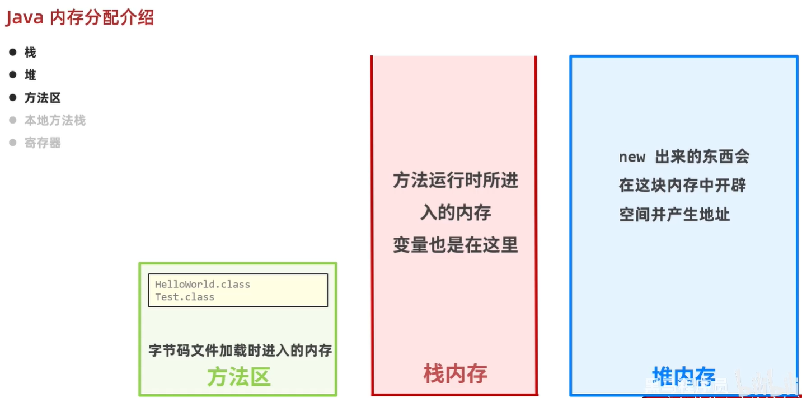

## 一个对象的内存图

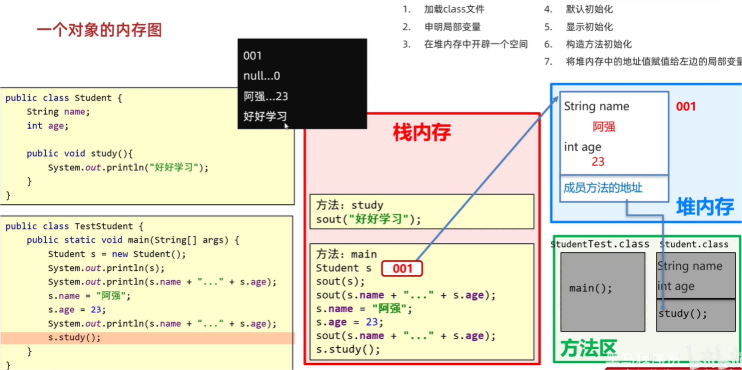

步骤: 
1. 加载class文件
2. 声明局部变量
3. 在堆内存中开辟一个空间
4. 默认初始化
5. 显示初始化
6. 构造方法初始化
7. 将堆内存中的地址值赋值给左边的局部变量

## 多个对象的内存图

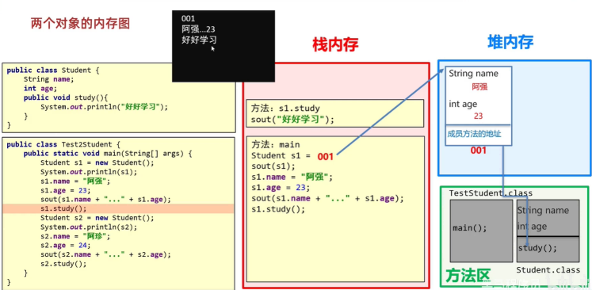

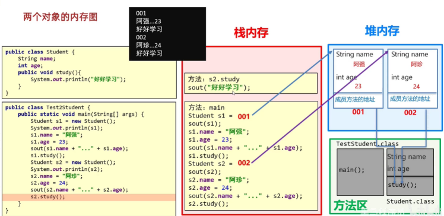

## 两个变量指向同一个对象内存图

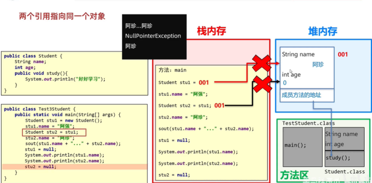

## this的内存原理

this的作用: 区分局部变量和成员变量

this的本质: 所在方法调用者的地址值

直接使用this: 

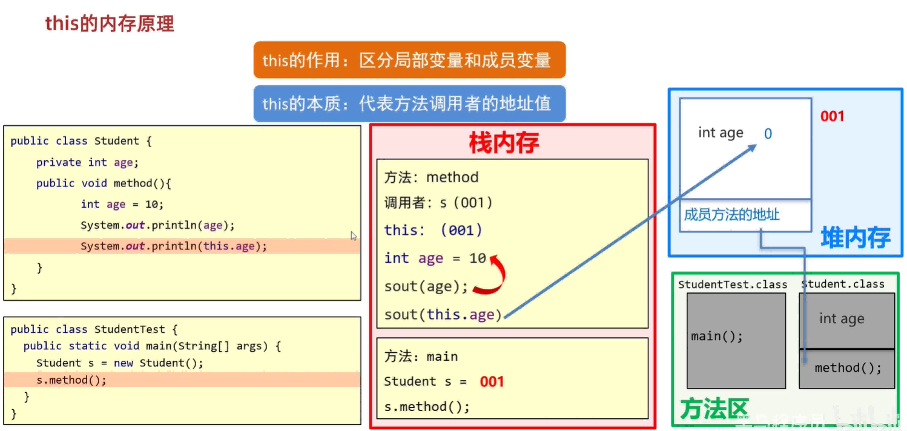

set(参数)方法里面的this: 

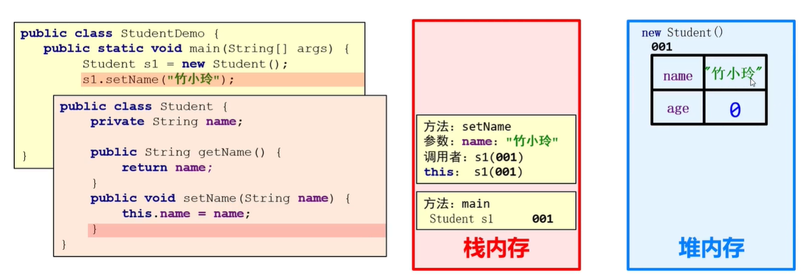

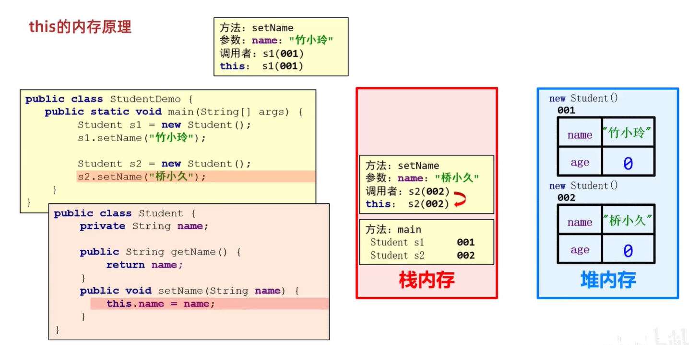

## 基本数据类型和引用数据类型的区别

基本数据类型内存图: 

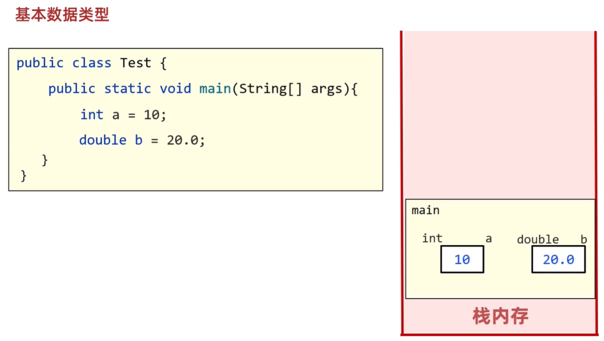

基本数据类型范围: byte,short,int,long,float,double,char,boolean(8种基本数据类型)  

基本数据类型: 数据值存储在自己的空间中  

特点: 赋值给其他变量,也是赋的真实的值

引用数据类型内存图: 

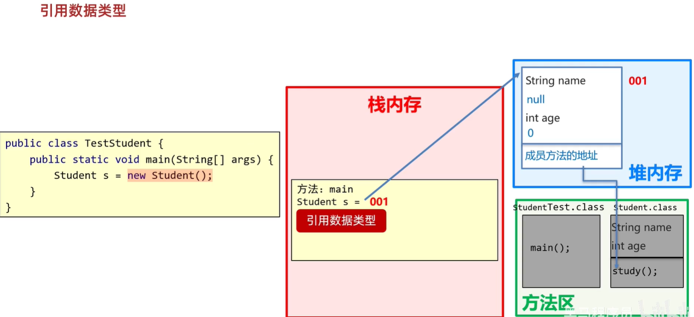

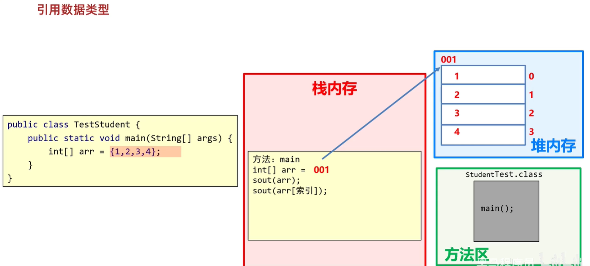

引用数据类型范围: 除了8种基本数据类型外的,其他所有数据类型是引用数据类型

引用数据类型: 数据值存储在其他空间中,自己空间中存储的是地址值

特点: 赋值给其他变量,赋的是地址值

## 局部变量和成员变量的区别

成员变量: 类中方法外的变量

局部变量: 方法内/方法申明上的变量(即形参)

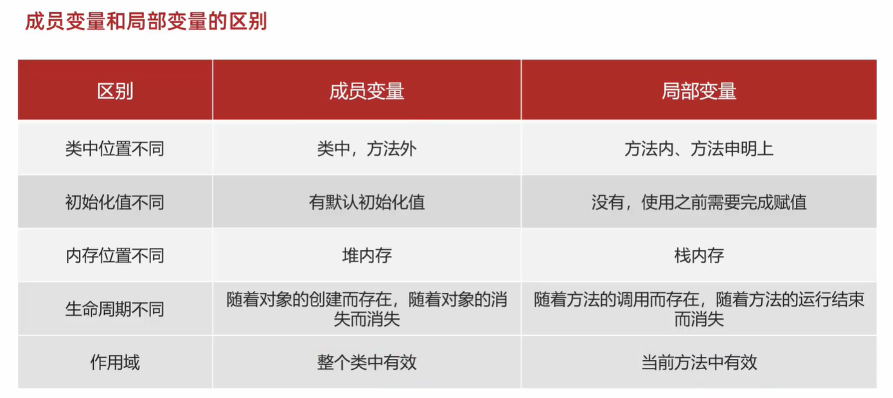

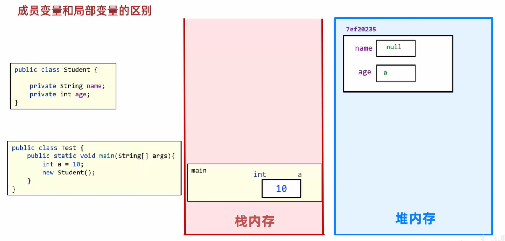