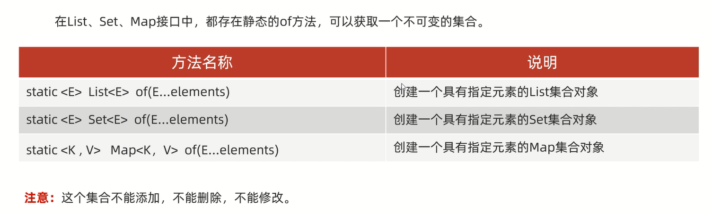

# 不可变集合

不可变集合:不可以被改变的集合

1. 不可以修改长度
2. 不可以修改内容

应用场景:
1. 如果某个数据不能被修改,把它防御性地拷贝到不可变集合中是个很好的实践
2. 当集合对象被不可信的库调用时,不可变形式是安全的

## 格式



细节一:**在创建Set的不可变集合的时候,要保证参数的唯一性**

范例:

```java
import java.util.Iterator;
import java.util.List;
import java.util.Map;
import java.util.Set;

public class Test {
    public static void main(String[] args) {
        List<String> list = List.of("张三", "李四", "王五");
        for (String s : list) {
            System.out.println(s);
        }

        Set<String> set = Set.of("张三", "李四", "王五");
        Iterator<String> it = set.iterator();
        while (it.hasNext()) {
            System.out.println(it.next());
        }

        Map<String, Integer> map = Map.of("张三", 1, "李四", 2, "王五", 3);
        map.forEach((key, value) -> System.out.println(key + ":" + value));
    }
}
```

细节二:**在创建Map的不可变集合的时候:**                     
1. **键不能重复**               
2. **Map里面的of方法,参数是有上限的,最多只能传递20个参数(即10个键值对)**              
3. **如果要传递多个键值对对象(数量大于10):**              
a.**通过Map.ofEntries方法创建不可变集合**                
b.**通过Map.copyOf方法创建不可变集合(JDK10之后)**             

范例:

```java
import java.util.*;

public class Test {
    public static void main(String[] args) {
        HashMap<String, String> hashMap = new HashMap<>();
        hashMap.put("1", "A");
        hashMap.put("2", "A");
        hashMap.put("3", "A");
        hashMap.put("4", "A");
        hashMap.put("5", "A");
        hashMap.put("6", "A");
        hashMap.put("7", "A");
        hashMap.put("8", "A");
        hashMap.put("9", "A");
        hashMap.put("10", "A");
        hashMap.put("11", "A");

        // 获取到所有的键值对对象
        // Set<Map.Entry<String, String>> entries = hashMap.entrySet();
        // 把entries集合变成一个数组array,数组类型指定为Map.Entry
        // toArray方法在底层会比较集合的长度和数组的长度两者的大小
        // 如果集合的长度>数组的长度,此时会根据实际数据的个数,重新创建新的数组
        // 如果集合的长度<=数组的长度,此时不会创建新的数组,而是直接用
        // Map.Entry[] array = entries.toArray(new Map.Entry[0]);

        // 通过Map.ofEntries方法创建不可变Map集合map
        // Map map = Map.ofEntries(array);

        // 方法一
        // 创建Map的不可变集合map1
        Map<Object, Object> map1 = Map.ofEntries(hashMap.entrySet().toArray(new Map.Entry[0]));
        map1.forEach((key, value) -> System.out.println(key + ":" + value));

        // 方法二(JDK10之后)
        // 通过copyOf方法生成不可变集合map2
        Map<String, String> map2 = Map.copyOf(hashMap);
        map2.forEach((key, value) -> System.out.println(key + ":" + value));
    }
}
```