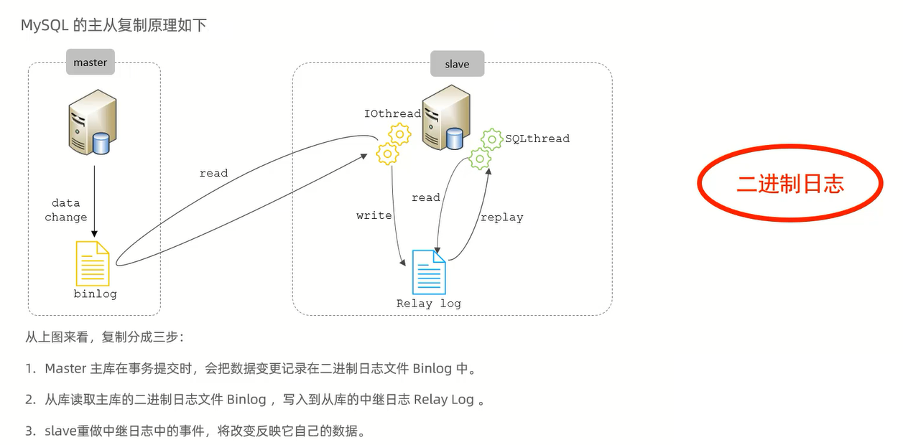

# 主从复制

主从复制是指将主数据库的DDL和DML操作通过二进制日志传到从库服务器中,然后在从库上对这些日志重新执行(也叫重做),从而使得从库和主库的数据保持同步                    

MySQL支持一台主库同时向多台从库进行复制,从库同时也可以作为其他从服务器的主库,实现链状复制

主库-Master                  
从库-Slave

MySQL复制的优点主要包含以下三个方面:
1. 主库出现问题,可以快速切换到从库提供服务
2. 实现读写分离,降低主库的访问压力
3. 可以在从库中执行备份,以避免备份期间影响主库服务

# 原理

# 搭建

