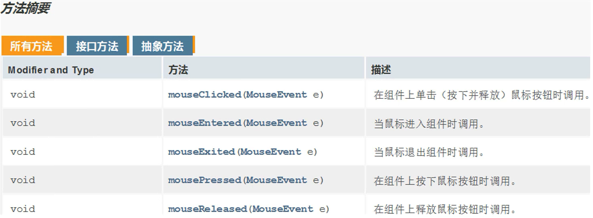
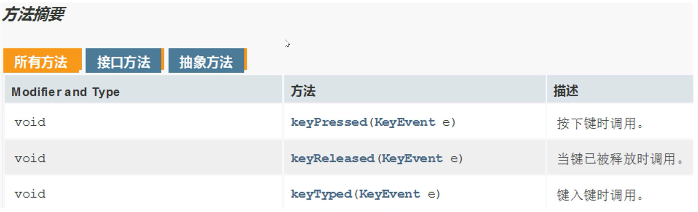

# 事件处理

事件是可以被组件识别的操作     
当对组件做了某些操作之后,就会执行对应的代码  

事件源: 按钮、图片、窗体...  

事件: 某些操作,如鼠标单击、鼠标划入...  

# 绑定事件监听

当事件源上发生了某个事件,则执行某段代码

# ActionEvent 动作监听

当用户执行操作(例如单击按钮、菜单项或文本框中的回车键)时触发

- `getSource()`:返回触发事件的对象(事件源)
- `getActionCommand()`:返回与事件关联的字符串命令,通常用于标识触发事件的组件
- `getModifiers()`:返回与事件一起传递的修饰符的位掩码,如SHIFT_MASK、CTRL_MASK等
- `getWhen()`:返回事件被创建的时间戳
- `getID()`:返回事件的唯一标识符
- `isAltDown()`、`isShiftDown()`、`isControlDown()`、`isMetaDown()`:分别返回事件发生时,Alt、Shift、Ctrl、Meta键是否被按下
- `setActionCommand(String command)`:设置事件的命令字符串,用于标识事件源
- `setSource(Object newSource)`:将事件源设置为指定的对象

## 方式一  

匿名内部类,内部类中重写接口`ActionListener`内的抽象方法

范例:

```java
import javax.swing.*;
import java.awt.event.ActionEvent;
import java.awt.event.ActionListener;

public class Test {
    public static void main(String[] args) {
        JFrame jFrame = new JFrame();
        jFrame.setSize(603,680);
        jFrame.setTitle("拼图游戏");
        jFrame.setAlwaysOnTop(true);
        jFrame.setLocationRelativeTo(null);
        jFrame.setDefaultCloseOperation(WindowConstants.EXIT_ON_CLOSE);
        jFrame.setLayout(null);
        
        JButton jButton = new JButton("点击");
        jButton.setBounds(0,0,100,50);
        
        // 给按钮绑定动作监听
        // jButton: 组件对象
        // addKeyListener: 表示要给本按钮添加动作监听(包含了鼠标左键点击、空格)
        jButton.addActionListener(new ActionListener() {
            @Override
            public void actionPerformed(ActionEvent e) {
                System.out.println("被点击了");
            }
        });
        
        jFrame.getContentPane().add(jButton);
        jFrame.setVisible(true);
    }
}
```

## 方式二

调用`ActionListener`接口的实现类,在实现类中重写接口`ActionListener`内的抽象方法

范例:

```java
import java.awt.event.ActionEvent;
import java.awt.event.ActionListener;

// 接口ActionListener的实现类myActionListener
public class myActionListener implements ActionListener{
    // 重写接口ActionListener内的抽象方法
    @Override
    public void actionPerformed(ActionEvent e) {
        System.out.println("被点击了");
    }
}
```

```java
import javax.swing.*;
import java.awt.event.ActionEvent;
import java.awt.event.ActionListener;

public class Test {
    public static void main(String[] args) {
        JFrame jFrame = new JFrame();
        jFrame.setSize(603,680);
        jFrame.setTitle("拼图游戏");
        jFrame.setAlwaysOnTop(true);
        jFrame.setLocationRelativeTo(null);
        jFrame.setDefaultCloseOperation(WindowConstants.EXIT_ON_CLOSE);
        jFrame.setLayout(null);
        
        JButton jButton = new JButton("点击");
        jButton.setBounds(0,0,100,50);
        
        jButton.addActionListener(new myActionListener());
        jFrame.getContentPane().add(jButton);
        jFrame.setVisible(true);
    }
}
```

## 方式三 

继承界面`JFrame`并实现接口`ActionListener`,重写接口`ActionListener`内的抽象方法

范例:

```java
import javax.swing.*;
import java.awt.event.ActionEvent;
import java.awt.event.ActionListener;
import java.util.Random;

public class MyJFrame extends JFrame implements ActionListener {
    JButton jButton1 = new JButton("点击");
    JButton jButton2 = new JButton("再点击");
    
    public MyJFrame() {
        this.setSize(603,680);
        this.setTitle("拼图游戏");
        this.setAlwaysOnTop(true);
        this.setLocationRelativeTo(null);
        this.setDefaultCloseOperation(WindowConstants.EXIT_ON_CLOSE);
        this.setLayout(null);
        
        jButton1.setBounds(0,0,100,50);
        jButton2.setBounds(0,500,100,50);
        
        // 给按钮绑定动作监听
        // jButton: 组件对象
        // addKeyListener: 表示要给本按钮添加动作监听(包含了鼠标左键点击、空格)
        // 参数this: 表示当事件被触发之后,会执行本类中的对应代码
        jButton1.addActionListener(this);
        jButton2.addActionListener(this);

        this.getContentPane().add(jButton1);
        this.getContentPane().add(jButton2);
        this.setVisible(true);
    }

    // 重写接口ActionListener内的抽象方法
    @Override
    public void actionPerformed(ActionEvent e) {
        // 获取当前被操作的按钮对象
        Object source = e.getSource();
        // 对当前按钮进行判断
        if (source == jButton1) {
            jButton1.setSize(200,200);
        } else if (source == jButton2) {
            Random random = new Random();
            jButton2.setLocation(random.nextInt(500),random.nextInt(500));
        }
    }
}
```

```java
public class Test {
    public static void main(String[] args) {
        new MyJFrame();
    }
}
```

# MouseEvent 鼠标监听

当用户与组件(如鼠标按下、释放、点击、进入或退出组件)交互时触发

- `getX()`:返回鼠标事件的x坐标,相对于源组件的左上角
- `getY()`:返回鼠标事件的y坐标,相对于源组件的左上角
- `getPoint()`:返回鼠标事件的坐标作为 Point 对象
- `getButton()`:返回触发鼠标事件的按钮,如MouseEvent.BUTTON1、MouseEvent.BUTTON2等
- `getClickCount()`:返回鼠标按键被按下或释放的总次数
- `getID()`:返回鼠标事件的类型(如MouseEvent.MOUSE_PRESSED、MouseEvent.MOUSE_RELEASED等)
- `isPopupTrigger()`:如果此鼠标事件是弹出菜单触发事件,则返回true
- `getModifiers()`:返回与此鼠标事件相关的修饰符的位掩码,如SHIFT_MASK、CTRL_MASK等
- `getXOnScreen()`:返回鼠标事件的x坐标,相对于屏幕左上角
- `getYOnScreen()`:返回鼠标事件的y坐标,相对于屏幕左上角
- `getModifiersEx()`:返回具有MouseEvent扩展的修饰符位掩码,用于更详细地描述事件的修饰符状态
- `getLocationOnScreen()`:返回鼠标事件的坐标作为Point对象,相对于屏幕左上角

`MouseListener`



范例:

```java
import javax.swing.*;
import java.awt.event.MouseEvent;
import java.awt.event.MouseListener;

public class MyJFrame extends JFrame implements MouseListener{
    JButton jButton = new JButton("点击");
    public MyJFrame() {
        this.setSize(603,680);
        this.setTitle("拼图游戏");
        this.setAlwaysOnTop(true);
        this.setLocationRelativeTo(null);
        this.setDefaultCloseOperation(WindowConstants.EXIT_ON_CLOSE);
        this.setLayout(null);

        jButton.setBounds(0,0,100,50);

        // 给按钮绑定鼠标监听
        // jButton: 组件对象
        // addKeyListener: 表示要给本按钮添加鼠标监听
        // 参数this: 表示当事件被触发之后,会执行本类中的对应代码
        jButton.addMouseListener(this);

        this.getContentPane().add(jButton);
        this.setVisible(true);
    }

    @Override
    public void mouseClicked(MouseEvent e) {
        System.out.println("单击");
    }

    @Override
    public void mousePressed(MouseEvent e) {
        System.out.println("按下不松");

    }

    @Override
    public void mouseReleased(MouseEvent e) {
        System.out.println("松开");
    }

    @Override
    public void mouseEntered(MouseEvent e) {
        System.out.println("划入");
    }

    @Override
    public void mouseExited(MouseEvent e) {
        System.out.println("划出");
    }
}
```

```java
public class Test {
    public static void main(String[] args) {
        new MyJFrame();
    }
}
```

# KeyEvent 键盘监听

当用户与键盘交互时触发(如按键按下或释放、键盘字符输入)

- `getKeyCode()`:返回按下或释放的键的键码(一个int值)
- `getKeyChar()`:返回按下或释放的键的字符,如果键不产生字符(如功能键),则返回CHAR_UNDEFINED
- `getID()`:返回键盘事件的类型,如KeyEvent.KEY_PRESSED、KeyEvent.KEY_RELEASED等
- `getModifiers()`:返回与此键盘事件相关的修饰符的位掩码,如SHIFT_MASK、CTRL_MASK等
- `isActionKey()`:如果此键盘事件是与动作关联的键(如箭头键、功能键等),则返回true
- `isAltDown()`、`isShiftDown()`、`isControlDown()`、`isMetaDown()`:分别返回事件发生时Alt、Shift、Ctrl、Meta键是否被按下
- `getModifiersEx()`:返回具有KeyEvent扩展的修饰符位掩码,用于更详细地描述事件的修饰符状态
- `getKeyLocation()`:返回按下或释放的键的位置,如KeyEvent.KEY_LOCATION_LEFT、KeyEvent.KEY_LOCATION_RIGHT等
- `consume()`:将此键盘事件标记为已处理,防止其被进一步传递或处理

`KeyListener`



范例:

```java
import javax.swing.*;
import java.awt.event.KeyEvent;
import java.awt.event.KeyListener;

public class MyJFrame extends JFrame implements KeyListener {
    public MyJFrame() {
        this.setSize(603,680);
        this.setTitle("拼图游戏");
        this.setAlwaysOnTop(true);
        this.setLocationRelativeTo(null);
        this.setDefaultCloseOperation(WindowConstants.EXIT_ON_CLOSE);
        this.setLayout(null);

        // 给界面绑定键盘监听
        // 调用者this: 表示本类对象,当前的界面对象
        // addKeyListener: 表示要给本界面添加键盘监听
        // 参数this: 表示当事件被触发之后,会执行本类中的对应代码
        this.addKeyListener(this);
        
        this.setVisible(true);
    }

    @Override
    public void keyTyped(KeyEvent e) {

    }

    @Override
    public void keyPressed(KeyEvent e) {
        System.out.println("按下不松");
    }

    @Override
    public void keyReleased(KeyEvent e) {
        System.out.println("松开");
        // 获取键盘上每一个按键的编号
        int code = e.getKeyCode();
        // 判断按键是否为A
        if (code == 65) {
            System.out.println("现在按的是A");
        }
    }
}
```

```java
public class Test {
    public static void main(String[] args) {
        new MyJFrame3();
    }
}
```

# WindowEvent

当窗口发生状态更改(如打开、关闭、最小化、激活、失去焦点等)时触发

# ComponentEvent

当组件大小、位置或可见性发生更改时触发

# FocusEvent

当组件获得或失去焦点时触发

# ItemEvent

当项目组件(如复选框、单选按钮、下拉列表)的选择状态发生更改时触发

# AdjustmentEvent

当滚动条的值发生更改时触发