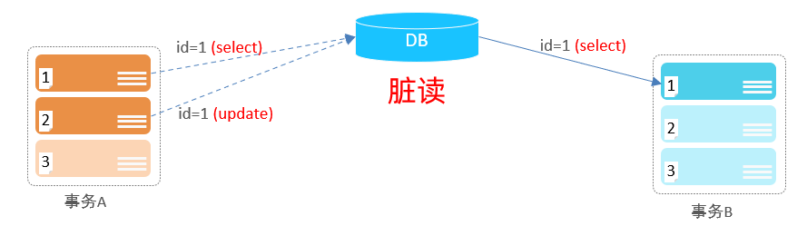

# 事务

事务是一组操作的集合,它是一个不可分割的工作单位,事务会把所有的操作作为一个整体一起向系统提交或撤销操作请求,即这些操作**要么同时成功,要么同时失败**

细节:**默认MySQL的事务是自动提交的,也就是说,当执行完一条DML语句时,MySQL会立即隐式的提交事务**

# 事务操作

## 方式一

1. 查看事务提交方式:`select @@autocommit;`  
2. 设置事务提交方式:`set @@autocommit=0;`                 
细节:**`1`是自动提交,`0`是手动提交**
3. 提交事务:`commit;`
4. 回滚事务:`rollback;`

## 方式二

1. 开启事务:`start transaction;`或者`begin;` 
2. 提交事务:`commit;`
3. 回滚事务:`rollback;`

范例:


准备工作:

```sql
# 创建账户表
create table account
(
    id    int primary key AUTO_INCREMENT comment 'ID',
    name  varchar(10) comment '姓名',
    money double(10, 2) comment '余额'
) comment '账户表';

# 账户表导入数据
insert into account(name, money)
VALUES ('张三', 2000),
       ('李四', 2000);
```

事务操作:

方式一:

```sql
# 设置事务提交方式为手动提交
set @@autocommit = 0;

# 转账操作
# 查询张三账户余额
select *
from account
where name = '张三';

# 将张三余额-1000
update account
set money=money - 1000
where name = '张三';

# 将李四余额+1000
update account
set money=money + 1000
where name = '李四';

# 提交事务
commit;
```

方式二:

```sql
# 开启事务
# start transaction;
begin;

# 转账操作
# 查询张三账户余额
select *
from account
where name = '张三';

# 将张三余额-1000
update account
set money=money - 1000
where name = '张三';

# 将李四余额+1000
update account
set money=money + 1000
where name = '李四';

# 提交事务
commit;
```

# 四大特性

事务的四大特性,简称ACID

- **原子性**(Atomicity):事务是不可分割的最小操作单元,要么全部成功,要么全部失败
- **一致性**(Consistency):事务完成时,必须使所有的数据都保持一致状态
- **隔离性**(Isolation):数据库系统提供的隔离机制,保证事务在不受外部并发操作影响的独立环境下运行
- **持久性**(Durability):事务一旦提交或回滚,它对数据库中的数据的改变就是永久的

# 并发事务问题


细节:**事务隔离级别越高,数据越安全,但是性能越低**

## 脏读

一个事务读到另外一个事务还没有提交的数据



## 不可重复读

一个事务先后读取同一条记录,但两次读取的数据不同,称之为不可重复读


## 幻读

一个事务按照条件查询数据时,没有对应的数据行,但是在插入数据时,又发现这行数据已经存在,好像出现了"幻影"


# 事务隔离级别


- 查看事务隔离级别:`select @@transaction_isolation;`
- 设置事务隔离级别:`set [session | global] transaction isolation level {read uncommitted | read committed | repeatable read | serializable};`