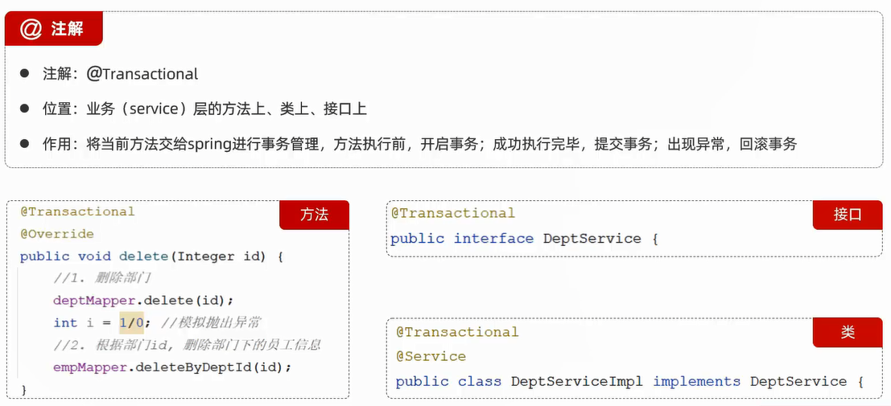
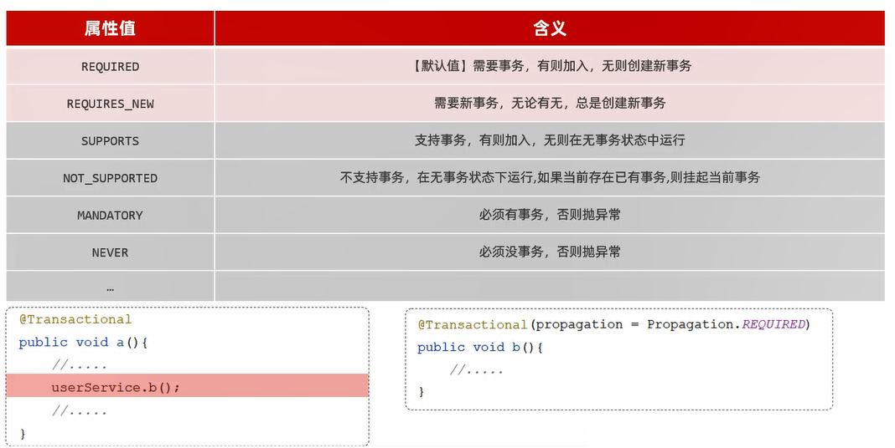
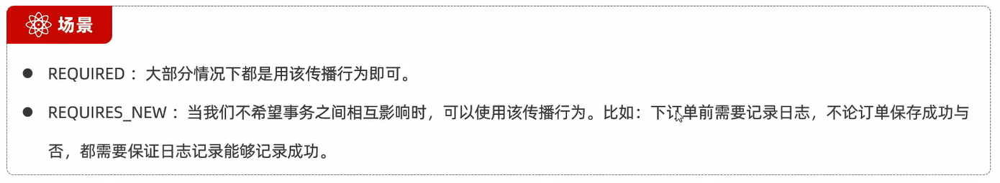

# 事务管理



细节:**尽量在执行了多次数据访问操作的业务方法上加上@Transactional注解**

## 范例

删除部门的时候,需要把该部门下的所有员工也一并删除

DeptServiceImpl类:

```java
package com.jinzhao.service.impl;

import com.jinzhao.mapper.DeptMapper;
import com.jinzhao.mapper.EmpMapper;
import com.jinzhao.service.DeptService;
import com.jinzhao.pojo.Dept;
import org.springframework.beans.factory.annotation.Autowired;
import org.springframework.stereotype.Service;
import org.springframework.transaction.annotation.Transactional;

import java.time.LocalDateTime;
import java.util.List;

@Service
public class DeptServiceImpl implements DeptService {
    @Autowired
    private DeptMapper deptMapper;
    @Autowired
    private EmpMapper empMapper;

    // 根据Id删除部门
    @Transactional
    @Override
    public void delete(Integer id) {
        // 根据id删除部门
        deptMapper.deleteById(id);
        // 删除部门的同时,删除该部门下的所有员工
        empMapper.deleteByDeptId(id);
    }
}
```

EmpMapper类:

```java
package com.jinzhao.mapper;

import com.jinzhao.pojo.Emp;
import org.apache.ibatis.annotations.Mapper;

import java.time.LocalDate;
import java.util.List;

@Mapper
public interface EmpMapper {
    // 删除部门的同时,删除该部门下的所有员工
    void deleteByDeptId(Integer deptId);
}
```

EmpMapper.xml:

```xml
<?xml version="1.0" encoding="UTF-8" ?>
<!DOCTYPE mapper
        PUBLIC "-//mybatis.org//DTD Mapper 3.0//EN"
        "http://mybatis.org/dtd/mybatis-3-mapper.dtd">
<mapper namespace="com.jinzhao.mapper.EmpMapper">
    <!--删除部门的同时,删除该部门下的所有员工-->
    <delete id="deleteByDeptId">
        delete
        from emp
        where dept_id = #{deptId}
    </delete>
</mapper>
```

## spring事务管理日志

配置文件中添加:

```yml
# spring事务管理日志
logging:
  level:
    org.springframework.jdbc.support.JdbcTransactionManager: debug
```

# 事务进阶

## 回滚

**默认情况下,只有出现RuntimeException才会回滚事务**,而回滚(rollbackFor)属性用于控制出现何种异常类型,回滚事务

范例:

```java
// 出现所有异常,都会回滚事务
@Transactional(rollbackFor = Exception.class)
@Override
public void delete(Integer id) {
    // 根据id删除部门
    deptMapper.deleteById(id);
    // 删除部门的同时,删除该部门下的所有员工
    empMapper.deleteByDeptId(id);
}
```

## 传播行为

传播行为(propagation)属性指的是当一个事务方法被另一个事务方法调用时,这个事务方法应该如何进行事务控制





### 范例

删除部门的时候,需要把该部门下的所有员工也一并删除,无论是删除成功还是删除失败,都要记录操作日志

创建部门操作日志表:

```sql
create table dept_log
(
    id          int auto_increment comment '主键ID' primary key,
    create_time datetime     null comment '操作时间',
    description varchar(300) null comment '操作描述'
) comment '部门操作日志表';
```

DeptLog类:部门操作日志

```java
package com.jinzhao.pojo;

import lombok.AllArgsConstructor;
import lombok.Data;
import lombok.NoArgsConstructor;

import java.time.LocalDateTime;

// 部门操作日志
@Data
@NoArgsConstructor
@AllArgsConstructor
public class DeptLog {
    private Integer id;
    private LocalDateTime createTime;
    private String description;
}
```

DeptLogService接口类:

```java
package com.jinzhao.service;

import com.jinzhao.pojo.DeptLog;

public interface DeptLogService {
    // 记录部门操作日志
    void insert(DeptLog deptLog);
}
```

DeptLogServiceImpl接口实现类:

```java
package com.jinzhao.service.impl;

import com.jinzhao.mapper.DeptLogMapper;
import com.jinzhao.pojo.DeptLog;
import com.jinzhao.service.DeptLogService;
import org.springframework.beans.factory.annotation.Autowired;
import org.springframework.stereotype.Service;
import org.springframework.transaction.annotation.Propagation;
import org.springframework.transaction.annotation.Transactional;

@Service
public class DeptLogServiceImpl implements DeptLogService {
    @Autowired
    private DeptLogMapper deptLogMapper;

    // 记录部门操作日志
    // 设置propagation属性为REQUIRES_NEW,即无论有无,都会创建新事务
    @Transactional(propagation = Propagation.REQUIRES_NEW)
    @Override
    public void insert(DeptLog deptLog) {
        deptLogMapper.insert(deptLog);
    }
}
```

DeptLogMapper接口类:

```java
package com.jinzhao.mapper;

import com.jinzhao.pojo.DeptLog;
import org.apache.ibatis.annotations.Insert;
import org.apache.ibatis.annotations.Mapper;

@Mapper
public interface DeptLogMapper {
    // 记录部门操作日志
    @Insert("insert into dept_log(create_time,description) values(#{createTime},#{description})")
    void insert(DeptLog log);
}
```

DeptServiceImpl接口实现类中:

```java
// 根据Id删除部门
@Transactional(rollbackFor = Exception.class)
@Override
public void delete(Integer id) {
    try {
        // 根据id删除部门
        deptMapper.deleteById(id);
        
        // 测试异常
        // int i = 1/0;
        
        // 删除部门的同时,删除该部门下的所有员工
        empMapper.deleteByDeptId(id);
    } finally {
        // 记录部门操作日志
        DeptLog deptLog = new DeptLog();
        deptLog.setCreateTime(LocalDateTime.now());
        deptLog.setDescription("执行了删除部门的操作,此次删除的是id为" + id + "的部门");
        deptLogService.insert(deptLog);
    }
}
```