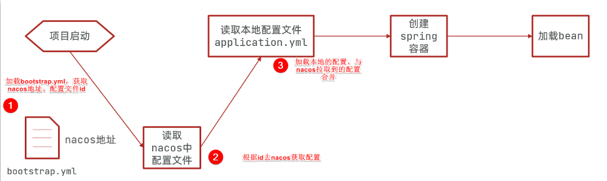
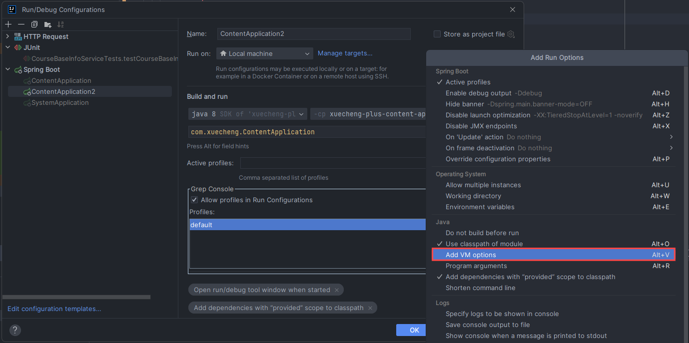
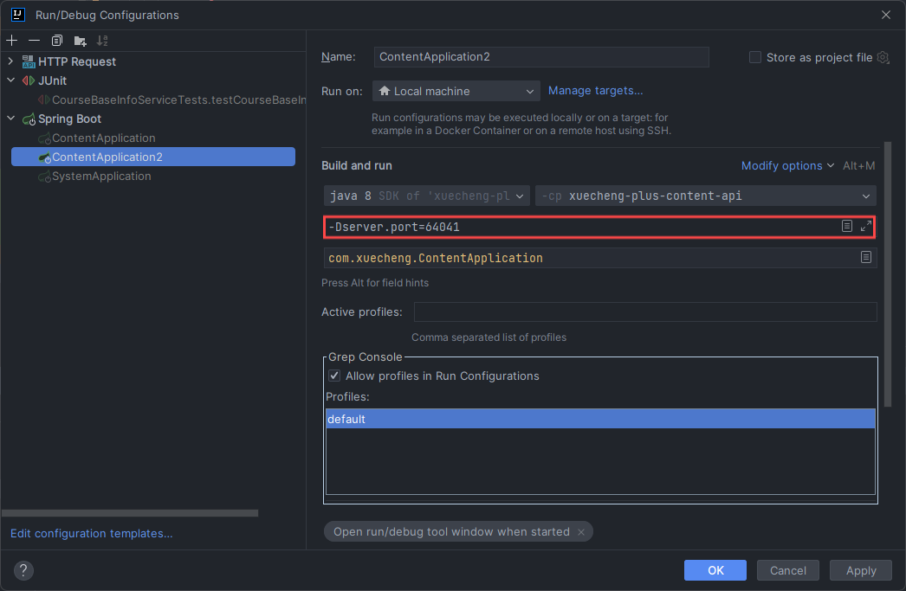
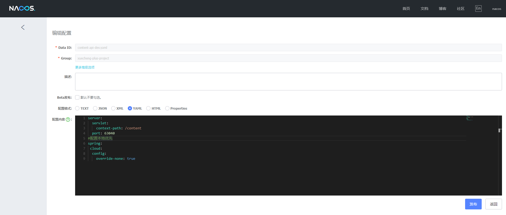

# 概念

## 服务注册(发现)

Spring Cloud:一套规范
Spring Cloud alibaba:Nacos服务注册中心,配置中心

两个概念:
- `namespace`:用于区分环境,比如：开发环境、测试环境、生产环境
- `group`:用于区分项目,比如:xuecheng-plus项目、xuecheng2.0项目

## 配置管理

配置文件分类:
1. 每个项目特有的配置

是指该配置只在有些项目中需要配置,或者该配置在每个项目中配置的值不同

比如:spring.application.name每个项目都需要配置但值不一样,以及有些项目需要连接数据库而有些项目不需要,有些项目需要配置消息队列而有些项目不需要

2. 项目公用的配置

是指在若干项目中配置内容相同的配置,比如:redis的配置,很多项目用的同一套redis服务所以配置也一样

另外还需要知道nacos如何去定位一个具体的配置文件,即:`namespace`、`group`、`dataid`
- 通过`namespace`、`group`找到具体的环境和具体的项目
- 通过`dataid`找到具体的配置文件,dataid有三部分组成

比如:content-service-dev.yaml配置文件由`content-service`-`dev`.`yaml`三部分组成
- `content-service`:第一部分,它是在application.yaml中配置的应用名,即spring.application.name的值
- `dev`:第二部分,它是环境名,通过spring.profiles.active指定
- `yaml`:第三部分,它是配置文件的后缀,目前nacos支持properties、yaml等格式类型,本项目选择yaml格式类型

所以,例如要配置content-service工程的配置文件:                       
- 在开发环境中配置content-service-dev.yaml         
- 在测试环境中配置content-service-test.yaml               
- 在生产环境中配置content-service-prod.yaml                      

启动项目中传入spring.profiles.active的参数决定引用哪个环境的配置文件,例如:传入spring.profiles.active=dev表示使用dev环境的配置文件即content-service-dev.yaml

# 使用

## 服务注册(发现)

1. 依赖引入

父工程需要引入阿里巴巴的Spring Cloud依赖:

```xml
<!-- 引入阿里巴巴云的Spring Cloud依赖 -->
<dependency>
    <groupId>org.springframework.cloud</groupId>
    <artifactId>spring-cloud-dependencies</artifactId>
    <version>${spring-cloud.version}</version>
    <type>pom</type>
    <scope>import</scope>
</dependency>
```

子工程中的服务注册需要引入Nacos的依赖:

```xml
<!-- Nacos注册中心依赖 -->
<dependency>
    <groupId>com.alibaba.cloud</groupId>
    <artifactId>spring-cloud-starter-alibaba-nacos-discovery</artifactId>
</dependency>
```

2. Spring Boot配置

```yml
spring:
  application:
    name: content-api # 服务名称
  cloud:
    nacos:
      server-addr: 192.168.101.65:8848 # Nacos服务器地址
      discovery: # 注册服务
        namespace: dev # Nacos命名空间
        group: xuecheng-plus-project # 服务所在分组
  profiles: # 环境配置
    active: dev # Spring Boot支持多环境配置,可以通过设置这个属性来选择加载哪个环境下的配置
```

## 配置管理

1. 依赖引入

父工程需要引入阿里巴巴的Spring Cloud依赖:

```xml
<!-- 引入阿里巴巴云的Spring Cloud依赖 -->
<dependency>
    <groupId>org.springframework.cloud</groupId>
    <artifactId>spring-cloud-dependencies</artifactId>
    <version>${spring-cloud.version}</version>
    <type>pom</type>
    <scope>import</scope>
</dependency>
```

子工程中的配置管理需要引入Nacos的依赖:

```xml
<!-- Nacos配置管理中心依赖 -->
<dependency>
    <groupId>com.alibaba.cloud</groupId>
    <artifactId>spring-cloud-starter-alibaba-nacos-config</artifactId>
</dependency>
```

2. Spring Boot配置

```yml
spring:
  application:
    name: content-api # 服务名称
  cloud:
    nacos:
      server-addr: 192.168.101.65:8848 # Nacos服务器地址
      discovery: # 注册服务
        namespace: dev # Nacos命名空间
        group: xuecheng-plus-project # 服务所在分组
      config: # 配置管理
        namespace: dev # Nacos命名空间
        group: xuecheng-plus-project # 服务所在分组
        file-extension: yaml # 配置文件格式
        refresh-enabled: true # 是否支持动态刷新
        extension-configs: # 扩展配置文件
          - data-id: content-service-${spring.profiles.active}.yaml
            group: xuecheng-plus-project
            refresh: true
        shared-configs: # 共享配置文件
          - data-id: swagger-${spring.profiles.active}.yaml
            group: xuecheng-plus-common
            refresh: true
          - data-id: logging-${spring.profiles.active}.yaml
            group: xuecheng-plus-common
            refresh: true
  profiles: # 环境配置
    active: dev # Spring Boot支持多环境配置,可以通过设置这个属性来选择加载哪个环境下的配置
```

这里的范例拉取了4个配置文件:
- 通过服务名称和环境配置方式引入,获得content-api-dev.yaml
- 通过扩展配置文件方式引入,获得content-service-dev.yaml
- 通过共享配置文件方式引入,获得swagger-dev.yaml和logging-dev.yaml

## 配置生效优先级



引入配置文件的形式有:
1. 以项目应用名方式引入
2. 以扩展配置文件方式引入
3. 以共享配置文件方式引入
4. 本地配置文件

**默认各配置文件的优先级:项目应用名配置文件 > 扩展配置文件 > 共享配置文件 > 本地配置文件**

### 调整本地配置最优先

例如启动两个内容管理微服务ContentApplication,此时需要在本地指定不同的端口,通过VM Options参数,在IDEA配置启动参数





此时还需要**让本地配置最优先**,在Nacos配置文件content-api-dev.yml中添加如下配置:

```yml
#配置本地优先
spring:
 cloud:
  config:
    override-none: true
```



## 远程调用

以学成在线项目为例,实现内容管理服务:课程静态化后上传至MinIO时,远程调用媒资管理服务:上传文件的接口

1. 依赖引入

```xml
<!-- Spring Cloud 微服务远程调用 -->
<dependency>
    <groupId>org.springframework.cloud</groupId>
    <artifactId>spring-cloud-starter-openfeign</artifactId>
</dependency>
<dependency>
    <groupId>io.github.openfeign</groupId>
    <artifactId>feign-httpclient</artifactId>
</dependency>
```

2. 配置熔断

开启Feign熔断保护,设置熔断的超时时间,为防止一次处理时间较长触发熔断,另外设置请求和连接的超时时间

```yaml
feign:
  hystrix:
    enabled: true
  circuitbreaker:
    enabled: true
hystrix:
  command:
    default:
      execution:
        isolation:
          thread:
            timeoutInMilliseconds: 30000  #熔断超时时间
ribbon:
  ConnectTimeout: 60000 #连接超时时间
  ReadTimeout: 60000 #读超时时间
  MaxAutoRetries: 0 #重试次数
  MaxAutoRetriesNextServer: 1 #切换实例的重试次数
```

3. 定义降级处理逻辑

定义一个fallbackFactory类MediaServiceClientFallbackFactory实现FallbackFactory

```java
package com.xuecheng.content.feignclient;

import feign.hystrix.FallbackFactory;
import lombok.extern.slf4j.Slf4j;
import org.springframework.stereotype.Component;
import org.springframework.web.multipart.MultipartFile;

import java.io.IOException;

/**
 * @description 媒资管理服务调用失败的降级处理
 */
@Component
@Slf4j
public class MediaServiceClientFallbackFactory implements FallbackFactory<MediaServiceClient> {

    @Override
    public MediaServiceClient create(Throwable throwable) {
        return new MediaServiceClient() {
            // 发生熔断,上游服务会调用此方法执行降级逻辑,此方法可以对远程调用的异常做处理
            @Override
            public String upload(MultipartFile filedata, String objectName) throws IOException {
                log.debug("远程调用上传文件的接口发生熔断:{}", throwable.getMessage(), throwable);
                return "";
            }
        };
    }
}
```

4. 定义远程调用媒资服务的接口,并配置远程调用的服务名media-api和降级处理逻辑FallbackFactory

```java
package com.xuecheng.content.feignclient;

import com.alibaba.nacos.common.http.param.MediaType;
import com.xuecheng.content.config.MultipartSupportConfig;
import org.springframework.cloud.openfeign.FeignClient;
import org.springframework.web.bind.annotation.RequestMapping;
import org.springframework.web.bind.annotation.RequestParam;
import org.springframework.web.bind.annotation.RequestPart;
import org.springframework.web.multipart.MultipartFile;

import java.io.IOException;

/**
 * @description 远程调用媒资服务的接口
 */
@FeignClient(value = "media-api", configuration = {MultipartSupportConfig.class}, fallbackFactory = MediaServiceClientFallbackFactory.class)
public interface MediaServiceClient {
    
    /**
     * 上传文件
     *
     * @param filedata   文件
     * @param objectName 如果传入objectName,则按照objectName目录去存储,如果没有传入,则按照年月日存储
     * @return 上传结果
     * @throws IOException 异常
     */
    @RequestMapping(value = "/media/upload/coursefile", consumes = MediaType.MULTIPART_FORM_DATA)
    String upload(@RequestPart("filedata") MultipartFile filedata,
                  @RequestParam(value = "objectName", required = false) String objectName) throws IOException;
}
```

5. 注入MediaServiceClient并引用upload方法

实际操作中把上传文件逻辑放到Service层,在Service层调用MediaServiceClient的upload方法