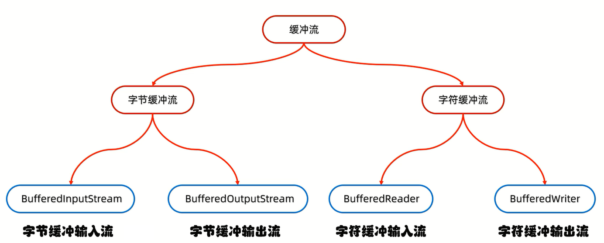
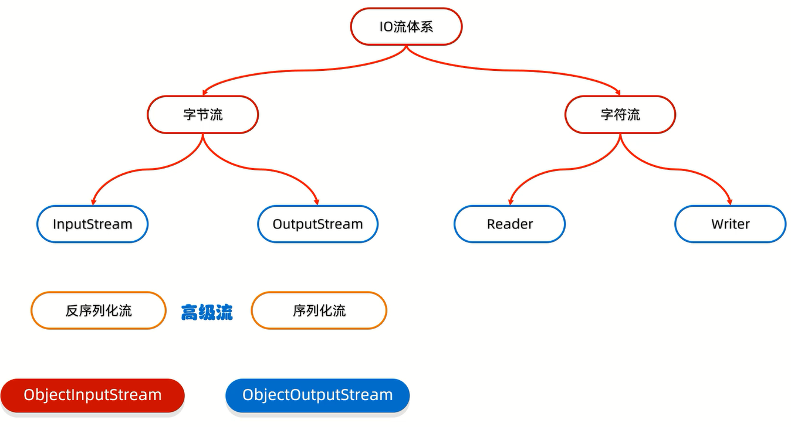

# 缓冲流



## 缓冲流原理


原理:缓冲流底层自带了长度为8192的缓冲区提高性能          
1. 字节缓冲流中的缓冲区是8192字节(8K的byte)
2. 字符缓冲流中的缓冲区是8192字符(8K的char,即16K的byte)

对于字节流,缓冲流可以显著提高**字节流**的读写性能                
对于字符流,缓冲流的提升不明显,但关键是其提供了2个特有方法:                               
a.BufferedReader中的readLine方法            
b.BufferedWriter中的newLine方法

## 字节缓冲流

构造方法:


范例:

```java
import java.io.*;

public class Test {
    public static void main(String[] args) throws IOException {
        File src = new File("D:\\Project\\Test(IDEA)\\src.txt");
        File dest = new File("D:\\Project\\Test(IDEA)\\dest.txt");
        copy(src, dest);
    }

    public static void copy(File src, File dest) throws IOException {
        BufferedInputStream bis = new BufferedInputStream(new FileInputStream(src));
        BufferedOutputStream bos = new BufferedOutputStream(new FileOutputStream(dest, true));
        int read;
        byte[] bytes = new byte[2];
        while ((read = bis.read(bytes)) != -1) {
            bos.write(bytes, 0, read);
        }
        bos.close();
        bis.close();
    }
}
```

## 字符缓冲流

构造方法:


特有方法:


各平台换行符:
1. windows:`\r\n`
2. linux:`\n`
3. mac:`\r`

细节:
1. readLine:方法在读取的时候,1次读1整行,遇到回车换行结束,但是不会把回车换行读到内存中

范例1:

```java
import java.io.*;

public class Test {
    public static void main(String[] args) throws IOException {
        File src = new File("D:\\Project\\Test(IDEA)\\src.txt");
        File dest = new File("D:\\Project\\Test(IDEA)\\dest.txt");
        copy(src, dest);
    }

    public static void copy(File src, File dest) throws IOException {
        BufferedReader br = new BufferedReader(new FileReader(src));
        BufferedWriter bw = new BufferedWriter(new FileWriter(dest, true));
        int read;
        char[] chars = new char[2];
        while ((read = br.read(chars)) != -1) {
            bw.write(chars, 0, read);
        }
        bw.close();
        br.close();
    }
}
```

范例2:

```java
import java.io.*;

public class Test {
    public static void main(String[] args) throws IOException {
        File src = new File("D:\\Project\\Test(IDEA)\\src.txt");
        File dest = new File("D:\\Project\\Test(IDEA)\\dest.txt");
        copy(src, dest);
    }

    public static void copy(File src, File dest) throws IOException {
        BufferedReader br = new BufferedReader(new FileReader(src));
        BufferedWriter bw = new BufferedWriter(new FileWriter(dest, true));
        // 一次读一整行
        String line;
        while ((line = br.readLine()) != null) {
            // 一次写一整行
            bw.write(line);
            // 跨平台换行
            bw.newLine();
        }
        bw.close();
        br.close();
    }
}
```

## 练习

### 拷贝文件

通过4种方式拷贝文件,并统计各自的用时

```java
import java.io.*;
import java.util.*;

public class Test {
    public static void main(String[] args) throws IOException {
        File src = new File("D:\\Project\\Test(IDEA)\\src.txt");
        File dest = new File("D:\\Project\\Test(IDEA)\\dest.txt");
        long FISFOSCopy = FISFOSCopy(src, dest);
        long FRFWCopy = FRFWCopy(src, dest);
        long BIOBOSCopy = BIOBOSCopy(src, dest);
        long BRBWCopy = BRBWCopy(src, dest);
        TreeMap<Long, String> map = new TreeMap<>();
        map.put(FISFOSCopy, "FISFOSCopy");
        map.put(FRFWCopy, "FRFWCopy");
        map.put(BIOBOSCopy, "BIOBOSCopy");
        map.put(BRBWCopy, "BRBWCopy");
        map.forEach((time, name) -> System.out.println(name + ":" + time));
        // 打印结果:"BRBWCopy:4"
        // 打印结果:"BIOBOSCopy:21"
        // 打印结果:"FRFWCopy:41"
        // 打印结果:"FISFOSCopy:110"
    }

    // 字节流
    public static long FISFOSCopy(File src, File dest) throws IOException {
        long start = System.currentTimeMillis();
        FileInputStream fis = new FileInputStream(src);
        FileOutputStream fos = new FileOutputStream(dest, true);
        int read;
        byte[] bytes = new byte[2];
        while ((read = fis.read(bytes)) != -1) {
            fos.write(bytes, 0, read);
        }
        fos.close();
        fis.close();
        long end = System.currentTimeMillis();
        return (end - start) / 1000.0;
    }

    // 字符流
    public static long FRFWCopy(File src, File dest) throws IOException {
        long start = System.currentTimeMillis();
        FileReader fr = new FileReader(src);
        FileWriter fw = new FileWriter(dest, true);
        int read;
        char[] chars = new char[2];
        while ((read = fr.read(chars)) != -1) {
            fw.write(chars, 0, read);
        }
        fw.close();
        fr.close();
        long end = System.currentTimeMillis();
        return end - start;
    }

    // 缓冲字节流
    public static long BIOBOSCopy(File src, File dest) throws IOException {
        long start = System.currentTimeMillis();
        BufferedInputStream bio = new BufferedInputStream(new FileInputStream(src));
        BufferedOutputStream bos = new BufferedOutputStream(new FileOutputStream(dest, true));
        int read;
        byte[] bytes = new byte[2];
        while ((read = bio.read(bytes)) != -1) {
            bos.write(bytes, 0, read);
        }
        bos.close();
        bio.close();
        long end = System.currentTimeMillis();
        return end - start;
    }

    // 缓冲字符流
    public static long BRBWCopy(File src, File dest) throws IOException {
        long start = System.currentTimeMillis();
        BufferedReader br = new BufferedReader(new FileReader(src));
        BufferedWriter bw = new BufferedWriter(new FileWriter(dest, true));
        String line;
        while ((line = br.readLine()) != null) {
            bw.write(line);
            bw.newLine();
        }
        bw.close();
        br.close();
        long end = System.currentTimeMillis();
        return end - start;
    }
}
```

### 恢复文章

把出师表的文章顺序进行恢复,恢复到一个新文件中

1. 方法一:

```java
import java.io.*;
import java.util.ArrayList;
import java.util.Comparator;

public class Test {
    public static void main(String[] args) throws IOException {
        File src = new File("D:\\Project\\Test(IDEA)\\src.txt");
        File dest = new File("D:\\Project\\Test(IDEA)\\dest.txt");
        restoreOrder(src, dest);
    }

    public static void restoreOrder(File src, File dest) throws IOException {
        BufferedReader br = new BufferedReader(new FileReader(src));
        ArrayList<String> list = new ArrayList<>();
        String line;
        while ((line = br.readLine()) != null) {
            list.add(line);
        }
        br.close();
        list.sort(new Comparator<String>() {
            @Override
            public int compare(String o1, String o2) {
                String o1Number = o1.split("\\.")[0];
                String o2Number = o2.split("\\.")[0];
                return Integer.parseInt(o1Number) - Integer.parseInt(o2Number);
            }
        });
        BufferedWriter bw = new BufferedWriter(new FileWriter(dest));
        for (String s : list) {
            bw.write(s);
            bw.newLine();
        }
        bw.close();
    }
}
```

2. 方法二:

```java
import java.io.*;
import java.util.*;

public class Test {
    public static void main(String[] args) throws IOException {
        File src = new File("D:\\Project\\Test(IDEA)\\src.txt");
        File dest = new File("D:\\Project\\Test(IDEA)\\dest.txt");
        restoreOrder(src, dest);
    }

    public static void restoreOrder(File src, File dest) throws IOException {
        BufferedReader br = new BufferedReader(new FileReader(src));
        TreeMap<Integer, String> map = new TreeMap<>();
        String line;
        while ((line = br.readLine()) != null) {
            String number = line.split("\\.")[0];
            // 去除序号,则传入String str = line.split("\\.")[1];
            int order = Integer.parseInt(number);
            map.put(order, line);
        }
        br.close();
        BufferedWriter bw = new BufferedWriter(new FileWriter(dest));
        Set<Map.Entry<Integer, String>> entries = map.entrySet();
        for (Map.Entry<Integer, String> entry : entries) {
            String str = entry.getValue();
            bw.write(str);
            bw.newLine();
        }
        bw.close();
    }
}
```
 
### 验证程序运行次数      

要求:当程序运行超过3次时给出提示"本软件只能免费使用3次,欢迎您注册会员后继续使用"       

程序运行演示如下:             
1. 第一次运行控制台输出:"欢迎使用本软件,第1次使用免费"           
2. 第二次运行控制台输出:"欢迎使用本软件,第2次使用免费"           
3. 第三次运行控制台输出:"欢迎使用本软件,第3次使用免费"              
4. 第四次及之后运行控制台输出:"本软件只能免费使用3次,欢迎您注册会员后继续使用"        

细节:**IO流随用随创建,什么时候不用什么时候关闭**

```java
import java.io.*;

public class Test {
    public static void main(String[] args) throws IOException {
        File src = new File("D:\\Project\\Test(IDEA)\\src.txt");
        File dest = new File("D:\\Project\\Test(IDEA)\\src.txt");
        noFree(src, dest);
    }

    public static void noFree(File src, File dest) throws IOException {
        BufferedReader br = new BufferedReader(new FileReader(src));
        String line = br.readLine();
        br.close();
        int count = Integer.parseInt(line);
        // src中的数字count默认开始为0
        count++;
        if (count <= 3) {
            System.out.println("欢迎使用本软件,第" + count + "次使用免费");
        } else {
            System.out.println("本软件只能免费使用3次,欢迎您注册会员后继续使用");
        }
        BufferedWriter bw = new BufferedWriter(new FileWriter(dest, false));
        bw.write(Integer.toString(count));
        bw.close();
    }
}
```

# 转换流

转换流是字节流和字符流之间的桥梁,属于字符流

1. 字符转换输入流:InputStreamReader     
2. 字符转换输出流:OutputStreamWriter


## 作用

1. 指定字符集读写数据(JDK11之后已淘汰)
2. 字节流想要使用字符流中的方法时,用转换流过渡

## 转换流原理


## 练习

### 转换文件编码  

1. 手动创建一个GBK的文件,把文件中的中文读取到内存中,不能出现乱码

```java
import java.io.*;
import java.nio.charset.Charset;

public class Test {
    public static void main(String[] args) throws IOException {
        File src = new File("D:\\Project\\Test(IDEA)\\src.txt");
        readFile(src);
    }

    // JDK11时被淘汰
    // public static void readFile(File src) throws IOException {
    //     InputStreamReader isr = new InputStreamReader(new FileInputStream(src), "GBK");
    //     int read;
    //     while ((read = isr.read()) != -1) {
    //         System.out.print((char) read);
    //     }
    //     isr.close();
    // }

    public static void readFile(File src) throws IOException {
        FileReader fr = new FileReader(src, Charset.forName("GBK"));
        int read;
        while ((read = fr.read()) != -1) {
            System.out.print((char) read);
        }
        fr.close();
    }
}
```

2. 把一段中文按照GBK的方式写到本地文件

```java
import java.io.*;
import java.nio.charset.Charset;

public class Test {
    public static void main(String[] args) throws IOException {
        File dest = new File("D:\\Project\\Test(IDEA)\\dest.txt");
        writeFile(dest);
    }

    // JDK11时被淘汰
    // public static void writeFile(File dest) throws IOException {
    //     OutputStreamWriter osw = new OutputStreamWriter(new FileOutputStream(dest), "GBK");
    //     osw.write("你好啊!");
    //     osw.close();
    // }

    public static void writeFile(File dest) throws IOException {
        FileWriter fw = new FileWriter(dest, Charset.forName("GBK"));
        fw.write("你好!");
        fw.close();
    }
}
```

3. 将本地文件中的GBK文件,转成UTF-8

```java
import java.io.*;
import java.nio.charset.Charset;
import java.nio.charset.StandardCharsets;

public class Test {
    public static void main(String[] args) throws IOException {
        File src = new File("D:\\Project\\Test(IDEA)\\src.txt");
        File dest = new File("D:\\Project\\Test(IDEA)\\dest.txt");
        // GBKToUTF1(src, dest);
        GBKToUTF2(src, dest);
    }

    // JDK11之前的方案
    public static void GBKToUTF1(File src, File dest) throws IOException {
        InputStreamReader isr = new InputStreamReader(new FileInputStream(src), "GBK");
        OutputStreamWriter osw = new OutputStreamWriter(new FileOutputStream(dest), StandardCharsets.UTF_8);
        int read;
        while ((read = isr.read()) != -1) {
            osw.write(read);
        }
        osw.close();
        isr.close();
    }

    public static void GBKToUTF2(File src, File dest) throws IOException {
        FileReader fr = new FileReader(src, Charset.forName("GBK"));
        FileWriter fw = new FileWriter(dest, StandardCharsets.UTF_8);
        int read;
        while ((read = fr.read()) != -1) {
            fw.write(read);
        }
        fw.close();
        fr.close();
    }
}
```

### 读取文件中的数据

利用字节流读取文件中的数据,每次读一整行,而且不能出现乱码

```java
import java.io.*;

public class Test {
    public static void main(String[] args) throws IOException {
        File file = new File("D:\\Project\\Test(IDEA)\\dest.txt");
        BufferedReader br = new BufferedReader(new InputStreamReader(new FileInputStream(file)));
        String line;
        while ((line = br.readLine()) != null) {
            System.out.println(line);
        }
        br.close();
    }
}
```

# 序列化流

序列化流可以把Java中的对象写到本地文件中,属于字节流



# 打印流

# 压缩流

# Commons-io