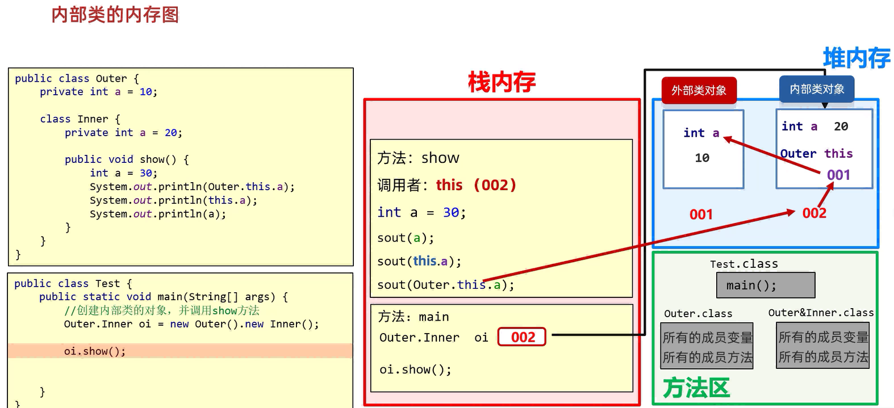

# 内部类

类的五大成员: 属性、方法、构造方法、代码块、内部类  

在一个类(**外部类**)的里面,再定义一个类(**内部类**)  
和外部类、内部类都无关的类叫做**外部其他类**  

注意事项:   
1. **内部类表示的事物是外部类的一部分**  
2. **内部类单独出现没有任何意义**   
  
范例: 

```java
// 外部类
public class Outer{
    // 内部类
    public class Inner{
        
    }
}
```

练习: 

写一个JavaBean类描述汽车  
属性: 汽车的品牌,车龄,颜色,发动机的品牌,使用年限  

```java
// 外部类
public class Car {
    String carBrand;
    int carAge;
    String carColor;

    // 内部类
    class engine {
        String engineName;
        int enginAge;
    }
}
```

内部类的访问特点:   
1. 内部类可以直接访问外部类的成员,包括私有  
2. 外部类要访问内部类的成员,必须创建对象  

范例: 

```java
public class Car {
    private String carBrand;
    int carAge;
    String carColor;

    // 外部类要访问内部类的成员,必须创建对象
    public void show() {
        engine e = new engine();
        System.out.println(e.engineBrand);
    }

    // 内部类
    class engine {
        String engineBrand;
        int enginAge;

        public void show() {
            // 内部类可以直接访问外部类的成员,包括私有
            System.out.println(carBrand);
        }
    }
}
```

## 成员内部类

## 代码书写

1. 写在成员位置的,属于外部类的成员   
2. 成员内部类可以被一些修饰符所修饰,比如private、默认、protected、public等  
3. 在成员内部类里面,JDK16之前不能定义静态变量,JDK16开始才可以定义静态变量  

范例: 

```java
// 外部类
public class Car {
    String carBrand;
    int carAge;
    String carColor;

    // 成员内部类
    class engine {
        String engineName;
        int enginAge;
    }
}
```

## 获取成员内部类的对象

1. 当成员内部类被private修饰时:   
在外部类中编写方法,对外提供内部类的对象  
2. 当成员内部类被非私有修饰时:   
直接创建格式: `外部类名.内部类名 对象名 = 外部类对象.内部类对象;`  

范例: 

```java
// 外部类
public class Outer {
    // 内部类
    static class Inner {
    }

    // 在外部类中编写方法,对外提供内部类的对象
    public Inner getInstance() {
        return new Inner();
    }
}
```

```java
public class Test {
    public static void main(String[] args) {
        // 直接创建格式: `外部类名.内部类名 对象名 = 外部类对象.内部类对象;`
        Outer.Inner o1 = new Outer.Inner();
        System.out.println(o1);

        // 在外部类中编写方法,对外提供内部类的对象
        Outer o2 = new Outer();
        System.out.println(o2.getInstance());
    }
}
```

## 当外部类成员变量和内部类成员变量重名时

范例: 

```java
// 外部类
public class Outer {
    private int a = 10;
    // 成员内部类
    class Inner {
        private int a = 20;

        public void show() {
            int a = 30;
            // 打印结果:"30"
            System.out.println(a);
            // 打印结果:"20"
            System.out.println(this.a);
            // 打印结果:"10"
            System.out.println(Outer.this.a);
        }
    }
}
```

```java
public class Test {
    public static void main(String[] args) {
        Outer.Inner oi = new Outer().new Inner();
        oi.show();
    }
}
```

## 内部类的内存图



## 静态内部类

静态内部类是一种特殊的成员内部类,它是用static修饰的成员内部类  

注意事项:   
1. **静态内部类只能访问外部类中的静态变量和静态方法**   
2. **如果想要访问非静态的成员,需要创建外部类对象**   

## 创建静态内部类对象

格式: `外部类名.内部类名 对象名 = new 外部类名.内部类名();`  

范例: `Outer.Inner oi = new Outer.Inner();`  
其中new关键字和Inner对象发生关系  

## 调用方法

1. 调用非静态方法的格式:   
`先创建对象,用对象调用`  
2. 调用静态方法的格式:    
`外部类名.内部类名.方法名();`  

范例: 

```java
// 外部类
public class Outer {
    // 非静态变量a
    int a = 10;
    // 静态变量b
    static int b = 20;
    // 静态内部类
    public static class Inner {
        public void show1() {
            System.out.println("非静态方法被调用了");
            Outer o = new Outer();
            System.out.println(o.a);
        }

        public static void show2() {
            System.out.println("静态方法被调用了");
            // 只要是静态的东西,都可以用类名点直接获取
            System.out.println(b);
        }
    }
}
```

```java
public class Test {
    public static void main(String[] args) {
        Outer.Inner oi = new Outer.Inner();
        // 打印结果:"非静态方法被调用了"
        // 打印结果:"10"
        oi.show1();
        // 打印结果:"静态方法被调用了"
        // 打印结果:"20"
        Outer.Inner.show2();
    }
}
```

## 局部内部类

1. 将内部类定义在方法里面就叫做局部内部类,类似于方法里面的局部变量  
2. 外界是无法直接使用,需要在方法内部创建对象并使用  
3. 该类可以直接访问外部类的成员,也可以访问方法内的局部变量  

范例: 

```java
// 外部类
public class Outer {
    // 成员变量b
    private int b = 20;

    public void show() {
        // 局部变量a
        int a = 10;
        // 局部内部类
        class Inner {
            String name;
            int age;

            public void method1() {
                System.out.println("局部内部类中的method1方法");
                // 访问外部类的成员
                System.out.println(Outer.this.b);
                // 访问方法内的局部变量
                System.out.println(a);
            }

            public static void method2() {
                System.out.println("局部内部类中的method2静态方法");
            }

        }
        // 外界是无法直接使用,需要在方法内部创建对象并使用
        Inner i = new Inner();
        System.out.println(i.name);
        i.method1();
        Inner.method2();
    }
}
```

```java
public class Test {
    public static void main(String[] args) {
        Outer o = new Outer();
        // 打印结果:"null"
        // 打印结果:"局部内部类中的method1方法"
        // 打印结果:"20"
        // 打印结果:"10"
        // 打印结果:"局部内部类中的method2静态方法"
        o.show();
    }
}
```

## 匿名内部类

匿名内部类本质上就是**隐藏了名字的内部类**,**可以写在成员位置**,**也可以写在局部位置**  

格式:   

```markdown
new 类名或者接口名(){
    重写方法;
};
```

格式包含了三部分: **继承/实现、方法重写、创建对象**  

继承范例:   

```java
public abstract class Animal {
    public abstract void eat();
}
```

```java
public class Test {
    public static void main(String[] args) {
        // 整体可以理解为Animal的子类对象
        // new的是真正匿名的类的对象
        new Animal() {
            // 真正匿名的类,实现了Animal的继承,即Animal的子类
            // 重写eat方法
            @Override
            public void eat() {
                System.out.println("重写了吃的方法");
            }
        };
    }
}
```

实现范例:   

```java
public interface Swim {
    void swim();
}
```

```java
public class Test {
    public static void main(String[] args) {
        // 整体可以理解为Swim接口的实现类对象
        // new的是真正匿名的类的对象
        new Swim() {
            // 真正匿名的类,实现了Swim的接口
            // 重写swim方法
            @Override
            public void swim() {
                System.out.println("重写了游泳的方法");
            }
        };
    }
}
```
   
使用场景:   
当方法的参数是接口或者类时,以接口为例,可以传递这个接口的实现类对象  
如果实现类只要使用一次,就可以用匿名内部类简化代码  

范例: 

```java
public abstract class Animal {
    public abstract void eat();
}
```

```java
public class Test {
    public static void main(String[] args) {
        method(
                // 相当于创建了一个Animal的子类对象
                new Animal() {
                    @Override
                    public void eat() {
                        System.out.println("吃骨头");
                    }
                }
        );
    }

    // 多态: 父类对象类型 对象名 = 子类对象
    public static void method(Animal a) {
        // 方法调用: 编译看左边,运行看右边
        // 编译的时候,看Animal中有无eat方法;运行的时候,运行子类里的eat方法
        a.eat();
    }
}
```

补充: 

```java
public interface Swim {
    void swim();
}
```

```java
public class Test {
    public static void main(String[] args) {
        // 整体可以理解为Swim接口的实现类对象
        Swim s = new Swim() {
            @Override
            public void swim() {
                System.out.println("重写了游泳的方法");
            }
        };
        // 作为对象,即可调用这个类里面的所有方法
        s.swim();
    }
}
```

练习: 

接口IPlay中有一个方法playGame(),在测试类中如何调用该方法?  

```java
public interface IPlay {
    void playGame();
}
```

​要求1: 创建子类实现接口的方式实现  

```java
public class Person {
}
```

```java
public class Player extends Person implements IPlay {
    @Override
    public void playGame() {
        System.out.println("玩游戏");
    }
}
```

要求2: 用匿名内部类实现  

```java
public class Player {
    public static void main(String[] args) {
        IPlay player = new IPlay() {
            @Override
            public void playGame() {
                System.out.println("玩游戏");
            }
        };
    }
}
```

练习: 

一个抽象类Fun中有一个抽象方法fun(),在测试类中如何调用该方法?  

```java
public abstract class Fun {
    public abstract void fun();
}
```

​要求一: 创建子类继承抽象类的方式实现  

```java
public class FunZi extends Fun {
    @Override
    public void fun() {
        System.out.println("玩的开心");
    }
}
```

要求二: 用匿名内部类实现  

```java
public class Test {
    public static void main(String[] args) {
        Fun fun = new Fun() {
            @Override
            public void fun() {
                System.out.println("玩的开心");
            }
        };
    }
}
```

练习: 

在控制台输出"HelloWorld"  

```java
public interface Inter {
    void show();
}
```

```java
class Outer {
    static Inter method() {
        // 创建并返回一个实现了Inter接口的匿名内部类对象
        return new Inter() {
            @Override
            public void show() {
                System.out.println("HelloWorld");
            }
        };
    }
}
```

```java
public class OuterDemo {
    public static void main(String[] args) {
        Outer.method().show();
    }
}
```

练习: 

在测试类Test中创建A的对象a并调用成员方法methodA(),要求用两种方式实现  

```java
public interface InterA {
    void showA();
}
```

```java
public class A {
    public void methodA(InterA a) {
        a.showA();
    }
}
```

方式一: 用匿名内部类实现  

```java
public class Test {
    public static void main(String[] args) {
        A a = new A();
        InterA interA = new InterA() {
            @Override
            public void showA() {
                System.out.println("输出A");
            }
        };
        a.methodA(interA);
    }
}
```

方式二: 用具体实现类实现  

```java
public class InterAImpl implements InterA{
    @Override
    public void showA() {
        System.out.println("输出A");
    }
}
```

```java
public class Test {
    public static void main(String[] args) {
        A a = new A();
        InterAImpl interAImpl = new InterAImpl();
        a.methodA(interAImpl);
    }
}
```

练习: 

在测试类Test中创建B的对象b,并调用成员方法methodB                  

```java
public interface InterB {
    void showB();
}
```

```java
public class B {
    InterB b;
    public B(InterB b){
        this.b = b;
    }
    public void methodB(){
        b.showB();
    }
}
```

```java
public class Test {
    public static void main(String[] args) {
        B b = new B(
                new InterB() {
                    @Override
                    public void showB() {
                        System.out.println("输出B");
                    }
                }
        );
        b.methodB();
    }
}
```