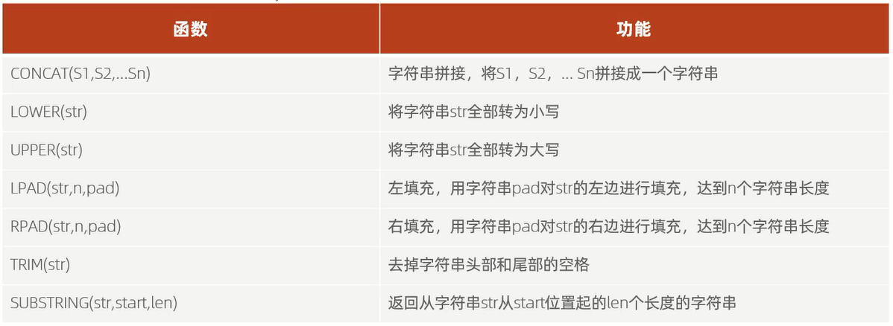
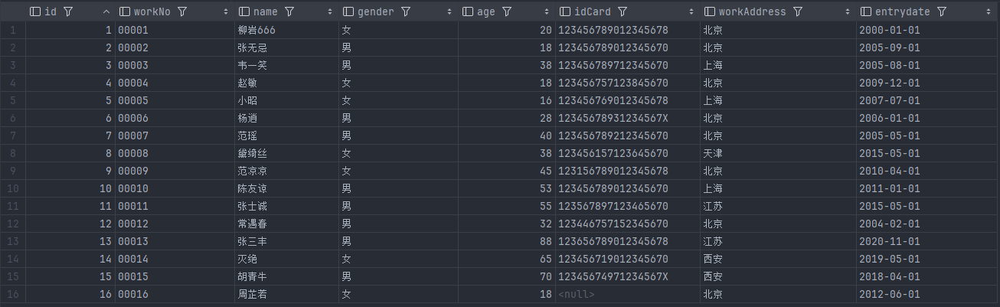
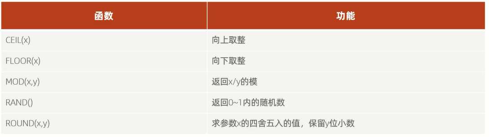
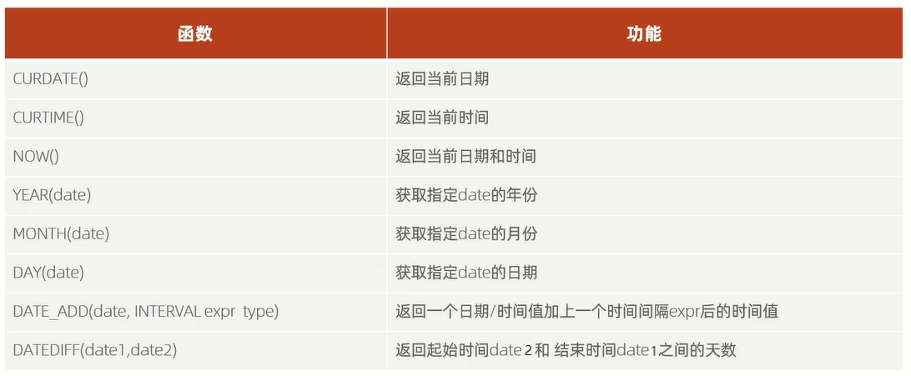
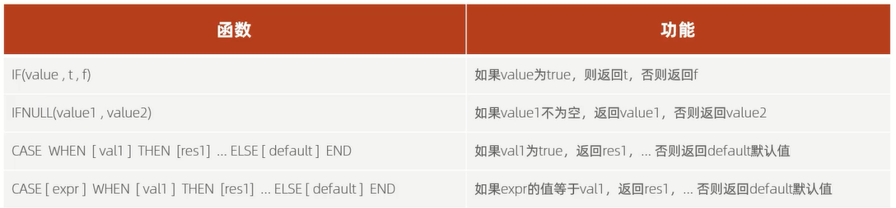
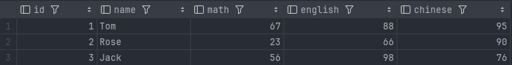

# 函数

函数是指一段可以直接被另一段程序调用的程序或代码

# 字符串函数



`select 函数(参数);`

范例:

```sql
# concat
select concat('hello', 'mysql');

# lower
select lower('HELLO');

# upper
select upper('mysql');

# lpad
select lpad('00', 5, '-');
# 结果:---00

# rpad
select rpad('00', 5, '-');
# 结果:00---

# trim
select trim('   00 00 00   ');
# 结果:00 00 00

# substring
select substring('hellomysql', 6, 2);
# 结果:my
```

范例表:



```sql
# 创建员工表
create table emp
(
    id          int comment '编号',
    workNo      varchar(10) comment '工号',
    name        varchar(10) comment '姓名',
    gender      char(1) comment '性别',
    age         tinyint unsigned comment '年龄',
    idCard      char(18) comment '身份证号',
    workAddress varchar(50) comment '工作地址',
    entryDate   date comment '入职时间'
) comment '员工表';

# 员工表导入数据
INSERT INTO emp (id, workNo, name, gender, age, idCard, workAddress, entryDate)
VALUES (1, '00001', '柳岩666', '女', 20, '123456789012345678', '北京', '2000-01-01');
INSERT INTO emp (id, workNo, name, gender, age, idCard, workAddress, entryDate)
VALUES (2, '00002', '张无忌', '男', 18, '123456789012345670', '北京', '2005-09-01');
INSERT INTO emp (id, workNo, name, gender, age, idCard, workAddress, entryDate)
VALUES (3, '00003', '韦一笑', '男', 38, '123456789712345670', '上海', '2005-08-01');
INSERT INTO emp (id, workNo, name, gender, age, idCard, workAddress, entryDate)
VALUES (4, '00004', '赵敏', '女', 18, '123456757123845670', '北京', '2009-12-01');
INSERT INTO emp (id, workNo, name, gender, age, idCard, workAddress, entryDate)
VALUES (5, '00005', '小昭', '女', 16, '123456769012345678', '上海', '2007-07-01');
INSERT INTO emp (id, workNo, name, gender, age, idCard, workAddress, entryDate)
VALUES (6, '00006', '杨逍', '男', 28, '12345678931234567X', '北京', '2006-01-01');
INSERT INTO emp (id, workNo, name, gender, age, idCard, workAddress, entryDate)
VALUES (7, '00007', '范瑶', '男', 40, '123456789212345670', '北京', '2005-05-01');
INSERT INTO emp (id, workNo, name, gender, age, idCard, workAddress, entryDate)
VALUES (8, '00008', '黛绮丝', '女', 38, '123456157123645670', '天津', '2015-05-01');
INSERT INTO emp (id, workNo, name, gender, age, idCard, workAddress, entryDate)
VALUES (9, '00009', '范凉凉', '女', 45, '123156789012345678', '北京', '2010-04-01');
INSERT INTO emp (id, workNo, name, gender, age, idCard, workAddress, entryDate)
VALUES (10, '00010', '陈友谅', '男', 53, '123456789012345670', '上海', '2011-01-01');
INSERT INTO emp (id, workNo, name, gender, age, idCard, workAddress, entryDate)
VALUES (11, '00011', '张士诚', '男', 55, '123567897123465670', '江苏', '2015-05-01');
INSERT INTO emp (id, workNo, name, gender, age, idCard, workAddress, entryDate)
VALUES (12, '00012', '常遇春', '男', 32, '123446757152345670', '北京', '2004-02-01');
INSERT INTO emp (id, workNo, name, gender, age, idCard, workAddress, entryDate)
VALUES (13, '00013', '张三丰', '男', 88, '123656789012345678', '江苏', '2020-11-01');
INSERT INTO emp (id, workNo, name, gender, age, idCard, workAddress, entryDate)
VALUES (14, '00014', '灭绝', '女', 65, '123456719012345670', '西安', '2019-05-01');
INSERT INTO emp (id, workNo, name, gender, age, idCard, workAddress, entryDate)
VALUES (15, '00015', '胡青牛', '男', 70, '12345674971234567X', '西安', '2018-04-01');
INSERT INTO emp (id, workNo, name, gender, age, idCard, workAddress, entryDate)
VALUES (16, '00016', '周芷若', '女', 18, null, '北京', '2012-06-01');
```

练习:

由于业务需求变更,企业员工的工号统一为7位数,目前不足7位数的全部在前面补0,比如1号员工的工号应该为0000001         

```sql
update emp set workNo=lpad(workNo,7,0);
```

# 数值函数



范例:

```sql
# ceil
select ceil(1.4);
# 结果:2
select ceil(-1.4);
# 结果:-1

# floor
select floor(2.7);
# 结果:2
select floor(-2.7);
# 结果:-3

# mod
select mod(6, 4);
# 结果:2

# rand
select rand();

# round
select round(2.345, 2);
# 结果:2.35
select round(2.345, 1);
# 结果:2.3
```

练习:

生成一个6位数的随机验证码

```sql
select lpad(round(rand() * 1000000, 0), 6, '0');
```

# 日期函数



细节:**datediff(结束日期,开始日期)函数,返回的天数 = 结束日期 - 开始日期**

范例:

```sql
# curdate
select curdate();

# curtime
select curtime();

# now
select now();

# year
select year(curdate());

# month
select month(curdate());

# day
select day(curdate());

# date_add
select date_add(now(), interval 70 day);
select date_add(now(), interval 2 month);
select date_add(now(), interval 48 hour);

# datediff
select datediff(now(), date_add(now(), interval -48 hour));
# 结果:2
select datediff('2023-1-1', '2022-1-1');
# 结果:365
```

练习:

查询所有员工的入职天数,并根据入职天数倒序排序

```sql
select name,datediff(curdate(),entrydate) as workDay from emp order by workDay desc;
```

# 流程函数

流程函数也是很常用的一类函数,可以在SQL语句中实现条件筛选,从而提高语句的效率



- if(条件表达式,true取值,false取值)
- case 表达式 when 值1 then 结果1 when 值2 then 结果2 else ... end

范例:

```sql
# if
select if(true, '对', '错');
select if(false, '对', '错');

# ifnull
select ifnull('A', 'B');
# 结果:A
select ifnull(null, 'B');
# 结果:B

# case when then else end
# 要求:查询emp表的员工姓名和工作地址(上海/北京 --> 一线城市,其他城市 --> 二线城市)
select name,
       (case workAddress when '北京' then '一线城市' when '上海' then '一线城市' else '二线城市' end) as '工作城市'
from emp;
```

练习:



```sql
# 创建学员成绩表
create table score
(
    id      int comment 'ID',
    name    varchar(20) comment '姓名',
    math    int comment '数学',
    english int comment '英语',
    chinese int comment '语文'
) comment '学员成绩表';

# 学员成绩表导入数据
insert into score(id, name, math, english, chinese)
VALUES (1, 'Tom', 67, 88, 95),
       (2, 'Rose', 23, 66, 90),
       (3, 'Jack', 56, 98, 76);
```

统计班级各个学生的成绩,展示规则如下:                
1. 大于等于85,展示优秀
2. 大于等于60,展示及格
3. 否则,展示不及格

```sql
select name as 姓名,
       (case when math >= 85 then '优秀' when math >= 60 then '及格' else '不及格' end) as '数学成绩',
       (case when english >= 85 then '优秀' when english >= 60 then '及格' else '不及格' end) as '英语成绩',
       (case when chinese >= 85 then '优秀' when chinese >= 60 then '及格' else '不及格' end) as '语文成绩'
from score;
```