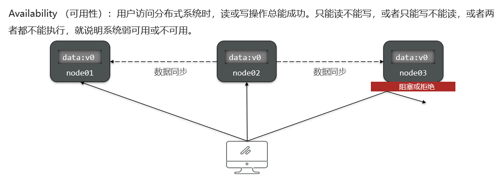

# 分布式事务

在分布式系统中,如果一个业务需要多个服务合作完成,而且每一个服务都有事务,多个事务必须同时成功或失败,这样的事务就是**分布式事务**

其中的每个服务的事务就是一个**分支事务**,整个业务称为**全局事务**


分布式事务解决思路:解决分布式事务,各个子事务之间必须能感知到彼此的事务状态,才能保证状态一致


# CAP和BASE

## CAP定理





简述CAP定理内容?
- 分布式系统节点通过网络连接,一定会出现分区问题(P)
- 当分区出现时,系统的一致性(C)和可用性(A)就无法同时满足

## BASE理论

BASE理论是对CAP的一种解决思路,包含三个思想:
- **Basically Available(基本可用)**:分布式系统在出现故障时,允许损失部分可用性,即保证核心可用
- **Soft State(软状态)**:在一定时间内,允许出现中间状态,比如临时的不一致状态
- **Eventually Consistent(最终一致性)**:虽然无法保证强一致性,但是在软状态结束后,最终达到数据一致

而分布式事务最大的问题是各个子事务的一致性问题,因此可以借鉴CAP定理和BASE理论:
- CP模式:各个子事务执行后互相等待,同时提交,同时回滚,达成**强一致**,但事务等待过程中,处于弱可用状态
- AP模式:各子事务分别执行和提交,允许出现结果不一致,然后采用弥补措施恢复数据即可,实现**最终一致**

# Seata

Seata是2019年1月份蚂蚁金服和阿里巴巴共同开源的分布式事务解决方案,致力于提供高性能和简单易用的分布式事务服务,为用户打造一站式的分布式解决方案

[Seata官方网站](http://seata.io/)

## Seata架构

- **TC (Transaction Coordinator) - 事务协调者**:维护全局和分支事务的状态,协调全局事务提交或回滚
- **TM (Transaction Manager) - 事务管理器**:定义全局事务的范围、开始全局事务、提交或回滚全局事务
- **RM (Resource Manager) - 资源管理器**:管理分支事务,与TC交谈以注册分支事务和报告分支事务的状态


Seata默认的分布式事务处理模式是**AT模式**

## 集成Seata

1. 引入Maven依赖

```xml
<!--seata-->
<dependency>
    <groupId>com.alibaba.cloud</groupId>
    <artifactId>spring-cloud-starter-alibaba-seata</artifactId>
</dependency>
```

2. 添加配置


# XA模式


1. 第一阶段(Try Phase):
    在这个阶段,业务SQL被执行,但不会提交事务
    Seata会通过数据库的XA接口注册分支事务,即通过XAStart和XAEnd命令来标记事务的开始和结束
    数据库内部可能会对涉及的行进行锁定,以防止其他事务修改这些数据

2. 第二阶段(Confirm/Rollback Phase):
    如果所有参与者都成功执行了第一阶段,则Seata会发起XAPrepare命令,然后根据情况发起XACommit或XARollback命令
    XAPrepare命令用于准备提交或回滚事务
    XACommit命令用于提交事务
    XARollback命令用于回滚事务

**XA模式属于CP模式,实现强一致性**

## 实现

1. 修改application.yaml文件(每个参与事务的微服务,这个配置可以放到nacos共享配置中),开启XA模式:

```yaml
seata:
    data-source-proxy-mode: XA # 开启数据源代理的XA模式
```

2. 给发起全局事务的入口方法添加`@GlobalTransactional`注解,本例中是OrderServiceImpl中的createOrder方法

```java
@Override
@GlobalTransactional
public Long createOrder(OrderFormDTO orderFormDTO) {
    // 1.订单数据
    Order order = new Order();
    // 1.1.查询商品
    List<OrderDetailDTO> detailDTOS = orderFormDTO.getDetails();
    // 1.2.获取商品id和数量的Map
    Map<Long, Integer> itemNumMap = detailDTOS.stream()
            .collect(Collectors.toMap(OrderDetailDTO::getItemId, OrderDetailDTO::getNum));
    Set<Long> itemIds = itemNumMap.keySet();
    // 1.3.查询商品
    List<ItemDTO> items = itemClient.queryItemByIds(itemIds);
    if (items == null || items.size() < itemIds.size()) {
        throw new BadRequestException("商品不存在");
    }
    // 1.4.基于商品价格、购买数量计算商品总价:totalFee
    int total = 0;
    for (ItemDTO item : items) {
        total += item.getPrice() * itemNumMap.get(item.getId());
    }
    order.setTotalFee(total);
    // 1.5.其它属性
    order.setPaymentType(orderFormDTO.getPaymentType());
    order.setUserId(UserContext.getUser());
    order.setStatus(1);
    // 1.6.将Order写入数据库order表中
    save(order);

    // 2.保存订单详情
    List<OrderDetail> details = buildDetails(order.getId(), items, itemNumMap);
    detailService.saveBatch(details);

    // 3.清理购物车商品
    cartClient.removeByItemIds(itemIds);

    // 4.扣减库存
    try {
        itemClient.deductStock(detailDTOS);
    } catch (Exception e) {
        throw new RuntimeException("库存不足！");
    }
    return order.getId();
}
```

3. 此外,本例还需要将removeByItemIds和deductStock方法添加`@Transactional`注解以回滚

CartServiceImpl中的removeByItemIds方法:

```java
@Override
@Transactional
public void removeByItemIds(Collection<Long> itemIds) {
    // 1.构建删除条件,userId和itemId
    QueryWrapper<Cart> queryWrapper = new QueryWrapper<>();
    queryWrapper.lambda()
            .eq(Cart::getUserId, UserContext.getUser())
            .in(Cart::getItemId, itemIds);
    // 2.删除
    remove(queryWrapper);
}
```

ItemServiceImpl中的deductStock方法:

```java
@Override
@Transactional
public void deductStock(List<OrderDetailDTO> items) {
    String sqlStatement = "com.hmall.item.mapper.ItemMapper.updateStock";
    boolean r = false;
    try {
        r = executeBatch(items, (sqlSession, entity) -> sqlSession.update(sqlStatement, entity));
    } catch (Exception e) {
        throw new BizIllegalException("更新库存异常,可能是库存不足!", e);
    }
    if (!r) {
        throw new BizIllegalException("库存不足！");
    }
}
```

## 优缺点

- 优点:
    1.**强一致性**:XA模式提供了强一致性保证,确保所有参与者要么全部提交,要么全部回滚,从而保证了数据的一致性
    2.**事务隔离性**:由于在第一阶段(Try Phase)就已经对数据进行了锁定,因此可以有效地避免其他事务对这些数据的影响,提高了事务的隔离性
    3.**数据库支持**:XA模式利用了数据库自身的XA事务支持,这意味着它可以在支持XA事务的数据库上运行,而无需额外的中间件或特殊配置

- 缺点:
    1.**性能开销**:XA模式需要执行额外的XA事务命令(如XAPrepare,XACommit,XARollback),这增加了网络通信和处理开销,第一阶段需要锁定数据,可能会导致其他事务等待,从而降低系统的并发性能
    2.**资源锁定**:在第一阶段,XA模式会对涉及的行进行锁定,这可能会导致其他事务等待,从而降低系统的并发性能,这种锁定可能会导致资源浪费,尤其是在高并发场景下
    3.**复杂性**:XA模式的实现比AT模式更为复杂,需要数据库支持XA事务,这可能会限制可用的数据库选择,需要对应用程序进行一定的配置和修改以支持XA模式
    4.**事务协调开销**:XA模式需要进行额外的事务协调,这可能会带来一定的网络通信和处理开销
    5.**事务回滚成本**:如果事务需要回滚,所有参与者都需要回滚,这可能会导致较大的性能开销

# AT模式


1. 第一阶段(Try Phase):
    在这个阶段,业务SQL会被执行,数据会在本地数据库中被更新
    Seata会**捕获更新前的数据快照(即原始数据状态)和更新后的数据快照(即事务结束后的数据状态)**
    同时,Seata还会对涉及到的行**加锁**,以防止其他事务修改这些数据

2. 第二阶段(Confirm/Rollback Phase):
    如果所有参与者都成功执行了第一阶段,则Seata会发起Confirm阶段,此时Seata只需释放之前加的行锁和清理快照数据即可
    如果任何一个参与者失败,则Seata会发起Rollback阶段,此时Seata将使用第一阶段捕获的更新前的数据快照来还原数据到初始状态

- 更新前的快照(Before Snapshot):在事务开始时,Seata会捕获涉及行的数据快照,即更新前的数据状态,这个快照用于在需要回滚时恢复数据到原始状态
- 更新后的快照(After Snapshot):在事务结束时,Seata会捕获涉及行的数据快照,即更新后的数据状态,这个快照在Seata中主要用于日志记录和审计目的

**AT模式属于AP模式,实现最终一致性**

## 实现

1. 添加undo_log表到hm-item、hm-carts、hm-trade的数据库中

```sql
-- for AT mode you must to init this sql for you business database. the seata server not need it.
CREATE TABLE IF NOT EXISTS `undo_log`
(
    `branch_id`     BIGINT       NOT NULL COMMENT 'branch transaction id',
    `xid`           VARCHAR(128) NOT NULL COMMENT 'global transaction id',
    `context`       VARCHAR(128) NOT NULL COMMENT 'undo_log context,such as serialization',
    `rollback_info` LONGBLOB     NOT NULL COMMENT 'rollback info',
    `log_status`    INT(11)      NOT NULL COMMENT '0:normal status,1:defense status',
    `log_created`   DATETIME(6)  NOT NULL COMMENT 'create datetime',
    `log_modified`  DATETIME(6)  NOT NULL COMMENT 'modify datetime',
    UNIQUE KEY `ux_undo_log` (`xid`, `branch_id`)
) ENGINE = InnoDB
  AUTO_INCREMENT = 1
  DEFAULT CHARSET = utf8mb4 COMMENT ='AT transaction mode undo table';
```

2. 修改application.yml文件(每个参与事务的微服务,这个配置可以放到nacos共享配置中),将事务模式修改为AT模式(不填默认也是AT模式)

```yaml
seata:
    data-source-proxy-mode: AT # 开启数据源代理的AT模式
```

3. 给发起全局事务的入口方法添加`@GlobalTransactional`注解,本例中是OrderServiceImpl中的createOrder方法

```java
@Override
@GlobalTransactional
public Long createOrder(OrderFormDTO orderFormDTO) {
    // 1.订单数据
    Order order = new Order();
    // 1.1.查询商品
    List<OrderDetailDTO> detailDTOS = orderFormDTO.getDetails();
    // 1.2.获取商品id和数量的Map
    Map<Long, Integer> itemNumMap = detailDTOS.stream()
            .collect(Collectors.toMap(OrderDetailDTO::getItemId, OrderDetailDTO::getNum));
    Set<Long> itemIds = itemNumMap.keySet();
    // 1.3.查询商品
    List<ItemDTO> items = itemClient.queryItemByIds(itemIds);
    if (items == null || items.size() < itemIds.size()) {
        throw new BadRequestException("商品不存在");
    }
    // 1.4.基于商品价格、购买数量计算商品总价:totalFee
    int total = 0;
    for (ItemDTO item : items) {
        total += item.getPrice() * itemNumMap.get(item.getId());
    }
    order.setTotalFee(total);
    // 1.5.其它属性
    order.setPaymentType(orderFormDTO.getPaymentType());
    order.setUserId(UserContext.getUser());
    order.setStatus(1);
    // 1.6.将Order写入数据库order表中
    save(order);

    // 2.保存订单详情
    List<OrderDetail> details = buildDetails(order.getId(), items, itemNumMap);
    detailService.saveBatch(details);

    // 3.清理购物车商品
    cartClient.removeByItemIds(itemIds);

    // 4.扣减库存
    try {
        itemClient.deductStock(detailDTOS);
    } catch (Exception e) {
        throw new RuntimeException("库存不足！");
    }
    return order.getId();
}
```

4. 此外,本例还需要将removeByItemIds和deductStock方法添加`@Transactional`注解以回滚

CartServiceImpl中的removeByItemIds方法:

```java
@Override
@Transactional
public void removeByItemIds(Collection<Long> itemIds) {
    // 1.构建删除条件,userId和itemId
    QueryWrapper<Cart> queryWrapper = new QueryWrapper<>();
    queryWrapper.lambda()
            .eq(Cart::getUserId, UserContext.getUser())
            .in(Cart::getItemId, itemIds);
    // 2.删除
    remove(queryWrapper);
}
```

ItemServiceImpl中的deductStock方法:

```java
@Override
@Transactional
public void deductStock(List<OrderDetailDTO> items) {
    String sqlStatement = "com.hmall.item.mapper.ItemMapper.updateStock";
    boolean r = false;
    try {
        r = executeBatch(items, (sqlSession, entity) -> sqlSession.update(sqlStatement, entity));
    } catch (Exception e) {
        throw new BizIllegalException("更新库存异常,可能是库存不足!", e);
    }
    if (!r) {
        throw new BizIllegalException("库存不足！");
    }
}
```

## AT模式的脏写问题

范例:


在极端情况下,特别是多线程并发访问AT模式的分布式事务时,有可能出现脏写问题,如下图:


解决思路就是通过Seata**引入全局锁**的概念,在释放DB锁之前,先拿到全局锁,避免同一时刻有另外一个事务来操作当前数据,如下图(事务1和事务2都是由Seata管理的全局事务):


细节:**DB锁(数据库锁)和TC全局锁不一样**
- **DB锁(数据库锁)会锁住这行数据(以Innodb为例),其他任何事务都无法对这行数据进行增删改查**
- **TC全局锁是记录操作这行数据的事务,由Seata管理,其他事务可以对这行数据进行增删改查**

但是,如果事务不全是Seata管理的全局事务,如下图:


细节:
1. **Seata会在第一阶段捕获更新前的数据快照(即原始数据状态)和更新后的数据快照(即事务结束后的数据状态)**
2. **在Seata的AT模式下,如果检测到更新后的数据快照和数据库的数据不一致,Seata不会执行回滚操作,以避免脏数据或数据丢失**

## 优缺点

- 优点:
    1.**性能优势**:相对于传统的XA模式,AT模式减少了资源锁定的时间,提高了系统的并发性能,第一阶段提交后即释放本地锁和连接资源,不会阻塞其他事务
    2.**简单易用**:开发者无需关心分布式事务的细节,Seata自动处理分布式事务的协调,业务代码与分布式事务处理解耦,降低了代码的复杂度
    3.**兼容性好**:AT模式不需要数据库支持特定的事务模式,如XA,因此可以广泛应用于各种数据库环境中
    4.**资源利用率高**:由于第一阶段完成后即释放本地锁和连接资源,因此可以更好地利用数据库资源
    5.**可扩展性强**:支持水平扩展,随着业务增长,可以轻松添加更多的数据库实例来提高性能

- 缺点:
    1.**弱一致性**:AT模式不能保证强一致性,因为在事务提交后,如果后续的分支事务出现问题,只能通过日志回滚来实现最终一致性,数据可能会暂时处于不一致的状态,直到回滚操作完成
    2.**事务回滚依赖日志**:回滚操作依赖于第一阶段捕获的更新前的数据快照(即UNDO LOG),如果日志丢失或损坏,可能会导致数据无法恢复
    3.**日志存储开销**:为了支持回滚操作,需要在第一阶段保存更新前的数据快照,这可能会增加额外的存储开销
    4.**异常处理复杂**:当出现异常时,需要正确处理异常情况,确保数据的一致性,这可能需要额外的异常处理逻辑
    5.**事务协调开销**:尽管AT模式相比XA模式减少了资源锁定的时间,但仍需要进行事务协调,这可能会带来一定的网络通信和处理开销

# XA模式与AT模式区别

- XA模式**一阶段不提交事务,锁定资源**;AT模式**一阶段直接提交,不锁定资源**
- XA模式**依赖数据库机制实现回滚**;AT模式**利用数据快照实现数据回滚**
- XA模式**强一致**;AT模式**最终一致**

# TCC模式


TCC模式与AT模式非常相似,每阶段都是独立事务,不同的是TCC通过人工编码来实现数据恢复

需要实现三个阶段:
- Try:资源的检测和预留 
- Confirm:完成资源操作业务(业务执行和提交),要求Try成功,Confirm一定要能成功
- Cancel:预留资源释放,可以理解为try的反向操作

范例:


## 空回滚和事务悬挂的问题


其中一个分支是未执行try操作的,直接执行了cancel操作,反而会导致数据错误

因此,这种情况下,尽管cancel方法要执行,但其中不能做任何回滚操作,这就是**空回滚**

对于整个空回滚的分支事务,将来try方法阻塞结束依然会执行

但是整个全局事务其实已经结束了,因此永远不会再有confirm或cancel,也就是说这个事务执行了一半,处于悬挂状态,这就是**事务悬挂**

**空回滚和事务悬挂问题都需要在编写try、cancel方法时处理**

## 优缺点

- 优点:
    1.**一阶段完成直接提交事务,释放数据库资源,性能好**
    2.**相比AT模型,无需生成快照,无需使用全局锁,性能最强**
    3.**不依赖数据库事务,而是依赖补偿操作,可以用于非事务型数据库**

- 缺点:
    1.**有代码侵入,需要人为编写try、Confirm和Cancel接口,太麻烦**
    2.**软状态,事务是最终一致**
    3.**需要考虑Confirm和Cancel的失败情况,做好幂等处理**
    4.**要编写逻辑解决空回滚和业务悬挂的问题**

# 最大努力通知


不管是XA、AT、TCC,都依赖于事务协调者来通信,不管是性能还是实现复杂度都比较高

越复杂的设计,故障率也越高,正所谓大道至简

所以大多数情况下,企业解决分布式事务问题都愿意牺牲事务的强一致性,选择使用最大努力通知方案

# 分布式事务控制常用的技术方案

- 实现CP就是要实现强一致性
    1. 使用Seata框架基于XA模式实现

- 实现AP则要保证最终数据一致性
    1. 使用Seata框架基于AT模式实现
    2. 使用Seata框架基于TCC模式实现
    3. 使用消息队列通知的方式去实现,通知失败自动重试,达到最大失败次数需要人工处理
    4. 使用任务调度的方案,启动任务调度将课程信息由数据库同步到elasticsearch、MinIO、redis中