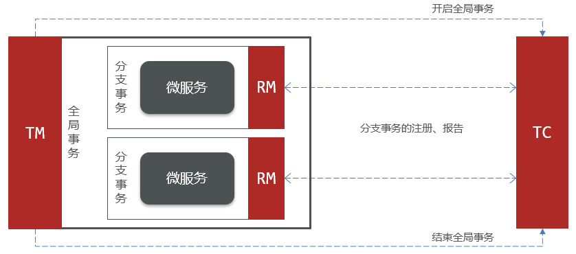

# 分布式服务

在分布式系统中,如果一个业务需要多个服务合作完成,而且每一个服务都有事务,多个事务必须同时成功或失败,这样的事务就是**分布式事务**

其中的每个服务的事务就是一个**分支事务**,整个业务称为**全局事务**


分布式事务解决思路:解决分布式事务,各个子事务之间必须能感知到彼此的事务状态,才能保证状态一致


# Seata

Seata是2019年1月份蚂蚁金服和阿里巴巴共同开源的分布式事务解决方案,致力于提供高性能和简单易用的分布式事务服务,为用户打造一站式的分布式解决方案

[Seata官方网站](http://seata.io/)

## Seata架构

- **TC (Transaction Coordinator) - 事务协调者**:维护全局和分支事务的状态,协调全局事务提交或回滚
- **TM (Transaction Manager) - 事务管理器**:定义全局事务的范围、开始全局事务、提交或回滚全局事务
- **RM (Resource Manager) - 资源管理器**:管理分支事务,与TC交谈以注册分支事务和报告分支事务的状态



## 集成Seata

1. 引入Maven依赖

```xml
<!--seata-->
<dependency>
    <groupId>com.alibaba.cloud</groupId>
    <artifactId>spring-cloud-starter-alibaba-seata</artifactId>
</dependency>
```

2. 添加配置


## XA模式


- 优点:事务的强一致性,满足ACID原则,常用数据库都支持,实现简单,并且没有代码侵入
- 缺点:因为一阶段需要锁定数据库资源,等待二阶段结束才释放,性能较差,依赖关系型数据库实现事务

### 实现

1. 修改application.yaml文件(每个参与事务的微服务,这个配置可以放到nacos共享配置中),开启XA模式:

```yaml
seata:
    data-source-proxy-mode: XA # 开启数据源代理的XA模式
```

2. 给发起全局事务的入口方法添加`@GlobalTransactional`注解,本例中是OrderServiceImpl中的createOrder方法

```java
@Override
@GlobalTransactional
public Long createOrder(OrderFormDTO orderFormDTO) {
    // 1.订单数据
    Order order = new Order();
    // 1.1.查询商品
    List<OrderDetailDTO> detailDTOS = orderFormDTO.getDetails();
    // 1.2.获取商品id和数量的Map
    Map<Long, Integer> itemNumMap = detailDTOS.stream()
            .collect(Collectors.toMap(OrderDetailDTO::getItemId, OrderDetailDTO::getNum));
    Set<Long> itemIds = itemNumMap.keySet();
    // 1.3.查询商品
    List<ItemDTO> items = itemClient.queryItemByIds(itemIds);
    if (items == null || items.size() < itemIds.size()) {
        throw new BadRequestException("商品不存在");
    }
    // 1.4.基于商品价格、购买数量计算商品总价:totalFee
    int total = 0;
    for (ItemDTO item : items) {
        total += item.getPrice() * itemNumMap.get(item.getId());
    }
    order.setTotalFee(total);
    // 1.5.其它属性
    order.setPaymentType(orderFormDTO.getPaymentType());
    order.setUserId(UserContext.getUser());
    order.setStatus(1);
    // 1.6.将Order写入数据库order表中
    save(order);

    // 2.保存订单详情
    List<OrderDetail> details = buildDetails(order.getId(), items, itemNumMap);
    detailService.saveBatch(details);

    // 3.清理购物车商品
    cartClient.removeByItemIds(itemIds);

    // 4.扣减库存
    try {
        itemClient.deductStock(detailDTOS);
    } catch (Exception e) {
        throw new RuntimeException("库存不足！");
    }
    return order.getId();
}
```

3. 此外,本例还需要将removeByItemIds和deductStock方法添加`@Transactional`注解以回滚

CartServiceImpl中的removeByItemIds方法:

```java
@Override
@Transactional
public void removeByItemIds(Collection<Long> itemIds) {
    // 1.构建删除条件,userId和itemId
    QueryWrapper<Cart> queryWrapper = new QueryWrapper<>();
    queryWrapper.lambda()
            .eq(Cart::getUserId, UserContext.getUser())
            .in(Cart::getItemId, itemIds);
    // 2.删除
    remove(queryWrapper);
}
```

ItemServiceImpl中的deductStock方法:

```java
@Override
@Transactional
public void deductStock(List<OrderDetailDTO> items) {
    String sqlStatement = "com.hmall.item.mapper.ItemMapper.updateStock";
    boolean r = false;
    try {
        r = executeBatch(items, (sqlSession, entity) -> sqlSession.update(sqlStatement, entity));
    } catch (Exception e) {
        throw new BizIllegalException("更新库存异常,可能是库存不足!", e);
    }
    if (!r) {
        throw new BizIllegalException("库存不足！");
    }
}
```

## AT模式


### 实现

1. 添加undo_log表到hm-item、hm-carts、hm-trade的数据库中

```sql
-- for AT mode you must to init this sql for you business database. the seata server not need it.
CREATE TABLE IF NOT EXISTS `undo_log`
(
    `branch_id`     BIGINT       NOT NULL COMMENT 'branch transaction id',
    `xid`           VARCHAR(128) NOT NULL COMMENT 'global transaction id',
    `context`       VARCHAR(128) NOT NULL COMMENT 'undo_log context,such as serialization',
    `rollback_info` LONGBLOB     NOT NULL COMMENT 'rollback info',
    `log_status`    INT(11)      NOT NULL COMMENT '0:normal status,1:defense status',
    `log_created`   DATETIME(6)  NOT NULL COMMENT 'create datetime',
    `log_modified`  DATETIME(6)  NOT NULL COMMENT 'modify datetime',
    UNIQUE KEY `ux_undo_log` (`xid`, `branch_id`)
) ENGINE = InnoDB
  AUTO_INCREMENT = 1
  DEFAULT CHARSET = utf8mb4 COMMENT ='AT transaction mode undo table';
```

2. 修改application.yml文件(每个参与事务的微服务,这个配置可以放到nacos共享配置中),将事务模式修改为AT模式(不填默认也是AT模式)

```yaml
seata:
    data-source-proxy-mode: AT # 开启数据源代理的AT模式
```

3. 给发起全局事务的入口方法添加`@GlobalTransactional`注解,本例中是OrderServiceImpl中的createOrder方法

```java
@Override
@GlobalTransactional
public Long createOrder(OrderFormDTO orderFormDTO) {
    // 1.订单数据
    Order order = new Order();
    // 1.1.查询商品
    List<OrderDetailDTO> detailDTOS = orderFormDTO.getDetails();
    // 1.2.获取商品id和数量的Map
    Map<Long, Integer> itemNumMap = detailDTOS.stream()
            .collect(Collectors.toMap(OrderDetailDTO::getItemId, OrderDetailDTO::getNum));
    Set<Long> itemIds = itemNumMap.keySet();
    // 1.3.查询商品
    List<ItemDTO> items = itemClient.queryItemByIds(itemIds);
    if (items == null || items.size() < itemIds.size()) {
        throw new BadRequestException("商品不存在");
    }
    // 1.4.基于商品价格、购买数量计算商品总价:totalFee
    int total = 0;
    for (ItemDTO item : items) {
        total += item.getPrice() * itemNumMap.get(item.getId());
    }
    order.setTotalFee(total);
    // 1.5.其它属性
    order.setPaymentType(orderFormDTO.getPaymentType());
    order.setUserId(UserContext.getUser());
    order.setStatus(1);
    // 1.6.将Order写入数据库order表中
    save(order);

    // 2.保存订单详情
    List<OrderDetail> details = buildDetails(order.getId(), items, itemNumMap);
    detailService.saveBatch(details);

    // 3.清理购物车商品
    cartClient.removeByItemIds(itemIds);

    // 4.扣减库存
    try {
        itemClient.deductStock(detailDTOS);
    } catch (Exception e) {
        throw new RuntimeException("库存不足！");
    }
    return order.getId();
}
```

4. 此外,本例还需要将removeByItemIds和deductStock方法添加`@Transactional`注解以回滚

CartServiceImpl中的removeByItemIds方法:

```java
@Override
@Transactional
public void removeByItemIds(Collection<Long> itemIds) {
    // 1.构建删除条件,userId和itemId
    QueryWrapper<Cart> queryWrapper = new QueryWrapper<>();
    queryWrapper.lambda()
            .eq(Cart::getUserId, UserContext.getUser())
            .in(Cart::getItemId, itemIds);
    // 2.删除
    remove(queryWrapper);
}
```

ItemServiceImpl中的deductStock方法:

```java
@Override
@Transactional
public void deductStock(List<OrderDetailDTO> items) {
    String sqlStatement = "com.hmall.item.mapper.ItemMapper.updateStock";
    boolean r = false;
    try {
        r = executeBatch(items, (sqlSession, entity) -> sqlSession.update(sqlStatement, entity));
    } catch (Exception e) {
        throw new BizIllegalException("更新库存异常,可能是库存不足!", e);
    }
    if (!r) {
        throw new BizIllegalException("库存不足！");
    }
}
```

## XA模式与AT模式区别

- XA模式一阶段不提交事务,锁定资源;AT模式一阶段直接提交,不锁定资源
- XA模式依赖数据库机制实现回滚;AT模式利用数据快照实现数据回滚
- XA模式强一致;AT模式最终一致