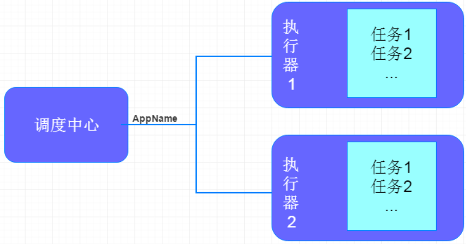
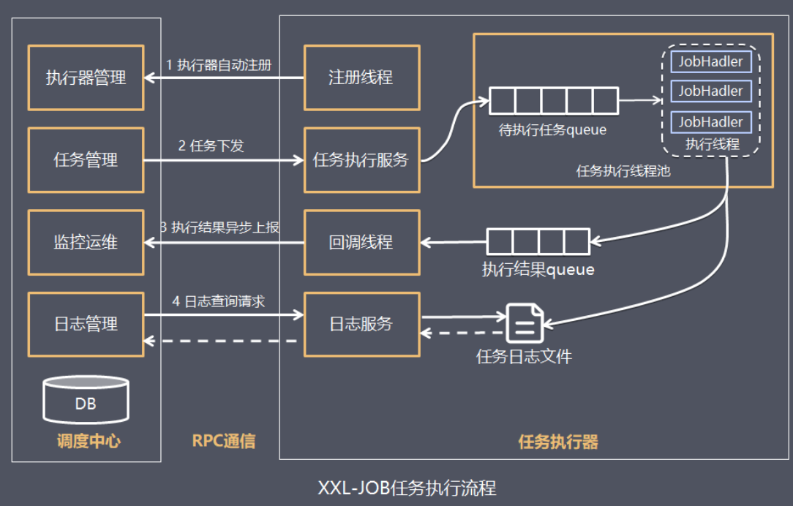
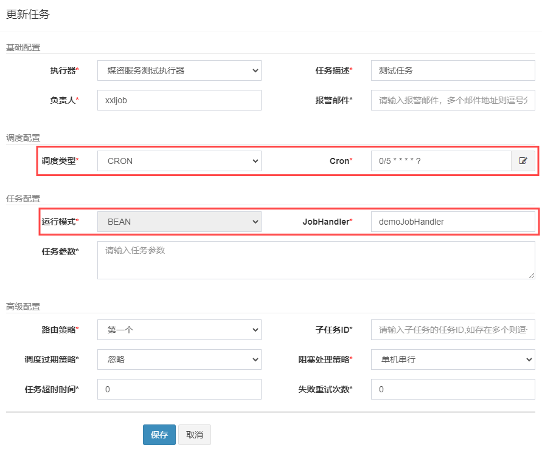
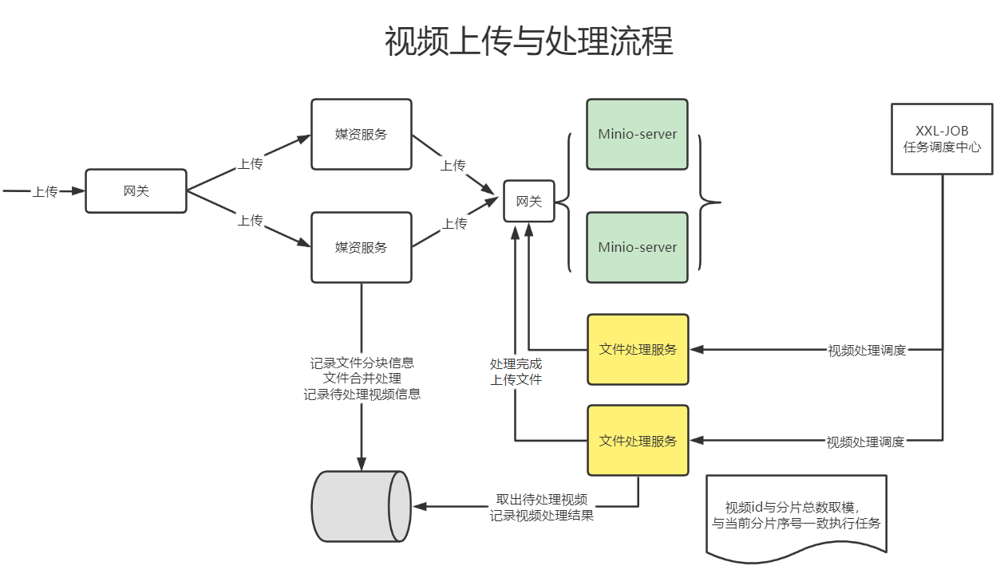
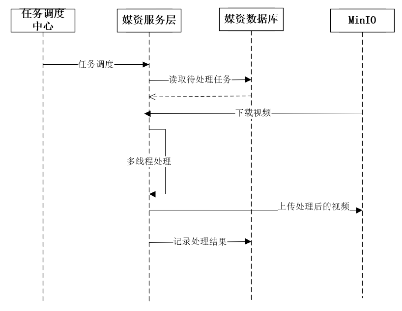

# 分布式任务调度

对一个视频的转码可以理解为一个任务的执行,如果视频的数量比较多,如何去高效处理一批任务呢?

1. 多线程
多线程是充分利用单机的资源

2. 分布式加多线程
充分利用多台计算机,每台计算机使用多线程处理

方案2可扩展性更强,这就是一种分布式任务调度的处理方案

**任务调度**就是对任务的调度,它是指系统为了完成特定业务,基于给定时间点,给定时间间隔或者给定执行次数自动执行任务

通常任务调度的程序是集成在应用中的,比如:优惠卷服务中包括了定时发放优惠卷的的调度程序,结算服务中包括了定期生成报表的任务调度程序,由于采用分布式架构,一个服务往往会部署多个冗余实例来运行业务,在这种分布式系统环境下运行任务调度,被称之为**分布式任务调度**

# 分布式调度要实现的目标

不管是任务调度程序集成在应用程序中,还是单独构建的任务调度系统,如果采用分布式调度任务的方式就相当于将任务调度程序分布式构建,这样就可以具有分布式系统的特点,并且提高任务的调度处理能力:

1. **并行任务调度**
    
    并行任务调度实现靠多线程,如果有大量任务需要调度,此时光靠多线程就会有瓶颈了,因为一台计算机CPU的处理能力是有限的,如果将任务调度程序分布式部署,每个结点还可以部署为集群,这样就可以让多台计算机共同去完成任务调度,可以将任务分割为若干个分片,由不同的实例并行执行,来提高任务调度的处理效率

2. **高可用**

    若某一个实例宕机,不影响其他实例来执行任务

3. **弹性扩容**
    
    当集群中增加实例就可以提高并执行任务的处理效率

4. **任务管理与监测**

    对系统中存在的所有定时任务进行统一的管理及监测,让开发人员及运维人员能够时刻了解任务执行情况,从而做出快速的应急处理响应

5. **避免任务重复执行**

    当任务调度以集群方式部署,同一个任务调度可能会执行多次,比如在上面提到的电商系统中到点发优惠券的例子,就会发放多次优惠券,对公司造成很多损失,所以需要控制相同的任务在多个运行实例上只执行一次

# XXL-JOB

[XXL-JOB官方网站](https://www.xuxueli.com/xxl-job/)

[XXL-JOB调度中心 Github仓库](https://github.com/xuxueli/xxl-job)



- 调度中心:
    负责管理调度信息,按照调度配置发出调度请求,自身不承担业务代码
    主要职责为执行器管理、任务管理、监控运维、日志管理等

- 任务执行器:
    负责接收调度请求并执行任务逻辑
    只要职责是注册服务、任务执行服务(接收到任务后会放入线程池中的任务队列)、执行结果上报、日志服务等

- 任务:负责执行具体的业务处理



执行流程:
1. 任务执行器根据配置的调度中心的地址,自动注册到调度中心
2. 达到任务触发条件,调度中心下发任务
3. 执行器基于线程池执行任务,并把执行结果放入内存队列中、把执行日志写入日志文件中
4. 执行器消费内存队列中的执行结果,主动上报给调度中心
5. 当用户在调度中心查看任务日志,调度中心请求任务执行器,任务执行器读取任务日志文件并返回日志详情

## 基本使用

1. 父工程指定xxl-job-core依赖版本,子工程依赖引入

```xml
<dependency>
    <groupId>com.xuxueli</groupId>
    <artifactId>xxl-job-core</artifactId>
</dependency>
```

2. Nacos配置xxl-job,appname即执行器名

```yaml
xxl:
  job:
    admin: 
      addresses: http://192.168.101.65:8088/xxl-job-admin
    executor:
      appname: testHandler
      address: 
      ip: 
      port: 9999
      logpath: /data/applogs/xxl-job/jobhandler
      logretentiondays: 30
    accessToken: default_token
```

3. 调度中心新增执行器,appname是前边在nacos中配置xxl信息时指定的执行器的应用名

4. 将xxl-job示例工程下配置类拷贝到媒资管理的service工程下

```java
package com.xxl.job.executor.core.config;

import com.xxl.job.core.executor.impl.XxlJobSpringExecutor;
import org.slf4j.Logger;
import org.slf4j.LoggerFactory;
import org.springframework.beans.factory.annotation.Value;
import org.springframework.context.annotation.Bean;
import org.springframework.context.annotation.Configuration;

/**
 * xxl-job config
 *
 * @author xuxueli 2017-04-28
 */
@Configuration
public class XxlJobConfig {
    private Logger logger = LoggerFactory.getLogger(XxlJobConfig.class);

    @Value("${xxl.job.admin.addresses}")
    private String adminAddresses;

    @Value("${xxl.job.accessToken}")
    private String accessToken;

    @Value("${xxl.job.executor.appname}")
    private String appname;

    @Value("${xxl.job.executor.address}")
    private String address;

    @Value("${xxl.job.executor.ip}")
    private String ip;

    @Value("${xxl.job.executor.port}")
    private int port;

    @Value("${xxl.job.executor.logpath}")
    private String logPath;

    @Value("${xxl.job.executor.logretentiondays}")
    private int logRetentionDays;


    @Bean
    public XxlJobSpringExecutor xxlJobExecutor() {
        logger.info(">>>>>>>>>>> xxl-job config init.");
        XxlJobSpringExecutor xxlJobSpringExecutor = new XxlJobSpringExecutor();
        xxlJobSpringExecutor.setAdminAddresses(adminAddresses);
        xxlJobSpringExecutor.setAppname(appname);
        xxlJobSpringExecutor.setAddress(address);
        xxlJobSpringExecutor.setIp(ip);
        xxlJobSpringExecutor.setPort(port);
        xxlJobSpringExecutor.setAccessToken(accessToken);
        xxlJobSpringExecutor.setLogPath(logPath);
        xxlJobSpringExecutor.setLogRetentionDays(logRetentionDays);

        return xxlJobSpringExecutor;
    }

    /**
     * 针对多网卡、容器内部署等情况,可借助 "spring-cloud-commons" 提供的 "InetUtils" 组件灵活定制注册IP
     *
     *      1、引入依赖:
     *          <dependency>
     *             <groupId>org.springframework.cloud</groupId>
     *             <artifactId>spring-cloud-commons</artifactId>
     *             <version>${version}</version>
     *         </dependency>
     *
     *      2、配置文件,或者容器启动变量
     *          spring.cloud.inetutils.preferred-networks: 'xxx.xxx.xxx.'
     *
     *      3、获取IP
     *          String ip_ = inetUtils.findFirstNonLoopbackHostInfo().getIpAddress();
     */
}
```

5. 在媒资服务service包下新建jobhandler存放任务类,参考示例工程编写一个任务类

```java
package com.xuecheng.media.service.jobhandler;

import com.xxl.job.core.context.XxlJobHelper;
import com.xxl.job.core.handler.annotation.XxlJob;
import org.slf4j.Logger;
import org.slf4j.LoggerFactory;
import org.springframework.stereotype.Component;

/**
 * XxlJob开发示例(Bean模式)
 * <p>
 * 开发步骤:
 * 1、任务开发:在Spring Bean实例中,开发Job方法
 * 2、注解配置:为Job方法添加注解 "@XxlJob(value="自定义jobhandler名称", init = "JobHandler初始化方法", destroy = "JobHandler销毁方法")",注解value值对应的是调度中心新建任务的JobHandler属性的值
 * 3、执行日志:需要通过 "XxlJobHelper.log" 打印执行日志
 * 4、任务结果:默认任务结果为 "成功" 状态,不需要主动设置如有诉求,比如设置任务结果为失败,可以通过 "XxlJobHelper.handleFail/handleSuccess" 自主设置任务结果
 *
 * @author xuxueli 2019-12-11 21:52:51
 */
@Component
public class SampleXxlJob {
    private static Logger logger = LoggerFactory.getLogger(SampleXxlJob.class);


    /**
     * 1、简单任务示例(Bean模式)
     */
    @XxlJob("demoJobHandler")
    public void demoJobHandler() throws Exception {
        System.out.println("处理视频...");
    }
}
```

6. 调度中心添加任务,选择执行器并启动任务



调度类型:
- 固定速度指按固定的间隔定时调度
- Cron,通过Cron表达式实现更丰富的定时调度策略

    Cron表达式是一个字符串,通过它可以定义调度策略,格式如下:
    `{秒数} {分钟} {小时} {日期} {月份} {星期} {年份(可为空)}`

运行模式:选择BEAN,JobHandler中填写对应的任务名demoJobHandler

路由策略:当执行器集群部署时,调度中心向哪个执行器下发任务,这里选择第一个表示只向第一个执行器下发任务

### 分片广播

和基本使用大体一致

JobHandler中填写对应的任务名shardingJobHandler,路由策略选择分片广播

在媒资服务service包下的jobhandler存放任务类,参考示例工程编写一个任务类

```java
package com.xuecheng.media.service.jobhandler;

import com.xxl.job.core.context.XxlJobHelper;
import com.xxl.job.core.handler.annotation.XxlJob;
import org.slf4j.Logger;
import org.slf4j.LoggerFactory;
import org.springframework.stereotype.Component;

/**
 * XxlJob开发示例（Bean模式）
 * <p>
 * 开发步骤：
 * 1、任务开发：在Spring Bean实例中,开发Job方法；
 * 2、注解配置：为Job方法添加注解 "@XxlJob(value="自定义jobhandler名称", init = "JobHandler初始化方法", destroy = "JobHandler销毁方法")",注解value值对应的是调度中心新建任务的JobHandler属性的值。
 * 3、执行日志：需要通过 "XxlJobHelper.log" 打印执行日志；
 * 4、任务结果：默认任务结果为 "成功" 状态,不需要主动设置；如有诉求,比如设置任务结果为失败,可以通过 "XxlJobHelper.handleFail/handleSuccess" 自主设置任务结果；
 *
 * @author xuxueli 2019-12-11 21:52:51
 */
@Component
public class SampleXxlJob {
    private static Logger logger = LoggerFactory.getLogger(SampleXxlJob.class);


    /**
     * 1、简单任务示例（Bean模式）
     */
    @XxlJob("demoJobHandler")
    public void demoJobHandler() throws Exception {
        System.out.println("处理视频...");
    }

    /**
     * 2、分片广播任务
     */
    @XxlJob("shardingJobHandler")
    public void shardingJobHandler() throws Exception {

        // 分片参数
        int shardIndex = XxlJobHelper.getShardIndex(); // 执行器序号,从0开始
        int shardTotal = XxlJobHelper.getShardTotal(); // 执行器总数

        XxlJobHelper.log("分片参数：当前分片序号 = {}, 总分片数 = {}", shardIndex, shardTotal);

        // 业务逻辑
        for (int i = 0; i < shardTotal; i++) {
            if (i == shardIndex) {
                XxlJobHelper.log("第 {} 片, 命中分片开始处理", i);
                System.out.println("命中分片" + i + "开始处理");
            } else {
                XxlJobHelper.log("第 {} 片, 忽略", i);
                System.out.println("忽略" + i);
            }
        }
    }
}
```

## 高级配置

- 路由策略:当执行器集群部署时,提供丰富的路由策略,包括
    - `FIRST`(第一个):固定选择第一个机器
    - `LAST`(最后一个):固定选择最后一个机器
    - `ROUND`(轮询):轮流选择机器
    - `RANDOM`(随机):随机选择在线的机器
    - `CONSISTENT_HASH`(一致性HASH):每个任务按照Hash算法固定选择某一台机器,且所有任务均匀散列在不同机器上
    - `LEAST_FREQUENTLY_USED`(最不经常使用):使用频率最低的机器优先被选举
    - `LEAST_RECENTLY_USED`(最近最久未使用):最久未使用的机器优先被选举
    - `FAILOVER`(故障转移):按照顺序依次进行心跳检测,第一个心跳检测成功的机器选定为目标执行器并发起调度
    - `BUSYOVER`(忙碌转移):按照顺序依次进行空闲检测,第一个空闲检测成功的机器选定为目标执行器并发起调度
    - `SHARDING_BROADCAST`(分片广播):广播触发对应集群中所有机器执行一次任务,同时系统自动传递分片参数可根据分片参数开发分片任务

- 子任务:每个任务都拥有一个唯一的任务ID(任务ID可以从任务列表获取),当本任务执行结束并且执行成功时,将会触发子任务ID所对应的任务的一次主动调度,通过子任务可以实现一个任务执行完成去执行另一个任务

- 调度过期策略:
    - 忽略:调度过期后,忽略过期的任务,从当前时间开始重新计算下次触发时间
    - 立即执行一次:调度过期后,立即执行一次,并从当前时间开始重新计算下次触发时间

- 阻塞处理策略:调度过于密集执行器来不及处理时的处理策略
    - 单机串行(默认):调度请求进入单机执行器后,调度请求进入FIFO队列并以串行方式运行
    - 丢弃后续调度:调度请求进入单机执行器后,发现执行器存在运行的调度任务,本次请求将会被丢弃并标记为失败
    - 覆盖之前调度:调度请求进入单机执行器后,发现执行器存在运行的调度任务,将会终止运行中的调度任务并清空队列,然后运行本地调度任务

- 任务超时时间:支持自定义任务超时时间,任务运行超时将会主动中断任务

- 失败重试次数支持自定义任务失败重试次数,当任务失败时将会按照预设的失败重试次数主动进行重试

# 学成在线项目

## 视频上传与处理方案





1. 任务调度中心广播作业分片
2. 执行器收到广播作业分片,从数据库读取待处理任务,读取未处理及处理失败的任务
3. 执行器更新任务为处理中,根据任务内容从MinIO下载要处理的文件
4. 执行器启动多线程去处理任务
5. 任务处理完成,上传处理后的视频到MinIO
6. 将更新任务处理结果,如果视频处理完成除了更新任务处理结果以外还要将文件的访问地址更新至任务处理表及文件表中,最后将任务完成记录写入历史表

### 视频处理代码实现

1. 父工程指定xxl-job-core依赖版本,子工程依赖引入

```xml
<dependency>
    <groupId>com.xuxueli</groupId>
    <artifactId>xxl-job-core</artifactId>
</dependency>
```

2. Nacos配置xxl-job,appname即执行器名

```yaml
xxl:
  job:
    admin: 
      addresses: http://192.168.101.65:8088/xxl-job-admin
    executor:
      appname: media-process-service
      address: 
      ip: 
      port: 9999
      logpath: /data/applogs/xxl-job/jobhandler
      logretentiondays: 30
    accessToken: default_token
```

3. 调度中心新增执行器,appname是前边在nacos中配置xxl信息时指定的执行器的应用名

4. 将xxl-job示例工程下配置类拷贝到媒资管理的service工程下

```java
package com.xuecheng.media.config;

import com.xxl.job.core.executor.impl.XxlJobSpringExecutor;
import org.slf4j.Logger;
import org.slf4j.LoggerFactory;
import org.springframework.beans.factory.annotation.Value;
import org.springframework.context.annotation.Bean;
import org.springframework.context.annotation.Configuration;

/**
 * xxl-job config
 *
 * @author xuxueli 2017-04-28
 */
@Configuration
public class XxlJobConfig {
    private Logger logger = LoggerFactory.getLogger(XxlJobConfig.class);

    @Value("${xxl.job.admin.addresses}")
    private String adminAddresses;

    @Value("${xxl.job.accessToken}")
    private String accessToken;

    @Value("${xxl.job.executor.appname}")
    private String appname;

    @Value("${xxl.job.executor.address}")
    private String address;

    @Value("${xxl.job.executor.ip}")
    private String ip;

    @Value("${xxl.job.executor.port}")
    private int port;

    @Value("${xxl.job.executor.logpath}")
    private String logPath;

    @Value("${xxl.job.executor.logretentiondays}")
    private int logRetentionDays;


    @Bean
    public XxlJobSpringExecutor xxlJobExecutor() {
        logger.info(">>>>>>>>>>> xxl-job config init.");
        XxlJobSpringExecutor xxlJobSpringExecutor = new XxlJobSpringExecutor();
        xxlJobSpringExecutor.setAdminAddresses(adminAddresses);
        xxlJobSpringExecutor.setAppname(appname);
        xxlJobSpringExecutor.setAddress(address);
        xxlJobSpringExecutor.setIp(ip);
        xxlJobSpringExecutor.setPort(port);
        xxlJobSpringExecutor.setAccessToken(accessToken);
        xxlJobSpringExecutor.setLogPath(logPath);
        xxlJobSpringExecutor.setLogRetentionDays(logRetentionDays);

        return xxlJobSpringExecutor;
    }

    /**
     * 针对多网卡、容器内部署等情况，可借助 "spring-cloud-commons" 提供的 "InetUtils" 组件灵活定制注册IP；
     *
     *      1、引入依赖：
     *          <dependency>
     *             <groupId>org.springframework.cloud</groupId>
     *             <artifactId>spring-cloud-commons</artifactId>
     *             <version>${version}</version>
     *         </dependency>
     *
     *      2、配置文件，或者容器启动变量
     *          spring.cloud.inetutils.preferred-networks: 'xxx.xxx.xxx.'
     *
     *      3、获取IP
     *          String ip_ = inetUtils.findFirstNonLoopbackHostInfo().getIpAddress();
     */
}
```

5. 在service目录下新建jobhandler包,新建类VideoTask

```java
package com.xuecheng.media.service.jobhandler;

import com.xuecheng.base.utils.Mp4VideoUtil;
import com.xuecheng.media.model.po.MediaProcess;
import com.xuecheng.media.service.MediaFileProcessService;
import com.xuecheng.media.service.MediaFileService;
import com.xxl.job.core.context.XxlJobHelper;
import com.xxl.job.core.handler.annotation.XxlJob;
import lombok.RequiredArgsConstructor;
import lombok.extern.slf4j.Slf4j;
import org.springframework.beans.factory.annotation.Value;
import org.springframework.stereotype.Component;

import java.io.File;
import java.io.IOException;
import java.util.List;
import java.util.concurrent.CountDownLatch;
import java.util.concurrent.ExecutorService;
import java.util.concurrent.Executors;
import java.util.concurrent.TimeUnit;

/**
 * @description 视频处理任务
 */
@Slf4j
@Component
@RequiredArgsConstructor
public class VideoTask {

    private final MediaFileProcessService mediaFileProcessService;
    private final MediaFileService mediaFileService;

    @Value("${videoprocess.ffmpegpath}")
    private String ffmpeg_path;

    /**
     * 视频处理任务
     *
     * @throws Exception 异常
     */
    @XxlJob("videoJobHandler")
    public void videoJobHandler() throws Exception {
        //=============== 分片参数 ======================================================================================
        int shardIndex = XxlJobHelper.getShardIndex(); // 执行器序号,从0开始
        int shardTotal = XxlJobHelper.getShardTotal(); // 执行器总数

        //=============== 确定cpu的核心数 ================================================================================
        int processors = Runtime.getRuntime().availableProcessors();

        //=============== 查询待处理的任务 ================================================================================
        List<MediaProcess> mediaProcessList = mediaFileProcessService.getMediaProcessList(shardTotal, shardIndex, 3, processors);

        // 任务数量
        int size = mediaProcessList.size();
        log.debug("取到的视频处理任务数为{}", size);
        if (size == 0) {
            return;
        }

        //=============== 创建一个线程池 ==================================================================================
        ExecutorService executorService = Executors.newFixedThreadPool(size);

        // 使用计数器
        CountDownLatch countDownLatch = new CountDownLatch(size);

        mediaProcessList.forEach(mediaProcess -> {
            // 将任务加入线程池
            executorService.execute(() -> {
                try {
                    // 任务id
                    Long taskId = mediaProcess.getId();

                    // 开启(抢占)任务
                    boolean b = mediaFileProcessService.startTask(taskId);

                    // 抢占任务失败
                    if (!b) {
                        log.debug("抢占任务失败,任务id:{}", taskId);
                        return;
                    }

                    // 抢占任务成功

                    String fileId = mediaProcess.getFileId(); // 文件id

                    // 下载minio视频到本地
                    String bucket = mediaProcess.getBucket(); // 桶
                    String objectName = mediaProcess.getFilePath(); // 对象名
                    File file = mediaFileService.downloadFileFromMinIO(bucket, objectName);
                    if (file == null) {
                        log.debug("下载视频出错,任务id:{},bucket:{},objectName:{}", taskId, bucket, objectName);
                        // 保存任务处理失败的结果
                        mediaFileProcessService.saveProcessFinishStatus(taskId, "3", fileId, null, "下载视频出错");
                        return;
                    }

                    // 源avi视频的路径
                    String video_path = file.getAbsolutePath();

                    // 转换后mp4文件的名称,文件id就是md5值,加上扩展名即为文件名称
                    String mp4_name = fileId + ".mp4";

                    // 转换后mp4文件的路径
                    // 创建临时文件,作为转换后的文件
                    File mp4File;
                    try {
                        mp4File = File.createTempFile("minio", ".mp4");
                    } catch (IOException e) {
                        log.debug("创建临时文件异常,任务id:{},bucket:{},objectName:{}", taskId, bucket, objectName);
                        // 保存任务处理失败的结果
                        mediaFileProcessService.saveProcessFinishStatus(taskId, "3", fileId, null, "创建临时文件异常");
                        return;
                    }
                    String mp4_path = mp4File.getAbsolutePath();

                    // 创建工具类对象
                    Mp4VideoUtil videoUtil = new Mp4VideoUtil(ffmpeg_path, video_path, mp4_name, mp4_path);

                    // 开始视频转码,成功将返回success
                    String resultGenerateMp4 = videoUtil.generateMp4();
                    if (!resultGenerateMp4.equals("success")) {
                        log.debug("视频转码失败,任务id:{},bucket:{},objectName:{},具体原因:{}", taskId, bucket, objectName, resultGenerateMp4);
                        // 保存任务处理失败的结果
                        mediaFileProcessService.saveProcessFinishStatus(taskId, "3", fileId, null, "视频转码失败");
                        return;
                    }

                    // mp4对象名
                    objectName = mediaFileService.getChunkFilePath(fileId, ".mp4");

                    // 上传视频到MinIO
                    boolean resultToMinIO = mediaFileService.uploadFileToMinIO(bucket, mp4File.getAbsolutePath(), objectName, "video/mp4");
                    if (!resultToMinIO) {
                        log.debug("上传视频到MinIO失败,任务id:{},bucket:{},objectName:{}", taskId, bucket, objectName);
                        // 保存任务处理失败的结果
                        mediaFileProcessService.saveProcessFinishStatus(taskId, "3", fileId, null, "上传视频到MinIO失败");
                        return;
                    }

                    // mp4文件的url
                    String url = "/" + bucket + "/" + objectName;
                    // 保存任务的处理成功结果
                    mediaFileProcessService.saveProcessFinishStatus(taskId, "2", fileId, url, null);
                } finally {
                    // 计数器-1
                    countDownLatch.countDown();
                }
            });
        });
        // 阻塞直到所有任务都执行完毕,指定最大限制的等待时间,阻塞最多等待30分钟就解除阻塞
        boolean await = countDownLatch.await(30, TimeUnit.MINUTES);
    }
}
```

## 课程发布分布式事务控制处理方案


### 课程发布代码实现

1. 父工程指定xxl-job-core依赖版本,子工程依赖引入

```xml
<dependency>
    <groupId>com.xuxueli</groupId>
    <artifactId>xxl-job-core</artifactId>
</dependency>
```

2. Nacos配置xxl-job,appname即执行器名

```yaml
xxl:
  job:
    admin: 
      addresses: http://192.168.101.65:8088/xxl-job-admin
    executor:
      appname: coursepublish-job
      address: 
      ip: 
      port: 8999
      logpath: /data/applogs/xxl-job/jobhandler
      logretentiondays: 30
    accessToken: default_token
```

3. 调度中心新增执行器,appname是前边在nacos中配置xxl信息时指定的执行器的应用名

4. 将xxl-job示例工程下配置类拷贝到内容管理的service工程下

```java
package com.xuecheng.media.config;

import com.xxl.job.core.executor.impl.XxlJobSpringExecutor;
import org.slf4j.Logger;
import org.slf4j.LoggerFactory;
import org.springframework.beans.factory.annotation.Value;
import org.springframework.context.annotation.Bean;
import org.springframework.context.annotation.Configuration;

/**
 * xxl-job config
 *
 * @author xuxueli 2017-04-28
 */
@Configuration
public class XxlJobConfig {
    private Logger logger = LoggerFactory.getLogger(XxlJobConfig.class);

    @Value("${xxl.job.admin.addresses}")
    private String adminAddresses;

    @Value("${xxl.job.accessToken}")
    private String accessToken;

    @Value("${xxl.job.executor.appname}")
    private String appname;

    @Value("${xxl.job.executor.address}")
    private String address;

    @Value("${xxl.job.executor.ip}")
    private String ip;

    @Value("${xxl.job.executor.port}")
    private int port;

    @Value("${xxl.job.executor.logpath}")
    private String logPath;

    @Value("${xxl.job.executor.logretentiondays}")
    private int logRetentionDays;


    @Bean
    public XxlJobSpringExecutor xxlJobExecutor() {
        logger.info(">>>>>>>>>>> xxl-job config init.");
        XxlJobSpringExecutor xxlJobSpringExecutor = new XxlJobSpringExecutor();
        xxlJobSpringExecutor.setAdminAddresses(adminAddresses);
        xxlJobSpringExecutor.setAppname(appname);
        xxlJobSpringExecutor.setAddress(address);
        xxlJobSpringExecutor.setIp(ip);
        xxlJobSpringExecutor.setPort(port);
        xxlJobSpringExecutor.setAccessToken(accessToken);
        xxlJobSpringExecutor.setLogPath(logPath);
        xxlJobSpringExecutor.setLogRetentionDays(logRetentionDays);

        return xxlJobSpringExecutor;
    }

    /**
     * 针对多网卡、容器内部署等情况，可借助 "spring-cloud-commons" 提供的 "InetUtils" 组件灵活定制注册IP；
     *
     *      1、引入依赖：
     *          <dependency>
     *             <groupId>org.springframework.cloud</groupId>
     *             <artifactId>spring-cloud-commons</artifactId>
     *             <version>${version}</version>
     *         </dependency>
     *
     *      2、配置文件，或者容器启动变量
     *          spring.cloud.inetutils.preferred-networks: 'xxx.xxx.xxx.'
     *
     *      3、获取IP
     *          String ip_ = inetUtils.findFirstNonLoopbackHostInfo().getIpAddress();
     */
}
```

5. 在service目录下新建jobhandler包,新建类CoursePublishTask继承MessageProcessAbstract

MessageProcessAbstract.java:

```java
package com.xuecheng.messagesdk.service;

import com.xuecheng.messagesdk.model.po.MqMessage;
import lombok.Data;
import lombok.extern.slf4j.Slf4j;
import org.springframework.beans.factory.annotation.Autowired;

import java.util.List;
import java.util.concurrent.*;

/**
 * @author Mr.M
 * @version 1.0
 * @description 消息处理抽象类
 * @date 2022/9/21 19:44
 */
@Slf4j
@Data
public abstract class MessageProcessAbstract {

    @Autowired
    MqMessageService mqMessageService;


    /**
     * @param mqMessage 执行任务内容
     * @return boolean true:处理成功，false处理失败
     * @description 任务处理
     * @author Mr.M
     * @date 2022/9/21 19:47
     */
    public abstract boolean execute(MqMessage mqMessage) throws Exception;


    /**
     * @param shardIndex  分片序号
     * @param shardTotal  分片总数
     * @param messageType 消息类型
     * @param count       一次取出任务总数
     * @param timeout     预估任务执行时间,到此时间如果任务还没有结束则强制结束 单位秒
     * @return void
     * @description 扫描消息表多线程执行任务
     * @author Mr.M
     * @date 2022/9/21 20:35
     */
    public void process(int shardIndex, int shardTotal, String messageType, int count, long timeout) {

        try {
            //扫描消息表获取任务清单
            List<MqMessage> messageList = mqMessageService.getMessageList(shardIndex, shardTotal, messageType, count);
            //任务个数
            int size = messageList.size();
            log.debug("取出待处理消息" + size + "条");
            if (size <= 0) {
                return;
            }

            //创建线程池
            ExecutorService threadPool = Executors.newFixedThreadPool(size);
            //计数器
            CountDownLatch countDownLatch = new CountDownLatch(size);
            messageList.forEach(message -> {
                threadPool.execute(() -> {
                    log.debug("开始任务:{}", message);
                    //处理任务
                    try {
                        boolean result = execute(message);
                        if (result) {
                            log.debug("任务执行成功:{})", message);
                            //更新任务状态,删除消息表记录,添加到历史表
                            int completed = mqMessageService.completed(message.getId());
                            if (completed > 0) {
                                log.debug("任务执行成功:{}", message);
                            } else {
                                log.debug("任务执行失败:{}", message);
                            }
                        }
                    } catch (Exception e) {
                        e.printStackTrace();
                        log.debug("任务出现异常:{},任务:{}", e.getMessage(), message);
                    } finally {
                        //计数
                        countDownLatch.countDown();
                    }
                    log.debug("结束任务:{}", message);
                });
            });

            //等待,给一个充裕的超时时间,防止无限等待，到达超时时间还没有处理完成则结束任务
            countDownLatch.await(timeout, TimeUnit.SECONDS);
            System.out.println("结束....");
        } catch (InterruptedException e) {
            e.printStackTrace();
        }
    }
}
```

CoursePublishTask.java:

```java
package com.xuecheng.content.service.jobhandler;

import com.xuecheng.base.exception.XueChengPlusException;
import com.xuecheng.content.feignclient.CourseIndex;
import com.xuecheng.content.feignclient.SearchServiceClient;
import com.xuecheng.content.mapper.CoursePublishMapper;
import com.xuecheng.content.model.po.CoursePublish;
import com.xuecheng.content.service.CoursePublishService;
import com.xuecheng.messagesdk.model.po.MqMessage;
import com.xuecheng.messagesdk.service.MessageProcessAbstract;
import com.xuecheng.messagesdk.service.MqMessageService;
import com.xxl.job.core.context.XxlJobHelper;
import com.xxl.job.core.handler.annotation.XxlJob;
import lombok.RequiredArgsConstructor;
import lombok.extern.slf4j.Slf4j;
import org.springframework.beans.BeanUtils;
import org.springframework.stereotype.Component;

import java.io.File;

/**
 * @description 课程发布任务
 */
@Slf4j
@Component
@RequiredArgsConstructor
public class CoursePublishTask extends MessageProcessAbstract {

    private final CoursePublishService coursePublishService;
    private final SearchServiceClient searchServiceClient;
    private final CoursePublishMapper coursePublishMapper;

    /**
     * 任务调度入口
     *
     * @throws Exception 异常
     */
    @XxlJob("CoursePublishJobHandler")
    public void coursePublishJobHandler() throws Exception {
        // 执行器序号,从0开始
        int shardIndex = XxlJobHelper.getShardIndex();
        // 执行器总数
        int shardTotal = XxlJobHelper.getShardTotal();

        log.debug("shardIndex={},shardTotal={}", shardIndex, shardTotal);

        // 调用抽象类的方法执行任务
        // 参数:分片序号、分片总数、消息类型、一次最多取到的任务数量、一次任务调度执行的超时时间
        process(shardIndex, shardTotal, "course_publish", 30, 60);
    }

    /**
     * 执行课程发布任务的逻辑
     *
     * @param mqMessage 执行任务内容
     * @description 如果任务执行成功, 返回true, 如果此方法抛出异常, 则任务执行失败并返回false
     */
    @Override
    public boolean execute(MqMessage mqMessage) throws Exception {
        // 获取消息相关的业务信息:课程id
        Long courseId = Long.parseLong(mqMessage.getBusinessKey1());
        // 生成课程静态化页面并上传到MinIO
        generateCourseHtml(mqMessage, courseId);
        // 添加课程索引到ElasticSearch
        saveCourseIndex(mqMessage, courseId);
        // 缓存课程信息到Redis
        saveCourseCache(mqMessage, courseId);
        // 返回true表示任务完成
        return true;
    }

    /**
     * 生成课程静态化页面并上传到MinIO
     *
     * @param mqMessage 消息
     * @param courseId  课程id
     */
    private void generateCourseHtml(MqMessage mqMessage, Long courseId) throws Exception {
        log.debug("开始课程静态化任务,courseId:{}", courseId);
        // 任务幂等性处理

        // 消息id
        Long taskId = mqMessage.getId();

        // 查询数据库取出该阶段的执行状态
        MqMessageService mqMessageService = this.getMqMessageService();
        int stageOne = mqMessageService.getStageOne(taskId);
        if (stageOne > 0) {
            log.debug("课程静态化任务完成,无需处理");
            return;
        }

        // 生成课程静态化页面
        File file = coursePublishService.generateCourseHtml(courseId);
        if (file == null) {
            XueChengPlusException.cast("生成的静态化页面为空");
        }

        // 上传课程静态化页面到MinIO
        coursePublishService.uploadCourseHtml(courseId, file);

        // 任务处理完成,更新任务状态为成功
        mqMessageService.completedStageOne(taskId);
    }

    /**
     * 添加课程索引到ElasticSearch
     *
     * @param mqMessage 消息
     * @param courseId  课程id
     */
    private void saveCourseIndex(MqMessage mqMessage, Long courseId) {
        log.debug("开始添加课程索引任务,courseId:{}", courseId);
        // 任务幂等性处理

        // 消息id
        Long taskId = mqMessage.getId();

        // 查询数据库取出该阶段的执行状态
        MqMessageService mqMessageService = this.getMqMessageService();
        int stageOne = mqMessageService.getStageTwo(taskId);
        if (stageOne > 0) {
            log.debug("添加课程索引任务完成,无需处理");
            return;
        }

        // 查询数据库取出课程发布信息
        CoursePublish coursePublish = coursePublishMapper.selectById(courseId);
        // 拷贝至课程索引对象
        CourseIndex courseIndex = new CourseIndex();
        BeanUtils.copyProperties(coursePublish, courseIndex);

        // 添加课程索引
        Boolean add = searchServiceClient.add(courseIndex);
        if (!add) {
            XueChengPlusException.cast("添加课程索引失败");
        }

        // 任务处理完成,更新任务状态为成功
        mqMessageService.completedStageTwo(taskId);
    }

    /**
     * 缓存课程信息到Redis
     *
     * @param mqMessage 消息
     * @param courseId  课程id
     */
    private void saveCourseCache(MqMessage mqMessage, Long courseId) {
        log.debug("开始缓存课程信息任务,courseId:{}", courseId);
        // 任务幂等性处理

        // 消息id
        Long taskId = mqMessage.getId();

        // 查询数据库取出该阶段的执行状态
        MqMessageService mqMessageService = this.getMqMessageService();
        int stageOne = mqMessageService.getStageThree(taskId);
        if (stageOne > 0) {
            log.debug("缓存课程信息任务完成,无需处理");
            return;
        }

        // 开始缓存课程信息 TODO

        // 任务处理完成,更新任务状态为成功
        mqMessageService.completedStageThree(taskId);
    }
}
```

