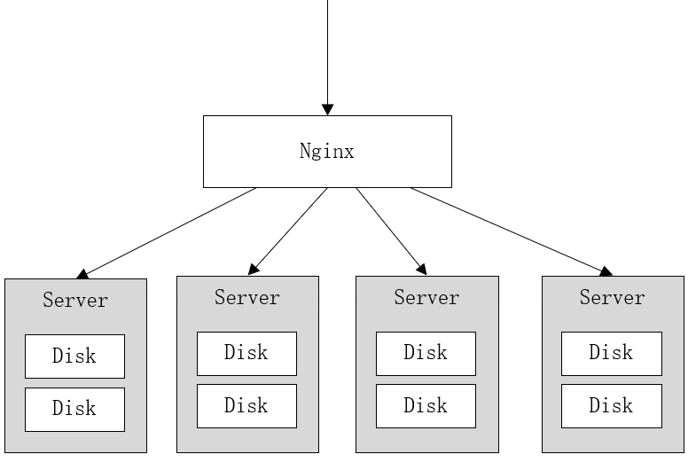

# 分布式文件系统

文件系统是负责管理和存储文件的系统软件,操作系统通过文件系统提供的接口去存取文件,用户通过操作系统访问磁盘上的文件

常见的文件系统:FAT16/FAT32、NTFS、HFS、UFS、APFS、XFS、Ext4等


通过概念可以简单理解为:一个计算机无法存储海量的文件,通过网络将若干计算机组织起来共同去存储海量的文件,去接收海量用户的请求,这些组织起来的计算机通过网络进行通信,如下图:


特点:
1. 一台计算机的文件系统处理能力扩充到多台计算机同时处理
2. 一台计算机挂了还有另外副本计算机提供数据
3. 每台计算机可以放在不同的地域,这样用户就可以就近访问,提高访问速度

# NFS


特点:
1. 在客户端上映射NFS服务器的驱动器
2. 客户端通过网络访问NFS服务器的硬盘完全透明

# GFS

GFS是一个可扩展的分布式文件系统,用于大型的、分布式的、对大量数据进行访问的应用,它运行于廉价的普通硬件上,可以提供容错功能,可以给大量的用户提供总体性能较高的服务


特点:
1. GFS采用主从结构,一个GFS集群由一个master和大量的chunkserver组成
2. master存储了数据文件的元数据,一个文件被分成了若干块存储在多个chunkserver中
3. 用户从master中获取数据元信息,向chunkserver存储数据

# HDFS

HDFS,是Hadoop Distributed File System的简称,是Hadoop抽象文件系统的一种实现

HDFS是一个高度容错性的系统,适合部署在廉价的机器上,HDFS能提供高吞吐量的数据访问,非常适合大规模数据集上的应用

HDFS的文件分布在集群机器上,同时提供副本进行容错及可靠性保证,例如客户端写入读取文件的直接操作都是分布在集群各个机器上的,没有单点性能压力


特点:
1. HDFS采用主从结构,一个HDFS集群由一个名称结点和若干数据结点组成
2. 名称结点存储数据的元信息,一个完整的数据文件分成若干块存储在数据结点
3. 客户端从名称结点获取数据的元信息及数据分块的信息,得到信息客户端即可从数据块来存取数据

# 云计算厂家

1. 阿里云对象存储服务(简称OSS),是阿里云提供的海量、安全、低成本、高可靠的云存储服务

其数据设计持久性不低于99.9999999999%(12个9),服务设计可用性(或业务连续性)不低于99.995%

[阿里云OSS官方网站](https://www.aliyun.com/product/oss) 

2. 百度对象存储(简称BOS)提供稳定、安全、高效、高可扩展的云存储服务

可以将任意数量和形式的非结构化数据存入BOS,并对数据进行管理和处理,BOS支持标准、低频、冷和归档存储等多种存储类型,满足多场景的存储需求

[百度云BOS官方网站](https://cloud.baidu.com/product/bos.html) 

# MinIO

MinIO是一个非常轻量的服务,可以很简单的和其他应用的结合使用,它兼容亚马逊S3云存储服务接口,非常适合于存储大容量非结构化的数据,例如图片、视频、日志文件、备份数据和容器/虚拟机镜像等

它一大特点就是轻量,使用简单,功能强大,支持各种平台,单个文件最大5TB,兼容Amazon S3接口,提供了Java、Python、GO等多版本SDK支持

[MinIO官方网站](https://min.io)

[MinIO中文文档](https://www.minio.org.cn/docs/minio/linux/index.html)

MinIO集群采用**去中心化共享架构**,每个结点是对等关系,通过Nginx可对MinIO进行负载均衡访问

## 去中性化

在大数据领域,通常的设计理念都是无中心和分布式,Minio分布式模式可以帮助搭建一个高可用的对象存储服务,通过使用这些存储设备,而不用考虑其真实物理位置,它将分布在不同服务器上的多块硬盘组成一个对象存储服务,由于硬盘分布在不同的节点上,分布式Minio避免了单点故障.如下图:



MinIO使用**纠删码技术**来保护数据,它是一种恢复丢失和损坏数据的数学算法,它将数据分块冗余的分散存储在各各节点的磁盘上,所有的可用磁盘组成一个集合,上图由8块硬盘组成一个集合,当上传一个文件时会通过纠删码算法计算对文件进行分块存储,除了将文件本身分成4个数据块,还会生成4个校验块,数据块和校验块会分散的存储在这8块硬盘上

**使用纠删码的好处是即便丢失一半数量(N/2)的硬盘,仍然可以恢复数据**,比如上边集合中有4个以内的硬盘损害仍可保证数据恢复,不影响上传和下载,如果多于一半的硬盘坏了则无法恢复

## 使用

1. 依赖引入

```xml
<!--MinIO SDK-->
<dependency>
    <groupId>io.minio</groupId>
    <artifactId>minio</artifactId>
    <version>8.4.3</version>
</dependency>
<!--OKHttp 网络请求-->
<dependency>
    <groupId>com.squareup.okhttp3</groupId>
    <artifactId>okhttp</artifactId>
    <version>4.8.1</version>
</dependency>
<!--根据扩展名取mimetype-->
<dependency>
    <groupId>com.j256.simplemagic</groupId>
    <artifactId>simplemagic</artifactId>
    <version>1.17</version>
</dependency>
```

2. 编写配置类

```java
package com.xuecheng.media.config;

import io.minio.MinioClient;
import org.springframework.beans.factory.annotation.Value;
import org.springframework.context.annotation.Bean;
import org.springframework.context.annotation.Configuration;

/**
 * @description MinIO配置类
 */
@Configuration
public class MinioConfig {

    @Value("${minio.endpoint}")
    private String endpoint;
    @Value("${minio.accessKey}")
    private String accessKey;
    @Value("${minio.secretKey}")
    private String secretKey;

    @Bean
    public MinioClient minioClient() {
        return MinioClient.builder()
                .endpoint(endpoint)
                .credentials(accessKey, secretKey)
                .build();
    }
}
```

3. 引用配置类

```java
package com.xuecheng.media;

import com.j256.simplemagic.ContentInfo;
import com.j256.simplemagic.ContentInfoUtil;
import io.minio.GetObjectArgs;
import io.minio.MinioClient;
import io.minio.RemoveObjectArgs;
import io.minio.UploadObjectArgs;
import io.minio.errors.*;
import org.apache.commons.codec.digest.DigestUtils;
import org.apache.commons.io.IOUtils;
import org.junit.jupiter.api.Test;
import org.springframework.http.MediaType;

import java.io.*;
import java.security.InvalidKeyException;
import java.security.NoSuchAlgorithmException;

/**
 * @description 测试MinIO的SDK
 */
public class MinIOTest {
    MinioClient minioClient = MinioClient.builder()
            .endpoint("http://192.168.101.65:9000")
            .credentials("minioadmin", "minioadmin")
            .build();
    ...
}
```

## 常规文件

### 上传文件

```java
/**
 * 测试上传文件
 */
@Test
public void testUpload() throws IOException, ServerException, InsufficientDataException, ErrorResponseException, NoSuchAlgorithmException, InvalidKeyException, InvalidResponseException, XmlParserException, InternalException {
    // 通过扩展名得到媒体资源类型mimeType
    ContentInfo extensionMatch = ContentInfoUtil.findExtensionMatch(".png");
    String mimeType = MediaType.APPLICATION_OCTET_STREAM_VALUE; // 通用mimeType,字节流

    if (extensionMatch != null) {
        mimeType = extensionMatch.getMimeType();
    }

    // 上传文件的参数信息
    UploadObjectArgs uploadObjectArgs = UploadObjectArgs.builder()
            .bucket("testbucket") // 桶
            .filename("D:\\Project\\Blog(JavaScript)\\source\\images\\MinIO去中心化.png") // 指定本地的文件路径
            .object("test/MinIO去中心化.png") // 对象名
            .contentType(mimeType) // 设置媒体文件类型
            .build();
    // 上传文件
    minioClient.uploadObject(uploadObjectArgs);
}
```

### 删除文件

```java
/**
* 测试删除文件
*/
@Test
public void testRemove() throws IOException, ServerException, InsufficientDataException, ErrorResponseException, NoSuchAlgorithmException, InvalidKeyException, InvalidResponseException, XmlParserException, InternalException {
    // 删除文件的参数信息
    RemoveObjectArgs removeObjectArgs = RemoveObjectArgs.builder()
            .bucket("testbucket") // 桶
            .object("test/MinIO去中心化.png") // 对象名
            .build();
    // 删除文件
    minioClient.removeObject(removeObjectArgs);
}
```

### 下载文件

```java
/**
 * 测试下载文件
 */
@Test
public void testGet() throws IOException, ServerException, InsufficientDataException, ErrorResponseException, NoSuchAlgorithmException, InvalidKeyException, InvalidResponseException, XmlParserException, InternalException {
    // 下载文件的参数信息
    GetObjectArgs getObjectArgs = GetObjectArgs.builder()
            .bucket("testbucket") // 桶
            .object("test/MinIO去中心化.png") // 对象名
            .build();
    // 下载文件
    // 查询远程服务器获取到的流对象
    FilterInputStream filterInputStream = minioClient.getObject(getObjectArgs);
    // 指定输出流
    FileOutputStream fileOutputStream = new FileOutputStream("D:\\MinIO去中性化.png");
    IOUtils.copy(filterInputStream, fileOutputStream);

    // 校验文件的完整性:对文件的内容进行md5值校验
    // 即通过下载文件到本地并与本地的源文件进行md5校验
    FileInputStream sourceInputStream = new FileInputStream("D:\\Project\\Blog(JavaScript)\\source\\images\\MinIO去中心化.png");
    String sourceMd5 = DigestUtils.md5Hex(sourceInputStream);
    FileInputStream localInputStream = new FileInputStream("D:\\MinIO去中性化.png");
    String localMd5 = DigestUtils.md5Hex(localInputStream);
    if (sourceMd5.equals(localMd5)) {
        System.out.println("下载成功");
    } else {
        System.out.println("下载失败");
    }
}
```

## 分块文件

### 上传分块文件

```java
/**
 * 将分块文件上传到MinIO
 */
@Test
public void testUploadChunk() throws IOException, ServerException, InsufficientDataException, ErrorResponseException, NoSuchAlgorithmException, InvalidKeyException, InvalidResponseException, XmlParserException, InternalException {
    for (int i = 0; i < 10; i++) {
        // 上传文件的参数信息
        UploadObjectArgs uploadObjectArgs = UploadObjectArgs.builder()
                .bucket("testbucket") // 桶
                .filename("E:\\chunk\\" + i) // 指定本地的文件路径
                .object("chunk/" + i) // 对象名
                .build();
        // 上传文件
        minioClient.uploadObject(uploadObjectArgs);
        System.out.println("上传分块" + i + "成功");
    }
}
```

### 合并分块文件

```java
/**
 * 调用MinIO的接口合并分块
 */
@Test
public void testMergeChunk() throws ServerException, InsufficientDataException, ErrorResponseException, IOException, NoSuchAlgorithmException, InvalidKeyException, InvalidResponseException, XmlParserException, InternalException {
    // 源文件
    List<ComposeSource> sources = new ArrayList<>();
    for (int i = 0; i < 10; i++) {
        ComposeSource composeSource = ComposeSource.builder()
                .bucket("testbucket") // 桶
                .object("chunk/" + i) // 对象名
                .build();
        sources.add(composeSource);
    }

//        List<ComposeSource> sources = Stream.iterate(0, i -> ++i).limit(47)
//                .map(i -> ComposeSource.builder()
//                        .bucket("testbucket") // 桶
//                        .object("chunk/" + i) // 分块文件
//                        .build())
//                .collect(Collectors.toList());

    // 合并参数信息
    ComposeObjectArgs composeObjectArgs = ComposeObjectArgs.builder()
            .bucket("testbucket") // 桶
            .object("merge01.mp4") // 指定合并后的文件
            .sources(sources) // 指定源文件
            .build();

    // 合并分块
    minioClient.composeObject(composeObjectArgs);
}
```

### 删除分块文件

```java
/**
 * 批量删除分块文件
 */
@Test
public void testDeleteChunk() {
    // 要删除的分块文件
    List<DeleteObject> deleteObjects = Stream.iterate(0, i -> ++i)
            .limit(10)
            .map(i -> new DeleteObject("chunk/" + i))
            .collect(Collectors.toList());

    // 构建删除对象请求参数
    RemoveObjectsArgs removeObjectsArgs = RemoveObjectsArgs.builder()
            .bucket("testbucket") // 桶
            .objects(deleteObjects) // 指定要删除的分块文件
            .build();

    // 批量删除
    Iterable<Result<DeleteError>> results = minioClient.removeObjects(removeObjectsArgs);

    // 处理删除结果
    results.forEach(r -> {
        DeleteError deleteError = null;
        try {
            deleteError = r.get();
        } catch (Exception e) {
            e.printStackTrace();
        }
    });
}
```