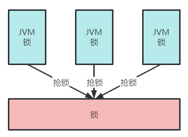

# 什么是乐观锁、悲观锁?

`synchronized`是一种悲观锁,在执行被synchronized包裹的代码时需要首先获取锁,没有拿到锁则无法执行,总悲观的认为别的线程会去抢,所以是悲观锁

乐观锁的思想是它不认为会有线程去争抢,尽管去执行,如果没有执行成功就再去重试

数据库的乐观锁实现方式是在表中增加一个version字段,更新时判断是否等于某个版本,等于则更新否则更新失败,如下方式:

`update t1 set t1.data1 = '',t1.version='2' where t1.version='1'`

# 分布式锁

```java
synchronized(锁对象){
   执行任务...
}
```

**`synchronized`只能保证同一个虚拟机中多个线程去争抢锁**

如果是多个执行器分布式部署,并不能保证同一个视频只有一个执行器去处理

现在要实现分布式环境下所有虚拟机中的线程去同步执行就需要让多个虚拟机去共用一个锁,虚拟机可以分布式部署,锁也可以分布式部署,如下图



虚拟机都去抢占同一个锁,锁是一个单独的程序提供加锁、解锁服务

**该锁已不属于某个虚拟机,而是分布式部署,由多个虚拟机所共享,这种锁叫分布式锁**

# 基于数据库实现分布锁

利用数据库主键唯一性的特点,或利用数据库唯一索引、行级锁的特点

比如:多个线程同时向数据库插入主键相同的同一条记录,谁插入成功谁就获取锁,多个线程同时去更新相同的记录,谁更新成功谁就抢到锁

# 基于redis实现锁

redis提供了分布式锁的实现方案,比如:SETNX、set nx、redisson等

以SETNX举例说明,SETNX命令的工作过程是去set一个不存在的key,多个线程去设置同一个key只会有一个线程设置成功,设置成功的的线程拿到锁

# 使用zookeeper实现

zookeeper是一个分布式协调服务,主要解决分布式程序之间的同步的问题

zookeeper的结构类似的文件目录,多线程向zookeeper创建一个子目录(节点)只会有一个创建成功,利用此特点可以实现分布式锁,谁创建该结点成功谁就获得锁