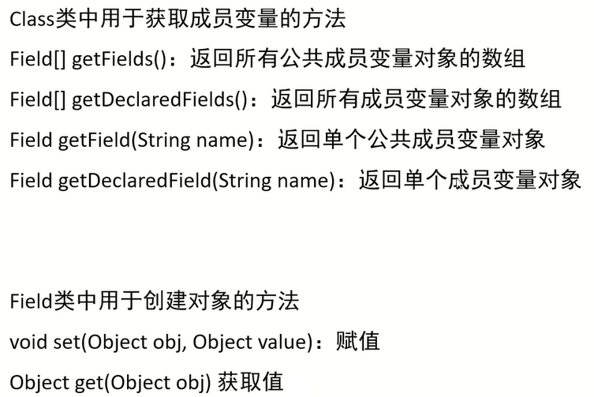

# 动态代理

特点:无侵入式的给代码增加额外的功能

1. 为什么要有代理?                

代理可以无侵入式的给代码增加额外的功能          

调用者 --> 代理 --> 对象

2. 代理长什么样?  

代理里面就是对象要被代理的方法

3. Java通过什么保证代理的样子?

通过接口保证,后面的对象和代理需要实现同一个接口,接口中就是要被代理的所有方法


范例:

```java
// 把所有想要被代理的方法定义在接口当中
public interface Star {
    // 唱歌
    public abstract String sing(String name);

    // 跳舞
    public abstract void dance();
}
```

```java
public class BigStar implements Star {
    private String name;

    public BigStar() {
    }

    public BigStar(String name) {
        this.name = name;
    }

    // 唱歌
    @Override
    public String sing(String name) {
        System.out.println(this.name + "正在唱" + name);
        return "谢谢";
    }

    // 跳舞
    @Override
    public void dance() {
        System.out.println(this.name + "正在跳舞");
    }

    public String getName() {
        return name;
    }

    public void setName(String name) {
        this.name = name;
    }

    public String toString() {
        return "BigStar{name = " + name + "}";
    }
}
```

```java
import java.lang.reflect.InvocationHandler;
import java.lang.reflect.Method;
import java.lang.reflect.Proxy;

// 创建一个代理
public class ProxyUtil {
    /*
     * 方法的作用:
     *       给一个明星的对象,创建一个代理
     *  形参:
     *       被代理的明星对象
     *  返回值:
     *       给明星创建的代理
     *
     * 需求:
     *   外面的人想要大明星唱一首歌
     *   1. 获取代理的对象
     *      代理对象=ProxyUtil.createProxy(大明星的对象);
     *   2. 再调用代理的唱歌方法
     *      代理对象.唱歌的方法("只因你太美");
     */
    public static Star createProxy(BigStar bigStar) {
       /* java.lang.reflect.Proxy类:提供了为对象产生代理对象的方法:
        public static Object newProxyInstance(ClassLoader loader, Class<?>[] interfaces, InvocationHandler h)
        参数一:用于指定用哪个类加载器,去加载生成的代理类
        参数二:指定接口,这些接口用于指定生成的代理长什么,也就是有哪些方法
        参数三:用来指定生成的代理对象要干什么事情*/

        Star star = (Star) Proxy.newProxyInstance(
                ProxyUtil.class.getClassLoader(),
                new Class[]{Star.class},
                new InvocationHandler() {
                    @Override
                    public Object invoke(Object proxy, Method method, Object[] args) throws Throwable {
                        /*
                         * 参数一:代理的对象
                         * 参数二:要运行的方法sing
                         * 参数三:调用sing方法时,传递的实参
                         * */
                        if ("sing".equals(method.getName())) {
                            System.out.println("准备话筒,收钱");
                        } else if ("dance".equals(method.getName())) {
                            System.out.println("准备场地,收钱");
                        }
                        // 去找大明星开始唱歌或者跳舞
                        // 代码的表现形式:调用大明星里面唱歌或者跳舞的方法
                        return method.invoke(bigStar, args);
                    }
                }
        );
        return star;
    }
}
```

```java
public class Test {
    public static void main(String[] args) {
        /*
        需求：
            外面的人想要大明星唱一首歌
             1. 获取代理的对象
                代理对象=ProxyUtil.createProxy(大明星的对象);
             2. 再调用代理的唱歌方法
                代理对象.唱歌的方法("只因你太美");
        */

        // 获取代理的对象
        BigStar bigStar = new BigStar("鸡哥");
        Star proxy = ProxyUtil.createProxy(bigStar);

        // 调用唱歌的方法
        String result = proxy.sing("只因你太美");
        System.out.println(result);

        // 调用跳舞的方法
        proxy.dance();
    }
}
```

# 反射

反射允许对封装类的字段(**成员变量**)、方法(**成员方法**)和构造函数(**构造方法**)的信息进行编程访问


## 获取class对象的三种方式

1. `Class.forName("全类名");`          
源代码阶段:*.java --> *.class                  
使用场景:最为常用                  
补充:全类名=包名+类名              

2. `类名.class`                   
加载阶段:内存中的*.class                    
使用场景:更多的是当作参数进行传递,例如`synchronized (*.class){}`                  

3. `对象.getClass();`                  
运行阶段:内存中创建对象,对象.getClass()调用                
使用场景:当已经有了这个类的对象的时候才能使用        

范例:

```java
package src.test2;

public class Student {
    private String name;
    private int age;

    public Student() {
    }

    public Student(String name, int age) {
        this.name = name;
        this.age = age;
    }

    public String getName() {
        return name;
    }

    public void setName(String name) {
        this.name = name;
    }

    public int getAge() {
        return age;
    }

    public void setAge(int age) {
        this.age = age;
    }

    @Override
    public String toString() {
        return "Student{" +
                "name='" + name + '\'' +
                ", age=" + age +
                '}';
    }
}
```

```java
package src.test2;

public class Test {
    public static void main(String[] args) throws ClassNotFoundException {
        Class<?> clazz1 = Class.forName("src.test2.Student");
        // 打印结果:"class src.test2.Student"
        System.out.println(clazz1);

        Class<Student> clazz2 = Student.class;
        // 打印结果:"class src.test2.Student"
        System.out.println(clazz2);

        Student s = new Student();
        Class<? extends Student> clazz3 = s.getClass();
        // 打印结果:"class src.test2.Student"
        System.out.println(clazz3);
    }
}
```


## 反射获取构造方法对象


范例:

```java
package src.test2;

public class Student {
    private String name;
    private int age;

    public Student() {
    }

    public Student(String name) {
        this.name = name;
    }

    public Student(int age) {
        this.age = age;
    }

    public Student(String name, int age) {
        this.name = name;
        this.age = age;
    }

    public String getName() {
        return name;
    }

    public void setName(String name) {
        this.name = name;
    }

    public int getAge() {
        return age;
    }

    public void setAge(int age) {
        this.age = age;
    }

    @Override
    public String toString() {
        return "Student{" +
                "name='" + name + '\'' +
                ", age=" + age +
                '}';
    }
}
```

```java
package src.test2;

import java.lang.reflect.Constructor;

public class Test {
    public static void main(String[] args) throws ClassNotFoundException, NoSuchMethodException {
        Class<?> clazz = Class.forName("src.test2.Student");

        // 获取所有的公共构造方法
        Constructor<?>[] cons = clazz.getConstructors();
        for (Constructor<?> con : cons) {
            System.out.println(con);
            // 打印结果:"public src.test2.Student(java.lang.String,int)"
            // 打印结果:"public src.test2.Student(int)"
            // 打印结果:"public src.test2.Student(java.lang.String)"
            // 打印结果:"public src.test2.Student()"
        }
        System.out.println();

        // 获取所有的构造方法(包括私有)
        Constructor<?>[] dcons = clazz.getDeclaredConstructors();
        for (Constructor<?> dcon : dcons) {
            System.out.println(dcon);
            // 打印结果:"public src.test2.Student()"
            // 打印结果:"public src.test2.Student(java.lang.String,int)"
            // 打印结果:"public src.test2.Student(int)"
            // 打印结果:"public src.test2.Student(java.lang.String)"
        }
        System.out.println();

        // 获取单个的公共构造方法
        Constructor<?> con1 = clazz.getConstructor();
        // 打印结果:"public src.test2.Student()"
        System.out.println(con1);
        System.out.println();

        // 获取单个的构造方法(包括私有)
        Constructor<?> con2 = clazz.getDeclaredConstructor();
        // 打印结果:"public src.test2.Student()"
        System.out.println(con2);
        System.out.println();

        // 获取指定的单个的公共构造方法
        Constructor<?> con3 = clazz.getDeclaredConstructor(String.class);
        // 打印结果:"public src.test2.Student(java.lang.String)"
        System.out.println(con3);
        System.out.println();

        // 获取指定的单个的构造方法(包括私有)
        Constructor<?> con4 = clazz.getDeclaredConstructor(String.class, int.class);
        // 打印结果:"public src.test2.Student(java.lang.String,int)"
        System.out.println(con4);
    }
}
```

```java
package src.test2;

import java.lang.reflect.Constructor;
import java.lang.reflect.InvocationTargetException;
import java.lang.reflect.Parameter;

public class Test {
    public static void main(String[] args) throws ClassNotFoundException, NoSuchMethodException, InvocationTargetException, InstantiationException, IllegalAccessException {
        Class<?> clazz = Class.forName("src.test2.Student");

        Constructor<?> con = clazz.getDeclaredConstructor(String.class, int.class);
        // 打印结果:"public src.test2.Student(java.lang.String,int)"
        System.out.println(con);

        // 获取修饰符
        int modifiers = con.getModifiers();
        // 打印结果:"1"
        System.out.println(modifiers);

        // 获取参数
        Parameter[] parameters = con.getParameters();
        for (Parameter parameter : parameters) {
            System.out.println(parameter);
            // 打印结果:"java.lang.String arg0"
            // 打印结果:"int arg1"
        }

        // 创建对象
        // 临时取消权限的校验(暴力反射),这样才能利用私有的构造方法创建对象,这里的构造方法是公共的,可以不写
        // con.setAccessible(true);
        Student student = (Student) con.newInstance("张三", 23);
        // 打印结果:"Student{name='张三', age=23}"
        System.out.println(student);
    }
}
```

## 反射获取成员变量



范例:

```java
package src.test2;

public class Student {
    private String name;
    private int age;

    public String gender;

    public Student() {
    }

    public Student(String name, int age, String gender) {
        this.name = name;
        this.age = age;
        this.gender = gender;
    }

    public String getName() {
        return name;
    }

    public void setName(String name) {
        this.name = name;
    }

    public int getAge() {
        return age;
    }

    public void setAge(int age) {
        this.age = age;
    }

    public String getGender() {
        return gender;
    }

    public void setGender(String gender) {
        this.gender = gender;
    }

    @Override
    public String toString() {
        return "Student{" +
                "name='" + name + '\'' +
                ", age=" + age +
                ", gender='" + gender + '\'' +
                '}';
    }
}
```

```java
package src.test2;

import java.lang.reflect.Field;

public class Test {
    public static void main(String[] args) throws ClassNotFoundException, NoSuchFieldException {
        Class<?> clazz = Class.forName("src.test2.Student");

        // 获取所有的公共成员变量
        Field[] fields = clazz.getFields();
        for (Field field : fields) {
            // 打印结果:"public java.lang.String src.test2.Student.gender"
            System.out.println(field);
        }
        System.out.println();

        // 获取所有的成员变量(包括私有)
        Field[] declaredFields = clazz.getDeclaredFields();
        for (Field declaredField : declaredFields) {
            System.out.println(declaredField);
            // 打印结果:"private java.lang.String src.test2.Student.name"
            // 打印结果:"private int src.test2.Student.age"
            // 打印结果:"public java.lang.String src.test2.Student.gender"
        }
        System.out.println();

        // 获取指定的单一的公共成员变量
        Field gender = clazz.getField("gender");
        // 打印结果:"public java.lang.String src.test2.Student.gender"
        System.out.println(gender);
        System.out.println();

        // 获取指定的单一的私有成员变量
        Field declaredField = clazz.getDeclaredField("name");
        // 打印结果:"private java.lang.String src.test2.Student.name"
        System.out.println(declaredField);
        System.out.println();
    }
}
```

```java
package src.test2;

import java.lang.reflect.Field;

public class Test {
    public static void main(String[] args) throws ClassNotFoundException, NoSuchFieldException, IllegalAccessException {
        Class<?> clazz = Class.forName("src.test2.Student");

        Field name = clazz.getDeclaredField("name");
        // 打印结果:"private java.lang.String src.test2.Student.name"
        System.out.println(name);
        System.out.println();

        // 获取修饰符
        int modifiers = name.getModifiers();
        // 打印结果:"2"
        System.out.println(modifiers);
        System.out.println();

        // 获取成员变量名
        String name1 = name.getName();
        // 打印结果:"name"
        System.out.println(name1);
        System.out.println();

        // 获取数据类型
        Class<?> type = name.getType();
        // 打印结果:"class java.lang.String"
        System.out.println(type);
        System.out.println();

        // 获取成员变量的值
        Student student = new Student("张三", 23, "男");
        // 临时取消权限的校验(暴力反射),这样才能利用私有的构造方法创建对象
        name.setAccessible(true);
        String value = (String) name.get(student);
        // 打印结果:"张三"
        System.out.println(value);
        System.out.println();

        // 修改对象里的值
        name.set(student, "李四");
        // 打印结果:"Student{name='李四', age=23, gender='男'}"
        System.out.println(student);
    }
}
```

## 反射获取成员方法


范例:

```java
package src.test2;

public class Student {
    private String name;
    private int age;

    public Student() {
    }

    public Student(String name, int age) {
        this.name = name;
        this.age = age;
    }

    public String getName() {
        return name;
    }

    public void setName(String name) {
        this.name = name;
    }

    public int getAge() {
        return age;
    }

    public void setAge(int age) {
        this.age = age;
    }

    public void sleep() {
        System.out.println("睡觉");
    }

    private String eat(String something) {
        System.out.println("在吃" + something);
        return "奥里给!";
    }
    @Override
    public String toString() {
        return "Student{" +
                "name='" + name + '\'' +
                ", age=" + age +
                '}';
    }
}
```

```java
package src.test2;

import java.lang.reflect.Field;
import java.lang.reflect.Method;

public class Test {
    public static void main(String[] args) throws ClassNotFoundException, NoSuchFieldException, IllegalAccessException, NoSuchMethodException {
        Class<?> clazz = Class.forName("src.test2.Student");

        // 获取里面的所有方法对象(包含父类中所有的公共方法)
        Method[] methods = clazz.getMethods();
        for (Method method : methods) {
            System.out.println(method);
            // 打印结果:"public java.lang.String src.test2.Student.toString()"
            // 打印结果:"public java.lang.String src.test2.Student.getName()"
            // 打印结果:"public void src.test2.Student.sleep()"
            // 打印结果:"public void src.test2.Student.setName(java.lang.String)"
            // 打印结果:"public int src.test2.Student.getAge()"
            // 打印结果:"public void src.test2.Student.setAge(int)"
            // 打印结果:"public final native void java.lang.Object.wait(long) throws java.lang.InterruptedException"
            // 打印结果:"public final void java.lang.Object.wait(long,int) throws java.lang.InterruptedException"
            // 打印结果:"public final void java.lang.Object.wait() throws java.lang.InterruptedException"
            // 打印结果:"public boolean java.lang.Object.equals(java.lang.Object)"
            // 打印结果:"public native int java.lang.Object.hashCode()"
            // 打印结果:"public final native java.lang.Class java.lang.Object.getClass()"
            // 打印结果:"public final native void java.lang.Object.notify()"
            // 打印结果:"public final native void java.lang.Object.notifyAll()"
        }
        System.out.println();

        // 获取里面的所有方法对象(不能获取父类的,但是可以获取本类中私有的方法)
        Method[] declaredMethods = clazz.getDeclaredMethods();
        for (Method declaredMethod : declaredMethods) {
            System.out.println(declaredMethod);
            // 打印结果:"public java.lang.String src.test2.Student.toString()"
            // 打印结果:"public java.lang.String src.test2.Student.getName()"
            // 打印结果:"public void src.test2.Student.sleep()"
            // 打印结果:"public void src.test2.Student.setName(java.lang.String)"
            // 打印结果:"private void src.test2.Student.eat(java.lang.String)"
            // 打印结果:"public void src.test2.Student.setAge(int)"
            // 打印结果:"public int src.test2.Student.getAge()"
        }
        System.out.println();

        // 获取指定的单一方法
        Method eat = clazz.getDeclaredMethod("eat", String.class);
        // 打印结果:"private void src.test2.Student.eat(java.lang.String)"
        System.out.println(eat);
        System.out.println();
    }
}
```

```java
package src.test2;

import java.lang.reflect.InvocationTargetException;
import java.lang.reflect.Method;
import java.lang.reflect.Parameter;

public class Test {
    public static void main(String[] args) throws ClassNotFoundException, IllegalAccessException, NoSuchMethodException, InvocationTargetException {
        Class<?> clazz = Class.forName("src.test2.Student");

        // 获取指定的单一方法
        Method eat = clazz.getDeclaredMethod("eat", String.class);
        // 打印结果:"private void src.test2.Student.eat(java.lang.String)"
        System.out.println(eat);
        System.out.println();

        // 获取修饰符
        int modifiers = eat.getModifiers();
        // 打印结果:"2"
        System.out.println(modifiers);
        System.out.println();

        // 获取方法名
        String name = eat.getName();
        // 打印结果:"eat"
        System.out.println(name);
        System.out.println();

        // 获取方法的形参
        Parameter[] parameters = eat.getParameters();
        for (Parameter parameter : parameters) {
            // 打印结果:"java.lang.String arg0"
            System.out.println(parameter);
        }
        System.out.println();

        // 获取方法抛出的异常
        Class<?>[] exceptionTypes = eat.getExceptionTypes();
        for (Class<?> exceptionType : exceptionTypes) {
            System.out.println(exceptionType);
        }

        // 运行方法并获取返回值
        Student student = new Student();
        eat.setAccessible(true);
        // 打印结果:"在吃汉堡包"
        String result = (String) eat.invoke(student, "汉堡包");
        // 打印结果:"奥里给!"
        System.out.println(result);
    }
}
```