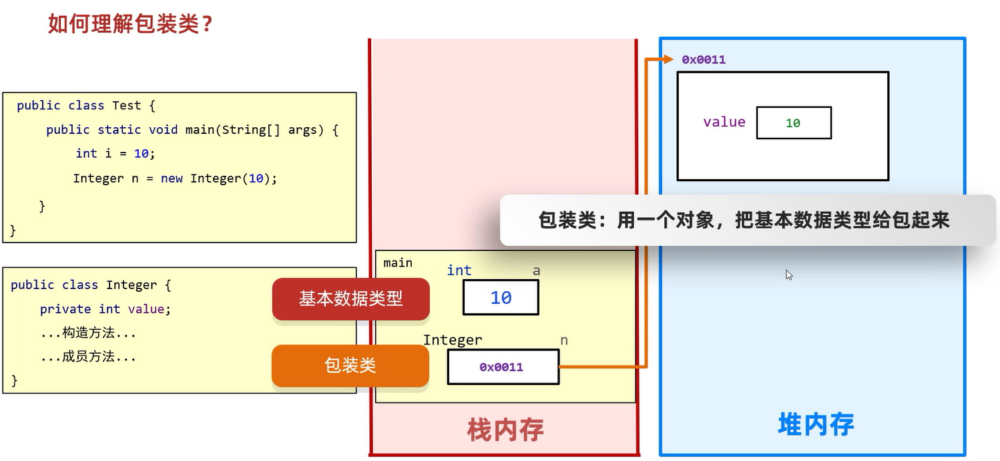
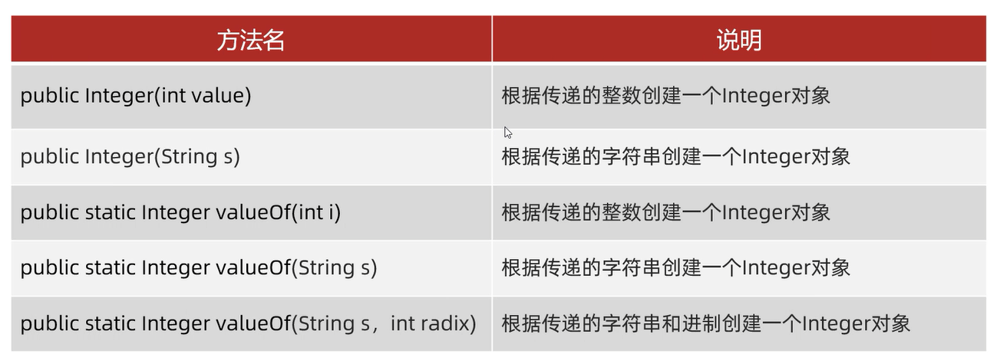
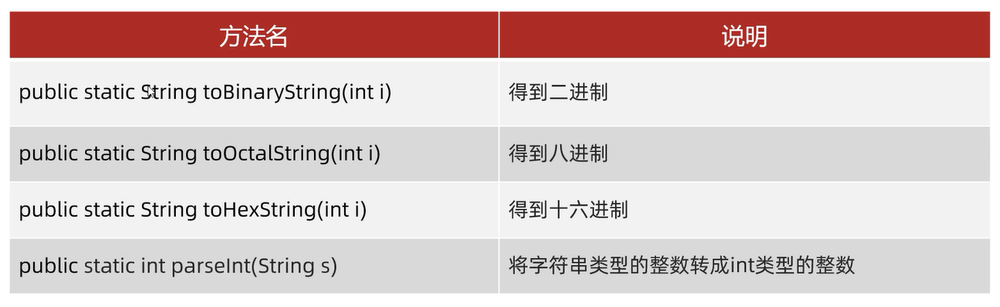

## 包装类

包装类: 基本数据类型对应的引用类型

- `byte` -- `Byte`
- `short` -- `Short`
- `int` -- `Integer`
- `char` -- `Character`
- `long` -- `Long`
- `float` -- `Float`
- `double` -- `Double`
- boolean -- boolean

理解包装类(以Integer为例,从内存角度): 



## 如何获取包装类的对象

**不需要new,不需要调用方法,直接赋值即可**

### 以Integer为例,其他包装类大同小异

#### 在JDK5以前,获取Integer对象的方式



范例: 

```java
public class Test {
    public static void main(String[] args) {
        //利用构造方法获取Integer的对象(JDK5以前的方式)
        Integer i1 = new Integer(1);
        //打印结果: "1"
        System.out.println(i1);
        Integer i2 = new Integer("1");
        //打印结果: "1"
        System.out.println(i2);

        //利用静态方法获取Integer的对象(JDK5以前的方式)
        Integer i3 = Integer.valueOf(123);
        //打印结果: "123"
        System.out.println(i3);
        Integer i4 = Integer.valueOf("123");
        //打印结果: "123"
        System.out.println(i4);
        Integer i5 = Integer.valueOf("123",8);
        //打印结果: "83"
        System.out.println(i5);

        //这两种方式获取对象的区别(掌握)
        //底层原理：
        //因为在实际开发中,-128 ~ 127之间的数据,用的比较多
        //如果每次使用都是new对象,那么太浪费内存了
        //所以,提前把这个范围之内的每一个数据都创建好对象
        //如果要用到了不会创建新的,而是返回已经创建好的对象
        Integer i6 = Integer.valueOf(127);
        Integer i7 = Integer.valueOf(127);
        //打印结果: "true" 
        System.out.println(i6 == i7);

        Integer i8 = Integer.valueOf(128);
        Integer i9 = Integer.valueOf(128);
        //打印结果: "false"
        System.out.println(i8 == i9);

        //因为看到了new关键字,在Java中,每一次new都是创建了一个新的对象
        //所以下面的两个对象都是new出来,地址值不一样
        Integer i10 = new Integer(127);
        Integer i11 = new Integer(127);
        //打印结果: "false"
        System.out.println(i10 == i11);

        Integer i12 = new Integer(128);
        Integer i13 = new Integer(128);
        //打印结果: "false"
        System.out.println(i12 == i13);
    }
}
```

获取Integer的对象:                      
1. **利用构造方法获取Integer的对象**        
2. **利用静态方法获取Integer的对象**      

细节: **这两种方式获取对象的区别(掌握)**     

`Integer.valueOf()`底层原理:            
**因为在实际开发中,-128 ~ 127之间的数据,用的比较多**      
**如果每次使用都是new对象,那么太浪费内存了**     
**所以,提前把这个范围之内的每一个数据都创建好对象**      
**如果要用到了不会创建新的,而是返回已经创建好的对象**     

#### 在JDK5以前,包装类如何进行计算

细节: **对象之间是不能直接进行计算的**

例如: 把两个数据进行相加    

步骤: 
1. 把对象进行拆箱,变成基本数据类型
2. 相加
3. 把得到的结果再次进行装箱(再变回包装类)

```java
public class Test {
    public static void main(String[] args) {
        Integer i1 = new Integer(1);
        Integer i2 = new Integer(2);
        int result = i1.intValue() + i2.intValue();
        Integer i3 = new Integer(result);
        System.out.println(i3);
    }
}
```

在JDK5的时候,提出了一个机制: 自动装箱和自动拆箱       
1. 自动装箱: 把基本数据类型自动地变成其对应的包装类      
2. 自动拆箱: 把包装类自动地变成其对应的基本数据类型      
   
```java
public class Test {
    public static void main(String[] args) {
        //自动装箱
        Integer i1 = 1;
        Integer i2 = 2;
        //自动拆箱
        int result = i1 + i2;
        System.out.println(result);
    }
}
```

细节: **在JDK5之后,int和Integer可以看作是同一个东西,因为在内部可以自动转化**

如何获取包装类的对象: **不需要new,不需要调用方法,直接赋值即可**

#### 成员方法

细节: **Java是一种强类型语言(每种数据在Java中都有各自的数据类型),在计算的时候,如果不是同一种数据类型,是无法直接计算的**



范例:  

```java
public class Test {
    public static void main(String[] args) {
        String str1 = Integer.toBinaryString(100);
        //打印结果: "1100100"(100的二进制)
        System.out.println(str1);

        String str2 = Integer.toOctalString(100);
        //打印结果: "144"(100的八进制)
        System.out.println(str2);

        String str3 = Integer.toHexString(100);
        //打印结果: "64"(100的十六进制)
        System.out.println(str3);

        //将字符串类型中的整数转成int类型的整数
        int i = Integer.parseInt("0123");
        //打印结果: "125"
        System.out.println(i + 2);
    }
}
```

`Integer.parseInt(Sting s)`细节: **s只能是数字,不能是其他,否则会报错**

补充: **8种包装类中,除了`Character`都有对应的parseXxx的方法,进行类型转换**

注意: **以后遇到键盘录入,无论什么类型,统一使用`nextLine`(特点: 遇到回车才停止)**

范例: 

```java
import java.util.Scanner;

public class Test {
    public static void main(String[] args) {
        Scanner sc = new Scanner(System.in);
        System.out.println("请输入一个字符串: ");
        String line = sc.nextLine();
        System.out.println(line);
        double v = Double.parseDouble(line);
        System.out.println(v);
    }
}
```