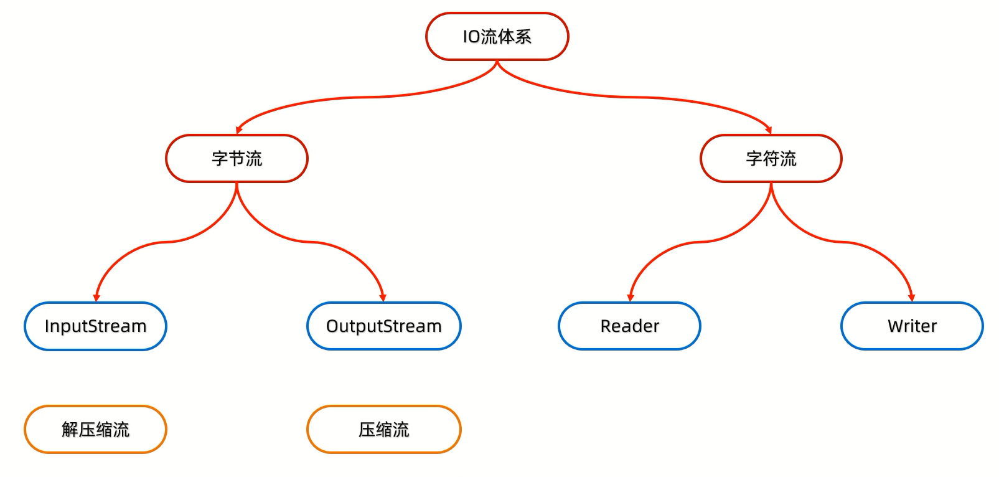

# 压缩流和解压缩流



# 分类

## 压缩流

压缩的本质:**把每一个(文件/文件夹)堪称ZipEntry对象放到压缩包中**

### 压缩单个文件

范例:

```java
import java.io.File;
import java.io.FileInputStream;
import java.io.FileOutputStream;
import java.io.IOException;
import java.util.zip.ZipEntry;
import java.util.zip.ZipInputStream;
import java.util.zip.ZipOutputStream;

public class Test {
    public static void main(String[] args) throws IOException {
        // 创建File对象表示要压缩的文件
        File src = new File("D:\\Project\\Test(IDEA)\\aaa.txt");
        // 创建File对象表示压缩包的位置
        File dest = new File("D:\\AAA");
        toZip(src, dest);
    }

    public static void toZip(File src, File dest) throws IOException {
        // 创建压缩流关联压缩包
        ZipOutputStream zos = new ZipOutputStream(new FileOutputStream(new File(dest, "aaa.zip")));
        // 创建ZipEntry对象,表示压缩包里面的每一个文件和文件夹
        // 参数:表示压缩包里面的路径
        ZipEntry entry = new ZipEntry("aaa.txt");
        // 把ZipEntry对象放到压缩包中
        zos.putNextEntry(entry);
        // 把src文件中的数据写到压缩包中
        FileInputStream fis = new FileInputStream(src);
        int read;
        while ((read = fis.read()) != -1) {
            zos.write(read);
        }
        zos.closeEntry();
        zos.close();
    }
}
```
### 压缩文件夹

范例:

```java
import java.io.File;
import java.io.FileInputStream;
import java.io.FileOutputStream;
import java.io.IOException;
import java.util.zip.ZipEntry;
import java.util.zip.ZipOutputStream;

public class Test {
    public static void main(String[] args) throws IOException {
        // 创建File对象表示要压缩的文件夹
        File src = new File("D:\\aaa");
        // 创建File对象表示压缩包放在哪里(压缩包的父级路径)
        File destParent = src.getParentFile();
        // 创建File对象表示压缩包的路径
        File dest = new File(destParent, src.getName() + ".zip");
        // 创建压缩流关联压缩包
        ZipOutputStream zos = new ZipOutputStream(new FileOutputStream(dest));
        // 获取src里面的每一个文件,变成ZipEntry对象,放入到压缩包当中
        toZip(src, zos, src.getName());
        zos.close();
    }

    public static void toZip(File src, ZipOutputStream zos, String name) throws IOException {
        File[] files = src.listFiles();
        if (files != null) {
            for (File file : files) {
                if (file.isFile()) {
                    // 要压缩的是文件,变成ZipEntry对象,放入到压缩包当中
                    ZipEntry entry = new ZipEntry(name + "\\" + file.getName());
                    zos.putNextEntry(entry);
                    // 读取文件中的数据,写到压缩包
                    FileInputStream fis = new FileInputStream(file);
                    int read;
                    while ((read = fis.read()) != -1) {
                        zos.write(read);
                    }
                    fis.close();
                    zos.closeEntry();
                } else {
                    // 要压缩的是文件夹
                    toZip(file, zos, name + "\\" + file.getName());
                }
            }
        }
    }
}
```

## 解压缩流

解压的本质:**把压缩包里面的每一个文件或者文件夹读取出来,按照层级拷贝到目的地当中**

范例:

```java
import java.io.*;
import java.util.zip.ZipEntry;
import java.util.zip.ZipInputStream;

public class Test {
    public static void main(String[] args) throws IOException {
        // 创建File对象表示要解压的压缩包
        File src = new File("D:\\Project\\Test(IDEA)\\aaa.zip");
        // 创建File对象表示解压的目的地
        File dest = new File("D:\\AAA");
        unzip(src, dest);
    }

    public static void unzip(File src, File dest) throws IOException {
        // 创建一个解压缩流用来读取压缩包中的数据
        ZipInputStream zis = new ZipInputStream(new FileInputStream(src));
        // 先获取到压缩包里面的每一个zipEntry对象,表示当前在压缩包中获取到的文件或者文件夹
        ZipEntry entry;
        while ((entry = zis.getNextEntry()) != null) {
            if (entry.isDirectory()) {
                // 解压的是文件夹:需要在目的地dest处创建一个相同的文件夹
                File file = new File(dest, entry.toString());
                boolean mkdirs = file.mkdirs();
            } else {
                // 解压的是文件:需要读取压缩包中的文件,并存放到目的地dest文件夹中(按照层级目录进行存放)
                FileOutputStream fos = new FileOutputStream(new File(dest, entry.toString()));
                int read;
                while ((read = zis.read()) != -1) {
                    // 写到目的地
                    fos.write(read);
                }
                fos.close();
                // 表示在压缩包中的一个文件处理完毕了
                zis.closeEntry();
            }
        }
        zis.close();
    }
}
```