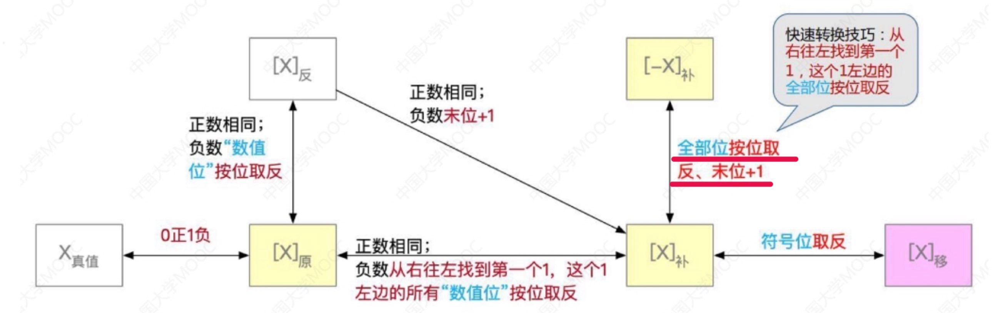

# 原码

计算规则: 十进制数据的二进制表现形式,最左边是符号位,0为正,1为负     
最大值: 0111 1111  对应真值: +127   
最小值: 1111 1111  对应真值: -127   

# 反码

计算规则: 正数的反码是其本身,负数的反码是符号位保持不变,其余位取反     

# 补码

目的: 解决负数计算时跨0的问题  

计算规则: 正数的补码是其本身,负数的补码是在其反码的基础上+1   

规定: 1000 0000  对应真值: -128,该数据在1个字节下,没有原码和反码

**计算机中数字的存储和计算都是以补码的形式来操作的**   
**1个字节(Byte)的取值范围是: -128 ~ +127**   

范例: 

```java
public class test {
    public static void main(String[] args) {
        // a补码(原码):  0000 0000 0000 0000 0000 0000 1100 1000
        int a = 200; 
        // b补码:  1100 1000
        // b原码:  1011 1000  对应真值: -56
        byte b = (byte) a; 
        System.out.println(b); 
    }
}
```

# 其他运算符


逻辑与 `&`    
0为false,1为true   
全部为真才是真   

范例: 

```java
public class test {
    public static void main(String[] args) {
        // a补码(原码):  0000 0000 0000 0000 0000 0000 1100 1000
        int a = 200;                 
        // b补码(原码):  0000 0000 0000 0000 0000 0000 0000 1010
        int b =10;   
        // a & b(补码原码):  0000 0000 0000 0000 0000 0000 0000 1000  对应真值: 8                
        System.out.println(a & b);   
    }
}
```

逻辑或 `|`   
0为false,1为true   
全部为假才是假  

范例: 

```java
public class test {
    public static void main(String[] args) {
        // a补码(原码):  0000 0000 0000 0000 0000 0000 1100 1000
        int a = 200;   
        // b补码(原码):  0000 0000 0000 0000 0000 0000 0000 1010              
        int b =10;       
        // a & b(补码原码):  0000 0000 0000 0000 0000 0000 1100 1010  对应真值: 202            
        System.out.println(a | b);   
    }
}
```

左移 `<<`   
向左移动,低位补0   
左移n位,真值变n倍   

范例: 

```java
public class test {
    public static void main(String[] args) {
        // a补码(原码):  0000 0000 0000 0000 0000 0000 1100 1000
        int a = 200; 
        // a << 2(补码原码):  0000 0000 0000 0000 0000 0011 0010 0000  对应真值: 800                
        System.out.println(a << 2);  
    }
}
```

右移 `>>`    
向右移动,高位补0或1(正数补0,负数补1)   
右移n位,真值除以n  

范例: 

```java
public class test {
    public static void main(String[] args) {
        // a补码(原码):  0000 0000 0000 0000 0000 0000 1100 1000
        int a = 200;               
        // a >> 2(补码原码):  0000 0000 0000 0000 0000 0000 0011 0010   对应真值: 50  
        System.out.println(a >> 2);  
    }
}
```

无符号右移 `>>>`   
向右移动,高位补0   