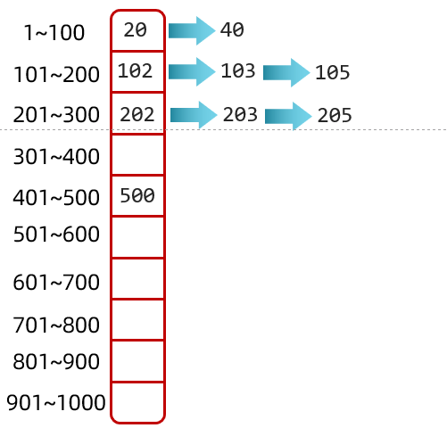
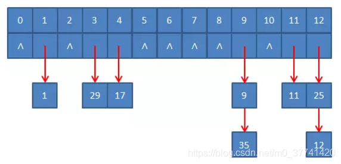

# 哈希查找

哈希查找是分块查找的进阶版

**适用于数据一边添加一边查找的情况 :**
1. **数组+链表的结合体**
2. **数组+链表+红黑树的结合体**



为了方便理解,所以规定:    
- 数组的0索引处存储1~100
- 数组的1索引处存储101~200
- 数组的2索引处存储201~300
- 以此类推

但是实际上,我们一般不会采取这种方式,因为这种方式容易导致一块区域添加的元素过多,导致效率偏低  

更多的是先计算出当前数据的哈希值,用哈希值跟数组的长度进行计算,计算出应存入的位置,再挂在数组的后面形成链表,如果挂的元素太多而且数组长度过长,我们也会把链表转化为红黑树,进一步提高效率

## 哈希表和哈希函数

哈希表是根据关键值而直接进行访问的数据结构     
也就是说,它通过把关键码值映射到表中一个位置来访问记录,以加快查找的速度     
这个映射函数叫做散列函数,存放记录的数组叫做散列表(哈希表)          

**哈希查找与顺序查找、树表查找最大的区别在于: 不用数值比较**

# 基本思路

## 构造哈希表

## 直接定址法

哈希地址: f(key)=a*key+b(a、b为常数)

优点是简单、均匀、不会产生冲突,但是需要事先知道key的分布情况,适合查找表较小并且连续的情况

## 数字分析法

假设关键字是R进制数(如十进制),并且哈希表中可能出现的关键字都是事先知道的,则可选取关键字的若干数位组成哈希地址,选取的原则是使得到的哈希地址尽量避免冲突,即所选数位上的数字尽可能是随机的          

例如11位手机号码"136xxxx5889",其中前三位是接入号,一般对应不同运营公司的子品牌,中间四位表示归属地,最后四位才是用户号,此时就可以用后4位来作为哈希地址    

## 平方取中法

取key平方后的中间几位为哈希地址         

通常在选定哈希函数时不一定能知道关键字的全部情况,仅取其中的几位为地址不一定合适,而一个数平方后的中间几位数和数的每一位都相关,由此得到的哈希地址随机性更大

例如key是1234,那么它的平方就是1522756,再抽取中间的3位就是227作为f(key)

## 折叠法

折叠法是将key从左到右分割成位数相等的几个部分(最后一部分位数不够可以短些),然后将这几部分叠加求和,并按哈希表的表长,取后几位作为f(key)       

例如key是9876543210,哈希表的表长为3位,我们将key分为4组,987、654、321、0,然后将它们叠加求和987+654+321+0=1962,再取后3位即得到哈希地址是962

## 除留余数法

取关键字被某个不大于哈希表表长m的数p除后所得的余数为哈希地址,即f(key)=key%p(p<=m)

**这种方法是最常用的哈希函数构造方法**

## 随机数法

哈希地址: random(key),这里random是随机函数

当key的长度不等时,采用这种方法比较合适

## 解决冲突

遇到两个key不相等,但计算出来的哈希地址相同的情况,该情况就被称为"冲突"

1. 开放定址法

该方法指的是两个key在计算出相同的哈希地址时,后者继续在哈希表中向后寻找空位置,存放改key的方法

例如原始的key中有8、15两个元素,哈希表中的长度为7,当使用key%length求余时,两个key会计算出相同的哈希位置,假设哈希表中的1位置已经存放了8,那么15就要从1位置往后寻找空位,假如2位置是空的,就可以把15存放到2位置; 假如2位置不空,就要往3位置寻找,以此类推

2. 拉链法

创建一个List,存储相同位置上不同值的key



# 范例

```java
public class Test {
    static int[] array = {13,29,27,28,26,30,38};
    // 初始化哈希表长度,此处哈希表容量设置的和array长度一样
    // 其实正常情况下,哈希表长度应该要长于array长度,因为使用开放地址法时,可能会多使用一些空位置
    static int hashLength = 7;
    static int[] hashTable = new int[hashLength];

    public static void main(String[] args) {
        // 将元素插入到哈希表中
        for (int i = 0; i < array.length; i++) {
            insertHashTable(hashTable,array[i]);
        }

        System.out.println("打印哈希表");
        printHashTable(hashTable);
        System.out.println();
        
        int target = 28;
        System.out.println(hashTableSearch(hashTable,target));
    }

    public static int hashTableSearch(int[] hashTable,int target) {
        int hashAddress = hash(hashTable,target);
        while (hashTable[hashAddress] != target) {
            // 寻找原始地址后面的位置
            hashAddress = (++hashAddress) % hashTable.length;
            // 查找到开放单元(未存放元素的位置)或循环回到原点,表示查找失败
            if (hashTable[hashAddress] == 0 || hashAddress == hash(hashTable,target)) {
                return -1;
            }
        }
        return hashAddress;
    }

    // 将元素插入到哈希表中
    public static void insertHashTable(int[] hashTable,int target) {
        int hashAddress = hash(hashTable,target);

        // 如果不为0,则说明发生冲突
        while (hashTable[hashAddress] != 0) {
            // 利用开放定址法解决冲突,即向后寻找新地址
            hashAddress = (++hashAddress) % hashTable.length;
        }

        // 将元素插入到哈希表中
        hashTable[hashAddress] = target;
    }

    // 用除留余数法计算要插入元素的地址
    public static int hash(int[] hashTable,int data) {
        return data % hashTable.length;
    }

    // 打印哈希表
    public static void printHashTable(int[] hashTable) {
        for (int i = 0; i < hashTable.length; i++)
            System.out.print(hashTable[i] + " ");
    }
}
```