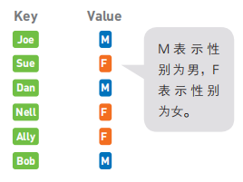
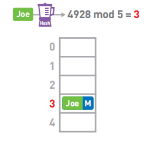
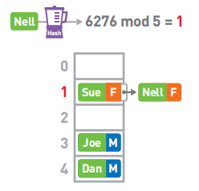
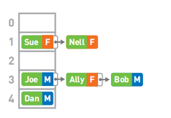
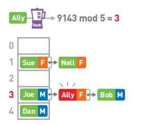

## 哈希表(散列表)

哈希表,也叫哈希表,是根据关键码和值(key和value)直接进行访问的数据结构         
通过key和value来映射到集合中的一个位置,这样就可以很快找到集合中的对应元素

一般来说,把键当作数据的标识符,把值当作数据的内容

例如,下列键(key)为人名,值(value)为性别

### 特点

1. 可以利用哈希函数快速访问到数组的目标数据; 如果发生哈希冲突,就使用链表进行存储
2. 如果数组的空间太小,使用哈希表的时候就容易发生冲突,线性查找的使用频率也会更高              
如果数组的空间太大,就会出现很多空箱子,造成内存的浪费                 
因此,给数组设定合适的空间非常重要
3. 在存储数据的过程中,如果发生冲突,可以利用链表在已有数据的后面插入新数据来解决冲突         
这种方法被称为"链地址法",此外还有其他解决冲突的方法,如"开放地址法"       

### 数据存储

假设我们需要存储5个元素        
首先使用哈希函数(Hash)计算Joe的键,也就是字符串"Joe"的哈希值,得到4928          
然后将哈希值mod数组长度5,求得其余数                 
因此,我们将Joe的数据存进数组的3号箱子中                  

### 冲突

如果两个哈希值取余的结果相同,我们称这种情况为"冲突"                         
假设Nell键的哈希值为6276,mod5的结果为1                 
但此时1号箱已经存储了Sue的数据,可使用链表在已有的数据的后面继续存储新的数据          

### 查询

假设最终的哈希表为: 

如果要查找Ally的性别,首先算出Alley键的哈希值,然后对它进行mod运算,最终结果为3  

然而3号箱中数据的键是Joe而不是Ally               
此时便需要对Joe所在的链表进行线性查找                  
找到了键为Ally的数据,取出其对应的值,便知道了Ally的性别为女(F)

