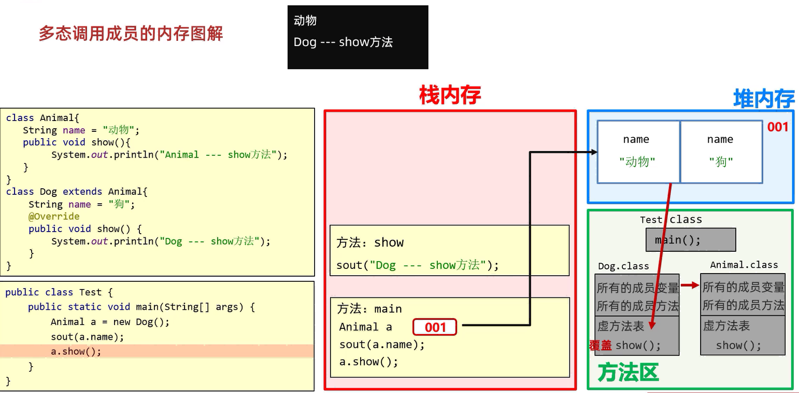

## 多态

同种类型的对象,表现出的不同形态

### 格式

表现形式(创建对象): `父类类型 对象名称 = 子类对象;`

### 前提

1. 有继承关系
2. 有父类引用指向子类对象    
例如`Fu f = new Zi();`   
3. 有方法重写

### 好处

使用父类型作为参数,可以接受所有子类对象,体现多态的扩展性与便利

范例: 

```java
public class Person {
    private String name;
    private int age;

    public Person() {
    }

    public Person(String name, int age) {
        this.name = name;
        this.age = age;
    }

    public String getName() {
        return name;
    }

    public void setName(String name) {
        this.name = name;
    }

    public int getAge() {
        return age;
    }

    public void setAge(int age) {
        this.age = age;
    }

    public void show() {
        System.out.println(name + "," + age);
    }
}
```

```java
public class Student extends Person {

    @Override
    public void show() {
        System.out.println("学生的信息为: " + getName() + "," + getAge());
    }
}
```

```java
public class Teacher extends Person {
    @Override
    public void show() {
        System.out.println("老师的信息为: " + getName() + "," + getAge());
    }
}
```

```java
public class Administrator extends Person {
    @Override
    public void show() {
        System.out.println("管理员的信息为: " + getName() + "," + getAge());
    }
}
```

```java
public class Test {
    public static void main(String[] args) {
        Student s = new Student();
        s.setName("张三");
        s.setAge(18);

        Teacher t = new Teacher();
        t.setName("李四");
        t.setAge(25);

        Administrator a = new Administrator();
        a.setName("管理员");
        a.setAge(30);

        register(s);
        register(t);
        register(a);
    }

    public static void register(Person p) {
        p.show();
    }
}
```

### 调用成员的特点

#### 变量调用

1. **编译看左边**  
看左边的父类中有无这个变量  
**如果有,则编译成功;如果没有,则编译失败**  

2. **运行也看左边**  
运行代码的时候,实际获取的就是左边父类中成员变量的值  

#### 方法调用

1. **编译看左边**  
看左边的父类中有无这个方法  
**如果有,则编译成功;如果没有,则编译失败**  

2. **运行看右边**  
运行代码的时候,实际运行的是子类中的方法  

范例: 

```java
public class Animal {
    String name = "动物";

    public void show() {
        System.out.println("Animal---show方法");
    }
}
```

```java
public class Dog extends Animal {
    String name = "狗";

    @Override
    public void show() {
        System.out.println("Dog---show方法");
    }
}
```

```java
public class Cat extends Animal {
    String name = "猫";

    @Override
    public void show() {
        System.out.println("Cat---show方法");
    }
}
```

```java
public class Test {
    public static void main(String[] args) {
        Animal a = new Dog();
        //变量调用: 编译看左边,运行也看左边
        //打印结果: "动物"
        System.out.println(a.name);
        //方法调用: 编译看左边,运行看右边
        //打印结果: "Dog---show方法"
        a.show();
    }
}
```

解释:  

1. `Animal a = new Dog();`  
成员变量: 在子类的对象中,会把父类的成员变量也继承下来,父: name,子: name                  
而a.name是Animal,继承的是父类的name,即动物  

2. `a.show();`  
成员方法: 如果子类对方法进行了重写,那么虚方法表中是会把父类的方法进行覆盖的  
因此,a.show()实际上运行的是子类的show()方法  

#### 内存图解



### 优势

1. 在多态形式下,右边对象可以实现解耦合,便于拓展和维护

例如: 

```java
Person p = new Student();
p.work();
```

```java
Person p = new Teacher();
p.work();
```

**当业务逻辑发生改变时,后续代码无需修改**

2. **定义方法的时候,使用父类型作为参数,可以接收所有子类对象**,体现多态的拓展性与便利

例如: 

```java
public class test {
    public static void main(String[] args) {
        StringBuilder sb = new StringBuilder();
        sb.append(Object obj);
    }
}
```

```java
public class test {
    public static void main(String[] args) {
        ArrayList list = new ArrayList<>();
        list.add(Object e);
    }
}
```

### 弊端

**不能使用子类的特有功能**

#### 解决方案

转换成真正的子类类型(强制类型转换),从而调用子类的独有功能

范例: 

```java
public class Animal{
    public void eat(){
        System.out.println("动物在吃东西");
    }
}
```

```java
public class Dog extends Animal{
    @Override
    public void eat() {
        System.out.println("狗吃骨头");
    }

    public void lookHome(){
        System.out.println("狗看家");
    }
}
```

```java
public class Cat extends Animal{
    @Override
    public void eat() {
        System.out.println("猫吃小鱼干");
    }

    public void catchMouse(){
        System.out.println("猫抓老鼠");
    }
}
```

```java
public class Test {
    public static void main(String[] args) {
        Animal a = new Dog();
        a.eat();

        //多态的弊端
        //不能调用子类的特有功能
        //报错的原因?
        //当调用成员方法的时候,编译看左边,运行看右边
        //那么在编译的时候会先检查左边的父类中有没有这个方法,如果没有直接报错
        //a.lookHome();

        //解决方案：
        //变回子类类型就可以了
        //细节：转换的时候不能瞎转,如果转成其他类的类型,就会报错

        /*if(a instanceof Dog){
            Dog d = (Dog) a;
            d.lookHome();
        }else if(a instanceof Cat){
            Cat c = (Cat) a;
            c.catchMouse();
        }else{
            System.out.println("没有这个类型,无法转换");
        }*/

        //JDK14新特性
        //先判断a是否为Dog类型,如果是,则强转成Dog类型,转换之后变量名为d
        //如果不是,则不强转,结果直接是false
        if(a instanceof Dog d){
            d.lookHome();
        }else if(a instanceof Cat c){
            c.catchMouse();
        }else{
            System.out.println("没有这个类型,无法转换");
        }
    }
}
```

##### 引用数据类型的类型转换

1. 自动类型转换
例如: `Person p = new Student();`
2. 强制类型转换
例如: `Student s = (Student) p;`

##### 强制类型转换能解决什么问题

1. 可以转换成真正的子类类型,从而调用子类的独有功能
2. 转换类型与真实对象类型不一致会报错
3. 转换的时候用instanceof关键字进行判断

例如`boolean a instanceof Dog`  
判断变量a的类型是否为Dog类型: 是,则返回true; 否,则返回false  

例如`a instanceof Dog d`  
先判断变量a是否为Dog类型,如果是,则强转成Dog类型,转换之后变量名为d  
如果不是,则不强转,结果直接是false  

练习: 

1. 定义Animal类  
属性: 年龄,颜色  
行为: eat(String something)方法(无具体行为,不同动物吃的方式和东西不一样,something表示吃的东西)  
生成空参有参构造,set和get方法  
2. 定义Dog类继承动物类   
​行为: eat(String something)方法,看家lookHome方法(无参数)  
3. 定义Cat类继承动物类      
行为: ​eat(String something)方法,逮老鼠catchMouse方法(无参数)  
4. 定义Person类  
属性: 姓名,年龄  
行为: keepPet(Dog dog,String something)  
​功能: 喂养宠物狗,something表示喂养的东西  
行为: keepPet(Cat cat,String something)方法  
功能: 喂养宠物猫,something表示喂养的东西  

5. 定义测试类(完成以下打印效果):   
keepPet(Dog dog,String somethind)方法和keepPet(Cat cat,String somethind)方法打印内容分别如下：  
```
年龄为30岁的老王养了一只黑颜色的2岁的狗  
2岁的黑颜色的狗两只前腿死死的抱住骨头猛吃  
```  
```
年龄为25岁的老李养了一只灰颜色的3岁的猫  
3岁的灰颜色的猫眯着眼睛侧着头吃鱼  
```

```java
public class Animal {
    private int age;
    private String color;

    public Animal() {
    }

    public Animal(int age, String color) {
        this.age = age;
        this.color = color;
    }

    public int getAge() {
        return age;
    }

    public void setAge(int age) {
        this.age = age;
    }

    public String getColor() {
        return color;
    }

    public void setColor(String color) {
        this.color = color;
    }

    public void eat(String something) {
        System.out.println(something);
    }
}
```

```java
public class Dog extends Animal {
    public Dog() {
    }

    public Dog(int age, String color) {
        super(age, color);
    }

    @Override
    public void eat(String something) {
        System.out.println(getAge() + "岁的" + getColor() + "的狗" + "两只前腿死死的抱住" + something + "骨头猛吃");
    }

    public void lookHome() {
        System.out.println("看家");
    }
}
```

```java
public class Cat extends Animal {
    public Cat() {
    }

    public Cat(int age, String color) {
        super(age, color);
    }

    @Override
    public void eat(String something) {
        System.out.println(getAge() + "岁的" + getColor() + "的猫眯着眼睛侧着头吃" + something);
    }


    public void catchMouse() {
        System.out.println("逮老鼠");
    }
}
```

```java
public class Person {
    private String name;
    private int age;

    public Person() {
    }

    public Person(String name, int age) {
        this.name = name;
        this.age = age;
    }

    public String getName() {
        return name;
    }

    public void setName(String name) {
        this.name = name;
    }

    public int getAge() {
        return age;
    }

    public void setAge(int age) {
        this.age = age;
    }

    public void keepPet(Dog dog, String something) {
        System.out.println("年龄为" + age + "的" + name + "养了一只" + dog.getColor() + "的" + dog.getAge() + "岁的狗");
        dog.eat(something);
    }

    public void keepPet(Cat cat, String something) {
        System.out.println("年龄为" + age + "的" + name + "养了一只" + cat.getColor() + "的" + cat.getAge() + "岁的猫");
        cat.eat(something);
    }
}
```

```java
public class Test {
    public static void main(String[] args) {
        Person person1 = new Person("老王", 30);
        Person person2 = new Person("老李", 25);
        Dog dog = new Dog(2, "黑颜色");
        Cat cat = new Cat(3, "灰颜色");
        person1.keepPet(dog, "骨头");
        person2.keepPet(cat, "鱼");
    }
}
```

思考:   
1. Dog和`Cat`都是`Animal`的子类,以上案例中针对不同的动物,定义了不同的keepPet方法,过于繁琐,能否简化,并体会简化后的好处?

```java
Animal a1 = new Dog();
Animal a2 = new Cat();

public void keepPet(Animal a, String something) {
    System.out.println("年龄为" + age + "的" + name + "养了一只" + a.getColor() + "的" + a.getAge() + "岁的动物");
    a.eat(something);
}
```

2. Dog和`Cat`虽然都是`Animal`的子类,但是都有其特有方法,能否想办法在keepPet中调用特有方法?

```java
Animal a1 = new Dog();
Animal a2 = new Cat();

public void keepPet(Animal a, String something) {
    if(a instanceof Dog d){
        System.out.println("年龄为" + age + "的" + name + "养了一只" + d.getColor() + "的" + d.getAge() + "岁的狗");
        d.eat(something);
    }else if(a instanceof Cat c){
        System.out.println("年龄为" + age + "的" + name + "养了一只" + c.getColor() + "的" + c.getAge() + "岁的猫");
        c.eat(something);
    }else{
        System.out.println("没有这个类型,无法转换");
    }
}
```