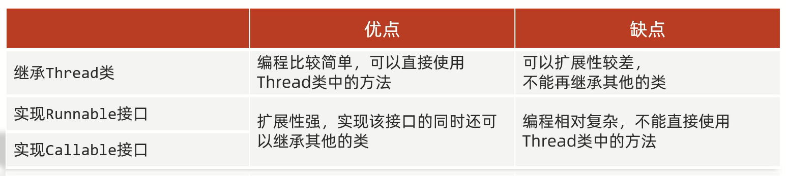
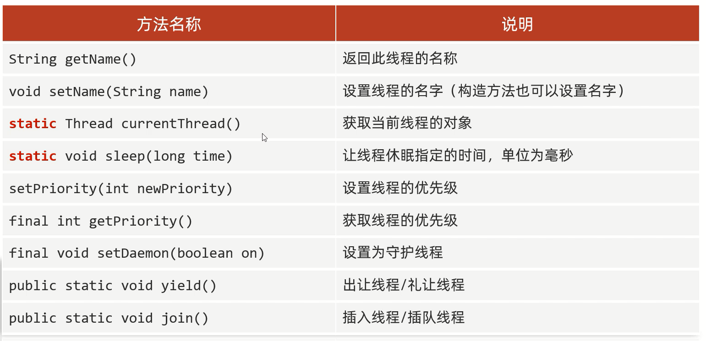
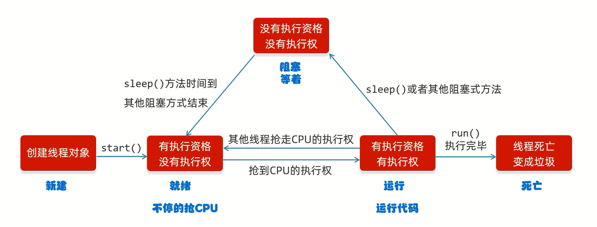
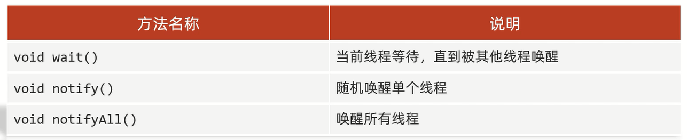
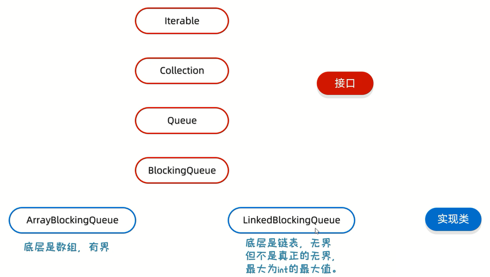
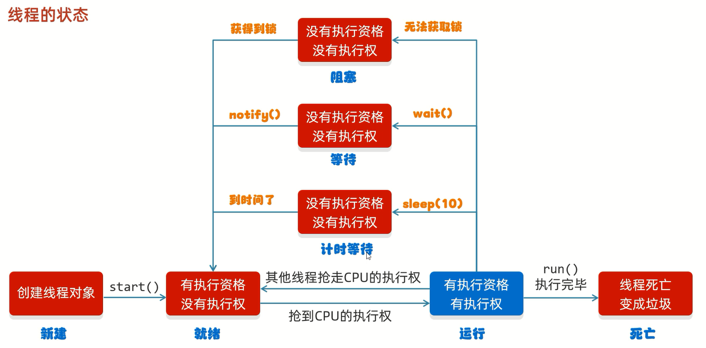
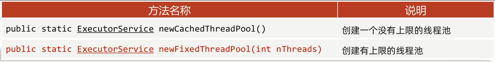
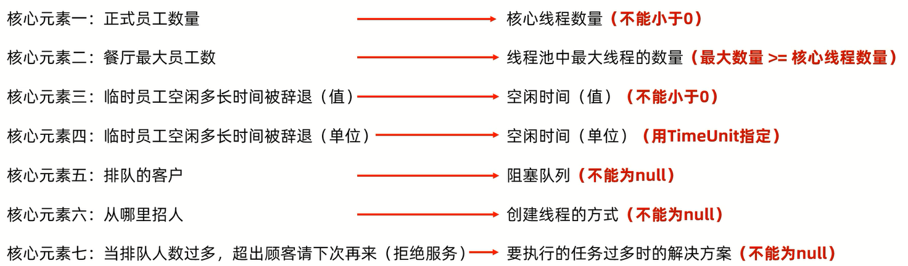
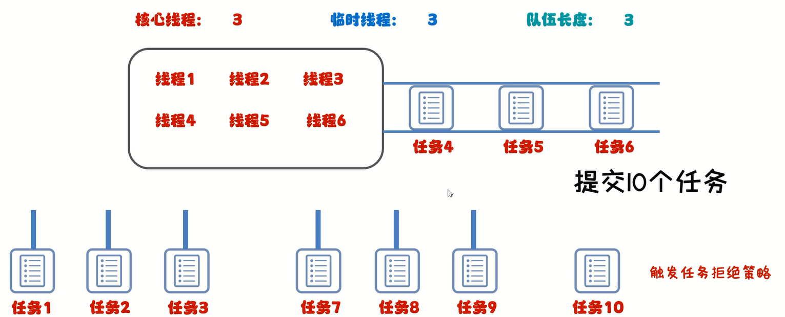

# 多线程

线程:操作系统能够进行运算调度的最小单位   

进程:程序的基本执行实体            

它被包含在进程之中,是进程中的实际运作单位

简单理解:**应用软件中互相独立的,可以同时运行的功能**

作用:提高效率

应用场景:
1. 软件中的耗时操作
2. 拷贝、迁移大文件 
3. 加载大量的资源文件          
...

# 并发和并行

- 并发:在同一时刻,有多个指令在单个CPU上**交替**执行            
- 并行:在同一时刻,有多个指令在单个CPU上**同时**执行

# 实现方式

1. 继承Thread类进行实现
2. 实现Runnable接口进行实现
3. 利用Callable接口和Future接口进行实现

## 继承Thread类

步骤:
1. 定义类继承Thread类
2. 重写run方法(书写多线程要执行的代码)
3. 测试类中创建子类的对象并启动线程

范例:

```java
public class MyThread extends Thread {
    @Override
    public void run() {
        // 书写线程要执行的代码
        for (int i = 0; i < 100; i++) {
            System.out.println(getName() + "HelloWorld");
        }
    }
}
```

```java
public class Test {
    public static void main(String[] args) {
        // 创建子类对象
        MyThread thread1 = new MyThread();
        MyThread thread2 = new MyThread();

        // 设置线程名称
        thread1.setName("线程一:");
        thread2.setName("线程二:");
        
        // 启动线程
        thread1.start();
        thread2.start();
    }
}
```

## 实现Runnable接口

步骤:
1. 定义类实现Runnable接口
2. 重写里面的run方法(书写多线程要执行的代码)
3. 测试类中创建自己类的对象
4. 创建Thread类的对象并开启线程

范例:

```java
public class MyRun implements Runnable {
    @Override
    public void run() {
        // 书写线程要执行的代码
        for (int i = 0; i < 100; i++) {
            System.out.println(Thread.currentThread().getName() + "HelloWorld");
        }
    }
}
```

```java
public class Test {
    public static void main(String[] args) {
        // 创建自己类的对象
        // 表示多线程要执行的任务
        MyRun mr = new MyRun();

        // 创建线程对象
        Thread thread1 = new Thread(mr);
        Thread thread2 = new Thread(mr);

        // 设置线程名称
        thread1.setName("线程一:");
        thread2.setName("线程二:");

        // 开启线程
        thread1.start();
        thread2.start();
    }
}
```

## 利用Callable接口和Future接口

特点:**可以获取到多线程运行的结果**

步骤:
1. 定义类实现Callable接口
2. 重写call方法(有返回值,表示多线程运行的结果)
3. 测试类中创建自己类的对象(书写多线程要执行的代码)
4. 创建FutureTask的对象(管理多线程运行的结果)
5. 创建Thread类的对象并开启线程

范例:

```java
import java.util.concurrent.Callable;

public class MyCallable implements Callable<Integer> {
    @Override
    public Integer call() throws Exception {
        // 书写线程要执行的代码
        int sum = 0;
        for (int i = 1; i <= 100; i++) {
            sum += i;
        }
        System.out.print(Thread.currentThread().getName());
        return sum;
    }
}
```

```java
import java.util.concurrent.ExecutionException;
import java.util.concurrent.FutureTask;

public class Test {
    public static void main(String[] args) throws ExecutionException, InterruptedException {
        // 创建自己类的对象
        MyCallable myCallable = new MyCallable();
        // 创建FutureTask的对象
        FutureTask<Integer> futureTask = new FutureTask<>(myCallable);
        // 创建线程的对象
        Thread thread = new Thread(futureTask);
        // 给线程设置名称
        thread.setName("线程:");
        // 启动线程
        thread.start();
        // 获取线程运行的结果
        System.out.print(futureTask.get());
    }
}
```

## 三种实现方式对比



# 常用方法



## 线程名称

- `String getName()`:返回此线程的名称              
- `void setName(String name)`:设置线程的名称

细节:
1. **如果没有给线程设置名称,线程名称默认是"Thread-序号"(序号从0开始)**
2. **设置线程的名称,除了用setName方法,也可以用Thread类的构造方法**

范例:

```java
public class MyThread extends Thread {

    public MyThread() {
    }

    public MyThread(String name) {
        super(name);
    }

    @Override
    public void run() {
        System.out.println("HelloWorld");
    }
}
```

```java
public class Test {
    public static void main(String[] args) {
        MyThread myThread1 = new MyThread();
        MyThread myThread2 = new MyThread();
        MyThread myThread3 = new MyThread("线程三");

        myThread1.start();
        myThread2.start();
        myThread3.start();

        // 打印结果:"Thread-0"
        System.out.println(myThread1.getName());
        // 打印结果:"Thread-1"
        System.out.println(myThread2.getName());

        // 打印结果:"线程三"
        System.out.println(myThread3.getName());

        myThread1.setName("线程一");
        // 打印结果:"线程一"
        System.out.println(myThread1.getName());
    }
}
```

## 获取当前线程的对象

- `static Thread currentThread()`:获取当前线程的对象

细节:**当JVM启动之后,会自动启动多条线程,其中有一条线程就叫做main线程,其作用就是去调用main方法并执行其中的方法**

范例:

```java
public class Test {
    public static void main(String[] args) {
        // 打印结果:"main"
        System.out.println(Thread.currentThread().getName());
    }
}
```

## 让线程休眠指定时间

`static void sleep(long time)`:让线程休眠指定时间,单位为毫秒

细节:
1. 哪条线程执行到这个方法,那么哪条线程就会在这里停留对应的时间
2. 方法参数为睡眠的时间,其单位为毫秒
3. 当时间到了之后,线程会自动的醒来,继续执行下面的其他代码

范例:

```java
public class Test {
    public static void main(String[] args) throws InterruptedException {
        System.out.println("开始");
        // main线程休眠了5秒钟
        Thread.sleep(5000);
        System.out.println("结束");
    }
}
```

## 线程优先级

线程的调度:
1. 抢占式调度(随机性)
2. 非抢占式调度(公平性)

**Java采用的是抢占式调度,线程的优先级为1-10,优先级越大,随机的概率越大,默认的优先级为5**

- `setPriority(int newPriority)`:设置线程的优先级
- `final int getPriority()`:获取线程的优先级

范例:

```java
public class MyRunnable implements Runnable {
    @Override
    public void run() {
        for (int i = 0; i < 100; i++) {
            System.out.println(Thread.currentThread().getName() + "---" + i);
        }
    }
}
```

```java
public class Test {
    public static void main(String[] args) {
        MyRunnable myRunnable = new MyRunnable();
        Thread thread1 = new Thread(myRunnable, "线程一");
        Thread thread2 = new Thread(myRunnable, "线程二");
        thread1.setPriority(10);
        thread2.setPriority(1);
        // thread1大概率会比thread2优先执行完毕,但只是概率大一些,不一定
        thread1.start();
        thread2.start();
    }
}
```

## 设置为守护线程

`final void setDaemon(boolean on)`:设置为守护线程

细节:**当其他的非守护线程执行完毕之后,守护线程也会陆续结束**

范例:

```java
public class MyThread1 extends Thread {

    public MyThread1(String name) {
        super(name);
    }

    @Override
    public void run() {
        for (int i = 0; i < 10; i++) {
            System.out.println(getName() + "---" + i);
        }
    }
}
```

```java
public class MyThread2 extends Thread {

    public MyThread2(String name) {
        super(name);
    }

    @Override
    public void run() {
        for (int i = 0; i < 100; i++) {
            System.out.println(getName() + "---" + i);
        }
    }
}
```

```java
public class Test {
    public static void main(String[] args) {
        MyThread1 mt1 = new MyThread1("非守护者");
        MyThread2 mt2 = new MyThread2("守护者");
        // 把mt2线程设置为守护线程
        mt2.setDaemon(true);
        // mt1执行完毕之后,mt2也陆续执行结束(不一定执行完全部代码就结束)
        mt1.start();
        mt2.start();
    }
}
```

## 出让线程(礼让线程)

`public static void yield()`:出让线程(礼让线程)

细节:**出让CPU的执行权,尽可能的让结果均匀,但不是绝对的,因为线程抢夺CPU的时候还是随机的**

范例:

```java
public class MyThread extends Thread {

    public MyThread(String name) {
        super(name);
    }

    @Override
    public void run() {
        for (int i = 0; i < 10; i++) {
            System.out.println(getName() + "---" + i);
            // 出让当前CPU的执行权
            Thread.yield();
        }
    }
}
```

```java
public class Test {
    public static void main(String[] args) {
        MyThread mt1 = new MyThread("飞机");
        MyThread mt2 = new MyThread("坦克");
        mt1.start();
        mt2.start();
    }
}
```

## 插入线程(插队线程)

`public static void join()`:插入线程(插队线程)

细节:**将线程插入到当前线程前并优先执行完毕**

范例:

```java
public class MyThread extends Thread {

    public MyThread(String name) {
        super(name);
    }

    @Override
    public void run() {
        for (int i = 0; i < 100; i++) {
            System.out.println(getName() + "---" + i);
        }
    }
}
```

```java
public class Test {
    public static void main(String[] args) throws InterruptedException {
        MyThread mt = new MyThread("飞机线程");
        mt.start();

        // 把mt线程插入到当前线程即main线程中
        mt.join();
        // 飞机线程会优先main线程执行完毕

        for (int i = 0; i < 10; i++) {
            System.out.println(Thread.currentThread().getName() + "---" + i);
        }
    }
}
```

# 生命周期



# 安全问题

练习:

某电影院卖票100张,共有3个窗口买票,设计一个程序模拟该电影院买票

```java
public class MyThread extends Thread {

    public MyThread(String name) {
        super(name);
    }

    // 这个类的所有对象都共享ticket数据
    static int ticket = 0;

    @Override
    public void run() {
        while (true) {
            if (ticket < 100) {
                try {
                    Thread.sleep(10);
                } catch (InterruptedException e) {
                    throw new RuntimeException(e);
                }
                ticket++;
                System.out.println(getName() + "正在卖第" + ticket + "张票!");
            } else {
                break;
            }
        }
    }
}
```

```java
public class Test {
    public static void main(String[] args) throws InterruptedException {
        MyThread mt1 = new MyThread("窗口1");
        MyThread mt2 = new MyThread("窗口2");
        MyThread mt3 = new MyThread("窗口3");
        mt1.start();
        mt2.start();
        mt3.start();
    }
}
```

买票引发的安全问题:
1. 相同的票出现了多次
2. 出现了超出范围的票

原因:**线程执行时,有随机性,CPU的执行权可能会被其他线程抢走**

解决方案:同步代码块

## 同步代码块

把操作共享数据的代码锁起来

### 格式

```markdown
synchronized(锁){
    操作共享数据的代码
}
```

特点:
1. 锁默认打开,有一个线程进去了,锁自动关闭
2. 里面的代码全部执行完毕,线程出来,锁自动打开

练习纠错:

```java
public class MyThread extends Thread {

    public MyThread(String name) {
        super(name);
    }

    // 这个类的所有对象都共享ticket数据
    static int ticket = 0;

    // 锁对象,一定要是唯一的
    static final Object obj = new Object();

    @Override
    public void run() {
        while (true) {
            synchronized (obj) {
                if (ticket < 100) {
                    try {
                        Thread.sleep(100);
                    } catch (InterruptedException e) {
                        throw new RuntimeException(e);
                    }
                    ticket++;
                    System.out.println(getName() + "正在卖第" + ticket + "张票!");
                } else {
                    break;
                }
            }
        }
    }
}
```

### 步骤

1. 循环
2. 同步代码块
3. 判断共享数据是否到了末尾(到了末尾)
4. 判断共享数据是否到了末尾(没有到末尾,执行核心逻辑)

### 细节

1. 同步代码块不能写在循环的外面
2. 锁对象一定要是唯一的,一般可以写当前类的字节码文件对象(XXX.class)=

## 同步方法

把`synchronized`关键字加到方法上

格式:`修饰符 synchronized 返回值类型 方法名(方法参数){...}`

### 特点

1. 同步方法是锁住方法里面的所有代码
2. 锁对象不能自己指定(Java规定)             
a.非静态:this                    
b.静态:当前类的字节码文件对象                

练习纠错:

```java
public class MyThread extends Thread {

    public MyThread(String name) {
        super(name);
    }

    // 这个类的所有对象都共享ticket数据
    static int ticket = 0;

    @Override
    public void run() {
        while (true) {
            if (method()) break;
        }
    }

    // 同步方法
    private synchronized boolean method() {
        if (ticket < 100) {
            try {
                Thread.sleep(100);
            } catch (InterruptedException e) {
                throw new RuntimeException(e);
            }
            ticket++;
            System.out.println(getName() + "正在卖第" + ticket + "张票!");
        } else {
            return true;
        }
        return false;
    }
}
```

### 补充

**将StringBuilder的实例用于多个线程是不安全的,如果需要这样的同步,则建议使用StringBuffer**

# Lock锁

JDK5之后提供了一个新的锁对象Lock,Lock比使用synchronized方法和语句可以获得更广泛的锁定操作              

- `void lock()`:获得锁(手动上锁)
- `void unlock()`:释放锁(手动释放锁)

**Lock是接口,不能直接实例化,一般采用其实现类ReentrantLock来实例化**                  

`ReentrantLock()`:创建一个ReentrantLock的实例

练习纠错:

```java
import java.util.concurrent.locks.Lock;
import java.util.concurrent.locks.ReentrantLock;

public class MyThread extends Thread {
    public MyThread(String name) {
        super(name);
    }

    // 这个类的所有对象都共享ticket数据
    static int ticket = 0;

    // 创建一个ReentrantLock的实例
    static Lock lock = new ReentrantLock();

    @Override
    public void run() {
        while (true) {
            // 获得锁
            lock.lock();
            try {
                if (ticket < 100) {
                    Thread.sleep(100);
                    ticket++;
                    System.out.println(getName() + "正在卖第" + ticket + "张票!");
                } else {
                    break;
                }
            } catch (InterruptedException e) {
                throw new RuntimeException(e);
            } finally {
                // 释放锁
                lock.unlock();
            }
        }
    }
}
```

# 死锁

死锁是一种错误,产生的原因是**锁的嵌套**

范例:

```java
public class MyThread extends Thread {

    static final Object objA = new Object();
    static final Object objB = new Object();

    @Override
    public void run() {
        // 循环
        while (true) {
            if ("线程A".equals(getName())) {
                synchronized (objA) {
                    System.out.println("线程A拿到了A锁，准备拿B锁");
                    synchronized (objB) {
                        System.out.println("线程A拿到了B锁，顺利执行完一轮");
                    }
                }
            } else if ("线程B".equals(getName())) {
                synchronized (objB) {
                    System.out.println("线程B拿到了B锁，准备拿A锁");
                    synchronized (objA) {
                        System.out.println("线程B拿到了A锁，顺利执行完一轮");
                    }
                }
            }
        }
    }
}
```

```java
public class Test {
    public static void main(String[] args) {
        MyThread t1 = new MyThread();
        MyThread t2 = new MyThread();

        t1.setName("线程A");
        t2.setName("线程B");

        t1.start();
        t2.start();
    }
}
```

# 等待唤醒机制

等待唤醒机制(也被称作生产者和消费者模式)是一种十分经典的多线程协作的模式

- 生产者-生产数据
- 消费者-消费数据


## 常用方法实现



范例:

```java
// 桌子:控制生产者和消费者的执行
public class Desk {
    // 是否有面条:0没有面条,1有面条
    public static int foodFlag = 0;

    // 总个数
    public static int count = 10;

    // 锁对象
    public static final Object lock = new Object();
}
```

```java
// 生产者
public class Cook extends Thread {
    @Override
    public void run() {
        while (true) {
            synchronized (Desk.lock) {
                // 判断共享数据是否到了末尾
                if (Desk.count == 0) {
                    // 到了末尾
                    break;
                } else {
                    // 没有到末尾,执行核心逻辑
                    // 判断桌子上是否有食物
                    // 如果有就等待
                    if (Desk.foodFlag == 1) {
                        // 让当前线程和锁进行绑定
                        try {
                            Desk.lock.wait();
                        } catch (InterruptedException e) {
                            throw new RuntimeException(e);
                        }
                    } else {
                        // 如果没有就制作食物
                        System.out.println("厨师做了一碗面条");
                        // 修改桌子上的食物状态
                        Desk.foodFlag = 1;
                        // 唤醒等待的消费者开吃
                        // 唤醒这把锁绑定的所有线程
                        Desk.lock.notifyAll();
                    }
                }
            }
        }
    }
}
```

```java
// 消费者
public class Foodie extends Thread {
    @Override
    public void run() {
        while (true) {
            synchronized (Desk.lock) {
                // 判断共享数据是否到了末尾
                if (Desk.count == 0) {
                    // 到了末尾
                    break;
                } else {
                    // 没有到末尾,执行核心逻辑
                    // 判断桌子上是否有面条
                    // 如果没有就等待
                    if (Desk.foodFlag == 0) {
                        // 让当前线程和锁进行绑定
                        try {
                            Desk.lock.wait();
                        } catch (InterruptedException e) {
                            throw new RuntimeException(e);
                        }
                    } else {
                        // 如果有就开吃
                        // 把吃的总数减1
                        Desk.count--;
                        System.out.println("吃货正在吃面条,还能再吃" + Desk.count + "碗");
                        // 吃完之后唤醒厨师开做
                        // 唤醒这把锁绑定的所有线程
                        Desk.lock.notifyAll();
                        // 修改桌子的状态
                        Desk.foodFlag = 0;
                    }
                }
            }
        }
    }
}
```

```java
public class Test {
    public static void main(String[] args) {
        // 创建线程对象
        Cook c = new Cook();
        Foodie f = new Foodie();
        // 设置线程名称
        c.setName("厨师");
        f.setName("吃货");
        // 开启线程
        c.start();
        f.start();
    }
}
```

## 阻塞队列方式实现


阻塞队列继承结构:



细节:**生产者和消费者必须使用同一个阻塞队列**

范例:

```java
import java.util.concurrent.ArrayBlockingQueue;

// 生产者
public class Cook extends Thread {
    ArrayBlockingQueue<String> queue;

    public Cook(ArrayBlockingQueue<String> queue) {
        this.queue = queue;
    }

    @Override
    public void run() {
        while (true) {
            // 不断的把面条放到阻塞队列当中
            try {
                queue.put("面条");
                System.out.println("厨师放了一碗面条");
            } catch (InterruptedException e) {
                throw new RuntimeException(e);
            }
        }
    }
}
```

```java
import java.util.concurrent.ArrayBlockingQueue;

// 消费者
public class Foodie extends Thread {
    ArrayBlockingQueue<String> queue;

    public Foodie(ArrayBlockingQueue<String> queue) {
        this.queue = queue;
    }

    @Override
    public void run() {
        while (true) {
            // 不断的从阻塞队列中获取面条
            String food;
            try {
                food = queue.take();
                System.out.println("吃货吃了一碗" + food);
            } catch (InterruptedException e) {
                throw new RuntimeException(e);
            }
        }
    }
}
```

```java
import java.util.concurrent.ArrayBlockingQueue;

public class Test {
    public static void main(String[] args) {
        // 创建阻塞队列的对象,这里设置阻塞队列里的容量是1,即1碗面条
        ArrayBlockingQueue<String> queue = new ArrayBlockingQueue<>(1);

        // 创建线程的对象,并把阻塞队列传递过去
        Cook c = new Cook(queue);
        Foodie f = new Foodie(queue);
        // 设置线程名称
        c.setName("厨师");
        f.setName("吃货");
        // 开启线程
        c.start();
        f.start();
    }
}
```

**这种方式里,由于sout不是放在锁中的,打印的结果可能会出现混乱,但是内存中的共享数据不会受到影响,依旧是等待唤醒机制**

# 线程状态



在Java中只有以下的6种线程状态:
1. 新建(`new`) ---> 创建线程对象
2. 就绪(`RUNNABLE`) ---> start方法
3. 阻塞(`BLOCKED`) ---> 无法获得锁对象
4. 等待(`WAITING`) ---> wait方法
5. 计时等待(`TIMED_WAITING`) ---> sleep方法
6. 结束(`TERMINATED`) ---> 全部代码运行完毕

# 线程池

## 核心原理

1. 创建一个池子,池子中是空的
2. 提交任务时,池子会创建新的线程对象,任务执行完毕,线程归还给池子,下回再次提交任务时,不需要创建新的线程,直接复用已有的线程即可
3. 但是如果提交任务时,池子中没有空闲线程,也无法创建新的线程,任务就会排队等待

## 代码实现

`Executors`:线程池的工具类,通过调用方法返回不同类型的线程池对象



范例:

```java
public class MyRunnable implements Runnable {
    @Override
    public void run() {
        for (int i = 0; i < 100; i++) {
            System.out.println(Thread.currentThread().getName() + "---" + i);
        }
    }
}
```

```java
import java.util.concurrent.ExecutorService;
import java.util.concurrent.Executors;

public class Test {
    public static void main(String[] args) {
        // 获取线程池对象
        // ExecutorService pool = Executors.newCachedThreadPool();
        ExecutorService pool = Executors.newFixedThreadPool(5);

        // 提交任务
        pool.submit(new MyRunnable());
        pool.submit(new MyRunnable());
        pool.submit(new MyRunnable());
        pool.submit(new MyRunnable());
        pool.submit(new MyRunnable());

        // 销毁线程池
        pool.shutdown();
    }
}
```

## 自定义线程池



### 临界点

不断的提交任务时,会有以下3个临界点:
1. 当核心线程满时,再提交任务就会排队
2. 当核心线程满时,队伍满时,会创建临时线程
3.  当核心线程满时,队伍满时,临时线程满时,会触发任务拒绝策略

范例:核心线程数量3,最大线程数量6,阻塞队列长度3,提交10个任务




### 范例

```java
public class MyRunnable implements Runnable {
    @Override
    public void run() {
        for (int i = 0; i < 100; i++) {
            System.out.println(Thread.currentThread().getName() + "---" + i);
        }
    }
}
```

```java
import java.util.concurrent.ArrayBlockingQueue;
import java.util.concurrent.Executors;
import java.util.concurrent.ThreadPoolExecutor;
import java.util.concurrent.TimeUnit;

public class MyThreadPool {
    public static void main(String[] args) {
        // 自定义线程池对象
        ThreadPoolExecutor pool = new ThreadPoolExecutor(
                3,// 核心线程数量,不能小于0
                6,// 最大线程数,不能小于0,最大数量>=核心线程数量
                1000,// 空闲线程最大存活时间
                TimeUnit.SECONDS,// 时间单位
                new ArrayBlockingQueue<>(3),// 任务队列
                Executors.defaultThreadFactory(),// 创建线程工厂
                new ThreadPoolExecutor.AbortPolicy()// 任务的拒绝策略
        );

        // 提交任务
        pool.submit(new MyRunnable());
        pool.submit(new MyRunnable());
        pool.submit(new MyRunnable());
        pool.submit(new MyRunnable());
        pool.submit(new MyRunnable());
        pool.submit(new MyRunnable());
        pool.submit(new MyRunnable());
        pool.submit(new MyRunnable());
        pool.submit(new MyRunnable());
        pool.submit(new MyRunnable());

        // 销毁线程池
        pool.shutdown();
    }
}
```