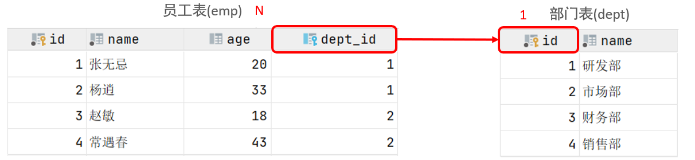
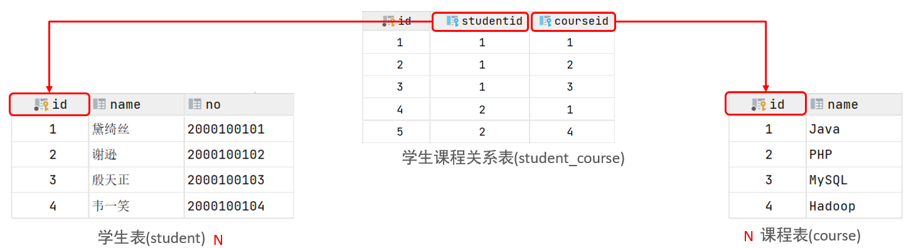
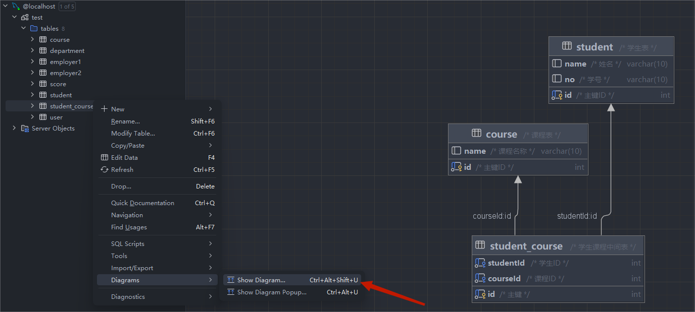
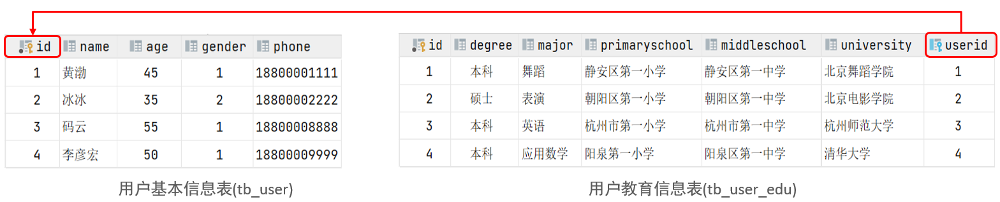
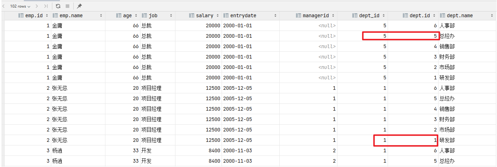
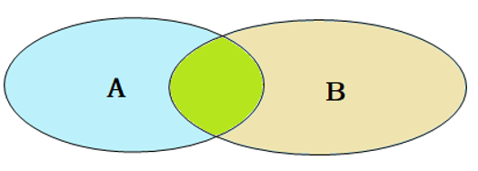
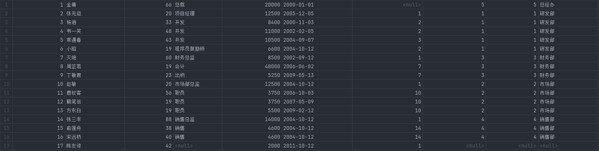
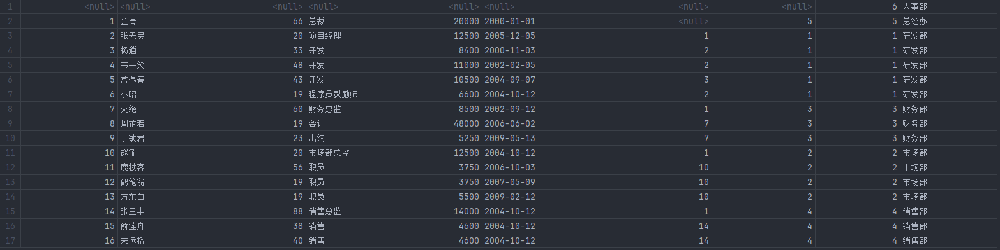
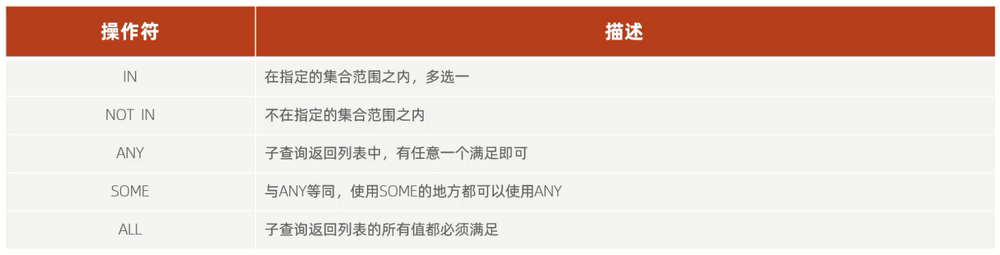

# 多表关系

项目开发中,在进行数据库表结构设计时,会根据业务需求及业务模块之间的关系,分析并设计表结构                 
由于业务之间相互关联,所以各个表结构之间也存在着各种联系,基本上分为三种:

1. 一对多(多对一)
2. 多对多
3. 一对一

## 一对多(多对一)

案例:部门与员工的关系                
关系:一个部门对应多个员工,一个员工对应一个部门                     
实现:**在多的一方建立外键,指向一的一方的主键**                          



## 多对多

案例:学生与课程的关系                    
关系:一个学生可以选修多门课程,一门课程也可以供多个学生选择                
实现:**建立第三张中间表,中间表至少包含两个外键,分别关联两方主键**                   



范例:

```sql
# 创建学生表
create table student
(
    id   int auto_increment primary key comment '主键ID',
    name varchar(10) comment '姓名',
    no   varchar(10) comment '学号'
) comment '学生表';

# 学生表导入数据
insert into student
values (null, '黛绮丝', '2000100101'),
       (null, '谢逊', '2000100102'),
       (null, '殷天正', '2000100103'),
       (null, '韦一笑', '2000100104');

# 创建课程表
create table course
(
    id   int auto_increment primary key comment '主键ID',
    name varchar(10) comment '课程名称'
) comment '课程表';

# 课程表导入数据
insert into course
values (null, 'Java'),
       (null, 'PHP'),
       (null, 'MySQL'),
       (null, 'Hadoop');

# 创建学生课程中间表
create table student_course
(
    id        int auto_increment comment '主键' primary key,
    studentId int not null comment '学生ID',
    courseId  int not null comment '课程ID',
    constraint fk_courseId foreign key (courseId) references course (id),
    constraint fk_studentId foreign key (studentId) references student (id)
) comment '学生课程中间表';

# 学生课程中间表导入数据
insert into student_course
values (null, 1, 1),
       (null, 1, 2),
       (null, 1, 3),
       (null, 2, 2),
       (null, 2, 3),
       (null, 3, 4);
```

学生课程中间表可视化:



## 一对一

案例:用户与用户详情的关系              
关系:一对一关系,多用于单表拆分,将一张表的基础字段放在一张表中,其他详情字段放在另一张表中,以提升操作效率               
实现:**在任意一方加入外键,关联另外一方的主键,并且设置外键为唯一的(`unique`)**                  



范例:

```sql
# 创建用户基本信息表
create table tb_user
(
    id     int auto_increment primary key comment '主键ID',
    name   varchar(10) comment '姓名',
    age    int comment '年龄',
    gender char(1) comment '1: 男 , 2: 女',
    phone  char(11) comment '手机号'
) comment '用户基本信息表';

# 用户基本信息表导入数据
insert into tb_user(id, name, age, gender, phone)
values (null, '黄渤', 45, '1', '18800001111'),
       (null, '冰冰', 35, '2', '18800002222'),
       (null, '码云', 55, '1', '18800008888'),
       (null, '李彦宏', 50, '1', '18800009999');

# 创建用户教育信息表
create table tb_user_edu
(
    id            int auto_increment primary key comment '主键ID',
    degree        varchar(20) comment '学历',
    major         varchar(50) comment '专业',
    primarySchool varchar(50) comment '小学',
    middleSchool  varchar(50) comment '中学',
    university    varchar(50) comment '大学',
    userid        int unique comment '用户ID',
    constraint fk_userid foreign key (userid) references tb_user (id)
) comment '用户教育信息表';

# 用户教育信息表导入数据
insert into tb_user_edu(id, degree, major, primarySchool, middleSchool, university, userid)
values (null, '本科', '舞蹈', '静安区第一小学', '静安区第一中学', '北京舞蹈学院', 1),
       (null, '硕士', '表演', '朝阳区第一小学', '朝阳区第一中学', '北京电影学院', 2),
       (null, '本科', '英语', '杭州市第一小学', '杭州市第一中学', '杭州师范大学', 3),
       (null, '本科', '应用数学', '阳泉第一小学', '阳泉区第一中学', '清华大学', 4);
```

# 多表查询

多表查询指从多张表中查询数据

笛卡尔积:指在数学中,两个集合,A集合和B集合的所有组合情况,(**在多表查询时,需要消除无效的笛卡尔积**)

出现笛卡尔积的情况:



范例:

```sql
# 创建部门表
create table dept
(
    id   int auto_increment comment 'ID' primary key,
    name varchar(50) not null comment '部门名称'
) comment '部门表';

# 部门表导入数据
INSERT INTO dept (id, name)
VALUES (1, '研发部'),
       (2, '市场部'),
       (3, '财务部'),
       (4, '销售部'),
       (5, '总经办'),
       (6, '人事部');

# 创建员工表
create table emp
(
    id        int auto_increment comment 'ID' primary key,
    name      varchar(50) not null comment '姓名',
    age       int comment '年龄',
    job       varchar(20) comment '职位',
    salary    int comment '薪资',
    entryDate date comment '入职时间',
    managerId int comment '直属领导ID',
    dept_id   int comment '部门ID'
) comment '员工表';

# 员工表导入数据
insert into emp (id, name, age, job, salary, entryDate, managerId, dept_id)
VALUES (1, '金庸', 66, '总裁', 20000, '2000-01-01', null, 5),
       (2, '张无忌', 20, '项目经理', 12500, '2005-12-05', 1, 1),
       (3, '杨逍', 33, '开发', 8400, '2000-11-03', 2, 1),
       (4, '韦一笑', 48, '开发', 11000, '2002-02-05', 2, 1),
       (5, '常遇春', 43, '开发', 10500, '2004-09-07', 3, 1),
       (6, '小昭', 19, '程序员鼓励师', 6600, '2004-10-12', 2, 1),
       (7, '灭绝', 60, '财务总监', 8500, '2002-09-12', 1, 3),
       (8, '周芷若', 19, '会计', 48000, '2006-06-02', 7, 3),
       (9, '丁敏君', 23, '出纳', 5250, '2009-05-13', 7, 3),
       (10, '赵敏', 20, '市场部总监', 12500, '2004-10-12', 1, 2),
       (11, '鹿杖客', 56, '职员', 3750, '2006-10-03', 10, 2),
       (12, '鹤笔翁', 19, '职员', 3750, '2007-05-09', 10, 2),
       (13, '方东白', 19, '职员', 5500, '2009-02-12', 10, 2),
       (14, '张三丰', 88, '销售总监', 14000, '2004-10-12', 1, 4),
       (15, '俞莲舟', 38, '销售', 4600, '2004-10-12', 14, 4),
       (16, '宋远桥', 40, '销售', 4600, '2004-10-12', 14, 4),
       (17, '陈友谅', 42, null, 2000, '2011-10-12', 1, null);

# 连接外键
alter table emp
    add constraint fk_emp_dept foreign key (dept_id) references dept (id);

# 出现笛卡尔积
select *
from emp,
     dept;

# 消除笛卡尔积
select *
from emp,
     dept
where emp.dept_id = dept.id;
```

## 分类

1. 连接查询
- 内连接:相当于查询A、B交集部分数据
- 外连接:             
左外连接:查询左表所有数据,以及两张表交集部分数据                  
右外连接:查询右表所有数据,以及两张表交集部分数据              
- 自连接:当前表与自身的连接查询,自连接必须使用表别名               
2. 子查询

## 连接查询

### 内连接



内连接查询的是两张表交集部分的数据(A表和B表重叠部分的数据)

1. 隐式内连接:`select 字段列表 from 表1,表2 where 条件;`
2. 显式内连接:`select 字段列表 from 表1 [inner] join 表2 on 连接条件;`

范例:

```sql
# 查询每一个员工的姓名及相关部门的名称
# 隐式内连接
select emp.name, dept.name
from emp,
     dept
where emp.dept_id = dept.id;

# 显式内连接
select emp.name, dept.name
from dept
         join emp on dept.id = emp.dept_id;
```

### 外连接


外连接查询分为两种,一种是左外连接,一种是右外连接

1. 左外连接:`select 字段列表 from 表1 left [outer] join 表2 on 条件;`                   
左外连接相当于查询表1(左A表)的所有数据,当然也包含表1和表2交集部分的数据
2. 右外连接:`select 字段列表 from 表1 right [outer] join 表2 on 条件;`                
右外连接相当于查询表2(右B表)的所有数据,当然也包含表1和表2交集部分的数据

范例:

```sql
# 查询emp表中的所有数据,和对应的部门信息
# 左外连接
select * from emp e left join dept d on d.id = e.dept_id;
# 右外连接
select * from emp right join dept d on d.id = emp.dept_id;
```

左外连接(**完全包含左表的数据**):



右外连接(**完全包含右表的数据**):



细节:**左外连接和右外连接是可以相互替换的,只需要调整在连接查询时SQL中,表结构的先后顺序就可以了,而在日常开发使用时,更偏向于左外连接**

### 自连接

自连接查询,顾名思义,就是自己连接自己,也就是把一张表连接查询多次

对于自连接查询,可以是内连接查询,也可以是外连接查询

1. 内连接:`select 字段列表 from 表A 别名A, 表A 别名B where 条件;`
2. 外连接:`select 字段列表 from 表A 别名A join 表A 别名B on 条件;`

范例:

```sql
# 查询所有员工及其所属领导(managerId)的名字
# 隐式内连接
select e1.name 员工, e2.name 领导
from emp e1,
     emp e2
where e1.managerId = e2.id;

# 显式内连接
select e1.name 员工, e2.name 领导
from emp e1
         join emp e2 on e1.managerId = e2.id;

# 查询所有员工及其所属领导(managerId)的名字,如果员工没有领导也需要查询出来
# 外连接
select e1.name 员工, e2.name 领导
from emp e1
         left join emp e2 on e1.managerId = e2.id;
```

## 联合查询

联合查询就是把多次查询的结果合并起来,形成一个新的查询结果集

```sql
select 字段列表 from 表A ...
union [all]
select 字段列表 from 表B ...;
```

细节:
1. **对于联合查询的多张表的列数必须保持一致,字段类型也需要保持一致**
2. **`union all`会将全部的数据直接合并在一起,`union`会对合并之后的数据去重**

范例:

```sql
# 联合查询
# 查询薪资低于5000的员工
select emp.name
from emp
where salary < 5000
union
# 查询年龄大于50岁的员工
select emp.name
from emp
where age > 50;
```

## 子查询

SQL语句中嵌套SELECT语句,称为嵌套查询,又称子查询

`select * from 表名1 where 字段1=(select 字段2 from 表2);`

`(...)`内部的是子查询,子查询外部的语句可以是insert、delete、update、select(增删改查)中的任何一个

### 分类



#### 根据子查询结果不同分类

1. 标量子查询(子查询结果为单个值)
2. 列子查询(子查询结果为一列)
3. 行子查询(子查询结果为一行)
4. 表子查询(子查询结果为多行多列)

#### 根据子查询位置分类

1. WHERE之后
2. FROM之后
3. SELECT之后

### 标量子查询

子查询返回的结果是单个值(数字、字符串、日期等),最简单的形式,这种子查询称为标量子查询

常用的操作符:`=`、`<>`、`>`、`>=`、`<`、`<=`

范例:

```sql
# 查询销售部所有的员工信息
select *
from emp e
where e.dept_id = (select d.id from dept d where d.name = '销售部');

# 查询在房东白员工入职之后的员工信息
select *
from emp e
where entryDate > (select e.entryDate from emp e where e.name = '方东白')
```

### 列子查询

子查询返回的结果是一列(可以是多行),这种子查询称为列子查询 

常用的操作符:`in`、`not in`、`any`、`some`、`all`

范例:

```sql
# 查询销售部和市场部的所有员工信息
select *
from emp e
where e.dept_id in (select d.id from dept d where d.name = '销售部' or d.name = '市场部');

# 查询比财务部所有的人的工资都高的员工信息
select *
from emp
where salary > all (select salary
                    from emp
                    where dept_id =
                          (select id from dept where name = '财务部'));

# 查询比研发部中任意一人的工资高的员工信息
select *
from emp
where salary > any (select salary
                    from emp
                    where dept_id =
                          (select id from dept where name = '研发部'));
```

### 行子查询

子查询返回的结果是一行(可以是多列),这种子查询称为行子查询

常用的操作符:`=`、`<>`、`in`、`not in`

范例:

```sql
# 查询与张无忌薪资以及其直属领导相同的员工信息
select *
from emp
where (salary, managerId) = (select salary, managerId from emp where name = '张无忌');
```

### 表子查询

子查询返回的结果是多行多列,这种子查询称为表子查询

常用的操作符:`in`

范例:

```sql
# 查询与鹿杖客,宋远桥的职位和薪资相同的员工信息
select *
from emp
where (job, salary) in (select job, salary from emp where name = '鹿杖客' or name = '宋远桥');

# 查询入职日期是2006-01-01之后的员工信息及其部门信息
select *
from (select * from emp where entryDate > '2006-01-01') e
         left join dept d on d.id = e.dept_id;
```

# 练习

准备工作:

```sql
# 创建部门表
create table dept
(
    id   int auto_increment comment 'ID' primary key,
    name varchar(50) not null comment '部门名称'
) comment '部门表';

# 部门表导入数据
INSERT INTO dept (id, name)
VALUES (1, '研发部'),
       (2, '市场部'),
       (3, '财务部'),
       (4, '销售部'),
       (5, '总经办'),
       (6, '人事部');

# 创建员工表
create table emp
(
    id        int auto_increment comment 'ID' primary key,
    name      varchar(50) not null comment '姓名',
    age       int comment '年龄',
    job       varchar(20) comment '职位',
    salary    int comment '薪资',
    entryDate date comment '入职时间',
    managerId int comment '直属领导ID',
    dept_id   int comment '部门ID'
) comment '员工表';

# 员工表导入数据
insert into emp (id, name, age, job, salary, entryDate, managerId, dept_id)
VALUES (1, '金庸', 66, '总裁', 20000, '2000-01-01', null, 5),
       (2, '张无忌', 20, '项目经理', 12500, '2005-12-05', 1, 1),
       (3, '杨逍', 33, '开发', 8400, '2000-11-03', 2, 1),
       (4, '韦一笑', 48, '开发', 11000, '2002-02-05', 2, 1),
       (5, '常遇春', 43, '开发', 10500, '2004-09-07', 3, 1),
       (6, '小昭', 19, '程序员鼓励师', 6600, '2004-10-12', 2, 1),
       (7, '灭绝', 60, '财务总监', 8500, '2002-09-12', 1, 3),
       (8, '周芷若', 19, '会计', 4800, '2006-06-02', 7, 3),
       (9, '丁敏君', 23, '出纳', 5250, '2009-05-13', 7, 3),
       (10, '赵敏', 20, '市场部总监', 12500, '2004-10-12', 1, 2),
       (11, '鹿杖客', 56, '职员', 3750, '2006-10-03', 10, 2),
       (12, '鹤笔翁', 19, '职员', 3750, '2007-05-09', 10, 2),
       (13, '方东白', 19, '职员', 5500, '2009-02-12', 10, 2),
       (14, '张三丰', 88, '销售总监', 14000, '2004-10-12', 1, 4),
       (15, '俞莲舟', 38, '销售', 4600, '2004-10-12', 14, 4),
       (16, '宋远桥', 40, '销售', 4600, '2004-10-12', 14, 4),
       (17, '陈友谅', 42, null, 2000, '2011-10-12', 1, null);

# 连接外键
alter table emp
    add constraint fk_emp_dept foreign key (dept_id) references dept (id);

# 创建薪资登记表
create table salGrade
(
    grade int,
    loSal int,
    hiSal int
) comment '薪资等级表';

# 薪资登记表导入数据
insert into salGrade values (1,0,3000);
insert into salGrade values (2,3001,5000);
insert into salGrade values (3,5001,8000);
insert into salGrade values (4,8001,10000);
insert into salGrade values (5,10001,15000);
insert into salGrade values (6,15001,20000);
insert into salGrade values (7,20001,25000);
insert into salGrade values (8,25001,30000);
```

1. 查询员工的姓名、年龄、职位、部门信息

```sql
# 方法一
select e.name 姓名, e.age 年龄, e.job 职位, d.name 部门
from emp e,
     dept d
where e.dept_id = d.id;

# 方法二
select e.name 姓名, e.age 年龄, e.job 职位, d.name 部门
from (select name, age, job, dept_id from emp) e
         left join dept d on e.dept_id = d.id;
```

2. 查询年龄小于30岁的员工姓名、年龄、职位、部门信息

```sql
# 方法一
select e.name 姓名, e.age 年龄, e.job 职位, d.name 部门
from emp e
         join dept d on e.dept_id = d.id
where e.age < 30;

# 方法二
select e.name 姓名, e.age 年龄, e.job 职位, d.name 部门
from (select name, age, job, dept_id from emp) e
         left join dept d on e.dept_id = d.id
where e.age < 30;
```

3. 查询拥有员工的部门id、部门名称

```sql
select distinct d.id 部门id, d.name 部门名称
from emp e,
     dept d
where e.dept_id = d.id;
```

4. 查询所有年龄大于40岁的员工信息,及其归属的部门名称;如果员工没有分配部门,也需要展示出来

```sql
select e.*, d.name 部门名称
from emp e
         left join dept d on e.dept_id = d.id
where e.age > 40;
```

5. 查询所有员工的工资等级

```sql
# 方法一
select e.*, s.grade 工资等级
from emp e,
     salgrade s
where e.salary >= s.loSal && e.salary <= s.hiSal;

# 方法二
select e.*, s.grade 工资等级
from emp e,
     salgrade s
where e.salary between s.loSal and s.hiSal;
```

6. 查询研发部所有员工的信息及工资等级

```sql
# 方法一
select e.*, s.grade 工资等级
from emp e,
     dept d,
     salgrade s
where (e.dept_id = d.id) && (e.salary >= s.loSal && e.salary <= s.hiSal) && (d.name = '研发部');

# 方法二
select r.*, s.grade 工资等级
from (select e.*
      from emp e
               left join dept d on e.dept_id = d.id
      where d.name = '研发部') r,
     salgrade s
where r.salary >= s.loSal && r.salary <= s.hiSal;
```

7. 查询研发部员工的平均工资

```sql
# 方法一
select round(avg(e.salary), 0) 研发部员工的平均工资
from emp e,
     dept d
where e.dept_id = d.id && d.name = '研发部';

# 方法二
select round(avg(r.salary), 0) 研发部员工的平均工资
from (select e.*
      from emp e
               left join dept d on e.dept_id = d.id
      where d.name = '研发部') r;
```

8. 查询工资比灭绝高的员工信息

```sql
select e.*
from emp e
where e.salary > (select salary from emp where name = '灭绝');
```

9. 查询比平均薪资高的员工信息

```sql
select e.*
from emp e
where e.salary > (select avg(salary) from emp);
```

10. 查询低于本部门平均工资的员工信息

```sql
select e1.*, (select avg(e2.salary) from emp e2 where e1.dept_id = e2.dept_id) 当前部门的平均薪资
from emp e1
where e1.salary < (select avg(e2.salary) from emp e2 where e1.dept_id = e2.dept_id);
```

11. 查询所有的部门信息,并统计部门的员工人数

```sql
select d.name 部门名称, (select count(*) from emp e where e.dept_id = d.id) 员工人数
from dept d;
```

12. 查询所有学生的选课情况,展示出学生名称,学号,课程名称

准备工作: 

```sql
# 创建学生表
create table student
(
    id   int auto_increment primary key comment '主键ID',
    name varchar(10) comment '姓名',
    no   varchar(10) comment '学号'
) comment '学生表';

# 学生表导入数据
insert into student
values (null, '黛绮丝', '2000100101'),
       (null, '谢逊', '2000100102'),
       (null, '殷天正', '2000100103'),
       (null, '韦一笑', '2000100104');

# 创建课程表
create table course
(
    id   int auto_increment primary key comment '主键ID',
    name varchar(10) comment '课程名称'
) comment '课程表';

# 课程表导入数据
insert into course
values (null, 'Java'),
       (null, 'PHP'),
       (null, 'MySQL'),
       (null, 'Hadoop');

# 创建学生课程中间表
create table student_course
(
    id        int auto_increment comment '主键' primary key,
    studentId int not null comment '学生ID',
    courseId  int not null comment '课程ID',
    constraint fk_courseId foreign key (courseId) references course (id),
    constraint fk_studentId foreign key (studentId) references student (id)
) comment '学生课程中间表';

# 学生课程中间表导入数据
insert into student_course
values (null, 1, 1),
       (null, 1, 2),
       (null, 1, 3),
       (null, 2, 2),
       (null, 2, 3),
       (null, 3, 4);
```

```sql
select s.name 学生名称, s.no 学号, c.name 课程名称
from student s,
     course c,
     student_course sc
where s.id = sc.studentId && c.id = sc.courseId;
```