# String

java.lang.String类代表字符串,Java程序中的所有字符串文字都为此类的对象     
定义在java.lang包中,因此使用的时候不需要导包   

**字符串的内容是不会发生改变的,它的对象在创建后不能被更改**   
例如: 给一个已有字符串"abcd",第二次赋值成"abced"   
这不是在原内存地址上修改数据,而是重新指向一个新对象,新地址   

创建String对象的两种方式: 

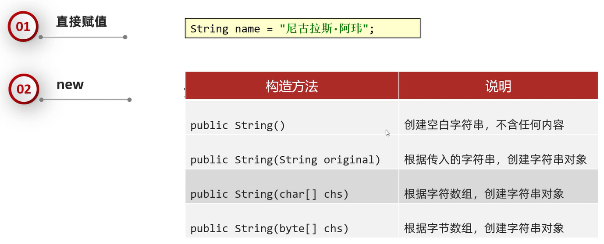

1. 直接赋值获取一个字符串对象  
2. new方式获取一个字符串对象   
a.空参构造: 可以获取一个空白的字符串对象  
b.传递一个字符串,根据传递的字符串内容再创建一个新的字符串对象   
c.传递一个字符串数组,根据传递的字符串内容再创建一个新的字符串对象  
应用场景: 修改字符串的内容   
范例: `abc --> 'a''b''c' --> 'Q''b''c' --> Qbc`     
d.传递一个字节数组,根据传递的字符串内容再创建一个新的字符串对象
应用场景: 网络传输的数据都是字节信息,当把字节信息转换成字符串时应用

练习: 

```java
public class test {
    public static void main(String[] args) {
        // 1.直接赋值获取一个字符串对象
        String a = "abd"; 
        // 打印结果:"abd"
        System.out.println(a); 

        // 2.new方式获取一个字符串对象
        // 空参构造: 可以获取一个空白的字符串对象
        String b = new String(); 
        // 打印结果:"@@"
        System.out.println("@" + b + "@"); 

        // 传递一个字符串,根据传递的字符串内容再创建一个新的字符串对象
        String c = new String("abc"); 
        // 打印结果:"abc"
        System.out.println(c); 

        // 传递一个字符串数组,根据传递的字符串内容再创建一个新的字符串对象
        char[] chars = {'a','b','c','d'}; 
        String d = new String(chars); 
        // 打印结果:"abcd"
        System.out.println(d); 

        // 传递一个字节数组,根据传递的字符串内容再创建一个新的字符串对象
        byte[] bytes = {97,99,100}; 
        String e = new String(bytes); 
        // 打印结果:"acd",即97,99,100对应的ASCII表字母
        System.out.println(e); 
    }
}
```

# 字符串存储的内存原理

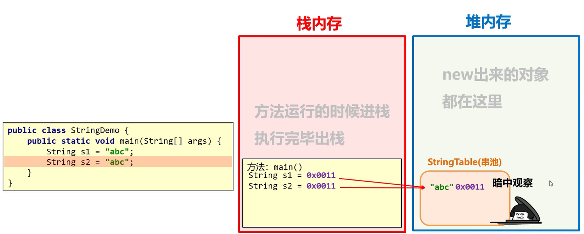

1. 直接赋值获取一个字符串对象的内存原理   
当使用`""`直接赋值的时候,系统会检查该字符串在串池中是否存在   
存在: 复用     
不存在: 创建新的    

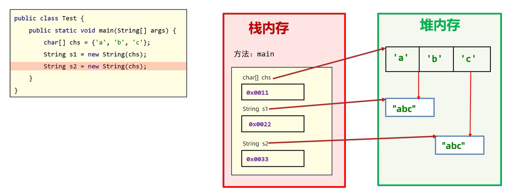

2. new方式获取一个字符串对象的内存原理   
每new一次就是开辟了一个新的小空间   

**建议使用直接赋值的方式获取字符串**   

# 比较字符串

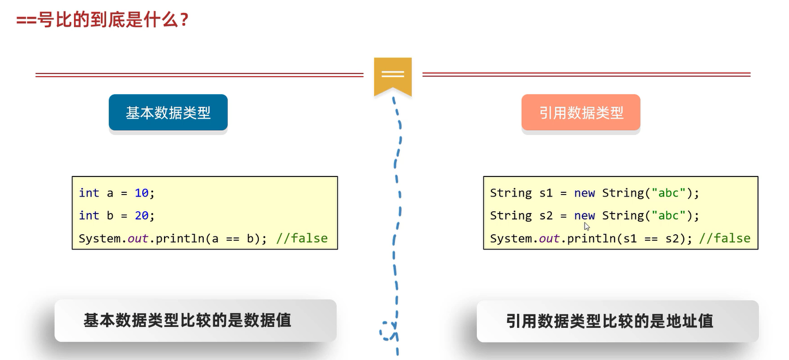

范例: 

```java
public class test {
    public static void main(String[] args) {
        // 记录串池里的地址值
        String s1 = "abc"; 
        // 记录串池里的地址值
        String s2 = "abc"; 
        // 打印结果:"true"
        System.out.println(s1 == s2); 
        // 记录堆里面的地址值
        String s3 = new String("abc"); 
        // 打印结果:"false"
        System.out.println(s1 == s3); 
    }
}
```

1. `boolean equals(要比较的字符串)`   
完全一样,结果才是true,否则为false   
2. `boolean equalsIgnoreCase(要比较的字符串)`   
忽略(英文状态下的)大小写的比较    

范例: 

```java
public class test {
    public static void main(String[] args) {
        // 记录串池里的地址值
        String s1 = "abc"; 
        // 记录堆里面的地址值
        String s2 = new String("abc"); 
        String s3 = new String("ABC"); 
        // 打印结果:"true"
        System.out.println(s1.equals(s2)); 
        // 打印结果:"false"
        System.out.println(s1.equals(s3)); 
        // 打印结果:"true"
        System.out.println(s1.equalsIgnoreCase(s3)); 
    }
}
```

**键盘录入的字符串是new出来的**   

```java
public class test {
    public static void main(String[] args) {
        Scanner sc = new Scanner(System.in); 
        // 输入abc
        System.out.println("请输入一个字符串: "); 
        // 键盘录入的字符串是new出来的
        String str = sc.next(); 
        String word = "abc"; 
        // 打印结果:"false"
        System.out.println(word == str); 
    }
}
```

**只要比较字符串的内容,就必须要用String里面的方法**

练习: 

已知正确的用户名和密码,请用程序实现模拟用户登录    
总共给3次机会,登录之后,给出相应的提示   

```java
import java.util.Scanner; 

public class test {
    public static void main(String[] args) {
        Scanner sc = new Scanner(System.in); 
        String userName = "admin"; 
        String userPassword = "123456"; 
        // 计数器
        int count = 3; 
        while (true) {
            System.out.println("请输入用户名: "); 
            String inputName = sc.next(); 
            System.out.println("请输入密码: "); 
            String inputPassword = sc.next(); 
            if (userName.equals(inputName) && userPassword.equals(inputPassword)) {
                System.out.println("登录成功!"); 
                break; 
            } else {
                count--; 
                if (count != 0) {
                    System.out.println("输入的用户名不正确,请重新输入!还剩" + count + "次机会"); 
                } else {
                    System.out.println("登录失败!"); 
                    break; 
                }
            }
        }
    }
}
```

```java
import java.util.Scanner; 

public class test {
    public static void main(String[] args) {
        Scanner sc = new Scanner(System.in); 
        String userName = "admin"; 
        String userPassword = "123456"; 
        // 计数器
        int count = 3; 
        while (true) {
            System.out.println("请输入用户名: "); 
            String inputName = sc.next(); 
            if (userName.equals(inputName)) {
                System.out.println("请输入密码: "); 
                String inputPassword = sc.next(); 
                if (userPassword.equals(inputPassword)) {
                    System.out.println("登录成功!"); 
                    break; 
                } else {
                    count--; 
                    System.out.println("输入的密码不正确,请重新输入!还剩" + count + "次机会"); 
                }
            } else {
                count--; 
                if (count != 0) {
                    System.out.println("输入的用户名不正确,请重新输入!还剩" + count + "次机会"); 
                } else {
                    System.out.println("登录失败!"); 
                    break; 
                }
            }
        }
    }
}
```

```java
import java.util.Scanner; 

public class test {
    public static void main(String[] args) {
        Scanner sc = new Scanner(System.in); 
        String userName = "admin"; 
        String userPassword = "123456"; 
        for (int i = 0;  i < 3;  i++) {
            System.out.println("请输入用户名: "); 
            String inputName = sc.next(); 
            System.out.println("请输入密码: "); 
            String inputPassword = sc.next(); 
            if (userName.equals(inputName) && userPassword.equals(inputPassword)) {
                System.out.println("登录成功!"); 
                break; 
            } else {
                if (i < 2) {
                    System.out.println("输入的用户名或密码不正确,请重新输入!还剩下" + (2 - i) + "次机会"); 
                }else{
                    System.out.println("登录失败!"); 
                }
            }
        }
    }
}
```

# 遍历字符串

`public char charAt(int index)`: 根据索引返回字符    
`public int length()`: 返回此字符串的长度    

数组的长度: `数组名.length`   
数组的长度是属性,调用不用加`()`  
字符串的长度: `字符串.length()`  
而**字符串的长度是方法,调用要加`()`**   

练习: 

键盘录入一个字符串并遍历

```java
import java.util.Scanner; 

public class test {
    public static void main(String[] args) {
        Scanner sc = new Scanner(System.in); 
        System.out.println("请输入一个字符串: "); 
        String str = sc.next(); 
        for (int i = 0;  i < str.length();  i++) {
            char c = str.charAt(i); 
            System.out.print(c + " "); 
        }
    }
}
```

练习: 

键盘录入一个字符串,统计该字符串中大写字母字符,小写字母字符以及数字字符出现的次数(不考虑其他字符)   
**char类型的变量在参与计算的时候,自动类型提升为int,查询ASCII码表**    

```java
import java.util.Scanner; 

public class test {
    public static void main(String[] args) {
        Scanner sc = new Scanner(System.in); 
        System.out.println("请输入一个字符串: "); 
        String str = sc.next(); 
        // 计数器
        int xCount = 0; 
        int XCount = 0; 
        int numberCount = 0; 
        for (int i = 0;  i < str.length();  i++) {
            char c = str.charAt(i); 
            if (c >= '0' && c <= '9') {
                numberCount++; 
            } else if (c >= 'A' && c <= 'Z') {
                XCount++; 
            } else if (c >= 'a' && c <= 'z') {
                xCount++; 
            }
        }
        System.out.println("大写字母字符的出现次数为: " + XCount); 
        System.out.println("小写字母字符的出现次数为: " + xCount); 
        System.out.println("数字字符的出现次数为: " + numberCount); 
    }
}
```

```java
import java.util.Scanner; 

public class test {
    public static void main(String[] args) {
        Scanner sc = new Scanner(System.in); 
        System.out.println("请输入一个字符串: "); 
        String str = sc.next(); 
        // 计数器
        int xCount = 0; 
        int XCount = 0; 
        int numberCount = 0; 
        for (int i = 0;  i < str.length();  i++) {
            char c = str.charAt(i); 
            if ((int) c >= 48 && (int) c <= 57) {
                numberCount++; 
            } else if ((int) c >= 65 && (int) c <= 90) {
                XCount++; 
            } else if ((int) c >= 97 && (int) c <= 122) {
                xCount++; 
            }
        }
        System.out.println("大写字母字符的出现次数为: " + XCount); 
        System.out.println("小写字母字符的出现次数为: " + xCount); 
        System.out.println("数字字符的出现次数为: " + numberCount); 
    }
}
```

# 拼接字符串

练习: 

定义一个方法,把int数组中的数据按照指定的格式拼接成一个字符串返回    
调用该方法,并在控制台输出结果    
例如: 数组为`int[] arr ={1,2,3};`   
执行方法后的输出结果为: "[1,2,3]"    

```java
public class test {
    public static void main(String[] args) {
        int[] arr = {1, 2, 3}; 
        String str = getStr(arr); 
        System.out.println(str); 
    }

    public static String getStr(int[] arr) {
        if (arr == null) {
            return ""; 
        }
        if (arr.length == 0) {
            return "[]"; 
        }
        String start = "["; 
        for (int i = 0;  i < arr.length;  i++) {
            if (i < arr.length - 1) {
                start += arr[i] + ","; 
            }else{
                start += arr[i] +"]"; 
            }
        }
        return start; 
    }
}
```

# 反转字符串

定义一个方法,实现字符串反转  
录入一个字符串,调用该方法后,在控制台输出结果   
例如: 输入"abc",输出"cba"   

```java
import java.util.Scanner; 

public class test {
    public static void main(String[] args) {
        Scanner sc = new Scanner(System.in); 
        System.out.println("请输入一个字符串: "); 
        String str = sc.next(); 
        String result = reverseStr(str); 
        System.out.print("反转之后为: "); 
        System.out.println(result); 
    }

    public static String reverseStr(String str) {
        char[] chars = new char[str.length()]; 
        for (int i = 0;  i < str.length();  i++) {
            chars[i] = str.charAt(i); 
        }
        String result = ""; 
        for (int i = chars.length - 1;  i >= 0;  i--) {
            result += chars[i]; 
        }
        return result; 
    }
}
```

```java
import java.util.Scanner; 

public class test {
    public static void main(String[] args) {
        Scanner sc = new Scanner(System.in); 
        System.out.println("请输入一个字符串: "); 
        String str = sc.next(); 
        String result = reverseStr(str); 
        System.out.print("反转之后为: "); 
        System.out.println(result); 
    }

    public static String reverseStr(String str) {
        String result = ""; 
        for (int i = str.length() - 1;  i >= 0;  i--) {
            char c = str.charAt(i); 
            result += c; 
        }
        return result; 
    }
}
```

练习: 

金额转换

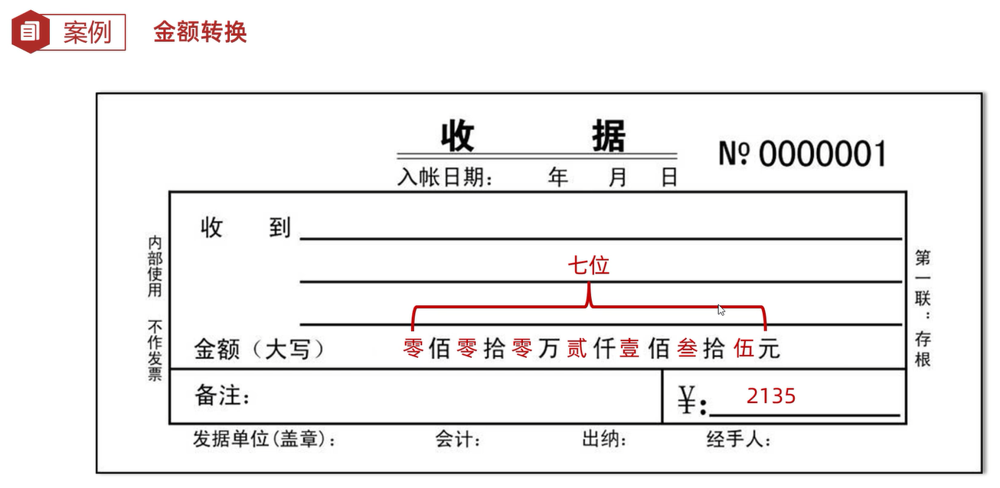

```java
import java.util.Scanner; 

public class test {
    public static void main(String[] args) {
        Scanner sc = new Scanner(System.in); 
        int money; 
        int count; 
        while (true) {
            System.out.println("请输入金额(7位数以内): "); 
            int number = sc.nextInt(); 
            // 判断金额是否是7位数以内的数字
            count = getCount(number); 
            if (count > 7) {
                System.out.println("超出金额范围!"); 
            } else {
                // 判断金额是否小于0
                if (number < 0) {
                    System.out.println("金额小于零!"); 
                } else {
                    money = number; 
                    break; 
                }
            }
        }
        String str = getStr(money, count); 
        String newStr = newStr(str); 
        System.out.println("转换后: " + newStr); 
    }

    // 将字符串补全到7位,并把阿拉伯数字转换成大写数字
    public static String newStr(String str) {
        int length = str.length(); 
        String newStr = ""; 
        String zero = "0"; 
        for (int i = 0;  i < (7 - str.length());  i++) {
            newStr += zero; 
        }
        // 补全成长度为7的字符串
        newStr += str; 
        // 将补全后的字符串中的每一个字符存入字符数组中
        char[] chars = new char[7]; 
        for (int i = 0;  i < chars.length;  i++) {
            chars[i] = newStr.charAt(i); 
        }
        char[] newChar = newChar(chars); 

        // 拼接字符串
        return newChar[0] + "佰" + newChar[1] + "拾" + newChar[2] + "万" + newChar[3] + "仟" + newChar[4] + "佰" + newChar[5] + "拾" + newChar[6] + "元"; 
    }

    // 将阿拉伯数字替换成大写数字
    public static char[] newChar(char[] oldChar) {
        char[] number = {'零', '壹', '贰', '叁', '肆', '伍', '陆', '柒', '捌', '玖'}; 
        for (int i = 0;  i < oldChar.length;  i++) {
            if (oldChar[i] == '0') {
                oldChar[i] = number[0]; 
            } else if (oldChar[i] == '1') {
                oldChar[i] = number[1]; 
            } else if (oldChar[i] == '2') {
                oldChar[i] = number[2]; 
            } else if (oldChar[i] == '3') {
                oldChar[i] = number[3]; 
            } else if (oldChar[i] == '4') {
                oldChar[i] = number[4]; 
            } else if (oldChar[i] == '5') {
                oldChar[i] = number[5]; 
            } else if (oldChar[i] == '6') {
                oldChar[i] = number[6]; 
            } else if (oldChar[i] == '7') {
                oldChar[i] = number[7]; 
            } else if (oldChar[i] == '8') {
                oldChar[i] = number[8]; 
            } else if (oldChar[i] == '9') {
                oldChar[i] = number[9]; 
            }
        }
        return oldChar; 
    }

    // 将int类型的数字转变成String的字符串
    public static String getStr(int number, int count) {
        int[] arr = new int[count]; 
        for (int i = arr.length - 1;  i >= 0;  i--) {
            arr[i] = number / 10; 
        }
        String start = ""; 
        for (int i = 0;  i < arr.length;  i++) {
            start += arr[i]; 
        }
        return start; 
    }

    // 获取数字的位数
    public static int getCount(int number) {
        // 计数器
        int count = 0; 
        while (number != 0) {
            number /= 10; 
            count++; 
        }
        return count; 
    }
}
```

```java
import java.util.Scanner; 

public class test {
    public static void main(String[] args) {
        Scanner sc = new Scanner(System.in); 
        int money; 
        while (true) {
            System.out.println("请录入一个金额"); 
            money = sc.nextInt(); 
            if (money >= 0 && money <= 9999999) {
                break; 
            } else {
                System.out.println("金额无效"); 
            }
        }

        String moneyStr = ""; 
        while (true) {
            // 从右往左获取数据，因为右侧是数据的个位
            int ge = money % 10; 
            String capitalNumber = getCapitalNumber(ge); 
            // 把转换之后的大写拼接到moneyStr当中
            moneyStr = capitalNumber + moneyStr; 
            // 第一次循环 ： "伍" + "" = "伍"
            // 第二次循环 ： "叁" + "伍" = "叁伍"
            // 去掉刚刚获取的数据
            money = money / 10; 
            // 如果数字上的每一位全部获取到了，那么money记录的就是0，此时循环结束
            if (money == 0) {
                break; 
            }
        }

        // 字符串补齐到7位
        int count = 7 - moneyStr.length(); 
        for (int i = 0;  i < count;  i++) {
            moneyStr = "零" + moneyStr; 
        }

        // 插入单位
        String[] arr = {"佰", "拾", "万", "仟", "佰", "拾", "元"}; 
        String result = ""; 
        for (int i = 0;  i < moneyStr.length();  i++) {
            char c = moneyStr.charAt(i); 
            // 把大写数字和单位拼接到result当中
            result = result + c + arr[i]; 
        }
        System.out.println("转换后: " + result); 
    }

    // 把阿拉伯数字转换成大写数字
    public static String getCapitalNumber(int number) {
        String[] arr = {"零", "壹", "贰", "叁", "肆", "伍", "陆", "柒", "捌", "玖"}; 
        return arr[number]; 
    }
}
```

# 截取字符串

`String substring(int beginIndex,int endIndex)`: 截取   
 
注意事项:    
1. **包头不包尾,包左不包右**  
2. **只有返回值才是截取的小串**   

`String substring(int beginIndex)`: 截取到末尾  
 
修改字符串的内容,有2个办法:   
1. 用subString进行截取,把左边的字符截取出来拼接到右侧去  
2. 先把字符串转换成一个字符数组,然后调整字符数组里的数据,最后再把字符数组拼接成字符串  

练习: 

手机号屏蔽

```java
import java.util.Scanner; 

public class test {
    public static void main(String[] args) {
        Scanner scanner = new Scanner(System.in); 
        System.out.println("请输入一个手机号码(11位): "); 
        String phoneNumber = scanner.next(); 
        String startNumber = phoneNumber.substring(0, 3); 
        String hideNumber = "****"; 
        String endNumber = phoneNumber.substring(7); 
        System.out.println("处理后的手机号为: " + startNumber + hideNumber + endNumber); 
    }
}
```

练习: 

身份证号码一共有18位,其中7~14位表示出生年、月、日     
第17位表示性别(奇数为男性,偶数为女性)    
录入一个身份证号码,打印人物的出生年、月、日和性别    

```java
import java.util.Scanner; 

public class test {
    public static void main(String[] args) {
        Scanner scanner = new Scanner(System.in); 
        System.out.println("请输入一个身份证号码(18位): "); 
        String peopleId = scanner.next(); 
        String year = peopleId.substring(6, 10); 
        String month = peopleId.substring(10, 12); 
        String day = peopleId.substring(12, 14); 
        char genderNumber = peopleId.charAt(16); 
        // 根据ASCII码表,字符0对应十进制48
        int genderInt = genderNumber - 48; 
        String gender = ""; 
        if (genderInt % 2 == 0) {
            gender = "女"; 
        } else {
            gender = "男"; 
        }
        System.out.println("出生年月日: " + year + "年" + month + "月" + day + "日"); 
        System.out.println("性别为: " + gender); 
    }
}
```

Integer包中的方法`int parseInt(String s)`: 将String类型转换为int类型   
使用方式: `int i = Integer.parseInt(String s)`即将字符串`s`转换成数字i    

```java
import java.util.Scanner; 

public class test {
    public static void main(String[] args) {
        Scanner scanner = new Scanner(System.in); 
        System.out.println("请输入一个身份证号码(18位): "); 
        String peopleId = scanner.next(); 
        String year = peopleId.substring(6, 10); 
        String month = peopleId.substring(10, 12); 
        String day = peopleId.substring(12, 14); 
        String genderNumber = peopleId.substring(16, 17); 
        int genderInt = Integer.parseInt(genderNumber); 
        String gender = ""; 
        if (genderInt % 2 == 0) {
            gender = "女"; 
        } else {
            gender = "男"; 
        }
        System.out.println("出生年月日: " + year + "年" + month + "月" + day + "日"); 
        System.out.println("性别为: " + gender); 
    }
}
```

# 替换字符串

`String replace(旧值,新值)`: 替换   
**只有返回值才是替换之后的结果**   

练习: 

敏感词替换

```java
public class test {
    public static void main(String[] args) {
        String str = "你玩的真好,以后不要再玩了,tmd"; 
        String newStr = str.replace("tmd","***"); 
        System.out.println(newStr); 
    }
}
```

```java
import java.util.Scanner; 

public class test {
    public static void main(String[] args) {
        Scanner scanner = new Scanner(System.in); 
        System.out.println("请开喷: "); 
        String str = scanner.next(); 
        String[] arr = {"tmd", "sb", "cnm"}; 
        for (int i = 0;  i < arr.length;  i++) {
            str = str.replace(arr[i], "***"); 
        }
        System.out.println("系统屏蔽后输出: " + str); 
    }
}
```

# StringBuilder

StringBuilder可以看成是一个容器,**创建之后里面的内容是可变的**   

作用: 提高字符串的操作效率     

使用场景:    
1. 字符串的拼接   
2. 字符串的反转   

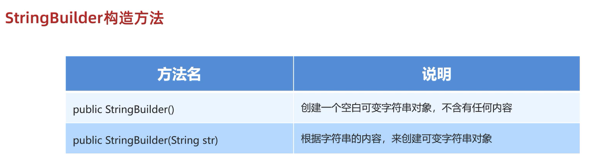

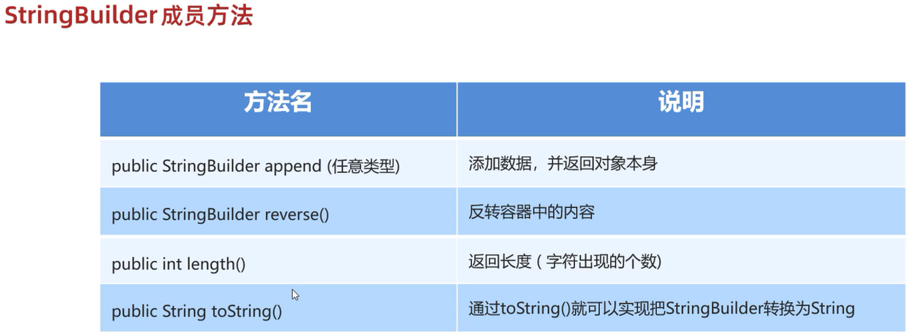

StringBuilder是Java已经写好的类   
Java在底层对它做了一些特殊处理: **打印对象不是地址值,而是属性值**   

练习: 

```java
public class test {
    public static void main(String[] args) {
        // 空参
        StringBuilder sb1 = new StringBuilder(); 
        // 打印结果:"@@"
        System.out.println("@" + sb1 + "@"); 

        // 添加元素
        StringBuilder sb2 = new StringBuilder("helloworld"); 
        sb2.append(1); 
        sb2.append(2.3); 
        sb2.append(true); 
        // 打印结果:"helloworld12.3true"
        System.out.println(sb2); 

        // 反转
        StringBuilder sb3 = new StringBuilder("helloworld"); 
        sb3.reverse(); 
        // 打印结果:"dlrowolleh"
        System.out.println(sb3); 

        // 获取长度
        StringBuilder sb4 = new StringBuilder("helloworld"); 
        int len = sb4.length(); 
        // 打印结果:"10"
        System.out.println(len); 
    }
}
```

```java
public class test {
    public static void main(String[] args) {
        StringBuilder sb = new StringBuilder(); 
        sb.append("aaa"); 
        sb.append("bbb"); 
        sb.append("ccc"); 
        sb.append("ddd"); 
        // 打印结果:"aaabbbcccddd",但此时的sb是StringBuilder类型的,并不是字符串类型
        System.out.println(sb); 

        // 把StringBuilder变回字符串
        String str = sb.toString(); 
        // 打印结果:"aaabbbcccddd"
        System.out.println(str); 
    }
}
```

链式编程: 在调用一个方法的时候,不需要用变量接受它的结果,可以直接继续调用其他方法   

```java
import java.util.Scanner; 

public class test {
    public static void main(String[] args) {
        // substring(1): 从索引1开始截取到末尾
        // replace("A","Q"): 把字符串里的"A"替换成"Q"
        int len = getString().substring(1).replace("A","Q").length(); 
        System.out.println(len); 
    }

    public static String getString() {
        Scanner sc = new Scanner(System.in); 
        System.out.println("请输入一个字符串: "); 
        return sc.next(); 
    }
}
```

```java
public class test {
    public static void main(String[] args) {
        StringBuilder sb = new StringBuilder(); 
        String str = sb.append("aaa").append("bbb").append("ccc").append("ddd").toString(); 
        // 打印结果:"aaabbbcccddd",但此时的sb是字符串类型
        System.out.println(str); 
    }
}
```

练习: 

录入一个字符串,程序判断出该字符串是否是对称字符串,并在控制台打印是/不是    
对称字符串: 12321    
非对称字符串: 123123    

```java
import java.util.Scanner; 

public class test {
    public static void main(String[] args) {
        Scanner sc = new Scanner(System.in); 
        System.out.println("请输入一个字符串: "); 
        String str = sc.next(); 
        String result = new StringBuilder().append(str).reverse().toString(); 
        if (str.equals(result)) {
            System.out.println("是"); 
        }else{
            System.out.println("不是"); 
        }
    }
}
```

练习: 

定义一个方法,把int[]数组中的数据按照指定的格式拼接成一个字符串返回   
调用该方法,并在控制台输出结果   
例如: 数组为`int[] arr = {1,2,3};`   
执行方法后的输出结果为: "[1,2,3]"    

```java
public class test {
    public static void main(String[] args) {
        int[] arr = {1, 2, 3}; 
        out(arr); 
    }

    public static void out(int[] arr) {
        StringBuilder sb = new StringBuilder(); 
        sb.append("["); 
        for (int i = 0;  i < arr.length;  i++) {
            if (i != arr.length - 1) {
                sb.append(arr[i]); 
                sb.append(","); 
            } else {
                sb.append(arr[i]); 
            }
        }
        sb.append("]"); 
        System.out.println(sb.toString()); 
    }
}
```

# StringJoiner

StringJoiner可以看成是一个容器,**创建之后里面的内容是可变的**   

作用: 提高字符串的操作效率    
  
使用场景: 高效地拼接字符串   

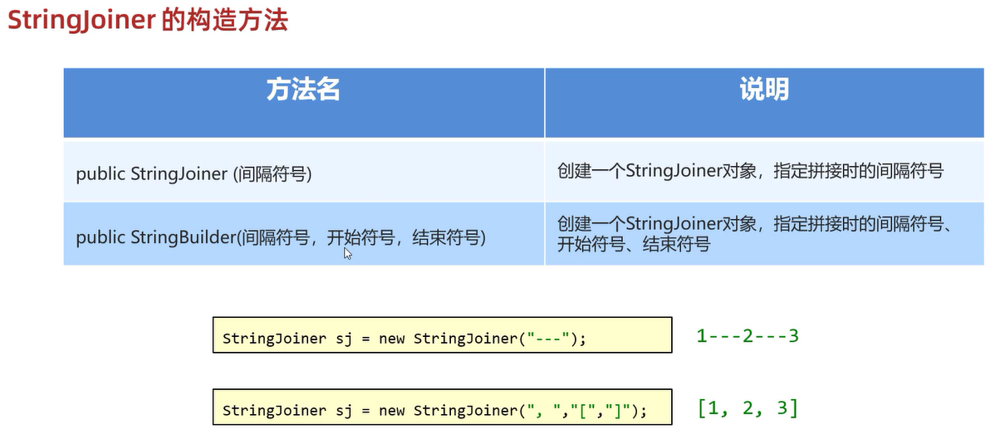

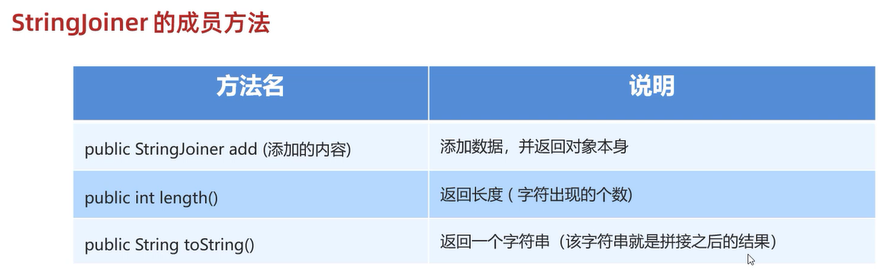

`add(添加数据)`中的添加数据只能是**字符串类型**   

练习: 

```java
import java.util.StringJoiner; 

public class test {
    public static void main(String[] args) {
        StringJoiner sj1 = new StringJoiner("----"); 
        // add()里面添加的数据只能是字符串类型的
        sj1.add("aaa").add("bbb").add("ccc"); 
        // 打印结果:"aaa----bbb----ccc",但此时的sj1是StringJoiner类型的,并不是字符串类型
        System.out.println(sj1); 

        StringJoiner sj2 = new StringJoiner(",","[","]"); 
        sj2.add("aaa").add("bbb").add("ccc"); 
        // 打印结果:"[aaa,bbb,ccc]",但此时的sj2是字符串类型
        System.out.println(sj2.toString()); 
        int len = sj2.length(); 
        // 打印结果:"13"
        System.out.println(len); 
    }
}
```

# 字符串相关类的底层原理

## 字符串存储的内存原理

直接赋值会复用字符串常量池中的   
new出来不会复用,而是开辟一个新的空间   

## `==`号比较的到底是什么?

1. 基本数据类型比较**数据值**  
2. 引用数据类型比较**地址值**   

## 字符串拼接的底层原理

1. 在拼接的时候**没有变量参与**,都是字符串    
会触发字符串的优化机制,在编译之后就是拼接之后的结果,**会复用串池中的字符串**  

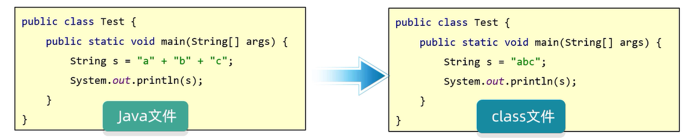

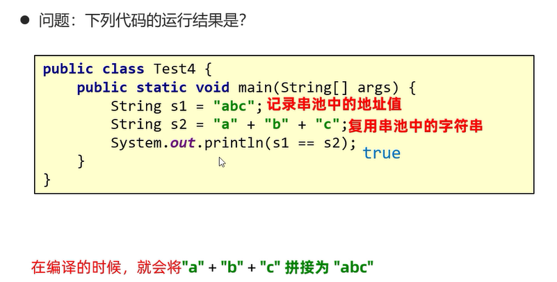

2. 在拼接的时候**有变量参与**  
每一行拼接的代码都会在内存中创建新的字符串,浪费空间和时间   
JDK8之前底层会使用StringBuilder   

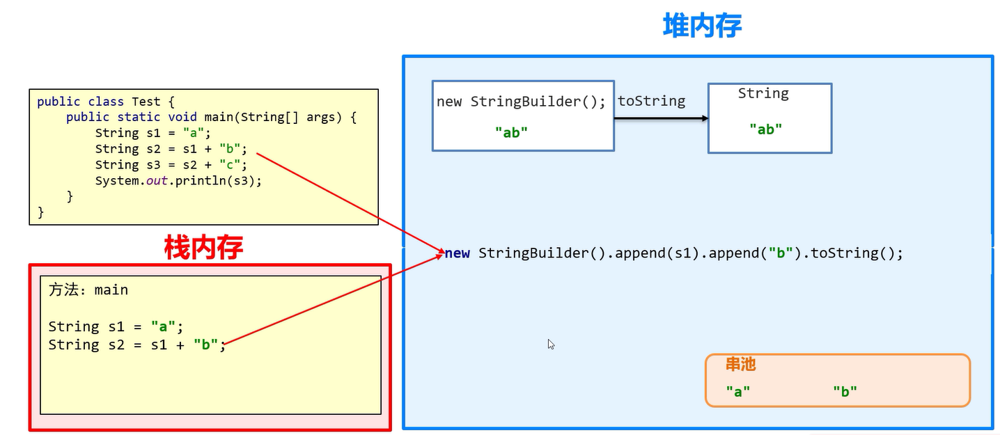

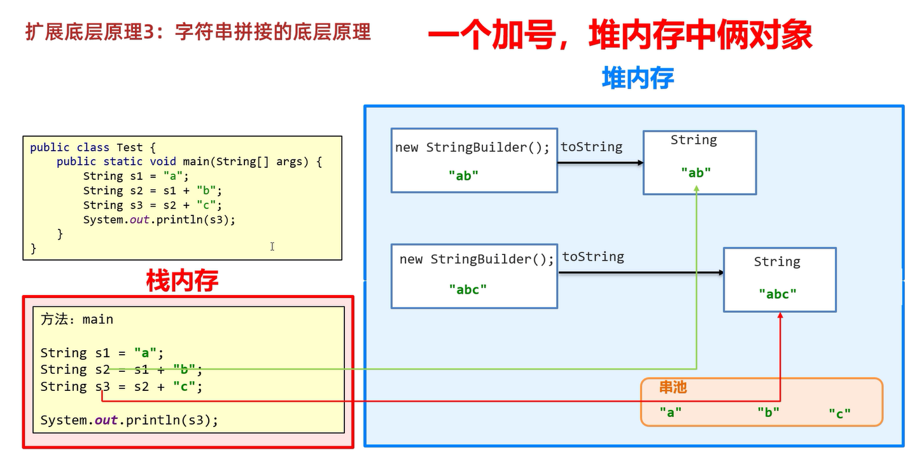

JDK8的时候,底层会先预估创建一个字符串数组   
 
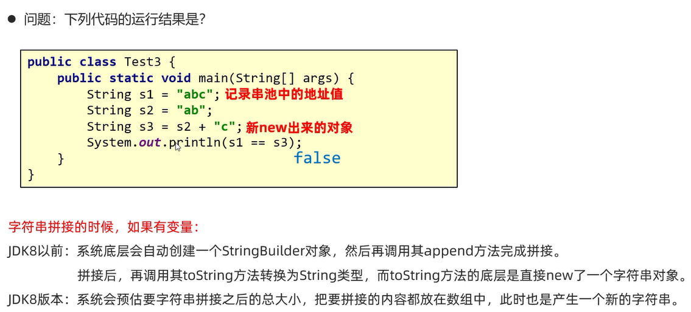

结论: **如果有很多字符串变量拼接,不要直接`+`**   

## StringBuilder提高效率原理图  

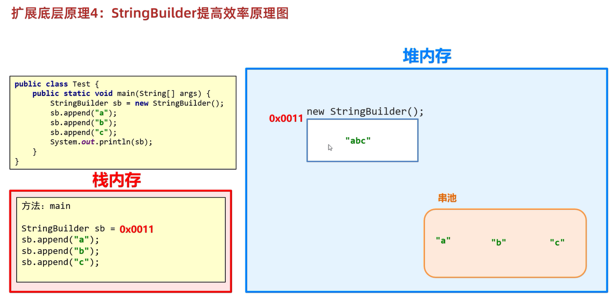

StringBuilder是一个内容可变的容器   
所有要拼接的内容都会往StringBuilder中放,不会创建很多无用的空间,节约内存   

## StringBuilder源码分析

StringBuilder容器中有容量和长度两个概念  

容量: 最多装多少   

长度: 已经装了多少  

过程: 
1. 默认创建一个长度为16的字节数组
2. 添加的内容长度小于16,直接存
3. 添加的内容长度大于16,会扩容(原来的容量*2+2)
4. 如果扩容之后还不够,以实际长度为准

范例:  

```java
public class test {
    public static void main(String[] args) {
        StringBuilder sb1 = new StringBuilder(); 
        // 打印结果:"16"(容量)
        System.out.println(sb1.capacity()); 
        // 打印结果:"0"(长度0)
        System.out.println(sb1.length()); 

        StringBuilder sb2 = new StringBuilder(); 
        sb2.append("abc"); 
        // 打印结果:"16"(容量够存直接存)
        System.out.println(sb2.capacity()); 
        // 打印结果:"3"(长度3)
        System.out.println(sb2.length()); 

        StringBuilder sb3 = new StringBuilder(); 
        sb3.append("qwertyuiopasdfghjklzxcvbnm"); 
        // 打印结果:"34"(容量不够存,扩容,容量=原来的容量*2+2)
        System.out.println(sb3.capacity()); 
        // 打印结果:"26"(长度26)
        System.out.println(sb3.length()); 

        StringBuilder sb4 = new StringBuilder(); 
        sb4.append("qwertyuiopasdfghjklzxcvbnm0123456789"); 
        // 打印结果:"36"(超出扩容,容量=实际长度)
        System.out.println(sb4.capacity()); 
        // 打印结果:"36"(长度36=26+10)
        System.out.println(sb4.length()); 
    }
}
```

# 补充字符串的相关方法

**`String toLowerCase()`**   
把字符串中的大写字母变成小写字母   

范例: 

```java
import java.util.Scanner; 

public class test {
    public static void main(String[] args) {
        Scanner sc = new Scanner(System.in); 
        System.out.println("请输入一个字符串: "); 
        // nextLine()属于键盘录入的第二套体系,可以接受空格、制表符(\t),直到遇到回车才停止接受数据
        String str = sc.nextLine(); 
        // toLowerCase()方法可以把字符串中的大写字母变成小写字母
        String str2 = str.toLowerCase(); 
        int countLetter = 0; 
        int countNumber = 0; 
        for (int i = 0;  i < str2.length();  i++) {
            char c = str2.charAt(i); 
            if (c >= 'a' && c <= 'z') {
                countLetter++; 
            } else if (c >= '0' && c <= '9') {
                countNumber++; 
            }
        }
        System.out.println("这个字符串中的英文字母有" + countLetter + "个,数字有" + countNumber + "个"); 
    }
}
```

**`Char[] toCharArray(); `**  
创建一个字符数组存储字符串中的字符   

范例: 

```java
public class test {
    public static void main(String[] args) {
        String str = "abcde"; 
        char[] arr = str.toCharArray(); 
        System.out.println(new String(arr)); 
    }
}
```

**`int indexOf(String str); `**   
查找参数字符串str在调用方法的字符串中第一次出现的索引，如果不存在，返回-1   

范例: 

```java
public class test {
    public static void main(String[] args) {
        String str1 = "你是谁家的孩子?你是我家的孩子吗?不,我家没有你这样的孩子!"; 
        String str2 = "家"; 
        int index = str1.indexOf(str2); 
        // 打印结果:"3"
        System.out.println(index); 
    }
}
```

**`boolean startsWith(String str)`**    
测试此字符串是否以指定的前缀开始   

范例: 

```java
public class test {
    public static void main(String[] args) {
        String str = "牛不牛"; 
        if (str.startsWith("牛")) {
            // 打印結果: "太牛了!"
            System.out.println("太牛了!"); 
        }
    }
}
```