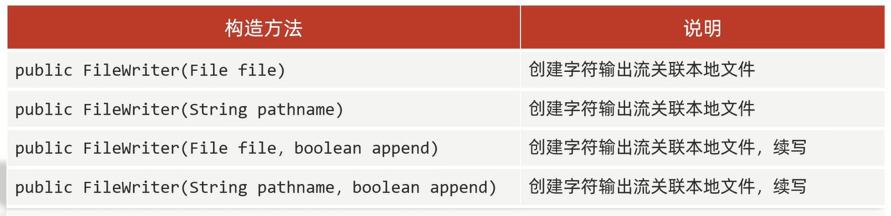

# 字符流


字符流的底层其实就是字节流

字符流=字节流+字符集

## 特点

1. 输入流:1次读1个字节,遇到中文时,一次读多个字节            
2. 输出流:底层会把数据按照指定的编码方式进行编码,变成字节再写到文件中

使用场景:对于纯文本文件进行读写操作

# FileReader

## 步骤

1. 创建字符输入流对象


2. 读取数据


3. 释放资源

## 空参read方法                 
a.默认也是1个字节1个字节的读取,如果遇到中文就会一次读取多个
b.在读取之后,方法的底层还会进行解码并转成十进制,最后把十进制作为返回值 

范例:

```java
import java.io.FileReader;
import java.io.IOException;

public class Test {
    public static void main(String[] args) throws IOException {
        FileReader fileReader = new FileReader("D:\\Project\\Test(IDEA)\\a.txt");
        int read;
        while ((read = fileReader.read()) != -1) {
            System.out.print((char) read);
        }
        fileReader.close();
    }
}
```

## 带参Read方法

把读取数据、解码、强转三步进行合并,然后把强转的字符放到数组里

范例:

```java
import java.io.FileReader;
import java.io.IOException;

public class Test {
    public static void main(String[] args) throws IOException {
        FileReader fileReader = new FileReader("D:\\Project\\Test(IDEA)\\a.txt");
        int read;
        char[] buffer = new char[2];
        while ((read = fileReader.read(buffer)) != -1) {
            System.out.print(new String(buffer, 0, read));
        }
        fileReader.close();
    }
}
```

# FileWriter

步骤:
1. 创建字符流输出对象
2. 写数据
3. 释放资源   

## 细节

创建字符流输出对象:                  
1. **参数是字符串表示的路径或者是File对象**
2. **如果文件不存在,会创建一个新的文件,但是要保证父级路径是存在的**
3. **如果文件已经存在,会先清空文件,如果不想清空可以打开续写开关**

写数据:**write方法的参数是整数,但是实际上写到本地文件中的是数据在字符集上对应的字符**

释放资源:**每次使用完流之后都要释放资源**

## 构造方法



## 写数据的5种方式


范例:

```java
import java.io.FileWriter;
import java.io.IOException;

public class Test {
    public static void main(String[] args) throws IOException {
        FileWriter fileWriter = new FileWriter("D:\\Project\\Test(IDEA)\\a.txt", true);
        // 写入:"我"
        fileWriter.write(25105);
        // 换行
        fileWriter.write("\r\n");
        // 写入:"你好帅啊!!!"
        fileWriter.write("你好帅啊!!!");

        // 一次写一个字节组数据
        char[] chars = {'我', '是', 'X'};
        fileWriter.write(chars);
        fileWriter.close();
    }
}
```

# 字符流原理


