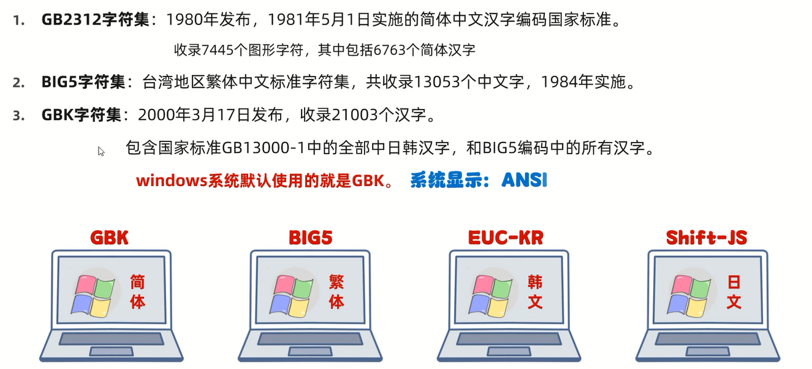
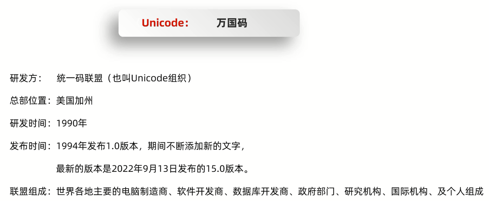

# ASCII


细节:**char类型的变量在参与计算的时候,自动类型提升为int,查询ASCII码表**

1个字节存储1个英文字母         

编码规则:**前面补0,补齐8位**

解码规则:**直接转成十进制**

# GBK

GBK字符集完全兼容ASCII字符集



1. 英文:          
编码规则:**前面补0,补齐8位**          
1个字节存储1个英文字母,二进制第1位一定是0,转成十进制之后是一个正数                         
解码规则:**直接转成十进制**

2. 中文:             
编码规则:**不需要变动**              
a.2个字节存储1个汉字           
b.高位字节二进制第1位一定是1,转成十进制之后是一个负数           
解码规则:**直接转成十进制**

# Unicode

国际标准字符集,它将世界各种语言的每个字符定义一个唯一的编码,以满足跨语言、跨平台的文本信息转换



UTF-8是Unicode字符集的一种编码方式(规则):用1~4个字节保存


英文:1个英文占1个字节,二进制第1位一定是0,转成十进制之后是一个正数          


中文:1个中文占3个字节,二进制第1位一定是1,转成十进制之后是一个负数    

# 乱码

## 原因

1. 读取数据时未读完整个汉字
2. 编码和解码时的方式不统一

## 解决方案

1. 不要用字节流读取文本文件
2. 编码和解码时用同一个码表,同一个编码方式

# Java中的编码和解码方法


范例:

```java
import java.io.UnsupportedEncodingException;
import java.util.Arrays;

public class Test {
    public static void main(String[] args) throws UnsupportedEncodingException {
        String str1 = "ai你哟";
        // 编码
        byte[] bytes1 = str1.getBytes();
        // 打印结果:"[97, 105, -28, -67, -96, -27, -109, -97]"
        System.out.println(Arrays.toString(bytes1));

        byte[] bytes2 = str1.getBytes("GBK");
        // 打印结果:"[97, 105, -60, -29, -45, -76]"
        System.out.println(Arrays.toString(bytes2));

        // 解码
        String str2 = new String(bytes1);
        // 打印结果:"ai你哟"
        System.out.println(str2);

        String str3 = new String(bytes1, "GBK");
        // 打印结果:"ai浣犲摕"(乱码)
        System.out.println(str3);
    }
}
```