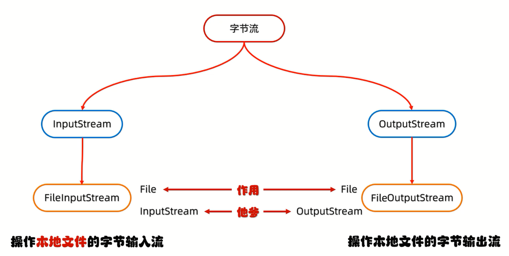
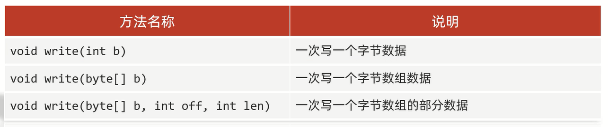
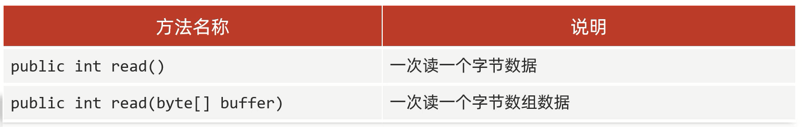
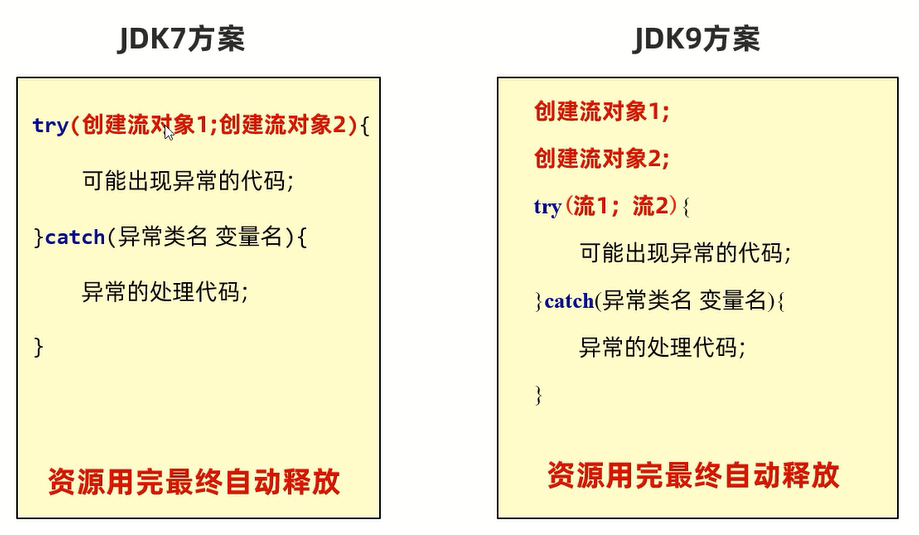

# 字节流



# FileOutputStream

操作本地文件的字节输出流,可以把程序中的数据写到本地文件中

使用场景:**拷贝任意类型的文件**

步骤:
1. 创建字节流输出对象
2. 写数据
3. 释放资源               

范例:

```java
import java.io.FileOutputStream;
import java.io.IOException;

public class Test {
    public static void main(String[] args) throws IOException {
        FileOutputStream file = new FileOutputStream("test.txt");
        // 写入:"a"
        file.write(97);
        // 写入:"9"
        file.write(57);
        // 写入:"7"
        file.write(55);
        file.close();
    }
}
```

## 细节                    

创建字节流输出对象:                   
1. **参数是字符串表示的路径或者是File对象**
2. **如果文件不存在,会创建一个新的文件,但是要保证父级路径是存在的**
3. **如果文件已经存在,会先清空文件**

写数据:**write方法的参数是整数,但是实际上写到本地文件中的是数据在ASCII表上对应的字符**

释放资源:**每次使用完流之后都要释放资源**

## 写数据的3种方式



`write(byte[], int off, int len)`:
1. 第一个参数:数组
2. 第二个参数:起始索引
3. 第三个参数:个数

范例:

```java
import java.io.FileOutputStream;
import java.io.IOException;

public class Test {
    public static void main(String[] args) throws IOException {
        FileOutputStream file = new FileOutputStream("test.txt");
        // 一次写一个字节数据
        file.write(97);
        byte[] arr = {98, 99, 100, 101, 102};
        // 一次写一个字节组数据
        file.write(arr);
        // 一次写一个字节组的部分数据
        file.write(arr, 0, 2);
        file.close();
    }
}
```

## 换行写

换行符:
1. windows:`\r\n`
2. linux:`\n`
3. mac:`\r`

范例:

```java
import java.io.FileOutputStream;
import java.io.IOException;

public class Test {
    public static void main(String[] args) throws IOException {
        FileOutputStream file = new FileOutputStream("test.txt");
        String str1 = "你好帅!";
        byte[] bytes1 = str1.getBytes();
        file.write(bytes1);
        String str2 = "\r\n";
        byte[] bytes2 = str2.getBytes();
        file.write(bytes2);
        String str3 = "我也好帅!";
        byte[] bytes3 = str3.getBytes();
        file.write(bytes3);
        file.close();
    }
}
```

## 续写

`FileOutputStream(String name, boolean append)`:
1. 第一个参数:字符串表示的路径或者是File对象
2. 第二个参数:是否续写(默认是false,此时是关闭续写,创建对象会清空文件)

范例:

```java
import java.io.FileOutputStream;
import java.io.IOException;

public class Test {
    public static void main(String[] args) throws IOException {
        FileOutputStream file = new FileOutputStream("test.txt", true);
        String str1 = "你好帅!";
        byte[] bytes1 = str1.getBytes();
        file.write(bytes1);
        String str2 = "\r\n";
        byte[] bytes2 = str2.getBytes();
        file.write(bytes2);
        String str3 = "我也好帅!";
        byte[] bytes3 = str3.getBytes();
        file.write(bytes3);
        file.close();
    }
}
```

# FileInputStream

操作本地文件的字节输出流,可以把本地文件中的数据读到程序中

步骤:      
1. 创建字节流输出对象            
2. 读数据           
3. 释放资源   

## 细节

创建字节流输出对象:**如果文件不存在,就直接报错**              

读数据:
1. **一次读一个字节,读出来的是数据在ASCII表上对应的数字**           
2. **读到文件末尾,read方法返回-1**

释放资源:**每次使用完流之后都要释放资源**

## 循环读取

read:表示读取数据,而且是读取一个数据就移动一次指针

范例:

```java
import java.io.FileInputStream;
import java.io.IOException;

public class Test {
    public static void main(String[] args) throws IOException {
        FileInputStream file = new FileInputStream("test.txt");
        int read;
        while ((read = file.read()) != -1) {
            System.out.println((char)read);
        }
        file.close();
    }
}
```

练习:

文件拷贝

```java
import java.io.FileInputStream;
import java.io.FileOutputStream;
import java.io.IOException;

public class Test {
    public static void main(String[] args) throws IOException {
        FileInputStream fileInputStream = new FileInputStream("test.txt");
        FileOutputStream fileOutputStream = new FileOutputStream("test2.txt");
        int read;
        // 核心思想:边读边写
        while ((read = fileInputStream.read()) != -1) {
            fileOutputStream.write((char) read);
        }
        // 释放资源:先开的最后关闭
        fileOutputStream.close();
        fileInputStream.close();
    }
}
```

练习:

统计拷贝时间,单位毫秒

```java
import java.io.FileInputStream;
import java.io.FileOutputStream;
import java.io.IOException;
import java.util.Date;

public class Test {
    public static void main(String[] args) throws IOException {
        FileInputStream fileInputStream = new FileInputStream("1 (642).jpg");
        FileOutputStream fileOutputStream = new FileOutputStream("Test");
        Date date1 = new Date();
        int read;
        while ((read = fileInputStream.read()) != -1) {
            fileOutputStream.write((char) read);
        }
        fileOutputStream.close();
        fileInputStream.close();
        Date date2 = new Date();
        System.out.println(date2.getTime() - date1.getTime() + "毫秒");
    }
}
```

## 一次读多个字节



细节:
1. **一次读一个字节数组的数据,每次读取会尽可能把数组装满**
2. **数组长度尽量为1024的整数倍**

范例:

```java
import java.io.FileInputStream;
import java.io.IOException;

public class Test {
    public static void main(String[] args) throws IOException {
        FileInputStream fileInputStream = new FileInputStream("D:\\Project\\Test(IDEA)\\src\\a.txt");
        byte[] bytes = new byte[2];

        int len1 = fileInputStream.read(bytes);
        String str1 = new String(bytes, 0, len1);
        // 打印结果:"ab"
        System.out.println(str1);

        int len2 = fileInputStream.read(bytes);
        String str2 = new String(bytes, 0, len2);
        // 打印结果:"cd"
        System.out.println(str2);

        int len3 = fileInputStream.read(bytes);
        String str3 = new String(bytes, 0, len3);
        // 打印结果:"e"
        System.out.println(str3);

        fileInputStream.close();
    }
}
```

练习:

统计拷贝时间,单位毫秒

```java
import java.io.FileInputStream;
import java.io.FileOutputStream;
import java.io.IOException;

public class Test {
    public static void main(String[] args) throws IOException {
        long start = System.currentTimeMillis();
        FileInputStream fileInputStream = new FileInputStream("D:\\Project\\Test(IDEA)\\234781324.jpg");
        FileOutputStream fileOutputStream = new FileOutputStream("D:\\Project\\a.jpg");
        int read;
        byte[] bytes = new byte[1024 * 1024 * 5];
        while ((read = fileInputStream.read(bytes)) != -1) {
            fileOutputStream.write(bytes, 0, read);
        }
        fileOutputStream.close();
        fileInputStream.close();
        long end = System.currentTimeMillis();
        System.out.println(end - start + "毫秒");
    }
}
```

# IO流中的捕获异常

try...catch...finally异常处理

特点:**finally里面的代码一定被执行,除非JVM停止**

范例:

```java
import java.io.FileInputStream;
import java.io.FileOutputStream;
import java.io.IOException;

public class Test {
    public static void main(String[] args) {
        FileInputStream fileInputStream = null;
        FileOutputStream fileOutputStream = null;
        try {
            fileInputStream = new FileInputStream("D:\\Project\\Test(IDEA)\\src\\test1\\Game.java");
            fileOutputStream = new FileOutputStream("D:\\Project\\Game.java");
            int read;
            byte[] bytes = new byte[1024 * 1024 * 5];
            while ((read = fileInputStream.read(bytes)) != -1) {
                fileOutputStream.write(bytes, 0, read);
            }
        } catch (IOException e) {
            e.printStackTrace();
        } finally {
            if (fileInputStream != null) {
                try {
                    fileInputStream.close();
                } catch (IOException e) {
                    e.printStackTrace();
                }
            }
            if (fileOutputStream != null) {
                try {
                    fileOutputStream.close();
                } catch (IOException e) {
                    e.printStackTrace();
                }
            }
        }
    }
}
```

优化:AutoCloseable接口(特点:特定情况下,可以自动释放资源)



JDK7:

```java
import java.io.FileInputStream;
import java.io.FileOutputStream;
import java.io.IOException;


public class Test {
    public static void main(String[] args) {

        try (FileInputStream fileInputStream = new FileInputStream("D:\\Project\\Test(IDEA)\\234781324.jpg");
             FileOutputStream fileOutputStream = new FileOutputStream("D:\\Project\\a.jpg")) {
            int read;
            byte[] bytes = new byte[1024 * 1024 * 5];
            while ((read = fileInputStream.read(bytes)) != -1) {
                fileOutputStream.write(bytes, 0, read);
            }
        } catch (IOException e) {
            e.printStackTrace();
        }
    }
}
```

JDK9:

```java
import java.io.FileInputStream;
import java.io.FileOutputStream;
import java.io.IOException;

public class Test {
    public static void main(String[] args) throws IOException {
        FileInputStream fileInputStream = new FileInputStream("D:\\Project\\Test(IDEA)\\234781324.jpg");
        FileOutputStream fileOutputStream = new FileOutputStream("D:\\Project\\a.jpg");
        try (fileInputStream; fileOutputStream) {
            int read;
            byte[] bytes = new byte[1024 * 1024 * 5];
            while ((read = fileInputStream.read(bytes)) != -1) {
                fileOutputStream.write(bytes, 0, read);
            }
        } catch (IOException e) {
            e.printStackTrace();
        }
    }
}
```