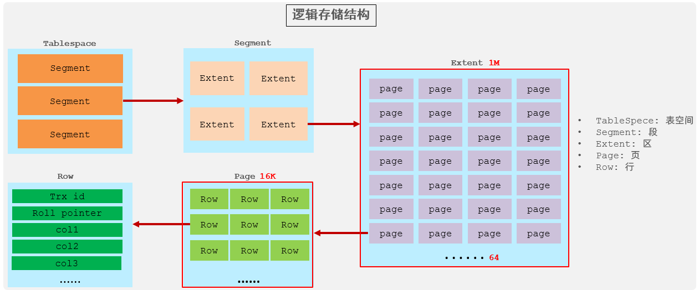
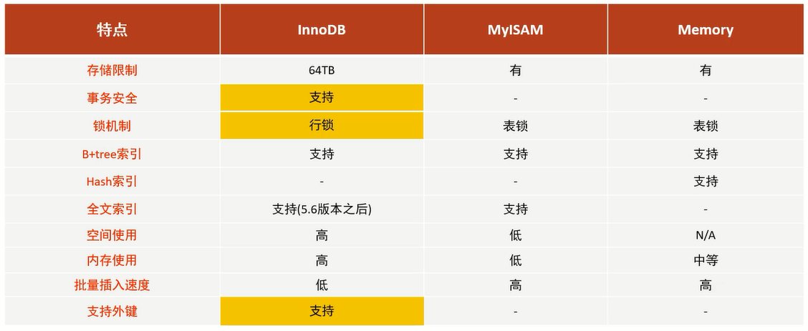

# 存储引擎

存储引擎就是存储数据、建立索引、更新/查询数据等技术的实现方式                     
存储引擎是基于表的,而不是基于库的,所以存储引擎也可被称为表类型         

在创建表的时候,可以指定选择的存储引擎,如果没有指定将自动选择默认的存储引擎

1. 在创建表的时候,指定存储引擎

```sql
create table 表名(
字段1 字段1类型 [comment '字段1注释'],
字段2 字段2类型 [comment '字段2注释'],
字段3 字段3类型 [comment '字段3注释'],
......
字段n 字段n类型 [comment '字段n注释'] 
) engine=innodb [comment '表注释'];
```

2. 查看当前数据库支持的存储引擎

`show engines;`

# InnoDB

InnoDB是一种兼顾高可靠性和高性能的通用存储引擎,在MySQL5.5之后,InnoDB是默认的MySQL存储引擎

## 特点

1. DML操作遵循ACID模型,支持**事务**
2. **行级锁**,提高并发访问性能
3. 支持**外键**约束,保证数据的完整性和正确性

## 文件

`xxx.ibd`:xxx代表的是表名,innoDB引擎的每张表都会对应这样一个表空间文件,存储该表的表结构(frm-早期的、sdi-新版的)、数据和索引            

参数:`innodb_file_per_table`          

如果该参数开启,代表对于InnoDB引擎的表,每一张表都对应一个ibd文件            

## 逻辑存储结构



- 表空间:InnoDB存储引擎逻辑结构的最高层,ibd文件其实就是表空间文件,在表空间中可以包含多个Segment段

- 段:表空间是由各个段组成的,常见的段有数据段、索引段、回滚段等                 
InnoDB中对于段的管理,都是引擎自身完成,不需要人为对其控制,一个段中包含多个区

- 区:区是表空间的单元结构,每个区的大小为1M,默认情况下,InnoDB存储引擎页大小为16K,即一个区中一共有64个连续的页

- 页:页是组成区的最小单元,页也是InnoDB存储引擎磁盘管理的最小单元,每个页的大小默认为16KB                    
为了保证页的连续性,InnoDB存储引擎每次从磁盘申请4-5个区                  

- 行:InnoDB存储引擎是面向行的,也就是说数据是按行进行存放的,在每一行中除了定义表时所指定的字段以外,还包含两个隐藏字段

# MyISAM

MyISAM是MySQL早期的默认存储引擎

## 特点

1. 不支持事务,不支持外键
2. 支持表锁,不支持行锁
3. 访问速度快

## 文件

`xxx.sdi`:存储表结构信息              
`xxx.MYD`:存储数据              
`xxx.MYI`:存储索引            

# Memory

Memory引擎的表数据时存储在内存中的,由于受到硬件问题、或断电问题的影响,只能将这些表作为临时表或缓存使用

## 特点

1. 内存存放
2. hash索引(默认)

## 文件

`xxx.sdi`:存储表结构信息

# 区别及特点



# 存储引擎选择

在选择存储引擎时,应该根据应用系统的特点选择合适的存储引擎,对于复杂的应用系统,还可以根据实际情况选择多种存储引擎进行组合               

- InnoDB:作为Mysql的默认存储引擎,支持事务、外键               
如果**应用对事务的完整性有比较高的要求,在并发条件下要求数据的一致性**,数据操作除了插入和查询之外,还包含很多的更新、删除操作,那么InnoDB存储引擎是比较合适的选择

- MyISAM:如果**应用是以读操作和插入操作为主,只有很少的更新和删除操作,并且对事务的完整性、并发性要求不是很高**,那么选择这个存储引擎是非常合适的

- MEMORY:将所有数据保存在内存中,访问速度快,通常用于**临时表及缓存**                            
MEMORY的缺陷就是对表的大小有限制,太大的表无法缓存在内存中,而且无法保障数据的安全性