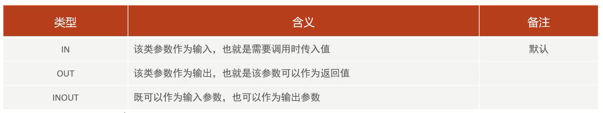

# 存储过程

存储过程是事先经过编译并存储在数据库中的一段SQL语句的集合,调用存储过程可以简化应用开发人员的很多工作,减少数据在数据库和应用服务器之间的传输,对于提高数据处理的效率是有好处的

存储过程思想上很简单,就是数据库SQL语言层面的代码封装与重用

# 特点

1. 封装,复用          
可以把某一业务SQL封装在存储过程中,需要用到的时候直接调用即可

2. 可以接收参数,也可以返回数据               
再存储过程中,可以传递参数,也可以接收返回值

3. 减少网络交互,效率提升                     
如果涉及到多条SQL,每执行一次都是一次网络传输,而如果封装在存储过程中,我们只需要网络交互一次可能就可以了

# 语法

## 创建

```sql
create procedure 存储过程名称([参数列表])
begin
    SQL语句
end;
```

**在命令行中,执行创建存储过程的SQL时,需要通过关键字`delimiter`指定SQL语句的结束符,例如`delimiter $$`:指定SQL语句的结束符为`$$`**

## 调用

`call 名称([参数]);`

## 查看

`select * from information_schema.routines where routine_schema ='XXX';`:查询指定数据库的存储过程及状态信息

`show create procedure 存储过程名称;`:查询某个存储过程的定义

## 删除

`drop procedure [if exists] 存储过程名称;`

## 范例

```sql
# 创建
create procedure p1()
begin
    select count(*) from student;
end;

# 调用
call p1();

# 查看
# 查询指定数据库的存储过程及状态信息
select * from information_schema.routines where routine_schema ='test';
# 查询某个存储过程的定义
show create procedure p1;

# 删除
drop procedure if exists p1;
```

# 变量

## 系统变量

系统变量是MySQL服务器提供,不是用户定义的,属于服务器层面,分为会话变量(session)、全局变量(global)

如果没有指定session/global,默认是session,会话变量

- 全局变量(global):全局变量针对于所有的会话
- 会话变量(session):会话变量针对于单个会话,在另外一个会话窗口就不生效了

MySQL服务器重新启动之后,所设置的全局参数就会失效,想不失效可以在/etc/my.cnf中配置

### 查看

- `show [session | global] variables;`:查看所有的系统变量

- `show [session | global] variables like '...';`:通过like模糊匹配的方式查找变量

- `select @@[session | global] 系统变量名`:查看指定变量的值

### 设置

- `set [session | global] 系统变量名 = 值;`

- `@@[session | global] 系统变量名 = 值;`

## 用户定义变量

用户定义变量是用户根据需要自己定义的变量,用户变量不用提前声明,在用的时候直接用 "@变量名" 使用就可以,其作用域为当前连接   

细节:**用户定义的变量无需对其进行声明或初始化,只不过获取到的值为null**

### 赋值

- `set @变量名 = 值,[,@变量名 = 值]...;`
- `set @变量名 := 值,[,@变量名 := 值]...;`

- `select @变量名 := 值,[,@变量名 := 值]...;`
- `select 字段名 into @变量名 from 表名;`

### 使用

`select @变量名;`

### 范例

```sql
# 设置自定义变量
set @myName := '张三',@myGender := '男';

select @myAge := '23';

select no
into @myNo
from student
where name = '黛绮丝';

# 使用自定义变量
select @myName, @myGender, @myAge, @myNo;
```

## 局部变量

局部变量是根据需要定义的在局部生效的变量,访问之前,需要declare声明               

可用作存储过程内的局部变量和输入参数,局部变量的范围是在其内声明的begin...end块

### 声明

`declare 变量名 变量类型[default ...];`

变量类型就是数据库字段类型:int、bigint、char、varchar、date、time等

### 赋值

- `set 变量名 = 值;`
- `set 变量名 := 值;`

- `select 字段名 into 变量名 from 表名...;`

### 范例

```sql
# 创建存储过程
create procedure p2()
begin
    declare stu_count int default 0;
    select count(*) into stu_count from student;
    select stu_count;
end;

# 调用存储过程
call p2();
```

# if

if用于做条件判断

## 语法

```sql
if 条件1 then
    ...
[elseif 条件2 then]
    ...
[else]
    ...
end if;
```

在if条件判断的结构中,else if结构可以有多个,也可以没有            
else结构可以有,也可以没有

## 范例

根据定义的分数score变量,判定当前分数对应的分数等级:              
1. score>=85,等级为优秀
2. score>=60且score<85,等级为及格
3. score<60,等级为不及格

```sql
# 创建存储过程
create procedure p1()
begin
    declare score int default 58;
    declare result varchar(10);
    if score >= 85 then
        set result = '优秀';
    elseif score >= 60 then
        set result = '及格';
    else
        set result = '不及格';
    end if;
    select score,result;
end;

# 调用存储过程
call p1();
```

# 参数



## 语法

```sql
create procedure 存储过程名称([in | out | inout 参数名 参数类型])
begin
    SQL语句
end;
```

## 范例

范例1:

根据传入参数score,判定当前分数对应的分数等级:              
1. score>=85,等级为优秀
2. score>=60且score<85,等级为及格
3. score<60,等级为不及格

```sql
# 创建存储过程
create procedure p3(in score int, out result varchar(10))
begin
    if score >= 85 then
        set result = '优秀';
    elseif score >= 60 then
        set result = '及格';
    else
        set result = '不及格';
    end if;
end;

# 调用存储过程
call p3(90, @result);
```

范例2:

将传入的200分制的分数,进行换算,换算成百分制,然后返回

```sql
# 创建存储过程
create procedure p4(inout score double)
begin
    set score := score * 0.5;
end;

set @score = 123;

# 调用存储过程
call p4(@score);

select @score;
```

# case

# while

# repeat

# loop

# 游标

# 条件处理程序