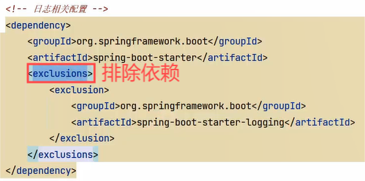
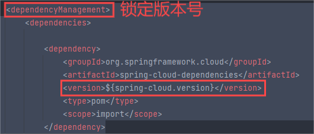

# 项目概况

## 详细说说你的项目吧!

从以下几个方面进行项目介绍:

1. 项目的背景,包括:是自研还是外包、什么业务、服务的客户群是谁、谁去运营等问题
2. 项目的业务流程
3. 项目的功能模块
4. 项目的技术架构
5. 个人工作职责
6. 个人负责模块的详细说明,包括模块的设计,所用到的技术,技术的实现方案等

我最近参与的项目是公司自研的专门针对成人职业技能教育的网络课堂系统,网站提供了成人职业技能培训的相关课程,如:软件开发培训、职业资格证书培训、成人学历教育培训等课程

项目基于B2B2C的业务模式,培训机构可以在平台入驻、发布课程,公司作为运营方由专门的人员对发布的课程进行审核,审核通过后课程才可以发布成功,课程包括免费和收费两种形式,对于免费课程普通用户可以直接选课学习,对于收费课程在选课后需要支付成功才可以继续学习

本项目包括用户端、机构端、运营端三个端

核心模块包括:内容管理、媒资管理、课程搜索、订单支付、选课管理、认证授权等

本项目采用前后端分离架构,后端采用SpringBoot、SpringCloud技术栈开发,数据库使用了MySQL,还使用的Redis、消息队列、分布式文件系统、Elasticsearch等中间件系统

划分的微服务包括:内容管理服务、媒资管理服务、搜索服务、订单支付服务、 学习中心服务、系统管理服务、认证授权服务、网关服务、注册中心服务、配置中心服务等

我在这个项目中负责了内容管理、媒资管理、订单支付模块的设计与开发

内容管理模块,是对平台上的课程进行管理,课程的相关信息比较多,这里在数据库设计了课程基本信息表、课程营销表、课程计划、课程师资表进行存储 ,培训机构要发布一门课程需要填写课程基本信息、课程营销信息、课程计划信息、课程师资信息,填写完毕后需要提交审核,由运营人员进行课程信息的审核,整个审核过程是程序自动审核加人工确认的方式,通常24小时审核完成,课程审核通过即可发布课程,课程的相关信息会聚合到课程发布表中,这里不仅要将课程信息写到课程发布表还要将课程信息写到索引库、分布式文件系统中,所以这里存在分布式事务的问题,项目使用本地消息表加任务调度的方式去解决这里的分布式事务,保存数据的最终一致性

## 项目的开发流程是什么?

1. 产品人员设计产品原型

2. 讨论需求

3. 分模块设计接口

4. 出接口文档

5. 将接口文档给到前端人员,前后端分离开发

6. 开发完毕进行测试

7. 测试完毕发布项目,由运维人员进行部署安装

# Git

## Git代码冲突怎么处理?

- 被动处理冲突

1. 手动解决冲突

打开包含冲突的文件,查找冲突标记,编辑文件以保留需要的部分,并删除冲突标记

2. 标记冲突解决

使用`git add <filename>`添加已解决冲突的文件到暂存区

3. 完成合并

使用`git commit`完成合并过程,提交解决冲突后的更改

4. 推送更改

使用`git push`将解决冲突后的更改推送到远程仓库

- 主动处理冲突

1. 识别冲突

运行`git status`查看哪些文件存在冲突

2. 备份工作区

如果有未提交的更改,使用`git stash save "message"`来暂时存储这些更改

3. 拉取最新代码

使用`git pull`或`git fetch`和`git merge`来获取最新的远程更改

4. 手动解决冲突

打开包含冲突的文件,查找冲突标记,编辑文件以保留需要的部分,并删除冲突标记

5. 标记冲突解决

使用`git add <filename>`添加已解决冲突的文件到暂存区

6. 完成合并

使用`git commit`完成合并过程,提交解决冲突后的更改

7. 恢复临时备份

如果之前使用了`git stash`,可以通过`git stash pop`恢复未提交的更改

8. 推送更改

使用`git push`将解决冲突后的更改推送到远程仓库

## 你是在哪个分支开发的?

我不是直接在主分支开发,而是由技术经理创建独立的开发分支,我是在独立的开发分支中进行开发的,最后再由技术经理将开发分支合并到主分支

# Maven

## Maven的常用命令有哪些?

- `mvn clean`:清理target目录中的生成结果
- `mvn complie`:编译源代码
- `mvn test`:执行单元测试
- `mvn package`:打包
- `mvn install`:打包并把打好的包上传到本地仓库
- `mvn deploy`:打包并把打好的包保存到本地仓库并上传到远程仓库

## Maven依赖版本冲突怎么解决?

Maven依赖版本冲突一般是由于间接依赖导致一个jar包即有多个不同的版本

比如:A依赖了B的1.0版本,C依赖了B的2.0版本,项目依赖A和C,从而间接依赖了B的1.0和2.0版本,此时B有两个版本被引入到项目中

当存在版本冲突时,可能会出现ClassNotFoundException、NoSuchMethodError等错误

处理版本冲突可以使用以下方法:

1. 使用exclusions排除依赖

比如:只依赖B的1.0版本,此时可以在依赖C时排除对B的依赖

2. 使用dependencyManagement锁定版本号

通常在父工程对依赖的版本统一管理

比如:只依赖B的1.0版本,此时可以在父工程中限定B的版本为1.0

# MySQL和MyBatis

## MySQL常见的搜索引擎及区别?

- InnoDB

    1.支持事务
    2.使用的锁颗粒度默认为行级锁,可以支持更高的并发;也支持表锁
    3.支持外键约束;外键约束降低了表的查询速度,增加了表之间的耦合度

- MyISAM

    1.不提供事务支持
    2.只支持表级锁
    3.不支持外键

- Memory

    数据存储在内存中

总结:

1. MyISAM管理非事务表,提供高速存储和检索以及全文搜索能力,如果在应用中执行大量select操作,应该选择MyISAM
2. InnoDB用于事务处理,具有ACID事务支持等特性,如果在应用中执行大量的insert和update操作,应该选择InnoDB

## MySQL建表时注意什么?

1. 注意选择存储引擎,如果要支持事务,需要选择InnoDB

2. 注意字段类型

    对于日期类型:如果要记录时分秒,建议使用`datetime`;只记录年月日,建议使用`date`
    对于字符类型:固定长度字段使用`char`;不固定长度字段使用`varchar`,`varchar`比char节省空间单速度不如`char`
    对于内容介绍类的长文本字段使用`text`或者`longtext`
    如果存储图片等二进制数据使用`blob`或者`longblob`
    对于金额字段使用`DECIMAL`
    对于数据类型的字段:在确保取值范围足够的前提下,尽量使用占用空间小的类型

3. 主键字段建议使用自然主键,不要有业务意义,建议使用`int unsigned`;特殊场景使用`bigint`

4. 如果要存储`text`、`blob`字段,建议单独建一张表,使用外键关联

5. 尽量不要定义外键,保证表的独立性,可以存在外键意义的字段

6. 设置字段默认值,比如状态、创建时间等

7. 每个字段的注释写清楚

8. 注意字段的约束,比如非空、唯一、主键等

## SpringBoot接口开发的常用注解有哪些?

`@Controller`标记此类是一个控制器,可以返回视图解析器指定的html页面,通过`@ResponseBody`可以将结果返回json、xml数据

`@RestController`相当于`@Controller`和`@ResponseBody`的组合,实现rest接口开发,返回json数据,不能返回html页面

`@RequestMapping`定义接口地址,可以标记在类上也可以标记在方法上,支持http的post、put、get、delete等方法

`@PostMapping`定义post接口,只能标记在方法上,用于添加记录、复杂条件的查询接口

`@GetMapping`定义get接口,只能标记在方法上,用于查询接口

`@PutMapping`定义put接口,只能标记在方法上,用于修改接口

`@DeleteMapping`定义delete接口,只能标记在方法上,用于删除接口

`@RequestBody`定义在方法上,用于将json串转成java对象

`@PathVariable`接收请求路径中占位符的值

`@ApiOperation`是Swagger注解,对接口方法进行说明,用于生成接口文档

`@Api`是Swagger注解,对接口类进行说明,用于生成接口文档

`@Autowired`是Spring注解,基于类型注入依赖

`@Resource`是Spring注解,基于名称注入依赖,如果失败则转为基于类型注入

## MyBatis分页插件的原理?

首先,分页参数放到ThreadLocal中,拦截执行的sql,根据数据库类型添加对应的分页语句重写sql

例如:`select * from table where a = 1`转换为`select count(*) from table where a = 1`和`select * from table where a limit 0 , 10`

计算出了total总条数,pageNum当前第几页,pageSize每页显示多少条,以及当前页的数据,是否为首页,是否为尾页,总页数等

## 树型表的标记字段是什么?

树型表的标记字段是parentId,即父节点的id

## 如何查询MySQL树型表的数据?

查询一个树型表的方法:

1. 层级固定时,用表的自链接进行查询
2. 灵活的查询每个层级,使用MySQL的递归查询(`with recursive`实现)

## MyBatis的ResultType和ResultMap的区别?

- ResultType:指定映射类型,只要查询的字段名和类型的属性名匹配,可以自动映射
- ResultMap:自定义映射规则,当查询的字段名和类型的属性名不匹配时,可以自定义映射规则,可以实现一对多、一对一映射

# 请求

## GET和POST请求的区别?

| 特性/请求方法 | GET                                                                                     | POST                                                                                    |
|--------------|----------------------------------------------------------------------------------------|----------------------------------------------------------------------------------------|
| 后退按钮/刷新 | 无害                                                                                    | 数据会被重新提交 (浏览器应该告知用户数据会被重新提交)                                  |
| 书签         | 可以收藏为书签                                                                          | 不可收藏为书签                                                                         |
| 缓存         | 能被缓存                                                                                | 不能被缓存                                                                             |
| 编码类型     | application/x-www-form-urlencoded                                                      | application/x-www-form-urlencoded 或 multipart/form-data, 为二进制数据使用多重编码      |
| 历史         | 参数保留在浏览器历史中                                                                  | 参数不会保留在浏览器历史中                                                              |
| 数据长度限制 | 当发送数据时, GET 方法向 URL 添加数据; URL 的长度是有限制的 (URL 的最大长度为 2048 个字符) | 无限制                                                                                 |
| 数据类型限制 | 只允许 ASCII 字符                                                                      | 无限制, 也允许二进制数据                                                               |
| 安全性       | 与 POST 相比, GET 的安全性较差, 因为所发送的数据是 URL 的一部分                         | 比 GET 更安全, 因为参数不会被保存在浏览器历史或 web 服务器日志中                        |
| 可见性       | 数据在 URL 中对所有人都是可见的                                                         | 数据不会显示在 URL 中                                                                  |

1. 报文上的区别

GET和POST只是HTTP协议中两种请求方式,所以在传输上,没有区别,因为HTTP协议是基于TCP/IP的应用层协议                    

报文格式上,不带参数时,最大区别仅仅是第一行方法名不同,一个是GET,一个是POST

带参数时报文的区别呢?在约定中,GET 方法的参数应该放在url中,POST方法参数应该放在body中

举个例子,如果参数是`name=qiming.c,age=22`

GET方法简约版报文可能是这样的:

> GET /index.php?name=qiming.c&age=22 HTTP/1.1
> Host: localhost

POST方法简约版报文可能是这样的:

> POST /index.php HTTP/1.1
> Host: localhost
> Content-Type: application/x-www-form-urlencoded name=qiming. c&age=22

2. GET方法参数写法是固定的吗?
在约定中,一般参数是写在`?`后面,用`&`分割

解析报文的过程是通过获取TCP数据,用正则等工具从数据中获取Header和Body,从而提取参数

也就是说,可以自己约定参数的写法,只要服务端能够解释出来就行,一种比较流行的写法是这样:

> http://www.example.com/user/name/yourname/age/22

3. POST方法比GET方法安全?

按照网上大部分文章的解释,POST比GET安全,因为数据在地址栏上不可见

然而从传输的角度来说,他们都是不安全的,因为HTTP在网络上是明文传输,只要在网络节点上抓包,就能完整地获取数据报文

要想安全传输,就只有加密,也就是HTTPS

## #{}和${}的区别?

- `#{}`是预编译,标记一个占位符,可以防止sql注入
- `${}`是动态拼接,在动态sql中拼接字符串,可能导致sql注入

## 请求参数的合法性校验如何做?

1. controller层:添加校验注解

使用基于JSR-303的校验框架实现,SpringBoot提供了JSR-303的支持,就是spring-boot-starter-validation

这其中包括了很多校验规则,只需要在模型类中通过注解指定校验规则,在controller方法上开启并指定校验器即可

2. service层:校验业务逻辑

# 异常

## 系统如何处理异常?

自定义一个统一的异常处理器去捕获并处理异常,通过使用控制器增加注解`@ControllerAdvice`和异常处理注解`@ExceptionHandler`来实现

1. 处理自定义异常

程序在编写代码时,根据校验结果主动抛出自定义异常类对象,抛出异常时指定详细的异常信息,异常处理器捕获异常信息,记录异常日志并响应给用户

2. 处理未知异常

接口执行过程中的一些运行时异常,也会由异常处理器统一捕获,记录异常日志,统一响应给用户500错误,在异常处理器中,还可以针对某个异常类型进行单独处理

# 事务

## 什么情况事务失效?

1. 在方法中捕获异常没有抛出去

2. 非事务方法调用事务方法

3. 事务方法内部调用事务方法

4. `@Transactional`注解标记的方法不是public

5. 抛出的异常与rollbackFor指定的异常不匹配,默认rollbackFor指定的异常是RuntimeException

6. 数据库表不支持事务,比如MySQL的MyISAM

7. Spring的传播行为导致事务失效,比如:`PROPAGATION_NEVER`、`PROPAGATION_NOT_SUPPORTED`

    - `PROPAGATION_REQUIRED`:支持当前事务,如果当前没有事务,就新建一个事务,这是最常见的选择
    - `PROPAGATION_SUPPORTS`:支持当前事务,如果当前没有事务,就以非事务方式执行
    - `PROPAGATION_MANDATORY`:支持当前事务,如果当前没有事务,就抛出异常
    - `PROPAGATION_REQUIRES_NEW`:新建事务,如果当前存在事务,把当前事务挂起
    - `PROPAGATION_NOT_SUPPORTED`:以非事务方式执行操作,如果当前存在事务,就把当前事务挂起
    - `PROPAGATION_NEVER`:以非事务方式执行,如果当前存在事务,则抛出异常
    - `PROPAGATION_NESTED`:如果当前存在事务,则在嵌套事务内执行,如果当前没有事务,则与`PROPAGATION_REQUIRED`类似的操作

# 媒资管理

## 断点续传是怎么做的?

基于分块上传的模式实现断点续传,当文件上传一部分断网后,前面已经上传过的不再上传

1. 前端对文件分块

2. 前端使用多线程一块一块上传,上传给服务端发一个消息验证该模块是否上传,如果已经上传则不再上传

3. 等所有分块上传完毕,服务端合并所有分块,校验文件的完整性

    因为分块全部上传到了服务器,服务器将所有分块按照顺序进行合并,就是将每个分块文件内容按顺序依次写入一个文件中,使用字节流去读写文件

4. 前端给服务端传了一个md5值,服务端合并文件后计算出一个md5值,如果一样则文件完整,如果不一样说明网络丢包导致文件不完整,这时上传失败,需要重新上传

## 分块文件的清理问题

上传一个文件进行分块上传,上传一半不传了,之前上传到minio的分块文件需要清理吗?怎么做的?

1. 在数据库中有一张文件表记录minio中存储的文件信息

2. 文件开始上传时会写入文件表,状态为上传中,上传完成会更新状态为上传完成

3. 当一个文件传了一半不再上传了,说明该文件没有上传完成,会有定时任务去查询文件表中的记录,如果文件上传完成则删除minio中没有上传成功的文件目录

## xxl-job

### xxl-job的工作原理是什么?

xxl-job分布式任务调度由调用中心和执行器组成,调用中心负责按任务调度策略向执行器下发任务,执行器负责接收和执行任务

1. 首先部署并启动xxl-job调度中心

2. 微服务中添加xxl-job依赖,微服务中配置执行器

3. 启动微服务,执行器向调度中心上报自己

4. 在微服务中写一个任务方法并用xxl-job的注解去标记执行任务的方法名称

5. 在调度中心配置任务调度策略,调度策略就是每隔多长时间执行一次任务

6. 在调度中心启动任务

7. 调度中心根据任务调度策略,到达时间就开始下发任务给执行器

8. 执行器收到任务就开始执行任务

### 如何保证任务不重复执行?

1. 调度中心按分片广播的方式去下发任务

2. 执行器收到分片广播的参数:分片总数和分片序号
    
    任务id除以分片总数得到一个余数,如果余数等于分片序号,则认为该任务是该执行器的任务,执行器收到任务就开始执行任务,这里就保证了不同的执行器执行不同的任务

3. 配置调度过期策略为"忽略",配置阻塞处理策略为"丢弃后续调度",避免同一个执行器多次重复执行同一个任务

4. 保证任务处理的幂等性,执行过的任务可以打一个状态标记完成,下次再调度执行该任务,若判断该任务已完成则不再执行

### 如何保证任务的幂等性?

任务的幂等性是指:对于数据的操作不论多少次,操作的结果始终是一致的

幂等性描述了一次和多次请求某一个资源对于资源本身应该具有同样的结果

幂等性是为了解决重复提交问题,比如：恶意刷单,重复支付等

解决幂等性常用的方案:
1. 数据库约束,比如:唯一索引,主键
2. 乐观锁,常用于数据库,更新数据时根据乐观锁状态去更新
3. 唯一序列号,操作传递一个唯一序列号,操作时判断与该序列号相等则执行

在学成在线项目中,要实现的是不论多少次任务调度同一个视频只执行一次成功的转码

在学成在线项目中,在执行器接收调度请求去执行视频处理任务时要实现视频处理的幂等性,要有办法去判断该视频是否处理完成,如果正在处理中或处理完则不再处理

这里在数据库视频处理表中添加处理状态字段,视频处理完成更新状态为完成,执行视频处理前判断状态是否完成,如果完成则不再处理

# Redis

Redis的使用场景:

1. 缓存:穿透、击穿、雪崩、双写一致、持久化、数据过期、淘汰策略

2. 分布式锁:setnx、redission

## 缓存穿透

## 缓存击穿

