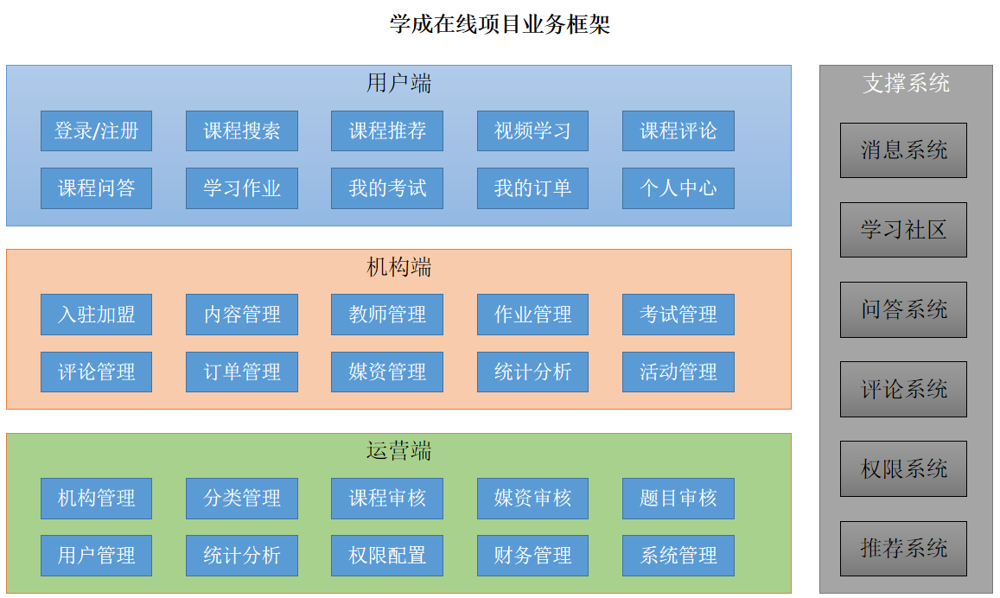
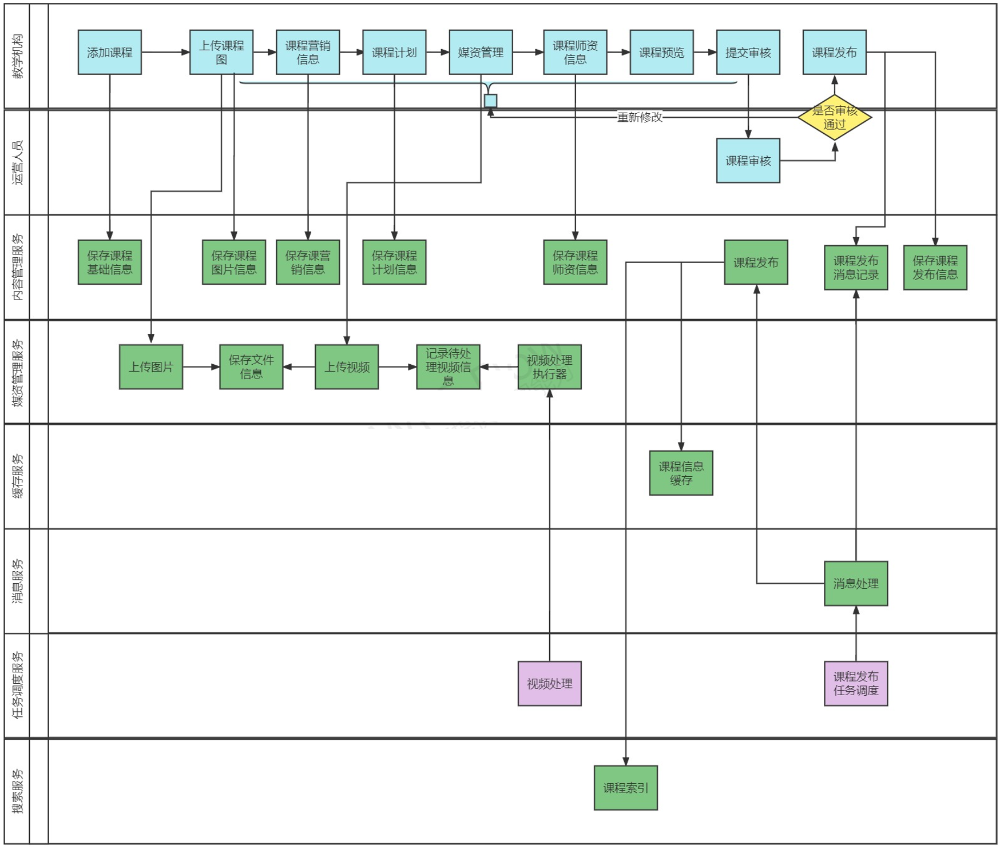
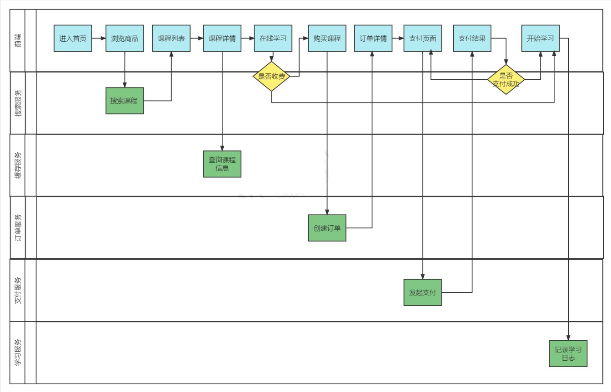
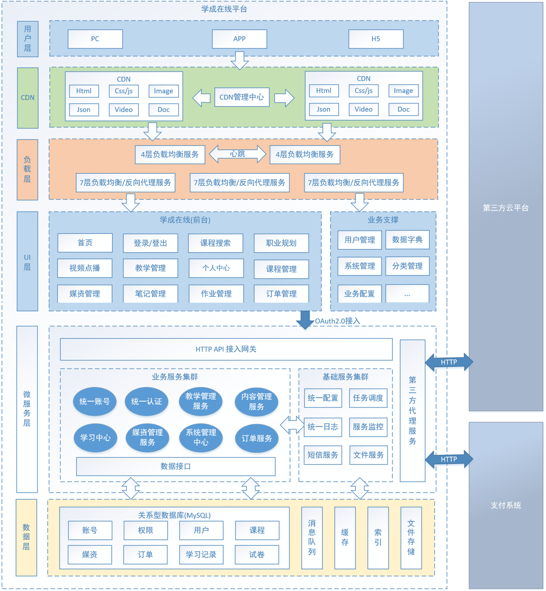
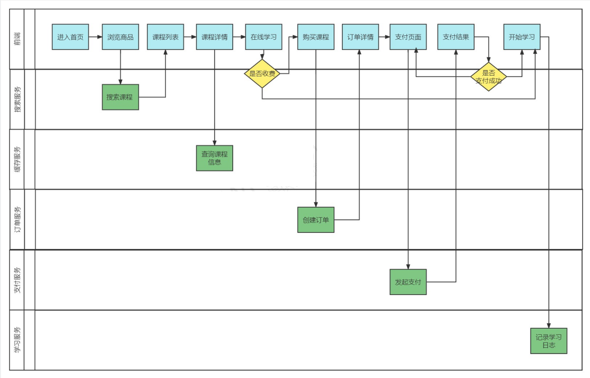
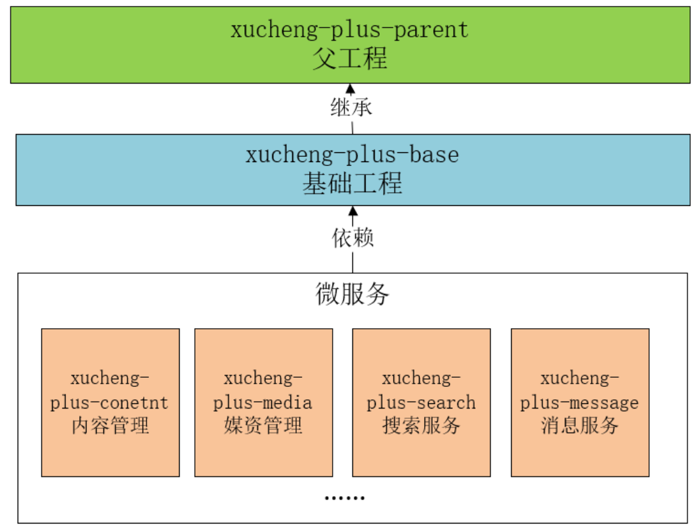
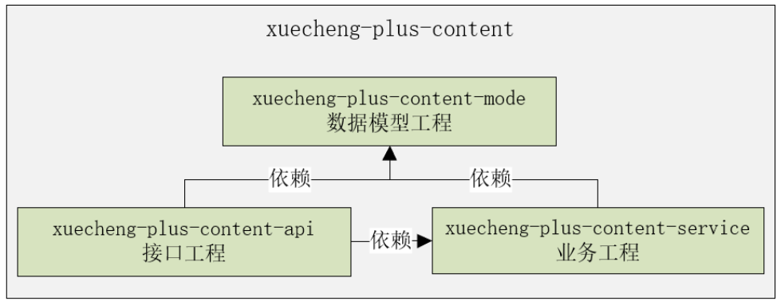
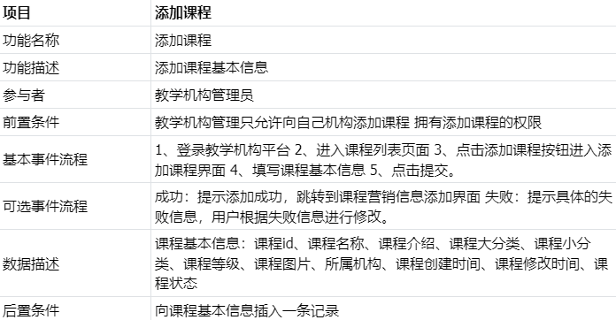

# 项目背景

软件总体分为两类:系统软件和应用软件,应用软件包括:运营类、管理类、工具类等,运营类的项目由运营商按照企业的商业模式去运营,比如:外卖项目、滴滴打车、在线教育等;管理类的项目是为某个组织完成某业务的数据及业务管理,比如:医院MIS(管理信息系统--Management Information System)系统,ERP系统(ERP全称是Enterprise Resource Planning,其中文名字为企业资源计划,这个系统是针对物资资源管理,人力资源管理,财务资源管理,信息资源管理集成一体化的一个企业管理系统)等;工具类的项目是为了某个领域完成具体的需求,比如:数据采集系统、文件处理系统等

学成在线项目属于运营类的项目,运营类项目的研发可能是自研也可能是外包

自研是由运营商成立软件研发部门自己进行软件研发,运营商即是甲方也是乙方

外包则是由运营商外包给第三方软件公司进行研发,运营商是甲方,软件公司是乙方

学成在线项目是本公司自研的一个专门针对成人职业技能教育的网络课堂系统,网站提供了成人职业技能培训的相关课程,如:软件开发培训、职业资格证书培训、成人学历教育培训等课程

项目基于B2B2C的业务模式

培训机构可以在平台入驻、发布课程

运营人员对发布的课程进行审核,审核通过后课程才可以发布成功

课程包括免费和收费两种形式,对于免费课程可以直接选课学习,对于收费课程在选课后需要支付成功才可以继续学习

## B2B2C

B2B2C是一种电子商务类型的网络购物商业模式,B是Business的简称,C是Consumer的简称,第一个B指的是商品或服务的供应商,第二个B指的是从事电子商务的企业,C则是表示消费者

B2B的定义:企业跟企业之间的电子商务运作方式

B2C的定义:企业跟消费者之间的电子商务运作方式

# 项目介绍

## 项目业务介绍

本项目包括了用户端、机构端、运营端

核心模块包括:内容管理、媒资管理、课程搜索、订单支付、选课管理、认证授权等

功能模块图:

课程编辑与发布流程:

课程发布后学生登录平台进行选课、在线学习

免费课程可直接学习,收费课程需要下单购买

学生选课流程:

## 项目技术架构

本项目采用前后端分离架构,后端采用SpringBoot、SpringCloud技术栈开发,数据库使用了MySQL,还使用的Redis、消息队列、分布式文件系统、Elasticsearch等中间件系统

划分的微服务包括:内容管理服务、媒资管理服务、搜索服务、订单支付服务、 学习中心服务、系统管理服务、认证授权服务、网关服务、注册中心服务、配置中心服务等

技术架构图:

各层职责说明:

- 用户层
    用户层描述了本系统所支持的用户类型包括:pc用户、app用户、h5用户
    pc用户通过浏览器访问系统、app用户通过android、ios手机访问系统,H5用户通过h5页面访问系统

- CDN	
    CDN全称Content Delivery Network,即内容分发网络,本系统所有静态资源全部通过CDN加速来提高访问速度
    系统静态资源包括:html页面、js文件、css文件、image图片、pdf和ppt及doc教学文档、video视频等

- 负载均衡
    系统的CDN层、UI层、服务层及数据层均设置了负载均衡服务,上图仅在UI层前边标注了负载均衡
    每一层的负载均衡会根据系统的需求来确定负载均衡器的类型,系统支持4层负载均衡+7层负载均衡结合的方式,4层负载均衡是指在网络传输层进行流程转发,根据IP和端口进行转发,7层负载均衡完成HTTP协议负载均衡及反向代理的功能,根据url进行请求转发

- UI层
    UI层描述了系统向pc用户、app用户、h5用户提供的产品界面
    根据系统功能模块特点确定了UI层包括如下产品界面类型:
    1.面向pc用户的门户系统、学习中心系统、教学管理系统、系统管理中心
    2.面向h5用户的门户系统、学习中心系统
    3.面向app用户的门户系统、学习中心系统

- 微服务层
    微服务层将系统服务分类三类:业务服务、基础服务、第三方代理服务
    业务服务:主要为学成在线核心业务提供服务,并与数据层进行交互获得数据
    基础服务:主要管理学成在线系统运行所需的配置、日志、任务调度、短信等系统级别的服务
    第三方代理服务:系统接入第三方服务完成业务的对接,例如认证、支付、视频点播/直播、用户认证和授权

- 数据层
    数据层描述了系统的数据存储的内容类型
    关系性数据库:持久化的业务数据使用MySQL
    消息队列:存储系统服务间通信的消息,本身提供消息存取服务,与微服务层的系统服务连接
    索引库:存储课程信息的索引信息,本身提供索引维护及搜索的服务,与微服务层的系统服务连接
    缓存:作为系统的缓存服务,作为微服务的缓存数据便于查询
    文件存储:提供系统静态资源文件的分布式存储服务,文件存储服务器作为CDN服务器的数据来源,CDN上的静态资源将最终在文件存储服务器上保存多份

## 核心业务流程

本项目主要包括三类用户角色:学生、教学机构的老师、平台运营人员

核心业务流程包括课程发布流程、选课学习流程

### 课程发布流程

课程发布流程:
1. 教学机构的老师登录教学管理平台,编辑课程信息,发布自己的课程
2. 平台运营人员登录运营平台审核课程、视频等信息,审核通过后课程方可发布

课程发布流程图:

### 学生选课流程

课程发布后学生登录平台进行选课、在线学习

免费课程可直接学习,收费课程需要下单购买

选课学习流程图:

# 模块工程结构

# 模块需求分析

需求分析也称为软件需求分析、系统需求分析或需求分析工程等,是开发人员经过深入细致的调研和分析,准确理解用户和项目的功能、性能、可靠性等具体要求,将用户非形式的需求表述转化为完整的需求定义,从而确定系统必须做什么的过程

简单理解就是要搞清楚问题域,问题域就是用户的需求,软件要为用户解决什么问题,实现哪些业务功能,满足什么样的性能要求

1. **第一:首先确认用户需求**

用户需求即用户的原始需求

通过用户访谈、问卷调查、开会讨论、查阅资料等调研手段梳理用户的原始需求

产品人员根据用户需求会绘制界面原型,通过界面原型再和用户确认需求

2. **第二:确认关键问题**

用户的原始需求可能是含糊不清的,需求分析要从繁杂的问题中梳理出关键问题

比如:教学机构的老师想要将课程发布到网上,这是原始需求,根据这个用户需求需要进行扩展分析,扩展出几下几点:

1）课程发布需要发布哪些信息
2）如果发布了不良信息怎么办?
3）课程发布后用户怎么查看课程?

根据以上几点继续延伸性分析:

1）课程发布需要发布哪些信息

课程名称、课程介绍、课程价格、课程图片、师资等信息

继续延伸分析:

这么多课程信息进行归类,方便用户编辑,分为课程基本信息、课程营销信息、课程师资等信息

按照这样的思路对用户需求逐项分析,梳理出若干问题,再从中找到关键问题

比如:上边对课程信息分类后,哪些是关键信息,课程名称、课程图片、课程介绍等基本信息为关键信息,所以发布课程的第一步要编写课程基本信息

找到了关键问题,下一步就可以进行数据建模,创建课程基本信息表,并设计其中的字段

3. **第三:梳理业务流程**

业务流程是由一个或多个用户参与完成为了完成一个目标所进行的一系列的业务操作,不论是整个系统还是一个模块通常首先分析核心的业务流程

比如:内容管理模块的核心业务流程是课程发布,本项目的核心业务流程是学生选课学习流程

4. **第四:数据建模**

数据建模要根据分析的关键问题将其相关的信息全部建模

比如:根据发布课程的用户需求,可创建课程基本信息表、课程营销信息表、课程师资表、课程发布记录表、课程审核记录表等

5. **第五:编写需求规格说明书**

需求分析阶段的成果物是需求分析规格说明书,针对每一个问题编写需求用例,需求用例包括:功能名称、功能描述、参与者、基本事件流程、可选事件流、数据描述、前置条件、后置条件等内容

比如:添加课程的需求用例如下:

