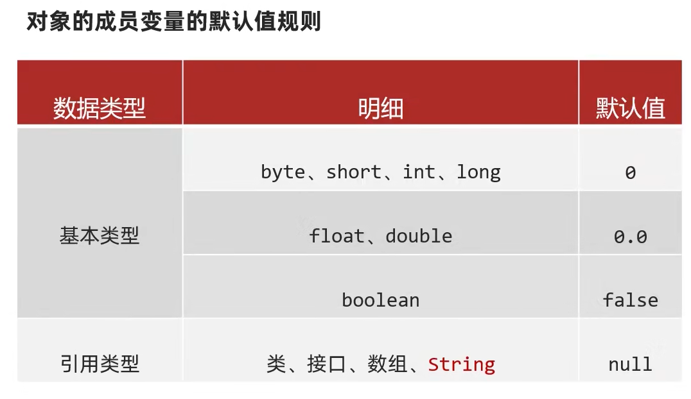

# 设计对象并使用

## 类和对象

类(设计图): 是对象共有特征的描述   

对象: 真实存在的具体东西  

**在Java中必须先设计类,才能获得对象**   

1. 如何定义类   

范例: 

```java
public class 类名{
    1.成员变量(代表属性,一般是名词)
    2.成员方法(代表行为,一般是动词)
    3.构造器
    4.代码块
    5.内部类
}
```

范例: 

```java
public class Phone {
    // 属性(成员变量)
    String brand;
    double price;
    // 行为(方法)
    public void call(){
        System.out.println("手机打电话!");
    }

    public static void playGame() {
        System.out.println("手机打游戏!");
    }
}
```

2. 如何得到类的对象: `类名 对象名 = new 类名();`   
范例: `Phone p = new Phone();`   

3. 如何使用对象  
访问属性: `对象名.成员变量`   
访问行为: `对象名.成员方法(...)`   

```java
public class test {
    public static void main(String[] args) {
        Phone p1 = new Phone();
        // 给手机赋值
        p1.brand = "Apple";
        p1.price = 8888.88;
        // 获取手机对象中的值
        System.out.println(p1.brand);
        System.out.println(p1.price);
        // 调用手机中的方法
        p1.call();
        p1.playGame();
        Phone p2 = new Phone();
        // 给手机赋值
        p2.brand = "华为";
        p2.price = 6666.66;
        // 获取手机对象中的值
        System.out.println(p2.brand);
        System.out.println(p2.price);
        // 调用手机中的方法
        p2.call();
        p2.playGame();
    }
}
```

## JavaBean类

用来描述一类事物的类,专业叫做JavaBean类  
在`JavaBean类`中,是不写main方法的  
例如: Student、`Teacher`、Dog等  

## 测试类

用来检查其他类是否书写正确,带有main方法的类,叫做测试类,是程序的入口  
可以在测试类中创建`JavaBean类`的对象并进行赋值调用  
 
## 工具类

帮助我们做一些事情的,但是不描述任何事物的类,叫做工具类  

注意事项:   
1. **类名要见名知意**   
2. **私有化构造方法(目的: 不让外界创造其对象,因为创建其对象无实际的意义)**  
3. **方法定义为静态**   

范例: 

```java
public class ArrUtil{
    private ArrUtil(){
        public static int getMax(...){...}
        public static int getMin(...){...}
        public static int getSum(...){...}
        public static int getAvg(...){...}
    }
}
```

## 注意事项
 
1. 类名的首字母建议大写,需要见名知意,驼峰模式,不能用关键字,满足标识符规定  
2. 一个Java文件中可以定义多个class类,且只能一个类是public修饰,而且public修饰的类名必须成为代码文件名  
**实际开发中建议: 一个文件定义一个class类**   
3. 成员变量的完整定义格式是: `修饰符 数据类型 变量名称 = 初始化值;`   
一般无需指定初始化值,存在默认值   



练习: 

编写女朋友类

```java
public class GirlFriend {
    String name;
    double weight;
    double height;

    public void eat() {
        System.out.println("吃饭");
    }

    public void sleep() {
        System.out.println("睡觉");
    }

    public void shop() {
        System.out.println("逛街");
    }
}
```

练习: 

定义项目经理类`Manager`  
属性: 姓名name 工号id 工资salary 奖金bonus   
行为: 工作work()    

定义程序员类`Coder`  
属性: 姓名name 工号id 工资salary   
行为: 工作work()  

要求：
1. 按照以上要求定义`Manager`类和`Coder`类,属性要私有,生成空参、有参构造，set和get方法  
2. 定义测试类,在main方法中创建该类的对象并给属性赋值(set方法或有参构造方法)  
3. 调用成员方法,打印格式如下: 		  

```
工号为123基本工资为15000奖金为6000的项目经理张三正在努力的做着管理工作,分配任务,检查员工提交上来的代码.....
工号为135基本工资为10000的程序员李四正在努力的写着代码......
```

```java
public class Manager {
    private String name;
    private int id;
    private int salary;
    private int bonus;


    public Manager() {
    }

    public Manager(String name,int id,int salary,int bonus) {
        this.name = name;
        this.id = id;
        this.salary = salary;
        this.bonus = bonus;
    }

    public String getName() {
        return name;
    }

    public void setName(String name) {
        this.name = name;
    }

    public int getId() {
        return id;
    }

    public void setId(int id) {
        this.id = id;
    }

    public int getSalary() {
        return salary;
    }

    public void setSalary(int salary) {
        this.salary = salary;
    }

    public int getBonus() {
        return bonus;
    }

    public void setBonus(int bonus) {
        this.bonus = bonus;
    }

    public void work() {
        System.out.println("工号为" + id + "基本工资为" + salary + "奖金为" + bonus + "的项目经理"+name+"正在努力的做着管理工作,分配任务,检查员工提交上来的代码.....");
    }
}
```

```java
public class Coder {
    private String name;
    private int id;
    private int salary;


    public Coder() {
    }

    public Coder(String name,int id,int salary) {
        this.name = name;
        this.id = id;
        this.salary = salary;
    }

    public String getName() {
        return name;
    }

    public void setName(String name) {
        this.name = name;
    }

    public int getId() {
        return id;
    }

    public void setId(int id) {
        this.id = id;
    }

    public int getSalary() {
        return salary;
    }

    public void setSalary(int salary) {
        this.salary = salary;
    }

    public void work() {
        System.out.println("工号为" + id + "基本工资为" + salary + "的程序员"+name+"正在努力的写着代码......");
    }
}
```

```java
public class test {
    public static void main(String[] args) {
        Manager manager = new Manager("张三",123,15000,6000);
        Coder coder = new Coder("李四",135,10000);
        manager.work();
        coder.work();
    }
}
```

练习: 

定义猫类`Cat`  
属性: 毛的颜色color 品种breed   
行为: 吃饭eat() 抓老鼠catchMouse()  

定义狗类Dog   
属性: 毛的颜色color 品种breed   
行为: 吃饭eat() 看家lookHome()  

要求:   
1. 按照以上要求定义Cat类和Dog类,属性要私有,生成空参、有参构造，set和get方法  
2. 定义测试类,在main方法中创建该类的对象并给属性赋值(set方法或有参构造方法)  
3. 调用成员方法,打印格式如下:   

```
花色的波斯猫正在吃鱼.....
花色的波斯猫正在逮老鼠....
黑色的藏獒正在啃骨头.....
黑色的藏獒正在看家.....
```

```java
public class Cat {
    private String color;
    private String breed;

    public Cat() {
    }

    public Cat(String color,String breed) {
        this.color = color;
        this.breed = breed;
    }

    public String getColor() {
        return color;
    }

    public void setColor(String color) {
        this.color = color;
    }

    public String getBreed() {
        return breed;
    }

    public void setBreed(String breed) {
        this.breed = breed;
    }

    public void eat() {
        System.out.println(color + "色的" + breed + "正在吃鱼.....");
    }

    public void catchMouse() {
        System.out.println(color + "色的" + breed + "正在逮老鼠....");
    }
}
```

```java
public class Dog {
    private String color;
    private String breed;

    public Dog() {
    }

    public Dog(String color,String breed) {
        this.color = color;
        this.breed = breed;
    }

    public String getColor() {
        return color;
    }

    public void setColor(String color) {
        this.color = color;
    }

    public String getBreed() {
        return breed;
    }

    public void setBreed(String breed) {
        this.breed = breed;
    }

    public void eat() {
        System.out.println(color + "色的" + breed + "正在啃骨头.....");
    }

    public void lookHome() {
        System.out.println(color + "色的" + breed + "正在看家.....");
    }
}
```

```java
public class test {
    public static void main(String[] args) {
        Cat cat = new Cat("花色","波斯猫");
        Dog dog = new Dog("黑色","藏獒");  
        cat.eat();
        cat.catchMouse();
        dog.eat();
        dog.lookHome();
    }
}
```

# 封装

**面向对象的三大特征: 封装、继承、多态**  
封装: 如何正确设计对象的属性和方法  
原则: **对象代表什么,就得封装对应的数据,并提供数据对应的行为**  

范例: 人画圆  
对象: 圆  
对应数据: 圆的半径  
行为: 画圆  
因此画圆这个方法应该定义在圆这个对象里面  

```java
public class Circle {
    double radius;
    public void draw() {
        System.out.println("根据半径" + radius + "画一个圆");
    }
}
```

范例: 人关门  
对象: 门  
对应数据: 门的状态(开/关)  
行为: 关门  
因此关门这个方法应该定义在门这个对象里面  
 
```java
public class Door {
    boolean flag= true;
    public void open(){

    }
    public void close(){

    }
}
```

## 封装思想的应用
 
可以把一些零散的数据封装成一个对象  
传递参数的时候,只需要传递一个整体就可以了,不用管零散的数据   

范例: 

```java
public class User {
    private String username;
    private String password;
    private String identity;
    private String phone;

    public User() {
    }

    public User(String username,String password,String identity,String phone) {
        this.username = username;
        this.password = password;
        this.identity = identity;
        this.phone = phone;
    }

    public String getUsername() {
        return username;
    }

    public void setUsername(String username) {
        this.username = username;
    }

    public String getPassword() {
        return password;
    }

    public void setPassword(String password) {
        this.password = password;
    }

    public String getIdentity() {
        return identity;
    }

    public void setIdentity(String identity) {
        this.identity = identity;
    }

    public String getPhone() {
        return phone;
    }

    public void setPhone(String phone) {
        this.phone = phone;
    }
}
```

```java
public class test {
    public static void main(String[] args) {
        User userInformation = new User("张三123","123",null,null);
        userPrint(userInformation);
    }

    public static void userPrint(User userInformation) {
        // 打印结果:"用户名为: 张三123,密码为: 123"
        System.out.println("用户名为: " + userInformation.getUsername() + ",密码为: " + userInformation.getPassword());
    }
}
```

## private关键字

private是一个权限修饰符,可以修饰成员(成员变量和成员方法)  

被private修饰的成员只能在本类中才能访问  

针对private修饰的成员变量,如果需要被其他类使用,提供相应的操作  
提供`set(参数)方法`: 给成员变量赋值,方法用public修饰  
提供`get()方法`: 对外提供成员变量的值,方法用public修饰  

练习: 

女朋友

```java
public class GirlFriend {
    private String name;
    private int age;

    private String gender;

    public void setName(String n) {
        name = n;
    }

    public String getName() {
        return name;
    }

    public void setAge(int a) {
        if (a >= 18 && a <= 30) {
            age = a;
        } else {
            System.out.println("年龄输入不合法!");
        }
    }

    public int getAge() {
        return age;
    }

    public void setGender(String g) {
        gender = g;
    }

    public String getGender() {
        return gender;
    }
}
```

```java
public class test {
    public static void main(String[] args) {
        GirlFriend gf = new GirlFriend();
        gf.setName("lucky");
        gf.setAge(18);
        gf.setGender("女");
        System.out.println(gf.getName());
        System.out.println(gf.getAge());
        System.out.println(gf.getGender());
    }
}
```

# 就近原则和this关键字

成员变量: 定义在方法外面的变量  
局部变量: 定义在方法里面的变量  

成员变量和局部变量同名时:   
1. 被调用时,采用**就近原则**  
2. 如果想要调用成员变量,需写成`this.成员变量`  

**this的作用: 区别成员变量和局部变量**  

范例: 

```java
public class GirlFriend {
    // 成员变量age默认为0
    private int age;

    public void method() {
        // 局部变量age为10
        int age = 10;
        // 就近原则,调用局部变量
        System.out.println(age);
        // this.成员变量,调用成员变量
        System.out.println(this.age);
    }
}
```

```java
public class GirlFriend {
    public class GirlFriend {
        private String name;
        private int age;

        private String gender;

        public void setName(String name) {
            // 局部变量name表示测试类中调用方法传递过来的数据
            // this.name为成员变量,将传递过来的数据赋值给成员变量
            this.name = name;
        }

        public String getName() {
            return this.name;
        }

        public void setAge(int age) {
            if (age >= 18 && age <= 30) {
                this.age = age;
            } else {
                System.out.println("年龄输入不合法!");
            }
        }

        public int getAge() {
            return this.age;
        }

        public void setGender(String gender) {
            this.gender = gender;
        }

        public String getGender() {
            return this.gender;
        }
    }
}
```

# 构造方法

构造方法也叫做构造器、构造函数  

作用: 在创建对象的时候,**由虚拟机自动调用构造方法**,给成员变量进行初始化的(赋值)  

格式:   

```java
public class 类名{
        修饰符 方法名(参数){
            方法体;
    }
}
```

特点:   
1. 方法名和类名相同,大小写也要一致  
2. 没有返回值类型,连`void`都没有  
3. 没有具体的返回值(不能由`return`带回结果数据)  

执行时机:   
1. 创建对象的时候,**由虚拟机自动调用构造方法**,不能手动调用构造方法  
2. 每创建一次对象,就会调用一次构造方法  

**无参数构造方法**: 初始化对象时,成员变量的数据均采用默认值  

范例: 

```java
public class GirlFriend {
    public GirlFriend(){
        System.out.println("我是无参构造"); 
    }
}
```

```java
public class test {
    public static void main(String[] args) {
        GirlFriend gf = new GirlFriend();
    }
}
```

**有参数构造方法**: 初始化对象时,同时为对象进行赋值

范例: 

```java
public class GirlFriend {
    private String name;
    private int age;

    // 带参构造,免去调用set(参数)方法
    public GirlFriend(String name,int age) {
        this.name = name;
        this.age = age;
    }

    public String getName() {
        return name;
    }

    public void setName(String name) {
        this.name = name;
    }

    public int getAge() {
        return age;
    }

    public void setAge(int age) {
        this.age = age;
    }
}
```

```java
public class test {
    public static void main(String[] args) {
        GirlFriend gf = new GirlFriend("张三",18);
        System.out.println(gf.getName());
        System.out.println(gf.getAge());
    }
}
```

注意事项:   
1. **构造方法的定义**  
如果没有定义构造方法,系统将给出一个**默认的无参数构造方法(空参构造)**  
如果定义了构造方法,系统将不再提供默认的构造方法  
2. **构造方法的重载**  
带参构造方法和无参构造方法,两者方法名相同,但是参数不同,这叫做构造方法的重载  
3. **推荐的使用方式**  
**无论是否使用,都手动书写无参构造方法,以及带全部参数的构造方法**  

# 标准JavaBean
 
1. 类名需要见名知意  
2. 成员变量使用private修饰,即私有化成员变量  
3. 提供至少两个构造方法  
a.无参构造方法   
b.带全部参数的构造方法    
4. 成员方法   
提供每一个成员变量对应的`set(参数)方法`/`get()方法`  
如果还有其他行为,也需要写上  

练习: 

注册界面

```java
public class user {
    private String username;
    private String password;
    private String email;
    private String gender;
    private int age;


    public user() {
    }

    public user(String username,String password,String email,String gender,int age) {
        this.username = username;
        this.password = password;
        this.email = email;
        this.gender = gender;
        this.age = age;
    }

    public String getUsername() {
        return username;
    }

    public void setUsername(String username) {
        this.username = username;
    }

    public String getPassword() {
        return password;
    }

    public void setPassword(String password) {
        this.password = password;
    }

    public String getEmail() {
        return email;
    }

    public void setEmail(String email) {
        this.email = email;
    }

    public String getGender() {
        return gender;
    }

    public void setGender(String gender) {
        this.gender = gender;
    }

    public int getAge() {
        return age;
    }

    public void setAge(int age) {
        this.age = age;
    }
}
```

**快速生成JavaBean**

1. 快捷键 `alt + insert`     
选择构造函数、Getter和Setter                              

2. 安装IDEA插件: ptg     
右键点击Ptg To JavaBean     