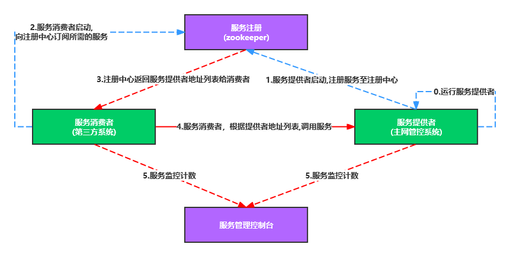

#### 一、什么是dubbo

dubbo是SOA时期的产物，它的关注点主要在于服务的调用和治理。



#### 二、dubbo的使用

##### 1、引入依赖

* 父工程引入依赖

  

  ```
  	<!-- Dubbo -->
  		<dependency>
  			<groupId>org.apache.dubbo</groupId>
  			<artifactId>dubbo-bom</artifactId>
  			<version>${dubbo.version}</version>
  			<type>pom</type>
  			<scope>import</scope>
  		</dependency>
  
  		<dependency>
  			<groupId>org.apache.dubbo</groupId>
  			<artifactId>dubbo-dependencies-zookeeper-curator5</artifactId>
  			<version>${dubbo.version}</version>
  			<type>pom</type>
  		</dependency>
  ```

  

* 各个子模块引入依赖

  ```
    <!-- dubbo -->
          <dependency>
              <groupId>org.apache.dubbo</groupId>
              <artifactId>dubbo-spring-boot-starter</artifactId>
              <version>3.0.9</version>
          </dependency>
          <dependency>
              <groupId>org.apache.dubbo</groupId>
              <artifactId>dubbo-dependencies-zookeeper-curator5</artifactId>
              <type>pom</type>
              <exclusions>
                  <exclusion>
                      <artifactId>slf4j-reload4j</artifactId>
                      <groupId>org.slf4j</groupId>
                  </exclusion>
              </exclusions>
              <version>3.0.9</version>
          </dependency>
  ```

  

##### 2、服务提供者

* 启动类添加注解@EnableDubbo

```java
@SpringBootApplication
@EnableDubbo
public class ProviderApp {
    public static void main(String[] args) {
        SpringApplication.run(ProviderApp.class, args);
        System.out.println("Hello World!");
    }
}

```

* 服务类添加注解@DubboService

```java

@DubboService
public class TestDubboServiceImpl implements TestDubboService {
    @Override
    public String sayHello(String name) {
        return "hello," + name;
    }

    @Override
    public ZhuoYe getZuoYe() {
        ZhuoYe zuoYe = new ZhuoYe();
        zuoYe.setName("zhuoye-1")
                .setDescription("帅呆了！！！");
        return zuoYe;
    }
}
```

* 配置文件配置dubbo的信息

```java
dubbo:
  application:
    name: dubbo-springboot-demo-provider
  protocol:
    name: dubbo
    port: -1
  registry:
    address: zookeeper://192.168.190.129:2181
    timeout: 60000
```

##### 3、服务的消费者

* 启动类添加注解@EnableDubbo

```java
@SpringBootApplication
@EnableDubbo
public class ProviderApp {
    public static void main(String[] args) {
        SpringApplication.run(ProviderApp.class, args);
        System.out.println("Hello World!");
    }
}
```


* 接口层通过注解@DubboReference将远程服务注入

  

```java
@RestController
@RequestMapping("dubbo")
public class TestDubboController {

    @DubboReference
    private TestDubboService testDubboService;

    @GetMapping("hello")
    public String hello(String name) {
        return testDubboService.sayHello(name);
    }

    @GetMapping("getZhuoye")
    public ZhuoYe getZhuoye() {
        return testDubboService.getZuoYe();
    }
}
```

* 配置文件配置dubbo的信息

```java
dubbo:
  application:
    name: dubbo-springboot-demo-comsumer
  protocol:
    name: dubbo
    port: -1
  registry:
    address: zookeeper://192.168.190.129:2181
    timeout: 60000
```

