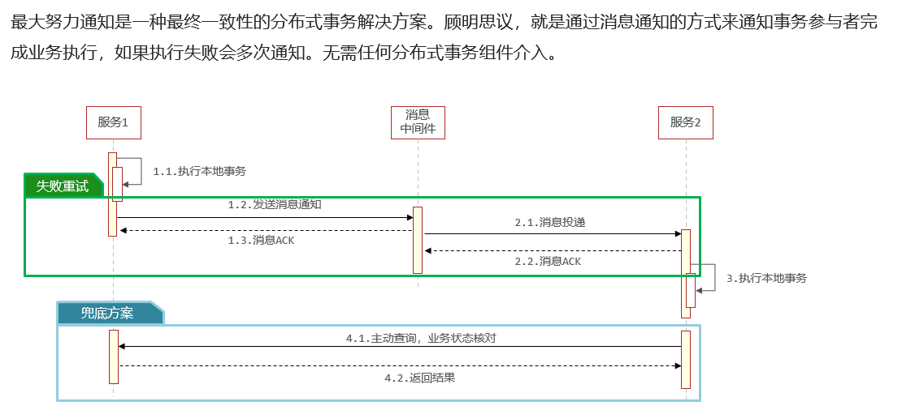

##### 一、什么是分布式事务？

虽然叫分布式事务，但不是一定是分布式部署的服务之间才会产生分布式事务。不是在同一个服务或同一个数据库架构下，产生的事务，也就是分布式事务。

* 跨数据源的分布式事务

* 跨服务的分布式事务

  
  
  

##### 二、解决方案

###### 1、使用阿里开源的Seata框架解决分布式事务

​    1）seata的架构

​    Seata事务管理中有三个重要的角色：

- **TC (Transaction Coordinator) -** **事务协调者：**维护全局和分支事务的状态，协调全局事务提交或回滚。

- **TM (Transaction Manager) -** **事务管理器：**定义全局事务的范围、开始全局事务、提交或回滚全局事务。

- **RM (Resource Manager) -** **资源管理器：**管理分支事务处理的资源，与TC交谈以注册分支事务和报告分支事务的状态，并驱动分支事务提交或回滚。


 2）部署TC服务以及在微服务中引入Seata

​        可以看我CSDN博客上面的博文  [Docker快速部署Seata的TC服务以及微服务引入Seata教程-CSDN博客](https://blog.csdn.net/weixin_50348837/article/details/139013263)

3）Seata的常用模式使用

   * XA模式

     在一阶段各个本地事务执行完成后，不提交，把执行状态给事务协调者TC,此时本地事务继续持有数据库锁

     二阶段TC基于一阶段的报告来进行判断，如果一阶段均成功则通知所有的事务参与者，提交事务，如果一阶段任意一个参与者失败，则通知所有事务参与者回滚事务。

     优点：能够实现强一致性，满足ACID原则；实现简单

     缺点：性能较差；依赖数据库的事务

     I. 在application.yml文件中开启XA模式(所有参与事务的服务都需要设置)：

        

     ```
     seata:
       data-source-proxy-mode: XA  
     ```

     II. 在全局事务的入口方法添加@GlobalTransactional注解

     ```java
     
         @Override
         @GlobalTransactional
         public Long create(Order order) {
             // 创建订单
             orderMapper.insert(order);
             try {
                 // 扣用户余额
                 accountClient.deduct(order.getUserId(), order.getMoney());
                 // 扣库存
                 storageClient.deduct(order.getCommodityCode(), order.getCount());
             } catch (FeignException e) {
                 log.error("下单失败，原因:{}", e.contentUTF8(), e);
                 throw new RuntimeException(e.contentUTF8(), e);
             }
             return order.getId();
         }
     ```

   * AT模式

     和xa模式一样也是二阶段提交，不同的是AT模式本地事务结束后，直接提交。但是，它会在本地事务进行数据库数据更新的时候记录一下更新前后的快照。

​       在二阶段需要回滚的时候，根据快照进行数据的恢复，如果二阶段全局事务提交，则把记录的快照删除。

​    优点：性能好；实现也较为简单

​    缺点： 存在中间状态，只能达到最终的一致性；快照功能会影响一些性能，但是相对于XA模式还是要好很多

   I. 在application.yml文件中开启AT模式(所有参与事务的服务都需要设置)：

```java 
seata:
  data-source-proxy-mode: AT # 默认就是AT
```

II. 创建相关数据库表

```Java
#在分支事务所在的库里创建记录快照的表undo_log
DROP TABLE IF EXISTS `undo_log`;
CREATE TABLE `undo_log`  (
  `branch_id` bigint(20) NOT NULL COMMENT 'branch transaction id',
  `xid` varchar(100) CHARACTER SET utf8 COLLATE utf8_general_ci NOT NULL COMMENT 'global transaction id',
  `context` varchar(128) CHARACTER SET utf8 COLLATE utf8_general_ci NOT NULL COMMENT 'undo_log context,such as serialization',
  `rollback_info` longblob NOT NULL COMMENT 'rollback info',
  `log_status` int(11) NOT NULL COMMENT '0:normal status,1:defense status',
  `log_created` datetime(6) NOT NULL COMMENT 'create datetime',
  `log_modified` datetime(6) NOT NULL COMMENT 'modify datetime',
  UNIQUE INDEX `ux_undo_log`(`xid`, `branch_id`) USING BTREE
) ENGINE = InnoDB CHARACTER SET = utf8 COLLATE = utf8_general_ci COMMENT = 'AT transaction mode undo table' ROW_FORMAT = Compact;

#在TC服务所使用的库里创建全局锁记录表lock_table
DROP TABLE IF EXISTS `lock_table`;
CREATE TABLE `lock_table`  (
  `row_key` varchar(128) CHARACTER SET utf8 COLLATE utf8_general_ci NOT NULL,
  `xid` varchar(96) CHARACTER SET utf8 COLLATE utf8_general_ci NULL DEFAULT NULL,
  `transaction_id` bigint(20) NULL DEFAULT NULL,
  `branch_id` bigint(20) NOT NULL,
  `resource_id` varchar(256) CHARACTER SET utf8 COLLATE utf8_general_ci NULL DEFAULT NULL,
  `table_name` varchar(32) CHARACTER SET utf8 COLLATE utf8_general_ci NULL DEFAULT NULL,
  `pk` varchar(36) CHARACTER SET utf8 COLLATE utf8_general_ci NULL DEFAULT NULL,
  `gmt_create` datetime NULL DEFAULT NULL,
  `gmt_modified` datetime NULL DEFAULT NULL,
  PRIMARY KEY (`row_key`) USING BTREE,
  INDEX `idx_branch_id`(`branch_id`) USING BTREE
) ENGINE = InnoDB CHARACTER SET = utf8 COLLATE = utf8_general_ci ROW_FORMAT = Compact;
```

III.  在全局事务的入口方法添加@GlobalTransactional注解

```java
    @Override
    @GlobalTransactional
    public Long create(Order order) {
        // 创建订单
        orderMapper.insert(order);
        try {
            // 扣用户余额
            accountClient.deduct(order.getUserId(), order.getMoney());
            // 扣库存
            storageClient.deduct(order.getCommodityCode(), order.getCount());
        } catch (FeignException e) {
            log.error("下单失败，原因:{}", e.contentUTF8(), e);
            throw new RuntimeException(e.contentUTF8(), e);
        }
        return order.getId();
    }
```


###### 2、使用RocketMQ实现可靠消息最终一致性方案

​     

​     

模拟转账  a银行向b银行转账

a银行业务代码：

减少金额，像mq发送事务消息

 1) 引入rocketmq依赖

```Java
<dependency>
   <groupId>org.apache.rocketmq</groupId>
   <artifactId>rocketmq‐spring‐boot‐starter</artifactId>
   <version>2.0.2</version>
</dependency>
```

2）配置rocketmq

```java
rocketmq.producer.group = zhuoye #设置生产者组的名称
rocketmq.name‐server = 127.0.0.1:9876  #指定rocketmq的地址
```

3） 业务层代码

```Java
@Service
@Slf4j
public class UserAccountServiceImpl implements UserAccountService {

   @Autowired
   private UserAccountMapper userAccountMapper;

   @Autowired
   private  RocketMQTemplate rocketMQTemplate;
    
   @Autowired
   private TansactionalRecordMapper tansactionalRecordMapper;


    //向mq发送转账消息
    @Override
    public void sendTransferAccountsMessagesToMq(AccountChangeEvent accountChangeEvent) {

        //将accountChangeEvent转成json
        JSONObject jsonObject =new JSONObject();
        jsonObject.put("transferAccountInfo",accountChangeEvent);
        String jsonString = jsonObject.toJSONString();
        //生成message类型
        Message<String> message = MessageBuilder.withPayload(jsonString).build();
        //发送一条事务消息
        /**
         * String txProducerGroup 生产组
         * String destination topic，
         * Message<?> message, 消息内容
         * Object arg 参数
         */ 
        rocketMQTemplate.sendMessageInTransaction("transferAccount_ABank","topic_transferAccount",message,null);

    }

    //更新账户，扣减金额
    @Override
    @Transactional
    public void doUpdateAccountBalance(AccountChangeEvent accountChangeEvent) {
        //幂等判断
        if(tansactionalRecordMapper.isExist(accountChangeEvent.getTxNo())>0){
            return ;
        }
        //扣减金额
        userAccountMapper.updateAccountBalance(accountChangeEvent.getAccountNo(),accountChangeEvent.getAmount() * -1);
        //添加事务日志
        tansactionalRecordMapper.add(accountChangeEvent.getTxNo());
    }
```

4）编写RocketMQLocalTransactionListener接口实现类

```Java
@Component
@Slf4j
@RocketMQTransactionListener(txProducerGroup = "transferAccount_ABank")
public class ProducerTxmsgListener implements RocketMQLocalTransactionListener {

    @Autowired
    private UserAccountService userAccountService;

   @Autowired
   private UserAccountMapper userAccountMapper;
    
   @Autowired
   private TansactionalRecordMapper tansactionalRecordMapper;

    //事务消息发送后的回调方法，当消息发送给mq成功，此方法被回调
    @Override
    @Transactional
    public RocketMQLocalTransactionState executeLocalTransaction(Message message, Object o) {

        try {
            //解析message，转成AccountChangeEvent
            String messageString = new String((byte[]) message.getPayload());
            JSONObject jsonObject = JSONObject.parseObject(messageString);
            String accountChangeString = jsonObject.getString("transferAccountInfo");
            //将accountChange（json）转成AccountChangeEvent
            AccountChangeEvent accountChangeEvent = JSONObject.parseObject(accountChangeString, AccountChangeEvent.class);
            //执行本地事务，扣减金额
            userAccountService.doUpdateAccountBalance(accountChangeEvent);
            //当返回RocketMQLocalTransactionState.COMMIT，自动向mq发送commit消息，mq将消息的状态改为可消费
            return RocketMQLocalTransactionState.COMMIT;
        } catch (Exception e) {
            e.printStackTrace();
            return RocketMQLocalTransactionState.ROLLBACK;
        }
    }

    //事务状态回查，查询是否扣减金额
    @Override
    public RocketMQLocalTransactionState checkLocalTransaction(Message message) {
        //解析message，转成AccountChangeEvent
        String messageString = new String((byte[]) message.getPayload());
        JSONObject jsonObject = JSONObject.parseObject(messageString);
        String accountChangeString = jsonObject.getString("transferAccountInfo");
        //将accountChange（json）转成AccountChangeEvent
        AccountChangeEvent accountChangeEvent = JSONObject.parseObject(accountChangeString, AccountChangeEvent.class);
        //事务id
        String txNo = accountChangeEvent.getTxNo();
        int isExist = tansactionalRecordMapper.isExist(txNo);
        if(isExist>0){
            return RocketMQLocalTransactionState.COMMIT;
        }else{
            return RocketMQLocalTransactionState.UNKNOWN;
        }
    }
}
```

b银行业务代码(前两步一样)：

接收消息，增加金额

1）业务层代码

```Java
@Service
@Slf4j
public class UserAccountServiceImpl implements UserAccountService {

   @Autowired
   private UserAccountMapper userAccountMapper;
    
   @Autowired
   private TansactionalRecordMapper tansactionalRecordMapper;

    //更新账户，增加金额
    @Override
    @Transactional
    public void addAccountInfoBalance(AccountChangeEvent accountChangeEvent) {
        //已更新
        if(tansactionalRecordMapper.isExist(accountChangeEvent.getTxNo())>0){
            return ;
        }
        //增加金额
        userAccountMapper.updateAccountBalance(accountChangeEvent.getAccountNo(),accountChangeEvent.getAmount());
        //添加事务记录，用于幂等
        tansactionalRecordMapper.add(accountChangeEvent.getTxNo());
    }
}

```

2)监听事务消息

```java
@Component
@Slf4j
@RocketMQMessageListener(consumerGroup = "transferAccount_ABank",topic = "topic_transferAccount",maxReconsumeTimes = 3)
public class TxmsgConsumer implements RocketMQListener<String> {

    @Autowired
    UserAccountService userAccountService;

    //接收消息
    @Override
    public void onMessage(String message) {
        //解析消息
        JSONObject jsonObject = JSONObject.parseObject(message);
        String accountChangeString = jsonObject.getString("transferAccountInfo");
        //转成AccountChangeEvent
        AccountChangeEvent accountChangeEvent = JSONObject.parseObject(accountChangeString, AccountChangeEvent.class);
        //更新本地账户，增加金额
        userAccountService.addAccountInfoBalance(accountChangeEvent);
    }
}

```


###### 3、最大努力通知方案(了解)

 



关键点：一定的消息重复通知机制、消息校对机制。

a银行向b银行转账，转账成功后，a银行需要短信通知用户 

