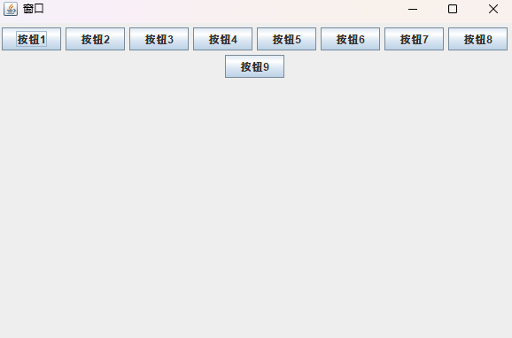
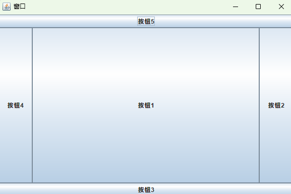
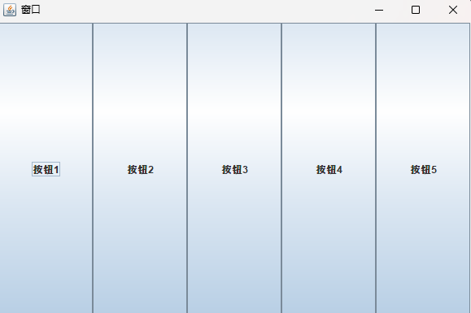
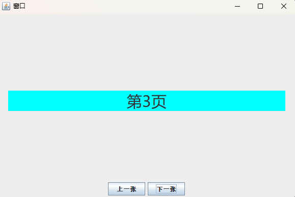
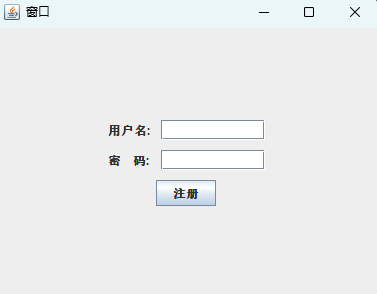
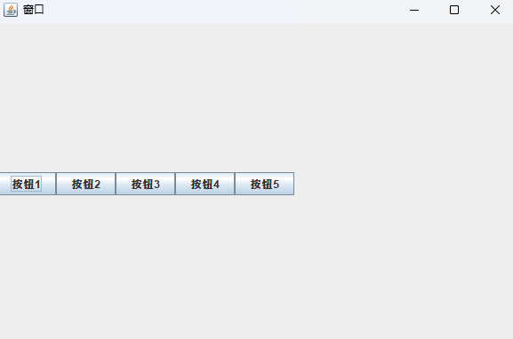

# 布局管理器

为了实现跨平台并获得动态的布局效果,Java将容器内的所有组件安排给一个布局管理器负责管理           
例如排列顺序、组件大小、位置、当窗口移动或调整大小后组件变化等功能授权给对应的容器的布局管理器来管理

`setLayout(LayoutManger manger)`:设置布局管理器

# FlowLayout 流式布局

组件从左到右、从上到下,一个挨一个的放在容器中                    
如果容器足够宽,第一个组件先添加到容器中第一行的最左边,后续的组件依次添加到上一个组件的右边             
如果当前行已放置不下该组件,则放置到下一行的最左边

在Java Swing中,**FlowLayout能被共享**

## 构造方法

- `FlowLayout()`:创建一个新的流布局管理器,它是居中对齐的,默认的水平和垂直间隙是5个单位 
- `FlowLayout(int align)`:创建一个新的流布局管理器,它具有指定的对齐方式,默认的水平和垂直间隙是5个单位
- `FlowLayout(int align, int hgap, int vgap)`:创建一个新的流布局管理器,它具有指定的对齐方式以及指定的水平和垂直间隙 

## 范例 



```java
import javax.swing.*;
import java.awt.*;
import java.util.ArrayList;
import java.util.Collections;

public class Test {
    public static void main(String[] args) {
        JFrame jFrame = new JFrame("窗口");
        jFrame.setSize(600, 400);
        jFrame.setLocationRelativeTo(null);

        // 默认的对齐方式为居中对齐
        jFrame.setLayout(new FlowLayout());

        // 指定对齐方式及横纵向间隔
        // 例如对齐方式:居左,横向间隔20像素,纵向间隔40像素
        // FlowLayout f1 = new FlowLayout(FlowLayout.LEFT, 20, 40);
        // jFrame.setLayout(f1);

        JButton jButton1 = new JButton("按钮1");
        JButton jButton2 = new JButton("按钮2");
        JButton jButton3 = new JButton("按钮3");
        JButton jButton4 = new JButton("按钮4");
        JButton jButton5 = new JButton("按钮5");
        JButton jButton6 = new JButton("按钮6");
        JButton jButton7 = new JButton("按钮7");
        JButton jButton8 = new JButton("按钮8");
        JButton jButton9 = new JButton("按钮9");

        ArrayList<JButton> list = new ArrayList<>();
        Collections.addAll(list, jButton1, jButton2, jButton3, jButton4, jButton5, jButton6, jButton7, jButton8, jButton9);
        for (JButton jButton : list) {
            jFrame.add(jButton);
        }

        jFrame.setVisible(true);
        jFrame.setDefaultCloseOperation(JFrame.EXIT_ON_CLOSE);
    }
}
```

# BorderLayout 边框布局

BorderLayout是窗口、面板的**默认布局**              
按照5个方位(东、南、西、北、中)放组件,**组件默认放在中心区域**                  
BorderLayout布局管理器把容器分成5个区域：North,South,East,West和Center,每个区域只能放置一个组件   

在Java Swing中,**BorderLayout能被共享**

## 构造方法

- `BorderLayout()`:创建一个新的边框布局,它的组件间距大小为0
- `BorderLayout(int hgap, int vgap)`:创建一个新的边框布局,它具有指定水平间距和垂直间距

## 范例



```java
import javax.swing.*;
import java.awt.*;

public class Test {
    public static void main(String[] args) {
        JFrame jFrame = new JFrame("窗口");
        jFrame.setSize(600, 400);
        jFrame.setLocationRelativeTo(null);
        
        // 默认组件之间没有间距
        // 如果不指定方位,组件默认放在中心区域
        jFrame.setLayout(new BorderLayout());

        // 指定横纵向间隔
        // 例如横向间隔20像素,纵向间隔40像素
        // BorderLayout b1 = new BorderLayout(20, 40);
        // jFrame.setLayout(b1);

        JButton jButton1 = new JButton("按钮1");
        JButton jButton2 = new JButton("按钮2");
        JButton jButton3 = new JButton("按钮3");
        JButton jButton4 = new JButton("按钮4");
        JButton jButton5 = new JButton("按钮5");

        jFrame.add(jButton1, BorderLayout.CENTER);
        jFrame.add(jButton2, BorderLayout.EAST);
        jFrame.add(jButton3, BorderLayout.SOUTH);
        jFrame.add(jButton4, BorderLayout.WEST);
        jFrame.add(jButton5, BorderLayout.NORTH);

        jFrame.setVisible(true);
        jFrame.setDefaultCloseOperation(JFrame.EXIT_ON_CLOSE);
    }
}
```

# GridLayout 网格布局

使容器中各个组件呈网格状布局,平均占据容器的空间

在Java Swing中,**GridLayout能被共享**

## 构造方法

- `GridLayout()`:创建一个新的网格布局,它具有默认值的网格布局,即每个组件占据1列 
- `GridLayout(int rows, int cols)`:创建一个新的网格布局,它具有指定行数和列数的网格布局 
- `GridLayout(int rows, int cols, int hgap, int vgap)`:创建一个新的网格布局,它具有指定行数、列数以及水平间距、垂直间距的网格布局

## 范例



```java
import javax.swing.*;
import java.awt.*;
import java.util.ArrayList;
import java.util.Collections;

public class Test {
    public static void main(String[] args) {
        JFrame jFrame = new JFrame("窗口");
        jFrame.setSize(600, 400);
        jFrame.setLocationRelativeTo(null);

        // 默认值的网格布局,即每个组件占据1列
        jFrame.setLayout(new GridLayout());

        // 指定行列数
        // 例如指定2行,3列,横向间隔20像素,纵向间隔40像素
        // GridLayout g1 = new GridLayout(2, 3, 20, 40);
        // jFrame.setLayout(g1);

        JButton jButton1 = new JButton("按钮1");
        JButton jButton2 = new JButton("按钮2");
        JButton jButton3 = new JButton("按钮3");
        JButton jButton4 = new JButton("按钮4");
        JButton jButton5 = new JButton("按钮5");

        ArrayList<JButton> list = new ArrayList<>();
        Collections.addAll(list, jButton1, jButton2, jButton3, jButton4, jButton5);
        for (JButton jButton : list) {
            jFrame.add(jButton);
        }
        
        jFrame.setVisible(true);
        jFrame.setDefaultCloseOperation(JFrame.EXIT_ON_CLOSE);
    }
}
```

# CardLayout 卡片布局

CardLayout将容器中的每个组件看作一张卡片,一次只能看到一张卡片

在Java Swing中,**CardLayout能被共享**

## 构造方法

- `CardLayout()`:创建一个新的卡片布局,它的组件间距大小为0
- `CardLayout(int hgap, int vgap)`:创建一个新的卡片布局,它具有水平间距和垂直间距 

**步骤以范例为准**

## 范例



```java
import javax.swing.*;
import java.awt.*;
import java.awt.event.ActionEvent;
import java.awt.event.ActionListener;
import java.util.ArrayList;
import java.util.Collections;

public class Test {
    public static void main(String[] args) {
        JFrame jFrame = new JFrame("窗口");
        jFrame.setSize(600, 400);
        jFrame.setLocationRelativeTo(null);

        // 创建ArrayList集合存储页面名称
        ArrayList<String> pageNames = new ArrayList<>();
        Collections.addAll(pageNames, "第1页", "第2页", "第3页", "第4页", "第5页", "第6页");

        // 创建显示面板
        JPanel CardjPanel = new JPanel();

        // 创建页面并添加到显示面板中
        for (String pageName : pageNames) {
            JLabel jLabel = new JLabel(pageName);
            // 设置文字居中显示
            jLabel.setHorizontalAlignment(SwingConstants.CENTER);
            // 设置并应用样式
            Font font = new Font("微软雅黑", Font.PLAIN, 30);
            jLabel.setFont(font);

            jLabel.setSize(100, 100);

            // 设置并应用背景色
            jLabel.setBackground(Color.CYAN);
            jLabel.setOpaque(true);

            CardjPanel.add(jLabel);
        }

        // 创建卡片布局,横向间隔20像素,纵向间隔150像素
        final CardLayout c = new CardLayout(20, 150);
        
        // 应用卡片布局到显示面板
        CardjPanel.setLayout(c);

        // 创建按钮面板
        JPanel buttonjPanel = new JPanel();

        // 创建上一张按钮并添加动作监听:上一张卡片
        JButton lastButton = new JButton("上一张");
        lastButton.addActionListener(new ActionListener() {
            @Override
            public void actionPerformed(ActionEvent e) {
                c.previous(CardjPanel);
            }
        });

        // 创建下一张按钮并添加动作监听:下一张卡片
        JButton nextButton = new JButton("下一张");
        nextButton.addActionListener(new ActionListener() {
            @Override
            public void actionPerformed(ActionEvent e) {
                c.next(CardjPanel);
            }
        });

        // 将按钮添加到按钮面板中
        buttonjPanel.add(lastButton);
        buttonjPanel.add(nextButton);

        // 将卡片面板按照边框布局添加到窗口中
        jFrame.add(CardjPanel, BorderLayout.NORTH);
        jFrame.add(buttonjPanel, BorderLayout.SOUTH);

        jFrame.setVisible(true);
        jFrame.setDefaultCloseOperation(JFrame.EXIT_ON_CLOSE);
    }
}
```

# GridBagLayout 网格包布局

GridBagLayout用于在容器中以灵活的网格形式布置组件

在Java Swing中,**GridBagLayout不能被共享**

## 构造方法

步骤:
1. `JPanel panel = new JPanel(new GridBagLayout())`:创建了一个包含GridBagLayout的JPanel
2. `GridBagConstraints gridBagConstraints = new GridBagConstraints()`:使用GridBagConstraints来控制组件的布局
3. `gridBagConstraints.insets = new Insets(5, 5, 5, 5)`:设置组件之间的间距
4. `gridBagConstraints.gridx = 0`和`gridBagConstraints.gridy = 0`:设置gridx和gridy来指定组件在网格中的位置
5. `gridBagConstraints.gridwidth = 2`和`gridBagConstraints.gridheight = 2`:设置gridwidth和gridheight来指定组件在网格中跨越的行数和列数

**步骤以范例为准**

特点:
1. 灵活性:GridBagLayout允许组件在网格中占据不同数量的行和列,也可以设置组件在网格中的对齐方式
2. 约束条件:通过GridBagConstraints对象,可以为每个组件指定布局约束条件,包括组件在网格中的位置、横向和纵向的拉伸能力、外部填充等
3. 自动调整大小:GridBagLayout会自动调整组件的大小,以适应容器的大小和布局约束条件
4. 复杂布局支持:由于其灵活性,GridBagLayout可以实现复杂的用户界面布局,包括多行多列的表格布局、网格布局、对齐布局等

## 范例



```java
import javax.swing.*;
import java.awt.*;

public class Test2 {
    public static void main(String[] args) {
        JFrame frame = new JFrame("窗口");
        frame.setDefaultCloseOperation(JFrame.EXIT_ON_CLOSE);

        // 创建了一个包含GridBagLayout的JPanel
        JPanel panel = new JPanel(new GridBagLayout());
        // 使用GridBagConstraints来控制组件的布局
        GridBagConstraints gridBagConstraints = new GridBagConstraints();
        // 设置组件之间的间距
        gridBagConstraints.insets = new Insets(5, 5, 5, 5);

        // 添加组件到面板
        JLabel label1 = new JLabel("用户名:");
        // 设置gridx和gridy来指定组件在网格中的位置
        gridBagConstraints.gridx = 0;
        gridBagConstraints.gridy = 0;
        panel.add(label1, gridBagConstraints);

        JTextField textField1 = new JTextField(10);
        gridBagConstraints.gridx = 1;
        gridBagConstraints.gridy = 0;
        panel.add(textField1, gridBagConstraints);

        JLabel label2 = new JLabel("密    码:");
        gridBagConstraints.gridx = 0;
        gridBagConstraints.gridy = 1;
        panel.add(label2, gridBagConstraints);

        JTextField textField2 = new JTextField(10);
        gridBagConstraints.gridx = 1;
        gridBagConstraints.gridy = 1;
        panel.add(textField2, gridBagConstraints);

        JButton button = new JButton("注册");
        gridBagConstraints.gridx = 0;
        gridBagConstraints.gridy = 2;
        // 设置gridwidth和gridheight来指定组件在网格中跨越的行数和列数
        gridBagConstraints.gridwidth = 2;
        panel.add(button, gridBagConstraints);

        frame.getContentPane().add(panel);
        frame.pack();
        frame.setVisible(true);
    }
}
```

# BoxLayout 框式布局

BoxLayout是允许垂直或水平布置多个组件的布局管理器

## 构造方法

- `BoxLayout(Container target, int axis)`:创建一个新的框式布局,它将沿给定轴放置组件          

其中:
1. LINE_AXIS:根据容器的书写方向来确定组件的排列方式,但**始终以水平方式排列组件**
2. PAGE_AXIS:根据容器的书写方向来确定组件的排列方式,但**始终以垂直方式排列组件**
3. X_AXIS:无论容器的书写方向如何,**始终以水平方式从左到右排列组件**
4. Y_AXIS:无论容器的书写方向如何,**始终以垂直方式从上到下排列组件**

在Java Swing中,**BoxLayout不能被共享**

## 范例



```java
import javax.swing.*;
import java.util.ArrayList;
import java.util.Collections;

public class Test {
    public static void main(String[] args) {
        JFrame jFrame = new JFrame("窗口");
        jFrame.setSize(600, 400);
        jFrame.setLocationRelativeTo(null);

        JPanel jPanel = new JPanel();
        // 无论容器的书写方向如何,始终以水平方式从左到右排列组件
        BoxLayout b1 = new BoxLayout(jPanel, BoxLayout.X_AXIS);
        jPanel.setLayout(b1);

        JButton jButton1 = new JButton("按钮1");
        JButton jButton2 = new JButton("按钮2");
        JButton jButton3 = new JButton("按钮3");
        JButton jButton4 = new JButton("按钮4");
        JButton jButton5 = new JButton("按钮5");

        ArrayList<JButton> list = new ArrayList<>();
        Collections.addAll(list, jButton1, jButton2, jButton3, jButton4, jButton5);
        for (JButton jButton : list) {
            jPanel.add(jButton);
        }

        jFrame.getContentPane().add(jPanel);
        jFrame.setVisible(true);
        jFrame.setDefaultCloseOperation(JFrame.EXIT_ON_CLOSE);
    }
}
```