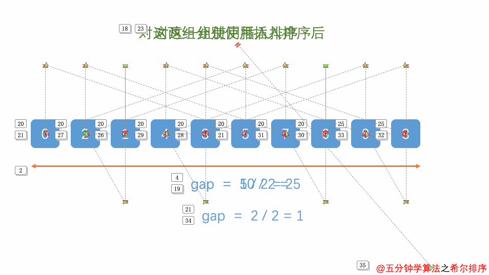

# 希尔排序

希尔排序(Shell Sort)是插入排序的一种改进版本,也称为“缩小增量排序”,是一种非稳定的排序算法

# 基本思路

1. 首先,设定一个增量ghp,一般取序列长度的一半,然后将序列分成ghp个子序列
2. 对于每个子序列,进行插入排序
3. 将ghp缩小为原来的一半,重新分组并进行插入排序,直到ghp缩小为1,此时整个序列就变成了一个有序序列

核心逻辑: **将原序列按一定间隔分成若干子序列,对每个子序列进行插入排序,缩小间隔,再进行插入排序**

# 动图演示



# 范例 

```java
public class Test {
    public static void main(String[] args) {
        int[] arr = {6,1,2,7,9,3,4,5,10,8};
        int ghp = arr.length;
        while (ghp > 1) {
            shellSort(arr,ghp);
            ghp /= 2;
        }
        shellSort(arr,ghp);
        printArr(arr);
    }

    public static void shellSort(int[] arr,int ghp) {
        for (int i = ghp; i < arr.length; i++) {
            int tmp = arr[i];
            int j = i - ghp;
            for (; j >= 0; j -= ghp) {
                if (arr[j] > tmp) {
                    arr[j + ghp] = arr[j];
                } else {
                    break;
                }
            }
            arr[j + ghp] = tmp;
        }
    }
    
    public static void printArr(int[] arr) {
        for (int i = 0; i < arr.length; i++) {
            System.out.print(arr[i] + " ");
        }
        System.out.println();
    }
}
```

# 复杂度

**时间复杂度: O(nlog^2n)**

**空间复杂度: O(1)**

# 特点总结

1. 希尔排序是对插入排序的优化
2. 希尔排序中gap的取法很多,一般都取序列长度的一半或者按照质素来取
3. 希尔排序是不稳定排序 