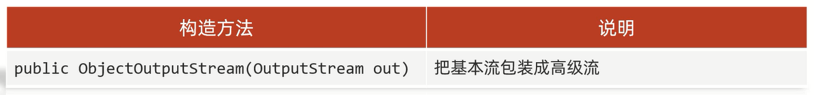
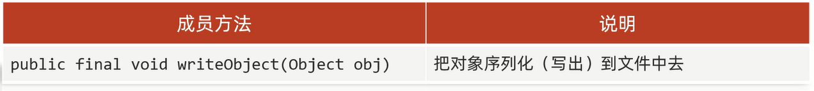
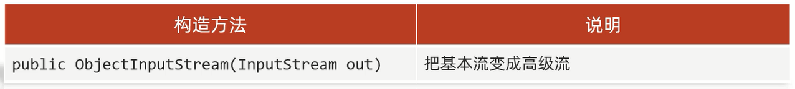
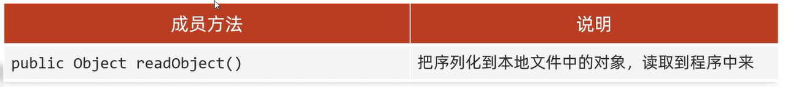

# 序列化流/反序列化流


# 细节

1. **使用序列化流将对象写到文件时,需要让JavaBean类实现Serializable接口,否则就会报错(NotSerializableException异常)**                        
Serializable接口里面没有抽象方法,即为标记型接口,一旦实现了这个接口,则表示当前JavaBean类可以被序列化          
2. **序列化流写到文件中的数据是不能被修改的,一旦修改就无法再次读回来了**                   
3. **序列化对象后,修改了JavaBean类,再次反序列化会报错(InvalidClassException异常)**           
解决方案:**在JavaBean类添加序列号(版本号)`private static final long serialVersionUID`**                
4. **如果JavaBean类里面有成员变量的值不想被序列化,给对应的成员变量前加上`transient`关键字修饰**           
transient:瞬态关键字           
作用:该关键字标记的成员变量不参与序列化过程,下次再读取该变量时是默认的初始化值                                            

# 分类

## 序列化流(对象操作输出流)

序列化流可以把Java中的对象写到本地文件中,属于字节流

### 构造方法



### 成员方法



范例:

```java
import java.io.Serializable;

public class Student implements Serializable {

    private static final long serialVersionUID = -2797750885309972308L;
    private String name;
    private int age;

    public Student() {
    }

    public Student(String name, int age) {
        this.name = name;
        this.age = age;
    }

    public String getName() {
        return name;
    }

    public void setName(String name) {
        this.name = name;
    }

    public int getAge() {
        return age;
    }

    public void setAge(int age) {
        this.age = age;
    }

    @Override
    public String toString() {
        return "Student{" +
                "name='" + name + '\'' +
                ", age=" + age +
                '}';
    }
}
```

```java
import java.io.*;

public class Test {
    public static void main(String[] args) throws IOException {
        File dest = new File("D:\\Project\\Test(IDEA)\\dest.txt");
        Student stu = new Student("张三", 23);
        getObjectFile(dest, stu);
    }

    public static void getObjectFile(File dest, Student stu) throws IOException {
        ObjectOutputStream oop = new ObjectOutputStream(new FileOutputStream(dest));
        oop.writeObject(stu);
        oop.close();
    }
}
```

## 反序列化流(对象操作输入流)

反序列化流可以把序列化到本地文件中的对象,读取到程序中来,属于字节流

### 构造方法



### 成员方法



范例:

```java
import java.io.*;

public class Test {
    public static void main(String[] args) throws IOException, ClassNotFoundException {
        File dest = new File("D:\\Project\\Test(IDEA)\\dest.txt");
        getObject(dest);
    }

    public static void getObject(File dest) throws IOException, ClassNotFoundException {
        ObjectInputStream ois = new ObjectInputStream(new FileInputStream(dest));
        Student stu = (Student) ois.readObject();
        System.out.println(stu);
        ois.close();
    }
}
```

# 练习

将多个自定义对象序列化到文件中,但是对象的数量不确定

```java
import java.io.Serializable;

public class Student implements Serializable {

    private static final long serialVersionUID = -3017121627307043960L;
    private String name;
    private int age;
    private String address;

    public Student() {
    }

    public Student(String name, int age, String address) {
        this.name = name;
        this.age = age;
        this.address = address;
    }

    public String getName() {
        return name;
    }

    public void setName(String name) {
        this.name = name;
    }

    public int getAge() {
        return age;
    }

    public void setAge(int age) {
        this.age = age;
    }

    public String getAddress() {
        return address;
    }

    public void setAddress(String address) {
        this.address = address;
    }

    @Override
    public String toString() {
        return "Student{" +
                "name='" + name + '\'' +
                ", age=" + age +
                ", address='" + address + '\'' +
                '}';
    }
}
```

```java
import java.io.*;
import java.util.ArrayList;
import java.util.Collections;

public class Test {
    public static void main(String[] args) throws IOException, ClassNotFoundException {
        Student stu1 = new Student("张三", 23, "南京");
        Student stu2 = new Student("李四", 24, "北京");
        Student stu3 = new Student("王五", 25, "天津");
        Student stu4 = new Student("赵六", 26, "东京");
        ArrayList<Student> writeList = new ArrayList<>();
        Collections.addAll(writeList, stu1, stu2, stu3, stu4);
        // 序列化
        File writeFile = new File("D:\\Project\\Test(IDEA)\\dest.txt");
        ObjectOutputStream oos = new ObjectOutputStream(new FileOutputStream(writeFile, false));
        oos.writeObject(writeList);
        oos.close();
        // 反序列化
        File readFile = new File("D:\\Project\\Test(IDEA)\\dest.txt");
        ObjectInputStream ois = new ObjectInputStream(new FileInputStream(readFile));
        ArrayList<Student> readList = (ArrayList<Student>) ois.readObject();
        ois.close();
        for (Student student : readList) {
            System.out.println("姓名:" + student.getName() + " 年龄:" + student.getAge() + " 住址:" + student.getAddress());
        }
    }
}
```