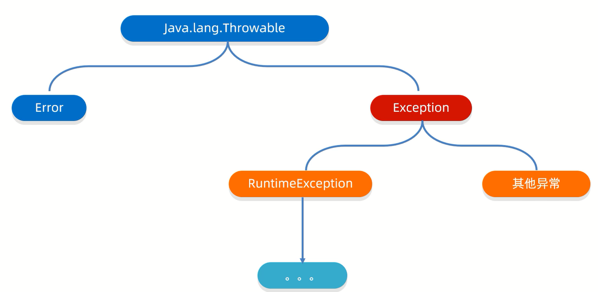
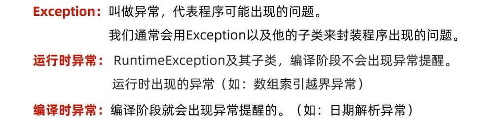
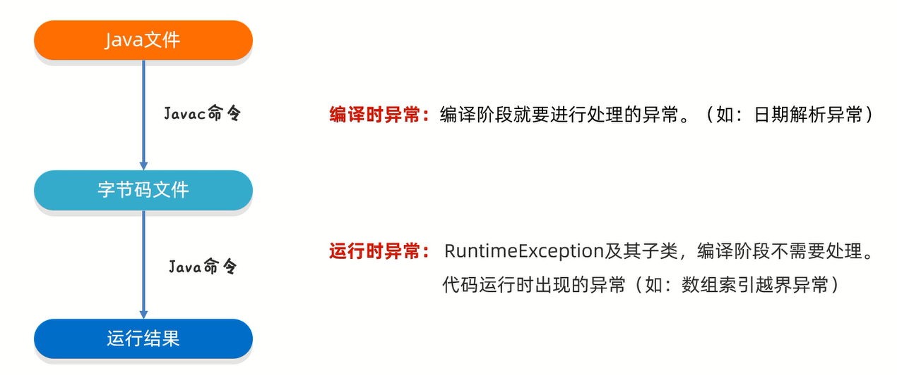
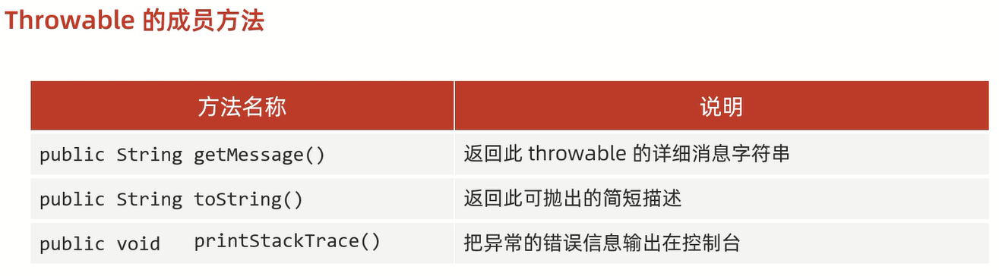
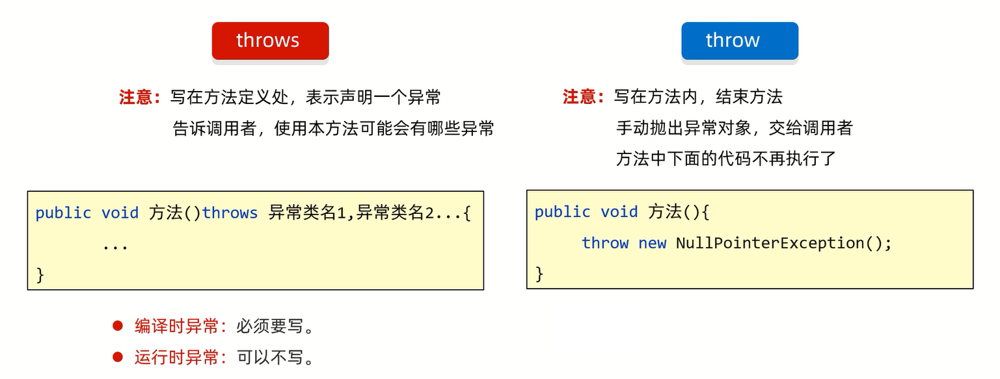

# 异常





# 编译时异常和运行时异常



- 编译时异常:**提醒程序员检查本地信息**
- 运行时异常:**代码出错(一般是由于参数传递错误)而导致程序出现的问题**

范例:

```java
import java.text.ParseException;
import java.text.SimpleDateFormat;
import java.util.Date;

public class Test {
    public static void main(String[] args) throws ParseException {
        // 编译时异常(在编译阶段,必须要手动处理,否则代码报错)
        // String time = "2030年1月1日";
        // SimpleDateFormat sdf = new SimpleDateFormat("yyyy年MM月dd日");
        // Date date = sdf.parse(time);
        // System.out.println(date);

        // 运行时异常(在编译阶段是不需要处理的,是代码运行时出现的异常)
        // int[] arr = {1, 2, 3, 4, 5};
        // ArrayIndexOutOfBoundsException
        // System.out.println(arr[10]);
    }
}
```

# 作用

1. 异常是用来查询Bug的关键参考信息
2. 异常可以作为方法内部的一种特殊返回值,以便通知调用者底层的执行情况

# 处理方式

## JVM默认的处理方式

- 把异常的名称,异常原因以及异常出现的位置等信息输出在控制台                   
- 程序停止执行,下面的代码就不会继续执行了         

## 捕获异常(自己处理)

格式:

```markdown
try{
    可能出现异常的代码;
} catch(异常类名 变量名){
    异常的处理代码;
}
```

目的:当代码出现异常时,**可以让程序继续往下执行**

范例:

```java
public class Test {
    public static void main(String[] args) {
        int[] arr = {1, 2, 3, 4, 5, 6};
        try {
            // 此处出现了异常,程序会创建ArrayIndexOutOfBoundsException对象
            // 拿着这个对象去catch中进行对比,看括号中的变量是否可以接收这个对象
            // 如果能被接收,则表示该异常被捕获,会执行catch里面对应的代码
            // 当catch里面的所有代码执行完毕,会继续执行try...catch体系下面的代码
            System.out.println(arr[10]);
        } catch (ArrayIndexOutOfBoundsException e) {
            System.out.println("索引越界了!");
        }
        System.out.println("看我执行了吗?");
        // 打印结果:"索引越界了!"
        // 打印结果:"看我执行了吗?"
    }
}
```

### 分析
1. 如果try中没有遇到问题,怎么执行?

会把try里面的所有代码执行完毕,不会执行catch里面的代码

范例:

```java
public class Test {
    public static void main(String[] args) {
        int[] arr = {1, 2, 3, 4, 5, 6};
        try {
            System.out.println(arr[1]);
        } catch (ArrayIndexOutOfBoundsException e) {
            System.out.println("索引越界了!");
        }
        System.out.println("看我执行了吗?");
        // 打印结果:"2"
        // 打印结果:"看我执行了吗?"
    }
}
```

2. 如果try中遇到多个问题,怎么执行?

会写多个catch与之匹配

细节:
1. **如果捕获多个异常,且这些异常中存在父子关系,那么父类一定要写在下面**
2. **在JDK7之后,可以在catch中同时捕获多个异常,中间用`|`隔开,表示如果出现了A异常或者B异常,采用同一种处理方案**

范例:

```java
public class Test {
    public static void main(String[] args) {
        int[] arr = {1, 2, 3, 4, 5, 6};

        // JDK7之前
        // try {
        //     // ArrayIndexOutOfBoundsException
        //     System.out.println(arr[10]);
        //     // ArithmeticException
        //     System.out.println(2 / 0);
        //     // NullPointerException
        //     String s = null;
        //     System.out.println(s.equals("abc"));
        // } catch (ArrayIndexOutOfBoundsException e) {
        //     System.out.println("索引越界了!");
        // } catch (ArithmeticException e) {
        //     System.out.println("除数不能为0!");
        // } catch (NullPointerException e) {
        //     System.out.println("空指针异常!");
        // } catch (Exception e) {
        //     System.out.println("出现异常!");
        // }
        // System.out.println("看我执行了吗?");

        // JDK7之后
        // try {
        // // ArrayIndexOutOfBoundsException
        // System.out.println(arr[10]);
        // // ArithmeticException
        // System.out.println(2 / 0);
        // String s = null;
        // System.out.println(s.equals("abc"));
        // } catch (ArrayIndexOutOfBoundsException | ArithmeticException e) {
        // System.out.println("索引越界了!或者除数不能为0!");
        // } catch (NullPointerException e) {
        // System.out.println("空指针异常!");
        // } catch (Exception e) {
        // System.out.println("出现异常!");
        // }
        // System.out.println("看我执行了吗?");
    }
}
```

3. 如果try中遇到的问题没有被捕获,怎么执行?

相当于try...catch的代码白写,最终还是会交给JVM进行处理

范例:

```java
public class Test {
    public static void main(String[] args) {
        int[] arr = {1, 2, 3, 4, 5, 6};

        try {
            // ArrayIndexOutOfBoundsException
            System.out.println(arr[10]);
        } catch (ArithmeticException e) {
            System.out.println("算数异常!");
        }
        // 打印结果:"ArrayIndexOutOfBoundsException异常"
        System.out.println("看我执行了吗?");
    }
}
```

4. 如果try中遇到了问题,那么try下面的其他代码还会不会执行?

下面的代码不会执行了,直接跳转到catch当中,执行对应catch里面的语句体                
如果没有对应的catch与之匹配,最终还是会交给JVM进行处理

范例:

```java
public class Test {
    public static void main(String[] args) {
        int[] arr = {1, 2, 3, 4, 5, 6};

        try {
            // ArrayIndexOutOfBoundsException
            System.out.println(arr[10]);
            System.out.println("hello!");
        } catch (ArrayIndexOutOfBoundsException e) {
            System.out.println("索引越界异常!");
        }
        // 打印结果:"索引越界异常!"
        // 打印结果:"看我执行了吗?"
        System.out.println("看我执行了吗?");
    }
}
```

### 常用方法



printStackTrace细节:
1. 底层是利用System.err.println进行输出,把异常的错误信息以红色字体输出在控制台
2. **仅仅是打印信息,不会停止程序运行**

范例:

```java
public class Test {
    public static void main(String[] args) {
        int[] arr = {1, 2, 3, 4, 5, 6};

        try {
            System.out.println(arr[10]);
        } catch (ArrayIndexOutOfBoundsException e) {
            String message = e.getMessage();
            // 打印结果:"Index 10 out of bounds for length 6"
            System.out.println(message);

            String string = e.toString();
            // 打印结果:"java.lang.ArrayIndexOutOfBoundsException: Index 10 out of bounds for length 6"
            System.out.println(string);

            // 打印结果:"java.lang.ArrayIndexOutOfBoundsException: Index 10 out of bounds for length 6"
            // 打印结果:"at test8.Test.main(Test.java:8)"
            e.printStackTrace();
        }

        // 打印结果:"看我执行了吗?"
        System.out.println("看我执行了吗?");
    }
}
```

## 抛出异常



范例:

```java
public class Test {
    public static void main(String[] args) {
        int[] arr = {1, 2, 3, 4, 5, 6};
        int max = 0;
        try {
            max = getMax(arr);
        } catch (NullPointerException e) {
            System.out.println("空指针异常");
        } catch (ArrayIndexOutOfBoundsException e) {
            System.out.println("数组越界异常");
        }
        System.out.println(max);
    }

    public static int getMax(int[] arr) /* throws NullPointerException, ArrayIndexOutOfBoundsException */ {
        if (arr == null) {
            // 手动创建一个异常对象,并把这个异常交给方法的调用者处理
            throw new NullPointerException();
        }
        if (arr.length == 0) {
            // 手动创建一个异常对象,并把这个异常交给方法的调用者处理
            throw new ArrayIndexOutOfBoundsException();
        }
        int max = arr[0];
        for (int i = 1; i < arr.length; i++) {
            if (arr[i] > max) {
                max = arr[i];
            }
        }
        return max;
    }
}
```

练习:

键盘录入自己心仪的女朋友姓名和年龄        
姓名的长度在3~10之间             
年龄的范围为18~40岁             
超出这个范围的异常数据不能赋值,需要重新录入,一直录到正确为止

方法一:

```java
import java.util.ArrayList;
import java.util.LinkedHashMap;
import java.util.Scanner;

public class Test {
    public static void main(String[] args) {
        Scanner sc = new Scanner(System.in);
        LinkedHashMap<String, Integer> map = new LinkedHashMap<>();
        ArrayList<String> nameList = new ArrayList<>();
        int index = 0;
        while (true) {
            System.out.print("请输入姓名:");
            String name = null;
            name = sc.nextLine();
            try {
                if (name.matches("\\D{3,10}")) {
                    nameList.add(name);
                    map.put(name, 0);
                    break;
                } else {
                    throw new RuntimeException();
                }
            } catch (RuntimeException e) {
                System.out.println("姓名的格式/范围有误!");
            }
        }
        while (true) {
            System.out.print("请输入年龄:");
            String age = null;
            age = sc.nextLine();
            try {
                if (age.matches("(1[8|9])|[2-3][0-9]|40")) {
                    map.put(nameList.get(index), Integer.parseInt(age));
                    index++;
                    break;
                } else {
                    throw new RuntimeException();
                }
            } catch (RuntimeException e) {
                System.out.println("年龄的格式/范围有误!");
            }
        }
        map.forEach((name, age) -> System.out.println("姓名:" + name + " 年龄:" + age));
    }
}
```

方法二:

```java
public class Girlfriend {
    private String name;
    private int age;

    public Girlfriend() {
    }

    public Girlfriend(String name, int age) {
        this.name = name;
        this.age = age;
    }

    public String getName() {
        return name;
    }

    public void setName(String name) {
        if (name.matches("\\D{3,10}")) {
            this.name = name;
        } else {
            throw new RuntimeException();
        }
    }

    public int getAge() {
        return age;
    }

    public void setAge(int age) {
        if (Integer.toString(age).matches("(1[8|9])|[2-3][0-9]|40")) {
            this.age = age;
        } else {
            throw new RuntimeException();
        }
    }

    @Override
    public String toString() {
        return "Girlfriend{" +
                "name='" + name + '\'' +
                ", age=" + age +
                '}';
    }
}
```

```java
import java.util.Scanner;

public class Test {
    public static void main(String[] args) {
        Scanner sc = new Scanner(System.in);
        Girlfriend gf = new Girlfriend();
        while (true) {
            try {
                System.out.print("请输入姓名:");
                String name = sc.nextLine();
                gf.setName(name);
            } catch (NumberFormatException | RuntimeException e) {
                System.out.println("姓名的范围有误!");
            }
            try {
                System.out.print("请输入年龄:");
                String ageStr = sc.nextLine();
                int age = Integer.parseInt(ageStr);
                gf.setAge(age);
                break;
            } catch (NumberFormatException | RuntimeException e) {
                System.out.println("年龄的范围有误!");
            }
        }
        System.out.println("姓名:" + gf.getName() + " 年龄:" + gf.getAge());
    }
}
```

## 自定义异常

意义:为了让控制台的报错信息更加的见名知意

步骤:
1. 定义异常类
2. 写继承关系          
a.运行时:RuntimeException               
b.编译时:Exception                  
3. 空参构造
4. 带参构造

范例:

```java
public class Girlfriend {
    private String name;
    private int age;

    public Girlfriend() {
    }

    public Girlfriend(String name, int age) {
        this.name = name;
        this.age = age;
    }

    public String getName() {
        return name;
    }

    public void setName(String name) {
        if (name.matches("\\D{3,10}")) {
            this.name = name;
        } else {
            throw new NameFormatException(name + "格式有误,长度应该为3~10");
        }
    }

    public int getAge() {
        return age;
    }

    public void setAge(int age) {
        if (Integer.toString(age).matches("(1[8|9])|[2-3][0-9]|40")) {
            this.age = age;
        } else {
            throw new AgeOutOfBoundsException(age + "格式有误,年龄应该为18~40");
        }
    }

    @Override
    public String toString() {
        return "Girlfriend{" +
                "name='" + name + '\'' +
                ", age=" + age +
                '}';
    }
}
```

```java
public class NameFormatException extends RuntimeException {
    public NameFormatException() {
    }

    public NameFormatException(String message) {
        super(message);
    }
}
```

```java
public class AgeOutOfBoundsException extends RuntimeException{
    public AgeOutOfBoundsException() {
    }

    public AgeOutOfBoundsException(String message) {
        super(message);
    }
}
```

```java
import java.util.Scanner;

public class Test {
    public static void main(String[] args) {
        Scanner sc = new Scanner(System.in);
        Girlfriend gf = new Girlfriend();
        while (true) {
            try {
                System.out.print("请输入姓名:");
                String name = sc.nextLine();
                gf.setName(name);
            } catch (NumberFormatException | NameFormatException e) {
                e.printStackTrace();
            }
            try {
                System.out.print("请输入年龄:");
                String ageStr = sc.nextLine();
                int age = Integer.parseInt(ageStr);
                gf.setAge(age);
                break;
            } catch (NumberFormatException | AgeOutOfBoundsException e) {
                e.printStackTrace();
            }
        }
        System.out.println("姓名:" + gf.getName() + " 年龄:" + gf.getAge());
    }
}
```