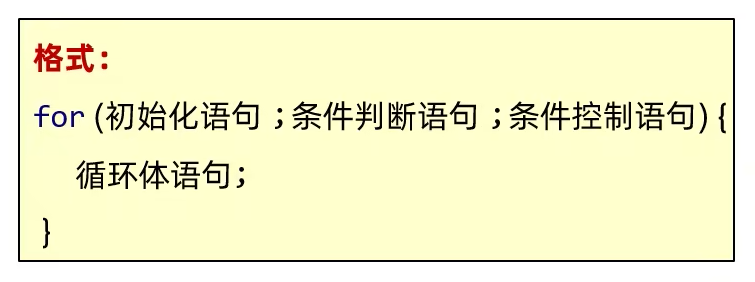

# 循环语句

需要重复执行的代码,选择循环实现   
**一个循环只做一件事情,不容易混淆逻辑**   

## for循环



执行流程: 
1. 执行初始化语句
2. 执行条件判断语句,看其结果是true还是false  
如果是false,循环结束,执行循环下面的其他语句  
如果是true,执行循环体语句,执行条件控制语句,回到2继续执行条件判断语句  

细节: 
1. **初始化语句只执行一次**
2. **判断为true,循环继续; 判断为false,循环结束**
3. **for循环的条件控制语句,其位置可以调整以确保程序的正确流程**

范例: 

```java
public static int[] getScore() {
    Scanner sc = new Scanner(System.in); 
    int[] score = new int[6]; 
    // 将条件控制语句`i++`移动到判断语句中
    for (int i = 0;  i < score.length;  ) {
        System.out.println("请输入第" + (i + 1) + "位评委打的分数: "); 
        int putIn = sc.nextInt(); 
        // 只有当录入的数据满足1~100的条件后才会i++,否则重复录入score[0]
        // 即实现重复输入第一个评委打的分数,满足打分要求才能继续
        if (putIn >= 0 && putIn <= 100) {
            score[i] = putIn; 
            i++; 
        } else {
            System.out.println("输入不合法!"); 
        }
    }
    return score; 
}
```

练习: 

打印5次HelloWorld

```java
public class test {
    public static void main(String[] args) {
        for(int i = 1; i <= 5; i++){
            System.out.println("HelloWorld!"); 
        }
    }
}
```

练习: 

打印1~5

```java
public class test {
    public static void main(String[] args) {
        for(int i = 1; i <= 5; i++){
            System.out.println(i); 
        }
    }
}
```

练习: 

打印5~1

```java
public class test {
    public static void main(String[] args) {
        for(int i = 5; i >= 1; i--){
            System.out.println(i); 
        }
    }
}
```

练习: 

公司要求断线重连的业务逻辑最多只写5次

```java
public class test {
    public static void main(String[] args) {
        for(int i = 1; i <= 5; i++){
            System.out.println("断线重连中,当前是第" + i + "次断线重连"); 
        }
        System.out.println("连接失败!"); 
    }
}

```

练习: 

求1~5之间的和

```java
public class test {
    public static void main(String[] args) {
        int sum = 0; 
        for(int i = 1; i <= 5; i++){
            sum = sum + i; 
        }
        System.out.println("1~5之间的和: " + sum); 
    }
}
```

**变量的作用域范围: 变量只有在所属的{}内才有效**  
例如求和的变量不能定义在循环里面,因为变量只在所属的{}内有效  
如果变量定义在循环里面,那么当前的变量只能在本次循环中有效   
当第二次循环开始的时候,又会重新定义一个变量   

```java
public class test {
    public static void main(String[] args) {
        for(int i = 1; i <= 5; i++){
            int sum = 0; 
            sum = sum + i; 
        }
        System.out.println("1~5之间的和: " + sum); 
    }
}
```

结论: 写累加求和的变量,可以把变量定义在循环的外面

练习: 

求1~100之间的偶数和

```java
public class test {
    public static void main(String[] args) {
        int sum = 0; 
        for(int i = 1; i <= 100; i++){
            if(i % 2 == 0){
                sum = sum + i; 
            }
        }
        System.out.println("1~100之间的偶数和: " + sum); 
    }
}
```

练习: 

录入两个数字,表示一个范围   
统计这个范围内,既能被3整除,又能被5整除的数字有多少个  

```java
import java.util.Scanner; 

public class test {
    public static void main(String[] args) {
        Scanner sc = new Scanner(System.in); 
        System.out.println("请输入一个数字: "); 
        int number_01 = sc.nextInt(); 
        System.out.println("请输入另一个数字: "); 
        int number_02 = sc.nextInt(); 
        int min = 0; 
        int max = 0; 
        if (number_01 <= number_02) {
            min = number_01; 
            max = number_02; 
        } else {
            min = number_02; 
            max = number_01; 
        }
        System.out.println("在" + min + "和" + max + "之间,既能被3整除、又能被5整除的数字有: "); 
        int sum = 0; 
        for (int i = min;  i <= max;  i++) {
            if (i % 3 == 0 && i % 5 == 0) {
                System.out.println(i); 
                sum++; 
            }
        }
        System.out.println("这样的数字一共有" + sum + "个"); 
    }
}
```

## 增强的for循环

格式: 

```java
for (元素类型 变量名:  数组或集合) {
//  循环体
}
```

范例: 

```java
public class test {
    public static void main(String[] args) {
        int[] arr = {1, 2, 3, 4, 5}; 
        for (int num :  arr) {
            System.out.println(num); 
        }
    }
}
```

## while循环


执行流程: 
1. 执行初始化语句
2. 执行条件判断语句,看其结果是true还是false    
如果是false,循环结束,执行循环下面的其他语句   
如果是true,执行循环体语句,执行条件控制语句,回到2继续执行条件判断语句  

细节: 
1. **初始化语句只执行一次**
2. **判断为true,循环继续; 判断为false,循环结束**

练习: 

打印1~100

```java
public class test {
    public static void main(String[] args) {
        int i = 1; 
        while(i <= 100){
            System.out.println(i); 
            i++; 
        }
    }
}
```

## for循环和while循环的对比

相同点: 运行规则一致  

不同点:   
1. for循环中,控制循环的变量,因为归属for循环的语法结构中,在for循环结束后,就不能再次被访问了  

```java
for(int i = 0; i < 4; i++){
    System.out.printIn(i); 
}
```

2. while循环中,控制循环的变量,对于while循环来说不归属其语法结构中,在while循环结束后,该变量还可以继续使用  

```java
int i = 0; 
while(i < 4){
    i++; 
}
System.out.println(i); 
```

而for循环也这样写,即与while循环无区别   

```java
int i = 0; 
for(; i < 4; i++){
    System.out.printIn(i); 
}
```

3. 实际开发中的区别   
**for循环中: 知道循环次数或者循环的范围**  
**while循环中: 不知道循环的次数和范围,只知道循环的结束条件**   

练习: 

珠穆朗玛峰高8844.43米即8844430毫米  
假如有一张足够大的纸,厚度为0.1毫米,折叠多少次到珠穆朗玛峰的高度  

```java
public class test {
    public static void main(String[] args) {
        double high = 0.1; 
        int n = 0; 
        while(high <= 8844430){
            high *= 2; 
            n++; 
        }
        System.out.println("折叠" + n + "次后,到达珠穆朗玛峰的高度"); 
    }
}
```

练习: 
 
回文数是指正序(从左向右)和倒序(从右向左)读都是一样的整数   
输入一个整数,如果是回文数,打印true; 否则,打印false  

```java
import java.util.Scanner; 

public class test {
    public static void main(String[] args) {
        Scanner sc = new Scanner(System.in); 
        System.out.println("请输入一个整数: "); 
        int x = sc.nextInt(); 
        // 定义一个临时变量来记录x的值,用于最后进行比较
        int temp = x; 
        int y = 0; 
        while(x != 0){
            // 取x的个位上的数字
            int position = x % 10; 
            // 再将x的个位数删除,即循环实现取得x每个位置上的数字
            x = x / 10; 
            // 将每个位置上的数字倒序拼接给y,y即x的倒序数
            y = y * 10 + position; 
        }
        // 判断x与其倒序数是否一致,即判断回文数
        System.out.println(temp == y); 
    }
}
```

练习: 

给定两个整数,被除数和除数(都是正数,且不超过int的范围)   
将两数相除,要求不使用乘法、除法和%运算符,得到商和余数  

```java
import java.util.Scanner; 

public class test {
    public static void main(String[] args) {
        Scanner sc = new Scanner(System.in); 
        System.out.println("请输入一个被除数: "); 
        int x = sc.nextInt(); 
        System.out.println("请输入一个除数: "); 
        int y = sc.nextInt(); 
        if (x >= y && x > 0 && y > 0) {
            // 定义商
            int shang = 0; 
            // 定义一个临时变量来记录x的值
            int temp = x; 
            while (x >= y) {
                x -= y; 
                shang++; 
            }
            System.out.println(temp + "/" + y + "的商为" + shang + "余数为" + x); 
        }
        System.out.println("输入不合法!"); 
    }
}
```

## do...while循环


执行流程: 
1. 执行初始化语句
2. 执行循环体语句
3. 执行条件控制语句
4. 执行条件判断语句,看其结果是true还是false   
如果是false,循环结束,执行循环下面的其他语句   
如果是true,回到2继续执行循环体语句    

## 无限循环

循环一直停不下来

范例: 

```java
for(; ; ){
    System.out.println("学习停不下来!"); 
}
```

```java
while(true){
    System.out.println("学习停不下来!"); 
}
```

```java
do{
    System.out.println("学习停不下来!"); 
}while(true); 
```

练习: 

程序自动生成1~100之间的随机数字,用程序实现猜出这个数字是多少

```java
import java.util.Random; 
import java.util.Scanner; 

public class test {
    public static void main(String[] args) {
        Random r = new Random(); 
        int number = r.nextInt(100) + 1; 
        Scanner sc = new Scanner(System.in); 
        int count = 0; 
        while (true) {
            System.out.println("请输入你猜的数: "); 
            int guess = sc.nextInt(); 
            if (number > guess) {
                System.out.println("小了!"); 
                count++; 
            } else if (number < guess) {
                System.out.println("大了!"); 
                count++; 
            } else {
                System.out.println("历经" + count + "次,你终于猜对了!"); 
                break; 
            }
        }
    }
}
```

## 跳转控制语句

在循环的过程中,跳转到其他语句上执行  

关键字: continue               
跳过本次循环,继续执行下次循环   

练习: 

小老虎吃5个包子,第3个包子有毒,跳过不吃

```java
public class test {
    public static void main(String[] args) {
        for (int i = 1;  i <= 5;  i++) {
            if(i == 3){
                continue; 
            }
            System.out.println("小老虎在吃第" + i + "个包子"); 
        }
    }
}
```

关键字: break  
结束整个循环   

练习: 

小老虎吃5个包子,吃到第3个包子的时候吃饱了,剩下的包子不吃

```java
public class test {
    public static void main(String[] args) {
        for (int i = 1;  i <= 5;  i++) {
            if(i == 4){
                break; 
            }
            System.out.println("小老虎在吃第" + i + "个包子"); 
        }
    }
}
```

## 跳出循环

1. 指定跳出循环

```java
import java.util.Scanner; 

public class test {
    public static void main(String[] args) {
        Scanner sc = new Scanner(System.in); 
        // 指定循环while的名为menu
        menu: 
        while (true) {
            System.out.println("请输入选项: "); 
            String choose = sc.next(); 
            switch (choose) {
                case "1" -> System.out.println("1"); 
                case "2" -> {
                    System.out.println("2"); 
                    // 不指定循环名的break,只能跳出本层循环switch
                    break; 
                }
                case "3" -> {
                    System.out.println("退出系统"); 
                    // 跳出指定循环while
                    break menu; 
                }
                default -> System.out.println("!"); 
            }
        }
    }
}

```

2. 停止虚拟机运行

`System.exit(0);`

```java
import java.util.Scanner; 

public class test {
    public static void main(String[] args) {
        Scanner sc = new Scanner(System.in); 
        while (true) {
            System.out.println("请输入选项: "); 
            String choose = sc.next(); 
            switch (choose) {
                case "1" -> System.out.println("1"); 
                case "2" -> System.out.println("2"); 
                case "3" -> {
                    System.out.println("退出系统!"); 
                    System.exit(0); 
                }
                default -> System.out.println("!"); 
            }
        }
    }
}
```