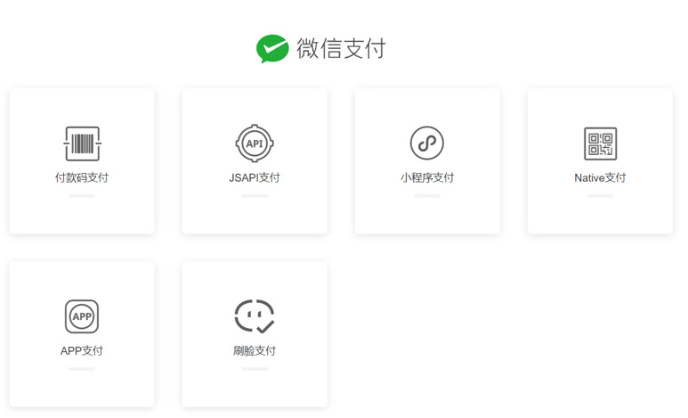
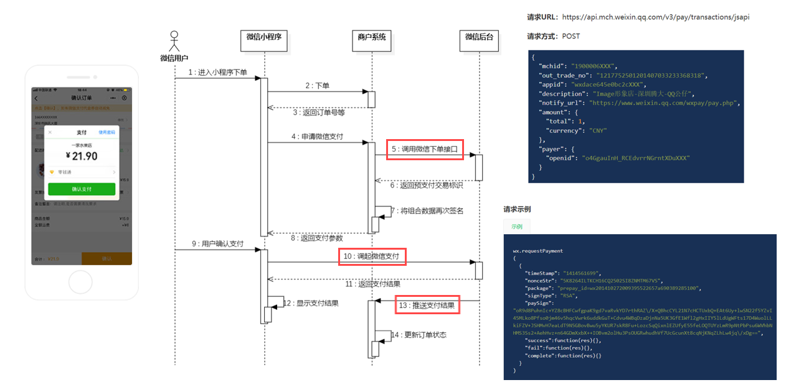
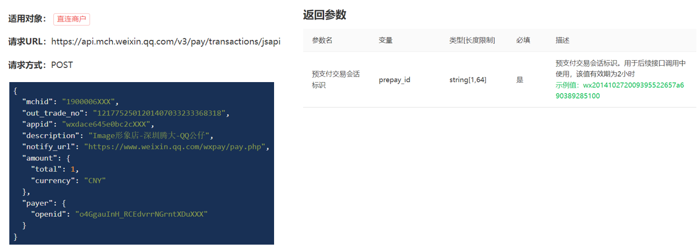
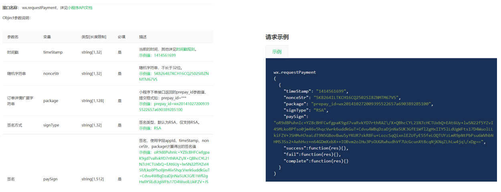

# 微信支付 

[微信支付官网](https://pay.weixin.qq.com/static/product/product_index.shtml)

微信支付产品:

微信小程序支付时序图:

# JSAPI下单

JSAPI下单:商户系统调用该接口在微信支付服务后台生成**预支付交易单**

请求URL:https://api.mch.weixin.qq.com/v3/pay/transactions/jsapi

# 微信小程序调起支付

微信小程序调起支付:通过JSAPI下单接口获取到发起支付的必要参数prepay_id,然后使用微信支付提供的小程序方法调起小程序支付

