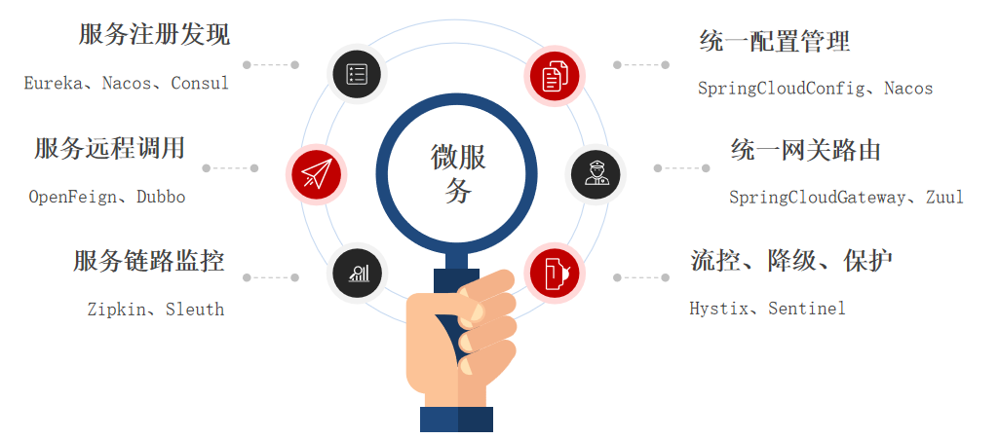
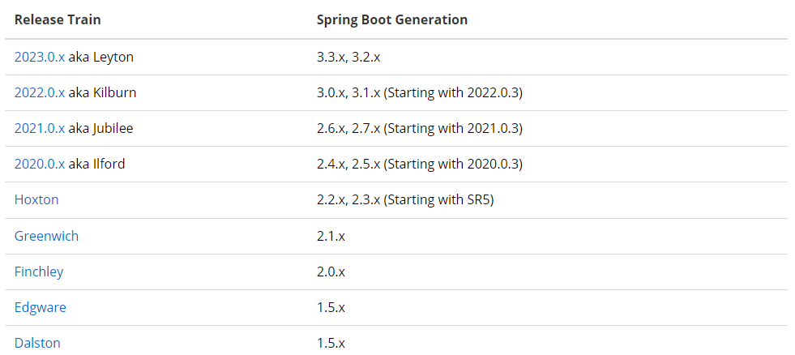

# 单体架构

**单体架构**:将业务的所有功能集中在一个项目中开发,打成一个包部署

优点:
- 架构简单
- 部署成本低

缺点:
- 团队协作成本高
- 系统发布效率低
- 系统可用性差

总结:**单体架构适合开发功能相对简单,规模较小的项目**

# 微服务

**微服务架构**:是服务化思想指导下的一套最佳实践架构方案,服务化,就是把单体架构中的功能模块拆分为多个独立项目

优点:
- 粒度小
- 团队自治
- 服务自治

# SpringCloud

**SpringCloud**是目前国内使用最广泛的微服务框架

[SpringCloud官网地址](https://spring.io/projects/spring-cloud)

SpringCloud集成了各种微服务功能组件,并基于SpringBoot实现了这些组件的自动装配,从而提供了良好的开箱即用体验

SpringCloud与SpringBoot版本对应:

