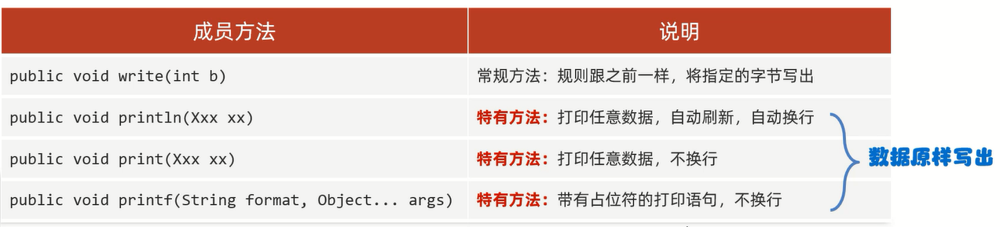
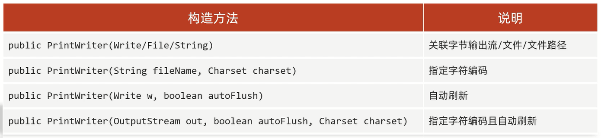
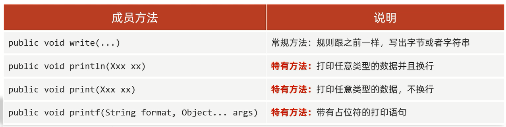

# 打印流


细节:**打印流只能读不能写**   

# 特点

1. 打印流指操作文件目的地,不操作数据源           
2. 字节打印流(PrintStream):默认自动刷新
3. 字符打印流(PrintWriter):自动刷新需要开启
4. 打印流特有的println方法可以实现:数据原样写出、自动刷新、自动换行                
打印一次数据 = 写出 + 换行 + 刷新             
              
## 字节打印流

### 构造方法


**字节流底层没有缓冲区,开不开自动刷新都一样**

### 成员方法



**字节流底层没有缓冲区,开不开自动刷新都一样**

范例:

```java
import java.io.File;
import java.io.FileOutputStream;
import java.io.IOException;
import java.io.PrintStream;
import java.nio.charset.StandardCharsets;

public class Test {
    public static void main(String[] args) throws IOException {
        File src = new File("D:\\Project\\Test(IDEA)\\src.txt");
        PrintStream ps = new PrintStream(new FileOutputStream(src), true, StandardCharsets.UTF_8);
        // 写入:"97"
        ps.println(97);
        // 写入:"true"
        ps.print(true);
        ps.println();
        // 写入:"阿正爱上中国的阿君"
        ps.printf("%s爱上中国的%s", "阿正", "阿君");
        ps.close();
    }
}
```

#### 占位符

常用:           

- `%n`:插入平台特定的换行符(windows:`\r\n`; mac:`\r`; linux:`\n`)
- `%%`:插入百分号

- `%d`:格式化整数
- `%f`:格式化浮点数
- `%c`:格式化字符
- `%s`:格式化字符串
- `%b`:格式化布尔值

- `%o`:将整数格式化为八进制表示形式
- `%x`:将整数格式化为十六进制表示形式
- `%a`:将浮点数格式化为十六进制表示形式
- `%e`:将浮点数格式化为科学计数法表示形式
- `%g`:根据值的大小动态选择使用固定或科学计数法   

更多占位符请看范例...

范例:

```java
package test10;

import java.io.FileNotFoundException;
import java.io.PrintStream;
import java.util.Date;

public class Test {
    public static void main(String[] args) throws FileNotFoundException {
        PrintStream ps = new PrintStream("D:\\Project\\Test(IDEA)\\src.txt");

        // 写入:"我叫阿玮"
        ps.printf("我叫%s %n", "阿玮");
        // 写入:"阿珍喜欢阿强"
        ps.printf("%s喜欢%s %n", "阿珍", "阿强");
        // 写入:"字母H的大写:H"
        ps.printf("字母H的大写:%c %n", 'H');
        // 写入:"8>3的结果是:true"
        ps.printf("8>3的结果是:%b %n", 8 > 3);
        // 写入:"100的16进制数是:64"
        ps.printf("100的16进制数是:%x %n", 100);
        // 写入:"100的8进制数是:144"
        ps.printf("100的8进制数是:%o %n", 100);
        // 写入:"100的一半是:50"
        ps.printf("100的一半是:%d %n", 100 / 2);
        // 写入:"50元的书打8.5折扣是:42.500000元"
        ps.printf("50元的书打8.5折扣是:%f元%n", 50 * 0.85);
        // 写入:"计算的结果转16进制:0x1.54p5"
        ps.printf("计算的结果转16进制:%a %n", 50 * 0.85);
        // 写入:"计算的结果转科学计数法表示:4.250000e+01"
        ps.printf("计算的结果转科学计数法表示:%e %n", 50 * 0.85);
        // 写入:"计算的结果转成指数和浮点数,结果的长度较短的是:42.5000"
        ps.printf("计算的结果转成指数和浮点数,结果的长度较短的是:%g %n", 50 * 0.85);
        // 写入:"带有百分号的符号表示法,以百分之85为例:85%"
        ps.printf("带有百分号的符号表示法,以百分之85为例:%d%% %n", 85);
        ps.println("---------------------");

        double num1 = 1.0;
        // 写入:"num: 1.000"
        ps.printf("num: %.4g %n", num1);
        // 写入:"num: 1.0000"
        ps.printf("num: %.5g %n", num1);
        // 写入:"num: 1.00000"
        ps.printf("num: %.6g %n", num1);

        float num2 = 1.0F;
        // 写入:"num: 1.0000"
        ps.printf("num: %.4f %n", num2);
        // 写入:"num: 1.00000"
        ps.printf("num: %.5f %n", num2);
        // 写入:"num: 1.000000"
        ps.printf("num: %.6f %n", num2);
        ps.println("---------------------");

        // 写入:"数字前面带有0的表示方式:007"
        ps.printf("数字前面带有0的表示方式:%03d %n", 7);
        // 写入:"数字前面带有0的表示方式:0007"
        ps.printf("数字前面带有0的表示方式:%04d %n", 7);
        // 写入:"数字前面带有空格的表示方式:       7"
        ps.printf("数字前面带有空格的表示方式:% 8d %n", 7);
        // 写入:"整数分组的效果是:9,989,997"
        ps.printf("整数分组的效果是:%,d %n", 9989997);
        ps.println("---------------------");

        // 最终结果是10位,小数点后面是5位,不够在前面补空格,补满10位
        // 如果实际数字小数点后面过长,但是只规定两位,会四舍五入
        // 如果整数部分过长,超出规定的总长度,会以实际为准
        // 写入:"一本书的价格是:49.80000元"
        ps.printf("一本书的价格是:%2.5f元%n", 49.8);

        // 写入:"(76.040000)"
        ps.printf("%(f%n", -76.04);

        // %f,默认小数点后面7位
        // 写入:"86.040000和1.79"
        ps.printf("%f和%3.2f %n", 86.04, 1.789651);

        // <,表示采取跟前面一样的内容
        // 写入:"86.040000和86.04"
        ps.printf("%f和%<3.2f %n", 86.04, 1.789651);
        ps.println("---------------------");

        Date date = new Date();
        // %t 表示时间,但是不能单独出现,要指定时间的格式
        // %tc 周二 12月 06 22:08:40 CST 2022
        // %tD 斜线隔开
        // %tF 冒号隔开(12小时制)
        // %tr 冒号隔开(24小时制)
        // %tT 冒号隔开(24小时制,带时分秒)

        // 写入:"全部日期和时间信息:周四 4月 25 11:30:00 CST 2024"
        ps.printf("全部日期和时间信息:%tc %n", date);
        // 写入:"月/日/年格式:04/25/24"
        ps.printf("月/日/年格式:%tD %n", date);
        // 写入:"年-月-日格式:2024-04-25"
        ps.printf("年-月-日格式:%tF %n", date);
        // 写入:"HH:MM:SS PM格式(12时制):11:30:00 上午"
        ps.printf("HH:MM:SS PM格式(12时制):%tr %n", date);
        // 写入:"HH:MM格式(24时制):11:30"
        ps.printf("HH:MM格式(24时制):%tR %n", date);
        // 写入:"HH:MM:SS格式(24时制):11:30:00"
        ps.printf("HH:MM:SS格式(24时制):%tT %n", date);
        ps.println("---------------------");

        // 写入:"星期的简称:周四"
        ps.printf("星期的简称:%ta %n", date);
        // 写入:"星期的全称:星期四"
        ps.printf("星期的全称:%tA %n", date);
        // 写入:"英文月份简称:4月"
        ps.printf("英文月份简称:%tb %n", date);
        // 写入:"英文月份全称:四月"
        ps.printf("英文月份全称:%tB %n", date);
        // 写入:"年的前两位数字(不足两位前面补0):20"
        ps.printf("年的前两位数字(不足两位前面补0):%tC %n", date);
        // 写入:"年的后两位数字(不足两位前面补0):24"
        ps.printf("年的后两位数字(不足两位前面补0):%ty %n", date);
        // 写入:"一年中的第几天:116"
        ps.printf("一年中的第几天:%tj %n", date);
        // 写入:"两位数字的月份(不足两位前面补0):04"
        ps.printf("两位数字的月份(不足两位前面补0):%tm %n", date);
        // 写入:"两位数字的日(不足两位前面补0):25"
        ps.printf("两位数字的日(不足两位前面补0):%td %n", date);
        // 写入:"月份的日(前面不补0):25"
        ps.printf("月份的日(前面不补0):%te  %n", date);
        ps.println("---------------------");

        // 写入:"两位数字24时制的小时(不足2位前面补0):11"
        ps.printf("两位数字24时制的小时(不足2位前面补0):%tH %n", date);
        // 写入:"两位数字12时制的小时(不足2位前面补0):11"
        ps.printf("两位数字12时制的小时(不足2位前面补0):%tI %n", date);
        // 写入:"两位数字24时制的小时(前面不补0):11"
        ps.printf("两位数字24时制的小时(前面不补0):%tk %n", date);
        // 写入:"两位数字12时制的小时(前面不补0):11"
        ps.printf("两位数字12时制的小时(前面不补0):%tl %n", date);
        // 写入:"两位数字的分钟(不足2位前面补0):53"
        ps.printf("两位数字的分钟(不足2位前面补0):%tM %n", date);
        // 写入:"两位数字的秒(不足2位前面补0):50"
        ps.printf("两位数字的秒(不足2位前面补0):%tS %n", date);
        // 写入:"三位数字的毫秒(不足3位前面补0):427"
        ps.printf("三位数字的毫秒(不足3位前面补0):%tL %n", date);
        // 写入:"九位数字的毫秒数(不足9位前面补0):427000000"
        ps.printf("九位数字的毫秒数(不足9位前面补0):%tN %n", date);
        // 写入:"小写字母的上午或下午标记(英):上午"
        ps.printf("小写字母的上午或下午标记(英):%tp %n", date);
        // 写入:"小写字母的上午或下午标记(中):上午"
        ps.printf("小写字母的上午或下午标记(中):%tp %n", date);
        // 写入:"相对于GMT的偏移量:+0800"
        ps.printf("相对于GMT的偏移量:%tz %n", date);
        // 写入:"时区缩写字符串:CST"
        ps.printf("时区缩写字符串:%tZ%n", date);
        // 写入:"1970-1-1 00:00:00 到现在所经过的秒数:1714017230"
        ps.printf("1970-1-1 00:00:00 到现在所经过的秒数:%ts %n", date);
        // 写入:"1970-1-1 00:00:00 到现在所经过的毫秒数:1714017230427"
        ps.printf("1970-1-1 00:00:00 到现在所经过的毫秒数:%tQ %n", date);

        ps.close();
    }
}
```

## 字符打印流    

### 构造方法



**字符流底层有缓冲区,想要自动刷新需要开启**

### 成员方法



**字符流底层有缓冲区,想要自动刷新需要开启**

范例:

```java
import java.io.File;
import java.io.FileWriter;
import java.io.IOException;
import java.io.PrintWriter;

public class Test {
    public static void main(String[] args) throws IOException {
        File src = new File("D:\\Project\\Test(IDEA)\\src.txt");
        PrintWriter pw = new PrintWriter(new FileWriter(src), true);
        // 写入:"97"
        pw.println(97);
        // 写入:"true"
        pw.print(true);
        pw.println();
        // 写入:"阿正爱上中国的阿君"
        pw.printf("%s爱上中国的%s", "阿正", "阿君");
        pw.close();
    }
}
```

# 应用场景

范例:

```java
import java.io.*;

public class Test {
    public static void main(String[] args) throws IOException {
        // 获取打印流的对象,此打印流在JVM启动时,由JVM创建,默认指向控制台
        // 这种特殊的打印流被称为系统的标准输出流,这是不能关闭的,因为这个在系统中是唯一的
        PrintStream ps = System.out;
        // 调用打印流中的println方法,实现写出数据,自动换行,自动刷新
        ps.println("123");
    }
}
```