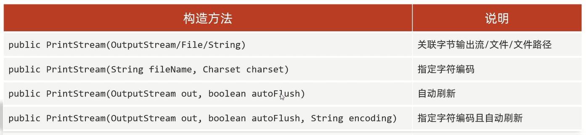

# 打印流

细节:**打印流只能读不能写**   

# 特点
1. 打印流指操作文件目的地,不操作数据源
2. 特有的写出方法可以实现:数据原样写出、自动刷新、自动换行           
打印一次数据=写出+换行+刷新             

# 分类   
1. 字节打印流:PrintStream              
2. 字符打印流:PrintWriter               

## 字节打印流

### 构造方法

## 字符打印流