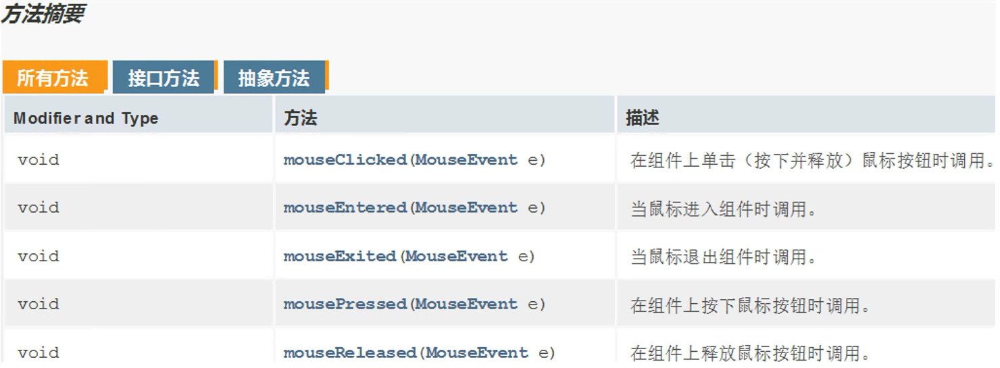
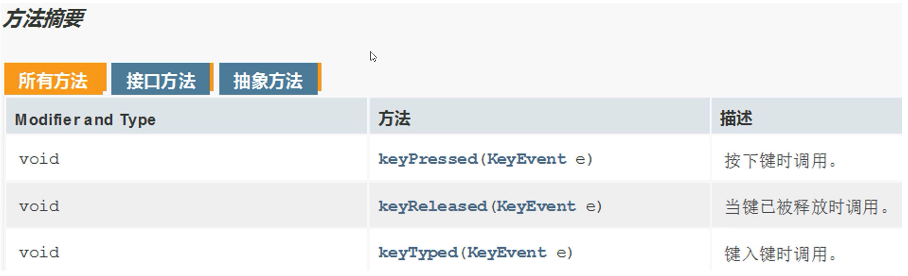

## GUI

是指采用图形化的方式显示操作界面

## 需求分析

### 创建界面

`JFrame`: 窗体

主界面: 

```java
package ui;

import javax.swing.*;

//主界面
public class GameJFrame extends JFrame {

    //在创建登录界面的时候,同时给这个界面去设置一些信息
    //通过构造函数即实现界面的初始化
    public GameJFrame(){
        //设置界面的宽高
        this.setSize(603,680);
        //设置界面的标题
        this.setTitle("拼图游戏");
        //设置界面置顶
        this.setAlwaysOnTop(true);
        //设置界面居中
        this.setLocationRelativeTo(null);
        //设置关闭模式
        this.setDefaultCloseOperation(WindowConstants.EXIT_ON_CLOSE);
        
        //显示界面
        this.setVisible(true);
    }
}
```

登录界面: 

```java
package ui;

import javax.swing.*;

//游戏的登录界面
public class LoginJFrame extends JFrame {

    //在创建登录界面的时候,同时给这个界面去设置一些信息
    //通过构造函数即实现界面的初始化
    public LoginJFrame() {
        //设置界面的宽高
        this.setSize(488,430);
        //设置界面的标题
        this.setTitle("登录界面");
        //设置界面置顶
        this.setAlwaysOnTop(true);
        //设置界面居中
        this.setLocationRelativeTo(null);
        //设置关闭模式
        this.setDefaultCloseOperation(WindowConstants.EXIT_ON_CLOSE);
        
        //显示界面
        this.setVisible(true);
    }
}
```

注册界面: 

```java
package ui;

import javax.swing.*;

//游戏的注册界面
public class RegisterJFrame extends JFrame {

    //在创建登录界面的时候,同时给这个界面去设置一些信息
    //通过构造函数即实现界面的初始化
    public RegisterJFrame(){
        //设置界面的宽高
        this.setSize(488,500);
        //设置界面的标题
        this.setTitle("注册界面");
        //设置界面置顶
        this.setAlwaysOnTop(true);
        //设置界面居中
        this.setLocationRelativeTo(null);
        //设置关闭模式
        this.setDefaultCloseOperation(WindowConstants.EXIT_ON_CLOSE);
        
        //显示界面
        this.setVisible(true);
    }
}
```

### 启动入口

```java
import ui.GameJFrame;
import ui.LoginJFrame;
import ui.RegisterJFrame;

//程序的启动入口
public class APP {
    public static void main(String[] args) {

        //如果想要开启一个界面,创建该界面的对象即可
        new LoginJFrame();
        new RegisterJFrame();
        new GameJFrame();
    }
}
```

### 制作菜单

`JMenuBar`: 菜单栏  
`JMenu`: 菜单项  
`JMenuItem`: 菜单条目(即下拉框)  

```java
package ui;

import javax.swing.*;

//游戏的主界面
public class GameJFrame extends JFrame {

    //构造方法实现初始化
    public GameJFrame() {
        //初始化界面
        initJFrame();
        
        //初始化菜单栏
        initJMenuBar();
        
        //显示界面
        this.setVisible(true);
    }

    //初始化菜单栏
    private void initJMenuBar() {
        //初始化菜单
        //创建菜单栏
        JMenuBar jMenuBar = new JMenuBar();
        
        //创建菜单项: 功能、关于我们
        JMenu functionJMenu = new JMenu("功能");
        JMenu aboutJMenu = new JMenu("关于我们");
        
        //创建菜单条目
        JMenuItem rePlayItem = new JMenuItem("重新游戏");
        JMenuItem reLoginItem = new JMenuItem("重新登录");

        JMenuItem accountItem = new JMenuItem("公众号");

        //将每一个菜单项下面的菜单条目添加到菜单项当中
        functionJMenu.add(rePlayItem);
        functionJMenu.add(reLoginItem);
        aboutJMenu.add(accountItem);

        //将每一个菜单项添加到菜单栏当中
        jMenuBar.add(functionJMenu);
        jMenuBar.add(aboutJMenu);

        //给界面设置菜单
        this.setJMenuBar(jMenuBar);
    }

    //初始化界面
    private void initJFrame() {
        //设置界面的宽高
        this.setSize(603,680);
        //设置界面的标题
        this.setTitle("拼图游戏");
        //设置界面置顶
        this.setAlwaysOnTop(true);
        //设置界面居中
        this.setLocationRelativeTo(null);
        //设置关闭模式
        this.setDefaultCloseOperation(WindowConstants.EXIT_ON_CLOSE);
        //取消默认的居中放置(取消后才会按照XY轴的方式添加组件)
        this.setLayout(null);
    }
}
```

### 添加图片

`ImageIcon`: 图片对象  
`JLabel`: 管理文字和图片的容器  

```java
//初始化图片
private void initImage() {
    //计数器,用来加载1~15张图片
    int number = 1;
    //外循环: 把内循环重复执行4次,即执行4行
    for (int j = 0; j < 4; j++) {
        //内循环: 每行添加4张图片
        for (int i = 0; i < 4; i++) {
            //创建图片
            ImageIcon icon = new ImageIcon("image/animal/animal3/" + number + ".jpg");
            //创建管理容器
            JLabel jLabel = new JLabel(icon);
            //指定图片位置
            jLabel.setBounds(105 * i,105 * j,105,105);
            //将管理容器添加到界面(隐藏容器)当中
            this.getContentPane().add(jLabel);
            //添加一次后number需要自增,表示下一次加载后面一张图片
            number++;
        }
    }
}
```

### 打乱图片

```java
package ui;

import javax.swing.*;
import java.util.Random;

//游戏的主界面
public class GameJFrame extends JFrame {
    //创建一个4*4的二维数组
    //目的: 用来管理数据
    //加载图片的时候,会根据二维数组中的数据进行加载
    int[][] data = new int[4][4];

    //构造方法实现初始化
    public GameJFrame() {
        //初始化界面
        initJFrame();
        
        //初始化菜单栏
        initJMenuBar();
        
        //初始化图片顺序(打乱)
        initData();
        
        //初始化图片
        initImage();
        
        //显示界面
        this.setVisible(true);
    }

    //初始化图片顺序(打乱)
    private void initData() {
        //创建一个一维数组
        int[] tempArr = {0,1,2,3,4,5,6,7,8,9,10,11,12,13,14,15};
        Random random = new Random();
        //遍历一维数组,得到每一个元素,拿着每一个元素跟随机索引上的数据进行交换
        for (int i = 0; i < tempArr.length; i++) {
            //获取随机索引
            int randomIndex = random.nextInt(16);
            //拿着每一个元素跟随机索引上的数据进行交换
            int temp = tempArr[i];
            tempArr[i] = tempArr[randomIndex];
            tempArr[randomIndex] = temp;
        }
        //遍历二维数组
        int index = 0;
        for (int i = 0; i < data.length; i++) {
            for (int j = 0; j < data[i].length; j++) {
                //给其中的每一个数据赋一维数组中每一个元素的值
                data[i][j] = tempArr[index];
                index++;
            }
        }
    }

    //初始化图片
    private void initImage() {
        //外循环: 把内循环重复执行4次,即j是行
        for (int j = 0; j < 4; j++) {
            //内循环: 每行添加4张图片,即i是列
            for (int i = 0; i < 4; i++) {
                int number = data[i][j];
                //创建图片
                ImageIcon icon = new ImageIcon("image/animal/animal8/" + number + ".jpg");
                //创建管理容器
                JLabel jLabel = new JLabel(icon);
                //指定图片位置
                jLabel.setBounds(105 * j,105 * i,105,105);
                //将管理容器添加到界面(隐藏容器)当中
                this.getContentPane().add(jLabel);
            }
        }
    }
}
```

### 美化界面

**先加载的图片在上方,后加载的图片在下方**

```java
//初始化图片
private void initImage() {
    //外循环: 把内循环重复执行4次,即j是行
    for (int j = 0; j < 4; j++) {
        //内循环: 每行添加4张图片,即i是列
        for (int i = 0; i < 4; i++) {
            int number = data[i][j];
            //创建图片
            ImageIcon icon = new ImageIcon("image/animal/animal3/" + number + ".jpg");
            //创建管理容器
            JLabel jLabel = new JLabel(icon);
            //指定图片位置(通过XY轴的适当偏移,使图片整体显示居中)
            jLabel.setBounds(105 * j + 83,105 * i + 134,105,105);
            //给图片添加边框
            //BevelBorder: 斜面边框(参数BevelBorder.RAISED: 凸起)
            jLabel.setBorder(new BevelBorder(BevelBorder.RAISED));
            //将管理容器添加到界面(隐藏容器)当中
            this.getContentPane().add(jLabel);
        }
    }

    //添加背景图片
    ImageIcon backgroundImage = new ImageIcon("image/background.png");
    //创建管理容器
    JLabel backgroundjLabel = new JLabel(backgroundImage);
    //指定图片位置
    backgroundjLabel.setBounds(40,40,508,560);
    //将管理容器添加到界面(隐藏容器)当中
    this.getContentPane().add(backgroundjLabel);
}
```

### 移动图片

```java
int[][] arr = {
{0,0},{0,1},{0,2},{0,3},
{1,0},{1,1},{1,2},{1,3},
{2,0},{2,1},{2,2},{2,3},
{3,0},{3,1},{3,2},{3,3},
}
```

向上移动: 空白图片与下方的图片交换位置  
向下移动: 空白图片与上方的图片交换位置  
向右移动: 空白图片与左边的图片交换位置  
向左移动: 空白图片与右边的图片交换位置  

1. 定义成员变量zeroX和zeroY

```java
//定义一维数组中索引为0的图片(即空白图片)在二维数组里的位置
int zeroX = 0;
int zeroY = 0;
```

2. 在初始化数据的时候,给成员变量赋值

```java
//遍历一维数组
for (int i = 0; i < tempArr.length; i++) {
    //获取一维数组中索引为0的图片(即空白图片)在二维数组里的位置
    if (tempArr[i] == 0) {
        zeroX = i / 4;
        zeroY = i % 4;
    } 
    //将一维数组中索引0~3,4~7,8~11,12~15的元素分别添加到二维数组中
    data[i / 4][i % 4] = tempArr[i];

}
```

3. 重写键盘监听接口的方法: 实现控制上下左右移动图片

```java
@Override
public void keyReleased(KeyEvent e) {
    //对左(37)、上(38)、右(39)、下(40)
    //和A(65)、W(87)、D(68)、S(83)进行判断,实现位移操作
    int code = e.getKeyCode();

    //向左移动: 空白图片与右边的图片交换位置
    if (code == 37 || code == 65) {
        //确保空白图片不在最右边
        if (zeroY != 3) {
            data[zeroX][zeroY] = data[zeroX][zeroY + 1];
            data[zeroX][zeroY + 1] = 0;
            //空白图片的位置变化
            zeroY++;
            //调用方法按照最新的顺序加载图片
            initImage();
        }

        //向上移动: 空白图片与下方的图片交换位置
    } else if (code == 38 || code == 87) {
        //确保空白图片不在最下边
        if (zeroX != 3) {
            data[zeroX][zeroY] = data[zeroX + 1][zeroY];
            data[zeroX + 1][zeroY] = 0;
            //空白图片的位置变化
            zeroX++;
            //调用方法按照最新的顺序加载图片
            initImage();
        }

        //向右移动: 空白图片与左边的图片交换位置
    } else if (code == 39 || code == 68) {
        //确保空白图片不在最左边
        if (zeroY != 0) {
            data[zeroX][zeroY] = data[zeroX][zeroY - 1];
            data[zeroX][zeroY - 1] = 0;
            //空白图片的位置变化
            zeroY--;
            //调用方法按照最新的顺序加载图片
            initImage();
        }

        //向下移动: 空白图片与上方的图片交换位置
    } else if (code == 40 || code == 83) {
        //确保空白图片不在最上边
        if (zeroX != 0) {
            data[zeroX][zeroY] = data[zeroX - 1][zeroY];
            data[zeroX - 1][zeroY] = 0;
            //空白图片的位置变化
            zeroX--;
            //调用方法按照最新的顺序加载图片
            initImage();
        }
    }
}
```

### 查看图片

1. 定义成员二维数组win

```java
//定义一个二维数组存储正确的顺序
int[][] win = new int[][]{
        {1,2,3,4},
        {5,6,7,8},
        {9,10,11,12},
        {13,14,15,0},
};
```

2. 重写键盘监听接口的方法: 实现按住空格查看完整图片

```java
@Override
public void keyPressed(KeyEvent e) {
    //对空格(32)进行判断,实现提示操作
    int code = e.getKeyCode();
    //按住空格,显示完整图片
    if (code == 32) {
        //清空界面中的图片
        this.getContentPane().removeAll();
        //加载完整图片
        JLabel all = new JLabel(new ImageIcon(path + "all.jpg"));
        all.setBounds(83,134,420,420);
        this.getContentPane().add(all);

        //添加背景图片
        ImageIcon backgroundImage = new ImageIcon("image/background.png");
        //创建管理容器
        JLabel backgroundjLabel = new JLabel(backgroundImage);
        //指定图片位置
        backgroundjLabel.setBounds(40,40,508,560);
        //将管理容器添加到界面(隐藏容器)当中
        this.getContentPane().add(backgroundjLabel);

        //刷新界面
        this.getContentPane().repaint();
    }
```

重写键盘监听接口的方法: 实现松开空格,恢复原状

```java
//松开空格: 恢复原状
else if (code == 32) {
    //调用方法按照最新的顺序加载图片
    initImage();
}
```

### 作弊码

重写键盘监听接口的方法: 实现按下作弊码Q直接通关

```java
//作弊码: Q(81)
else if (code == 81) {
    //按下Q: 直接通关
    data = new int[][]{
            {1,2,3,4},
            {5,6,7,8},
            {9,10,11,12},
            {13,14,15,0}
    };
    //调用方法按照最新的顺序加载图片
    initImage();
}
```

### 判断胜利

1. 定义方法判断胜利

```java
//判断data数组中的数据是否跟win数组中的数据一致
public boolean victory(){
    for (int i = 0; i < data.length; i++) {
        for (int j = 0; j < data[i].length; j++) {
            if(data[i][j] != win[i][j]){
                return false;
            }
        }
    }
    return true;
}
```

2. 在初始化图片前,先判断是否胜利

```java
//判断data数组和win数组的数据是否一致
if (victory()) {
    //显示胜利的图标
    JLabel jLabel = new JLabel(new ImageIcon("image/win.png"));
    //指定图片位置
    jLabel.setBounds(203,283,197,73);
    //将管理容器添加到界面(隐藏容器)当中
    this.getContentPane().add(jLabel);
}
```

3. 在重写键盘监听接口的方法中,移动代码前,先判断是否胜利

```java
//判断游戏是否胜利
//如果胜利,则此方法需要结束,不能再执行移动代码
if (victory()) {
    //结束方法
    return;
}
```

### 计步器

1. 定义成员变量计步
 
```java
//定义一个计步器
int step = 0;
```

2. 初始化图片时,添加计步器到界面上

```java
//显示步数的文字
JLabel stepCount = new JLabel("步数: "+step);
//指定文字位置
stepCount.setBounds(50,30,100,20);
//将管理容器添加到界面(隐藏容器)当中
this.getContentPane().add(stepCount);
```

3. 在重写键盘监听接口的方法中,控制上下左右时,实现计步

```java
//移动一次,计数器自增一次
step++;
```

### 重新游戏

1. 菜单条目绑定事件

```java
//给菜单条目绑定事件
rePlayItem.addActionListener(this);
reLoginItem.addActionListener(this);
accountItem.addActionListener(this);
```

2. 在重写动作监听接口的方法中,实现重新游戏

```java
//动作监听ActionListener接口重写方法
@Override
public void actionPerformed(ActionEvent e) {
    //获取当前被操作的条目对象
    Object obj = e.getSource();
    //重新游戏
    if (obj == rePlayItem) {
        //计步器清零
        step = 0;
        //初始化数据(打乱图片顺序)
        initData();
        //调用方法按照最新的顺序加载图片
        initImage();
        
        //重新登录
    } else if (obj == reLoginItem) {

        //玩法介绍
    } else if (obj == accountItem) {

    }
}
```

### 重新登录

在重写动作监听接口的方法中,实现重新登录

```java
//重新登录
else if (obj == reLoginItem) {
    //关闭当前的游戏界面
    this.setVisible(false);
    //打开登录界面
    new LoginJFrame();
}
```

### 玩法介绍

在重写动作监听接口的方法中,实现玩法介绍

```java
//玩法介绍
else if (obj == accountItem) {
    //创建一个弹框对象
    JDialog jDialog = new JDialog();
    //创建一个管理图片的容器对象
    JLabel jLabel = new JLabel(new ImageIcon("image/GameIntroduction.png"));
    //设置位置(相对于弹框)和宽高
    jLabel.setBounds(0,0,258,258);
    //把图片添加到弹框当中
    jDialog.getContentPane().add(jLabel);
    //给弹框设置大小
    jDialog.setSize(288,288);
    //让弹框置顶
    jDialog.setAlwaysOnTop(true);
    //让弹框居中
    jDialog.setLocationRelativeTo(null);
    //弹框不关闭,则无法操作下面的界面
    jDialog.setModal(true);
    //显示弹框
    jDialog.setVisible(true);
}
```

### 切换图片

1. 创建菜单条目美女、动物、运动,并添加到菜单栏中

```java
//创建菜单条目
JMenuItem rePlayItem = new JMenuItem("重新游戏");
JMenuItem reLoginItem = new JMenuItem("重新登录");
JMenuItem accountItem = new JMenuItem("玩法介绍");
JMenuItem beautyItem = new JMenuItem("美女");
JMenuItem animalItem = new JMenuItem("动物");
JMenuItem sportItem = new JMenuItem("运动");
```

```java
//初始化菜单栏
private void initJMenuBar() {
    //初始化菜单
    //创建菜单栏
    JMenuBar jMenuBar = new JMenuBar();
    //创建菜单项: 功能、更换图片
    JMenu functionJMenu = new JMenu("功能");
    JMenu changeImageJMenu = new JMenu("更换图片");

    //将每一个菜单项下面的菜单条目添加到菜单项当中
    functionJMenu.add(rePlayItem);
    functionJMenu.add(reLoginItem);
    functionJMenu.add(accountItem);
    //二级菜单(更换图片)
    functionJMenu.add(changeImageJMenu);
    changeImageJMenu.add(beautyItem);
    changeImageJMenu.add(animalItem);
    changeImageJMenu.add(sportItem);

    //给菜单条目绑定事件
    rePlayItem.addActionListener(this);
    reLoginItem.addActionListener(this);
    accountItem.addActionListener(this);
    beautyItem.addActionListener(this);
    animalItem.addActionListener(this);
    sportItem.addActionListener(this);

    //将每一个菜单项添加到菜单栏当中
    jMenuBar.add(functionJMenu);

    //给界面设置菜单
    this.setJMenuBar(jMenuBar);
}
```

2. 在重写动作监听接口的方法中,实现切换图片

```java
//更换美女图片
else if (obj == beautyItem) {
    Random random = new Random();
    //随机选择图片
    int number = random.nextInt(13) + 1;
    //更换path
    path = "image/girl/girl" + number;
    //计步器清零
    step = 0;
    //初始化数据(打乱图片顺序)
    initData();
    //调用方法按照最新的顺序加载图片
    initImage();

    //更换动物图片
} else if (obj == animalItem) {
    Random random = new Random();
    //随机选择图片
    int number = random.nextInt(8) + 1;
    //更换path
    path = "image/animal/animal" + number;
    //计步器清零
    step = 0;
    //初始化数据(打乱图片顺序)
    initData();
    //调用方法按照最新的顺序加载图片
    initImage();

    //更换运动图片
} else if (obj == sportItem) {
    Random random = new Random();
    //随机选择图片
    int number = random.nextInt(10) + 1;
    //更换path
    path = "image/sport/sport" + number;
    //计步器清零
    step = 0;
    //初始化数据(打乱图片顺序)
    initData();
    //调用方法按照最新的顺序加载图片
    initImage();
}
```

### 登录界面

1. 创建JavaBean类: 用户

```java
public class User {
    private String username;
    private String password;

    public User() {
    }

    public User(String username,String password) {
        this.username = username;
        this.password = password;
    }

    public String getUsername() {
        return username;
    }

    public void setUsername(String username) {
        this.username = username;
    }

    public String getPassword() {
        return password;
    }

    public void setPassword(String password) {
        this.password = password;
    }
}
```

2. 创建`util`工具类: 生成随机验证码

```java
import java.util.Random;

public class captchaUtil {
    //随机生成验证码
    public static String getCaptcha() {
        Random random = new Random();
        //创建字符数组存储52个大小写字母
        char[] letterArr = new char[52];
        for (int i = 0; i < letterArr.length; i++) {
            if (i < 26) {
                letterArr[i] = (char) ('a' + i);
            } else {
                letterArr[i] = (char) ('A' + i - 26);
            }
        }
        //验证码第1~4位为随机生成的大小写字母
        StringBuilder result = new StringBuilder();
        for (int i = 0; i < 4; i++) {
            int index = random.nextInt(52);
            result.append(letterArr[index]);
        }
        //验证码第5位为随机生成的数字
        result.append(random.nextInt(10));
        //将字符串转变成字符数组
        char[] captchaArr = result.toString().toCharArray();
        //将第5位元素,即数字和随机索引指向的元素交换位置
        int index = random.nextInt(5);
        char temp = captchaArr[index];
        captchaArr[index] = captchaArr[captchaArr.length - 1];
        captchaArr[captchaArr.length - 1] = temp;
        return new String(captchaArr);
    }
}
```

3. 登录界面

```java
import domain.User;
import util.captchaUtil;

import javax.swing.*;
import java.awt.event.MouseEvent;
import java.awt.event.MouseListener;
import java.util.ArrayList;

//游戏的登录界面
public class LoginJFrame extends JFrame implements MouseListener {

    //设置用户集合
    static ArrayList<User> allUsers = new ArrayList<>();
    static {
        allUsers.add(new User("admin","123456"));
    }

    //登录按钮
    JButton loginButton = new JButton();

    //注册按钮
    JButton registerButton = new JButton();

    //用户名
    JTextField username = new JTextField();

    //密码
    JPasswordField password = new JPasswordField();

    //验证码
    JTextField captcha = new JTextField();

    //正确的验证码
    JLabel rightCaptcha = new JLabel();

    //构造函数
    public LoginJFrame() {
        //初始化界面
        initJFrame();

        //在这个界面中添加内容
        initView();

        //让当前界面显示出来
        this.setVisible(true);
    }

    //在这个界面中添加内容
    public void initView() {
        //添加用户名图片
        JLabel usernameText = new JLabel(new ImageIcon("image/login/用户名.png"));
        //设置位置和宽高
        usernameText.setBounds(100,135,47,17);
        //将管理容器添加到界面(隐藏容器)当中
        this.getContentPane().add(usernameText);

        //添加用户名输入框
        username.setBounds(160,130,200,30);
        //将输入框添加到界面(隐藏容器)当中
        this.getContentPane().add(username);

        //添加密码图片
        JLabel passwordText = new JLabel(new ImageIcon("image/login/密码.png"));
        //设置位置和宽高
        passwordText.setBounds(115,195,32,16);
        //将管理容器添加到界面(隐藏容器)当中
        this.getContentPane().add(passwordText);

        //添加密码输入框
        password.setBounds(160,190,200,30);
        //将输入框添加到界面(隐藏容器)当中
        this.getContentPane().add(password);


        //添加验证码提示图片
        JLabel captchaText = new JLabel(new ImageIcon("image/login/验证码.png"));
        //设置位置和宽高
        captchaText.setBounds(95,255,50,30);
        //将管理容器添加到界面(隐藏容器)当中
        this.getContentPane().add(captchaText);

        //添加验证码的输入框
        captcha.setBounds(160,250,100,30);
        //将输入框添加到界面(隐藏容器)当中
        this.getContentPane().add(captcha);

        //验证码
        String captcha = captchaUtil.getCaptcha();
        //设置内容
        rightCaptcha.setText(captcha);
        //绑定鼠标监听
        rightCaptcha.addMouseListener(this);
        //设置位置和宽高
        rightCaptcha.setBounds(290,250,100,30);
        //将管理容器添加到界面(隐藏容器)当中
        this.getContentPane().add(rightCaptcha);

        //添加登录按钮图片
        loginButton.setIcon(new ImageIcon("image/login/登录按钮.png"));
        //设置位置和宽高
        loginButton.setBounds(90,310,128,47);
        //去除按钮的边框
        loginButton.setBorderPainted(false);
        //去除按钮的背景
        loginButton.setContentAreaFilled(false);
        //给按钮绑定鼠标监听
        loginButton.addMouseListener(this);
        //将按钮添加到界面(隐藏容器)当中
        this.getContentPane().add(loginButton);

        //添加注册按钮图片
        registerButton.setIcon(new ImageIcon("image/login/注册按钮.png"));
        //设置位置和宽高
        registerButton.setBounds(240,310,128,47);
        //去除按钮的边框
        registerButton.setBorderPainted(false);
        //去除按钮的背景
        registerButton.setContentAreaFilled(false);
        //给按钮绑定鼠标监听
        registerButton.addMouseListener(this);
        //将按钮添加到界面(隐藏容器)当中
        this.getContentPane().add(registerButton);

        //添加背景图片
        JLabel backgroundJLabel = new JLabel(new ImageIcon("image/login/background.png"));
        //设置位置和宽高
        backgroundJLabel.setBounds(0,0,470,390);
        //将管理容器添加到界面(隐藏容器)当中
        this.getContentPane().add(backgroundJLabel);
    }

    //初始化界面
    public void initJFrame() {
        //设置宽高
        this.setSize(488,430);
        //设置标题
        this.setTitle("登录界面");
        //设置关闭模式
        this.setDefaultCloseOperation(WindowConstants.EXIT_ON_CLOSE);
        //设置界面居中
        this.setLocationRelativeTo(null);
        //设置界面置顶
        this.setAlwaysOnTop(true);
        //取消内部默认布局
        this.setLayout(null);
    }

    //重写鼠标监听`MouseListener`接口的方法
    @Override
    public void mouseClicked(MouseEvent e) {
        if (e.getSource() == loginButton) {
            //获取输入的用户名
            String usernameInput = username.getText();
            //获取输入的密码
            String passwordInput = String.valueOf(password.getPassword());
            //获取输入的验证码
            String captchaInput = captcha.getText();

            //创建一个User对象
            User userInfo = new User(usernameInput,passwordInput);

            //判断验证码是否为空
            if (captchaInput.length() == 0) {
                //展示弹框
                showJDialog("验证码不能为空!");

                //判断用户名和密码是否为空
            } else if (usernameInput.length() == 0 || passwordInput.length() == 0) {
                //展示弹框
                showJDialog("用户名或者密码为空!");

                //判断验证码(忽略大小写)是否正确
            } else if (!captchaInput.equalsIgnoreCase(rightCaptcha.getText())) {
                //展示弹框
                showJDialog("验证码输入错误!");

                //验证用户名和密码是否正确
            } else if (isUsernameExist(userInfo)) {
                //关闭当前登录界面
                this.setVisible(false);
                //打开游戏的主界面
                new GameJFrame();

            } else {
                //展示弹框
                showJDialog("用户名或密码错误!");
            }

            //点击注册按钮
        } else if (e.getSource() == registerButton) {
            //进入注册界面
            System.out.println("点击了注册按钮");

            //点击验证码
        } else if (e.getSource() == rightCaptcha) {
            //获取一个新的验证码
            String captcha = captchaUtil.getCaptcha();
            rightCaptcha.setText(captcha);
        }
    }

    @Override
    public void mousePressed(MouseEvent e) {
        //登录按钮按下效果
        if (e.getSource() == loginButton) {
            loginButton.setIcon(new ImageIcon("image/login/登录按下.png"));

            //注册按钮按下效果
        } else if (e.getSource() == registerButton) {
            registerButton.setIcon(new ImageIcon("image/login/注册按下.png"));
        }
    }

    @Override
    public void mouseReleased(MouseEvent e) {
        //登录按钮松开效果
        if (e.getSource() == loginButton) {
            loginButton.setIcon(new ImageIcon("image/login/登录按钮.png"));

            //注册按钮松开效果
        } else if (e.getSource() == registerButton) {
            registerButton.setIcon(new ImageIcon("image/login/注册按钮.png"));
        }
    }

    @Override
    public void mouseEntered(MouseEvent e) {

    }

    @Override
    public void mouseExited(MouseEvent e) {

    }

    //提示框
    public void showJDialog(String content) {
        //创建一个弹框对象
        JDialog jDialog = new JDialog();
        //设置弹框大小
        jDialog.setSize(200,100);
        //设置弹框置顶
        jDialog.setAlwaysOnTop(true);
        //设置弹框居中
        jDialog.setLocationRelativeTo(null);
        //设置弹框不关闭永远无法操作下面的界面
        jDialog.setModal(true);

        //创建JLabel对象管理文字并添加到弹框当中
        JLabel warning = new JLabel(content);
        //设置大小
        warning.setBounds(0,0,200,100);
        //将管理容器添加到界面(隐藏容器)当中
        jDialog.getContentPane().add(warning);

        //展示弹框
        jDialog.setVisible(true);
    }

    //判断用户在集合中是否存在
    public boolean isUsernameExist(User userInput){
        //遍历用户集合
        for (User rightUser :  allUsers) {
            //判断用户名和密码是否一致
            if (userInput.getUsername().equals(rightUser.getUsername()) && userInput.getPassword().equals(rightUser.getPassword())) {
                return true;
            }
        }
        return false;
    }
}
```

### 注册界面

```java

```

## 事件

事件是可以被组件识别的操作  
当对组件做了某些操作之后,就会执行对应的代码  

事件源: 按钮、图片、窗体...  

事件: 某些操作,如鼠标单击、鼠标划入...  

### 绑定事件监听

当事件源上发生了某个事件,则执行某段代码

### 动作监听

`ActionListener`

方式一:   

匿名内部类,内部类中重写接口`ActionListener`内的抽象方法

```java
import javax.swing.*;
import java.awt.event.ActionEvent;
import java.awt.event.ActionListener;

public class Test1 {
    public static void main(String[] args) {
        //创建界面
        JFrame jFrame = new JFrame();
        //设置界面的宽高
        jFrame.setSize(603,680);
        //设置界面的标题
        jFrame.setTitle("拼图游戏");
        //设置界面置顶
        jFrame.setAlwaysOnTop(true);
        //设置界面居中
        jFrame.setLocationRelativeTo(null);
        //设置关闭模式
        jFrame.setDefaultCloseOperation(WindowConstants.EXIT_ON_CLOSE);
        //取消默认的居中放置(取消后才会按照XY轴的方式添加组件)
        jFrame.setLayout(null);
        
        //创建一个按钮对象
        JButton jButton = new JButton("点击");
        //设置按钮的位置和宽高
        jButton.setBounds(0,0,100,50);
        
        //给按钮绑定动作监听
        //jButton: 组件对象
        //addKeyListener: 表示要给本按钮添加动作监听(包含了鼠标左键点击、空格)
        //参数this: 表示当事件被触发之后,会执行本类中的对应代码
        jButton.addActionListener(new ActionListener() {
            //匿名内部类
            @Override
            public void actionPerformed(ActionEvent e) {
                System.out.println("被点击了");
            }
        });
        //把按钮添加到界面当中
        jFrame.getContentPane().add(jButton);
        
        //显示界面
        jFrame.setVisible(true);
    }
}
```

方式二: 

调用`ActionListener`接口的实现类,在实现类中重写接口`ActionListener`内的抽象方法

```java
import java.awt.event.ActionEvent;
import java.awt.event.ActionListener;

//接口ActionListener的实现类myActionListener
public class myActionListener implements ActionListener{
    //重写接口ActionListener内的抽象方法
    @Override
    public void actionPerformed(ActionEvent e) {
        System.out.println("被点击了");
    }
}
```

```java
import javax.swing.*;
import java.awt.event.ActionEvent;
import java.awt.event.ActionListener;

public class Test2 {
    public static void main(String[] args) {
        //创建界面
        JFrame jFrame = new JFrame();
        //设置界面的宽高
        jFrame.setSize(603,680);
        //设置界面的标题
        jFrame.setTitle("拼图游戏");
        //设置界面置顶
        jFrame.setAlwaysOnTop(true);
        //设置界面居中
        jFrame.setLocationRelativeTo(null);
        //设置关闭模式
        jFrame.setDefaultCloseOperation(WindowConstants.EXIT_ON_CLOSE);
        //取消默认的居中放置(取消后才会按照XY轴的方式添加组件)
        jFrame.setLayout(null);
        
        //创建一个按钮对象
        JButton jButton = new JButton("点击");
        //设置按钮的位置和宽高
        jButton.setBounds(0,0,100,50);
        
        //给按钮绑定动作监听
        //jButton: 组件对象
        //addKeyListener: 表示要给本按钮添加动作监听(包含了鼠标左键点击、空格)
        //参数this: 表示当事件被触发之后,会执行本类中的对应代码
        jButton.addActionListener(new myActionListener());
        //把按钮添加到界面当中
        jFrame.getContentPane().add(jButton);
        
        //显示界面
        jFrame.setVisible(true);
    }
}
```

方式三: 

继承界面`JFrame`并实现接口`ActionListener`,重写接口`ActionListener`内的抽象方法

```java
import javax.swing.*;
import java.awt.event.ActionEvent;
import java.awt.event.ActionListener;
import java.util.Random;

public class MyJFrame extends JFrame implements ActionListener {
    //创建一个按钮对象
    JButton jButton1 = new JButton("点击");
    JButton jButton2 = new JButton("再点击");
    
    public MyJFrame() {
        //设置界面的宽高
        this.setSize(603,680);
        //设置界面的标题
        this.setTitle("拼图游戏");
        //设置界面置顶
        this.setAlwaysOnTop(true);
        //设置界面居中
        this.setLocationRelativeTo(null);
        //设置关闭模式
        this.setDefaultCloseOperation(WindowConstants.EXIT_ON_CLOSE);
        //取消默认的居中放置(取消后才会按照XY轴的方式添加组件)
        this.setLayout(null);
        //设置按钮的位置和宽高
        jButton1.setBounds(0,0,100,50);
        jButton2.setBounds(0,500,100,50);
        
        //给按钮绑定动作监听
        //jButton: 组件对象
        //addKeyListener: 表示要给本按钮添加动作监听(包含了鼠标左键点击、空格)
        //参数this: 表示当事件被触发之后,会执行本类中的对应代码
        jButton1.addActionListener(this);
        jButton2.addActionListener(this);
        //把按钮添加到界面当中
        this.getContentPane().add(jButton1);
        this.getContentPane().add(jButton2);
        
        //显示界面
        this.setVisible(true);
    }

    //重写接口ActionListener内的抽象方法
    @Override
    public void actionPerformed(ActionEvent e) {
        //获取当前被操作的按钮对象
        Object source = e.getSource();
        //对当前按钮进行判断
        if (source == jButton1) {
            jButton1.setSize(200,200);
        } else if (source == jButton2) {
            Random random = new Random();
            jButton2.setLocation(random.nextInt(500),random.nextInt(500));
        }
    }
}
```

```java
public class Test3 {
    public static void main(String[] args) {
        new MyJFrame();
    }
}
```

### 鼠标监听

`MouseListener`



```java
import javax.swing.*;
import java.awt.event.MouseEvent;
import java.awt.event.MouseListener;

public class MyJFrame2 extends JFrame implements MouseListener{
    //创建一个按钮对象
    JButton jButton1 = new JButton("点击");
    public MyJFrame2() {
        //设置界面的宽高
        this.setSize(603,680);
        //设置界面的标题
        this.setTitle("拼图游戏");
        //设置界面置顶
        this.setAlwaysOnTop(true);
        //设置界面居中
        this.setLocationRelativeTo(null);
        //设置关闭模式
        this.setDefaultCloseOperation(WindowConstants.EXIT_ON_CLOSE);
        //取消默认的居中放置(取消后才会按照XY轴的方式添加组件)
        this.setLayout(null);
        //设置按钮的位置和宽高
        jButton1.setBounds(0,0,100,50);

        //给按钮绑定鼠标监听
        //jButton: 组件对象
        //addKeyListener: 表示要给本按钮添加鼠标监听
        //参数this: 表示当事件被触发之后,会执行本类中的对应代码
        jButton1.addMouseListener(this);

        //把按钮添加到界面当中
        this.getContentPane().add(jButton1);

        //显示界面
        this.setVisible(true);
    }

    @Override
    public void mouseClicked(MouseEvent e) {
        System.out.println("单击");
    }

    @Override
    public void mousePressed(MouseEvent e) {
        System.out.println("按下不松");

    }

    @Override
    public void mouseReleased(MouseEvent e) {
        System.out.println("松开");
    }

    @Override
    public void mouseEntered(MouseEvent e) {
        System.out.println("划入");
    }

    @Override
    public void mouseExited(MouseEvent e) {
        System.out.println("划出");
    }
}
```

```java
public class Test4 {
    public static void main(String[] args) {
        new MyJFrame2();
    }
}
```

### 键盘监听

`KeyListener`



```java
import javax.swing.*;
import java.awt.event.KeyEvent;
import java.awt.event.KeyListener;

public class MyJFrame3 extends JFrame implements KeyListener {
    public MyJFrame3() {
        //设置界面的宽高
        this.setSize(603,680);
        //设置界面的标题
        this.setTitle("拼图游戏");
        //设置界面置顶
        this.setAlwaysOnTop(true);
        //设置界面居中
        this.setLocationRelativeTo(null);
        //设置关闭模式
        this.setDefaultCloseOperation(WindowConstants.EXIT_ON_CLOSE);
        //取消默认的居中放置(取消后才会按照XY轴的方式添加组件)
        this.setLayout(null);

        //给界面绑定键盘监听
        //调用者this: 表示本类对象,当前的界面对象
        //addKeyListener: 表示要给本界面添加键盘监听
        //参数this: 表示当事件被触发之后,会执行本类中的对应代码
        this.addKeyListener(this);

        //显示界面
        this.setVisible(true);
    }

    @Override
    public void keyTyped(KeyEvent e) {

    }

    @Override
    public void keyPressed(KeyEvent e) {
        System.out.println("按下不松");
    }

    @Override
    public void keyReleased(KeyEvent e) {
        System.out.println("松开");
        //获取键盘上每一个按键的编号
        int code = e.getKeyCode();
        //判断按键是否为A
        if (code == 65) {
            System.out.println("现在按的是A");
        }
    }
}
```

```java
public class Test5 {
    public static void main(String[] args) {
        new MyJFrame3();
    }
}
```

## 代码

### JavaBean类

```java
public class User {
    private String username;
    private String password;

    public User() {
    }

    public User(String username,String password) {
        this.username = username;
        this.password = password;
    }

    public String getUsername() {
        return username;
    }

    public void setUsername(String username) {
        this.username = username;
    }

    public String getPassword() {
        return password;
    }

    public void setPassword(String password) {
        this.password = password;
    }
}
```

### ui界面

#### 主界面

```java
import javax.swing.*;
import javax.swing.border.BevelBorder;
import java.awt.event.ActionEvent;
import java.awt.event.ActionListener;
import java.awt.event.KeyEvent;
import java.awt.event.KeyListener;
import java.util.Random;

//主界面
public class GameJFrame extends JFrame implements KeyListener,ActionListener {
    //创建一个4*4的二维数组
    //目的: 用来管理数据
    //加载图片的时候,会根据二维数组中的数据进行加载
    int[][] data = new int[4][4];

    //定义一维数组中索引为0的图片(即空白图片)在二维数组里的位置
    int zeroX = 0;
    int zeroY = 0;

    //定义当前展示图片所在文件夹的路径
    String path = "image/animal/animal1";

    //定义一个二维数组存储正确的顺序
    int[][] win = new int[][]{
            {1,2,3,4},
            {5,6,7,8},
            {9,10,11,12},
            {13,14,15,0},
    };

    //定义一个计步器
    int step = 0;

    //创建菜单条目
    JMenuItem rePlayItem = new JMenuItem("重新游戏");
    JMenuItem reLoginItem = new JMenuItem("重新登录");
    JMenuItem accountItem = new JMenuItem("玩法介绍");
    JMenuItem beautyItem = new JMenuItem("美女");
    JMenuItem animalItem = new JMenuItem("动物");
    JMenuItem sportItem = new JMenuItem("运动");

    //构造方法实现初始化
    public GameJFrame() {
        //初始化界面
        initJFrame();

        //初始化菜单栏
        initJMenuBar();

        //初始化数据(打乱图片顺序)
        initData();

        //初始化图片
        initImage();

        //让界面显示出来,建议写在最后
        this.setVisible(true);
    }

    //初始化数据(打乱图片顺序)
    private void initData() {
        //创建一个一维数组
        int[] tempArr = {0,1,2,3,4,5,6,7,8,9,10,11,12,13,14,15};
        Random random = new Random();
        //遍历一维数组,得到每一个元素,拿着每一个元素跟随机索引上的数据进行交换
        for (int i = 0; i < tempArr.length; i++) {
            //获取随机索引
            int randomIndex = random.nextInt(16);
            //拿着每一个元素跟随机索引上的数据进行交换
            int temp = tempArr[i];
            tempArr[i] = tempArr[randomIndex];
            tempArr[randomIndex] = temp;
        }
        //遍历一维数组
        for (int i = 0; i < tempArr.length; i++) {
            //获取一维数组中索引为0的图片(即空白图片)在二维数组里的位置
            if (tempArr[i] == 0) {
                zeroX = i / 4;
                zeroY = i % 4;
            }
            //将一维数组中索引0~3,4~7,8~11,12~15的元素分别添加到二维数组中
            data[i / 4][i % 4] = tempArr[i];
        }
    }

    //初始化图片
    private void initImage() {
        //清空原本已经出现的所有图片
        this.getContentPane().removeAll();

        //判断是否胜利
        if (victory()) {
            //显示胜利的图标
            JLabel jLabel = new JLabel(new ImageIcon("image/win.png"));
            //指定图片位置
            jLabel.setBounds(203,283,197,73);
            //将管理容器添加到界面(隐藏容器)当中
            this.getContentPane().add(jLabel);
        }

        //显示步数的文字
        JLabel stepCount = new JLabel("步数: " + step);
        //指定文字位置
        stepCount.setBounds(50,30,100,20);
        //将管理容器添加到界面(隐藏容器)当中
        this.getContentPane().add(stepCount);

        //外循环: 把内循环重复执行4次,即j表示行
        for (int j = 0; j < 4; j++) {
            //内循环: 每行添加4张图片,即i表示列
            for (int i = 0; i < 4; i++) {
                int number = data[i][j];
                //创建图片
                ImageIcon icon = new ImageIcon(path + "/" + number + ".jpg");

                //创建管理容器
                JLabel jLabel = new JLabel(icon);

                //指定图片位置(通过XY轴的适当偏移,使图片整体显示居中)
                jLabel.setBounds(105 * j + 83,105 * i + 134,105,105);

                //给图片添加边框
                //BevelBorder: 斜面边框(参数BevelBorder.RAISED: 凸起)
                jLabel.setBorder(new BevelBorder(BevelBorder.RAISED));

                //将管理容器添加到界面(隐藏容器)当中
                this.getContentPane().add(jLabel);
            }
        }

        //添加背景图片
        ImageIcon backgroundImage = new ImageIcon("image/background.png");
        //创建管理容器
        JLabel backgroundjLabel = new JLabel(backgroundImage);
        //指定图片位置
        backgroundjLabel.setBounds(40,40,508,560);
        //将管理容器添加到界面(隐藏容器)当中
        this.getContentPane().add(backgroundjLabel);

        //刷新界面
        this.getContentPane().repaint();
    }

    //初始化菜单栏
    private void initJMenuBar() {
        //初始化菜单
        //创建菜单栏
        JMenuBar jMenuBar = new JMenuBar();
        //创建菜单项: 功能、更换图片
        JMenu functionJMenu = new JMenu("功能");
        JMenu changeImageJMenu = new JMenu("更换图片");

        //将每一个菜单项下面的菜单条目添加到菜单项当中
        functionJMenu.add(rePlayItem);
        functionJMenu.add(reLoginItem);
        functionJMenu.add(accountItem);
        //二级菜单(更换图片)
        functionJMenu.add(changeImageJMenu);
        changeImageJMenu.add(beautyItem);
        changeImageJMenu.add(animalItem);
        changeImageJMenu.add(sportItem);

        //给菜单条目绑定事件
        rePlayItem.addActionListener(this);
        reLoginItem.addActionListener(this);
        accountItem.addActionListener(this);
        beautyItem.addActionListener(this);
        animalItem.addActionListener(this);
        sportItem.addActionListener(this);

        //将每一个菜单项添加到菜单栏当中
        jMenuBar.add(functionJMenu);

        //给界面设置菜单
        this.setJMenuBar(jMenuBar);
    }

    //初始化界面
    private void initJFrame() {
        //设置界面的宽高
        this.setSize(600,680);
        //设置界面的标题
        this.setTitle("拼图游戏");
        //设置界面置顶
        this.setAlwaysOnTop(true);
        //设置界面居中
        this.setLocationRelativeTo(null);
        //设置关闭模式
        this.setDefaultCloseOperation(WindowConstants.EXIT_ON_CLOSE);
        //取消默认的居中放置(取消后才会按照XY轴的方式添加组件)
        this.setLayout(null);

        //给界面绑定键盘监听
        this.addKeyListener(this);
    }

    //键盘监听KeyListener接口重写方法
    @Override
    public void keyTyped(KeyEvent e) {

    }

    @Override
    public void keyPressed(KeyEvent e) {
        //对空格(32)进行判断,实现提示操作
        int code = e.getKeyCode();
        //按住空格,显示完整图片
        if (code == 32) {
            //清空界面中的图片
            this.getContentPane().removeAll();
            //加载完整图片
            JLabel all = new JLabel(new ImageIcon(path + "/all.jpg"));
            all.setBounds(83,134,420,420);
            this.getContentPane().add(all);

            //加载背景图片
            ImageIcon backgroundImage = new ImageIcon("image/background.png");
            //创建管理容器
            JLabel background = new JLabel(backgroundImage);
            //指定图片位置
            background.setBounds(40,40,508,560);
            //将管理容器添加到界面(隐藏容器)当中
            this.getContentPane().add(background);

            //刷新界面
            this.getContentPane().repaint();
        }

    }

    @Override
    public void keyReleased(KeyEvent e) {
        //判断游戏是否胜利
        //如果胜利,则此方法需要结束,不能再执行移动代码
        if (victory()) {
            //结束方法
            return;
        }

        //对左(37)、上(38)、右(39)、下(40)
        //和A(65)、W(87)、D(68)、S(83)进行判断,实现位移操作
        int code = e.getKeyCode();

        //向左移动: 空白图片与右边的图片交换位置
        if (code == 37 || code == 65) {
            //确保空白图片不在最右边
            if (zeroY != 3) {
                data[zeroX][zeroY] = data[zeroX][zeroY + 1];
                data[zeroX][zeroY + 1] = 0;
                //空白图片的位置变化
                zeroY++;
                //移动一次,计数器自增一次
                step++;
                //调用方法按照最新的顺序加载图片
                initImage();
            }

            //向上移动: 空白图片与下方的图片交换位置
        } else if (code == 38 || code == 87) {
            //确保空白图片不在最下边
            if (zeroX != 3) {
                data[zeroX][zeroY] = data[zeroX + 1][zeroY];
                data[zeroX + 1][zeroY] = 0;
                //空白图片的位置变化
                zeroX++;
                //移动一次,计数器自增一次
                step++;
                //调用方法按照最新的顺序加载图片
                initImage();
            }

            //向右移动: 空白图片与左边的图片交换位置
        } else if (code == 39 || code == 68) {
            //确保空白图片不在最左边
            if (zeroY != 0) {
                data[zeroX][zeroY] = data[zeroX][zeroY - 1];
                data[zeroX][zeroY - 1] = 0;
                //空白图片的位置变化
                zeroY--;
                //移动一次,计数器自增一次
                step++;
                //调用方法按照最新的顺序加载图片
                initImage();
            }

            //向下移动: 空白图片与上方的图片交换位置
        } else if (code == 40 || code == 83) {
            //确保空白图片不在最上边
            if (zeroX != 0) {
                data[zeroX][zeroY] = data[zeroX - 1][zeroY];
                data[zeroX - 1][zeroY] = 0;
                //空白图片的位置变化
                zeroX--;
                //移动一次,计数器自增一次
                step++;
                //调用方法按照最新的顺序加载图片
                initImage();
            }

            //松开空格: 恢复原状
        } else if (code == 32) {
            //调用方法按照最新的顺序加载图片
            initImage();

            //作弊码: Q(81)
        } else if (code == 81) {
            //按下Q: 直接通关
            data = new int[][]{
                    {1,2,3,4},
                    {5,6,7,8},
                    {9,10,11,12},
                    {13,14,15,0}
            };
            //调用方法按照最新的顺序加载图片
            initImage();
        }
    }

    //判断data数组中的数据是否跟win数组中的数据一致
    public boolean victory() {
        for (int i = 0; i < data.length; i++) {
            for (int j = 0; j < data[i].length; j++) {
                if (data[i][j] != win[i][j]) {
                    return false;
                }
            }
        }
        return true;
    }

    //动作监听ActionListener接口重写方法
    @Override
    public void actionPerformed(ActionEvent e) {
        //获取当前被操作的条目对象
        Object obj = e.getSource();

        //重新游戏
        if (obj == rePlayItem) {
            //计步器清零
            step = 0;
            //初始化数据(打乱图片顺序)
            initData();
            //调用方法按照最新的顺序加载图片
            initImage();

            //重新登录
        } else if (obj == reLoginItem) {
            //关闭当前的游戏界面
            this.setVisible(false);
            //打开登录界面
            new LoginJFrame();

            //玩法介绍
        } else if (obj == accountItem) {
            //创建一个弹框对象
            JDialog jDialog = new JDialog();
            //创建一个管理图片的容器对象
            JLabel jLabel = new JLabel(new ImageIcon("image/GameIntroduction.png"));
            //设置位置(相对于弹框)和宽高
            jLabel.setBounds(0,0,258,258);
            //把图片添加到弹框当中
            jDialog.getContentPane().add(jLabel);
            //给弹框设置大小
            jDialog.setSize(288,288);
            //让弹框置顶
            jDialog.setAlwaysOnTop(true);
            //让弹框居中
            jDialog.setLocationRelativeTo(null);
            //弹框不关闭,则无法操作下面的界面
            jDialog.setModal(true);
            //显示弹框
            jDialog.setVisible(true);

            //更换美女图片
        } else if (obj == beautyItem) {
            Random random = new Random();
            //随机选择图片
            int number = random.nextInt(13) + 1;
            //更换path
            path = "image/girl/girl" + number;
            //计步器清零
            step = 0;
            //初始化数据(打乱图片顺序)
            initData();
            //调用方法按照最新的顺序加载图片
            initImage();

            //更换动物图片
        } else if (obj == animalItem) {
            Random random = new Random();
            //随机选择图片
            int number = random.nextInt(8) + 1;
            //更换path
            path = "image/animal/animal" + number;
            //计步器清零
            step = 0;
            //初始化数据(打乱图片顺序)
            initData();
            //调用方法按照最新的顺序加载图片
            initImage();

            //更换运动图片
        } else if (obj == sportItem) {
            Random random = new Random();
            //随机选择图片
            int number = random.nextInt(10) + 1;
            //更换path
            path = "image/sport/sport" + number;
            //计步器清零
            step = 0;
            //初始化数据(打乱图片顺序)
            initData();
            //调用方法按照最新的顺序加载图片
            initImage();
        }
    }
}
```

#### 登录界面

```java
import domain.User;
import util.captchaUtil;

import javax.swing.*;
import java.awt.event.MouseEvent;
import java.awt.event.MouseListener;
import java.util.ArrayList;

//游戏的登录界面
public class LoginJFrame extends JFrame implements MouseListener {

    //设置用户集合
    static ArrayList<User> allUsers = new ArrayList<>();
    static {
        allUsers.add(new User("admin","123456"));
    }

    //登录按钮
    JButton loginButton = new JButton();

    //注册按钮
    JButton registerButton = new JButton();

    //用户名
    JTextField username = new JTextField();

    //密码
    JPasswordField password = new JPasswordField();

    //验证码
    JTextField captcha = new JTextField();

    //正确的验证码
    JLabel rightCaptcha = new JLabel();

    //构造函数
    public LoginJFrame() {
        //初始化界面
        initJFrame();

        //在这个界面中添加内容
        initView();

        //让当前界面显示出来
        this.setVisible(true);
    }

    //在这个界面中添加内容
    public void initView() {
        //添加用户名图片
        JLabel usernameText = new JLabel(new ImageIcon("image/login/用户名.png"));
        //设置位置和宽高
        usernameText.setBounds(100,135,47,17);
        //将管理容器添加到界面(隐藏容器)当中
        this.getContentPane().add(usernameText);

        //添加用户名输入框
        username.setBounds(160,130,200,30);
        //将输入框添加到界面(隐藏容器)当中
        this.getContentPane().add(username);

        //添加密码图片
        JLabel passwordText = new JLabel(new ImageIcon("image/login/密码.png"));
        //设置位置和宽高
        passwordText.setBounds(115,195,32,16);
        //将管理容器添加到界面(隐藏容器)当中
        this.getContentPane().add(passwordText);

        //添加密码输入框
        password.setBounds(160,190,200,30);
        //将输入框添加到界面(隐藏容器)当中
        this.getContentPane().add(password);


        //添加验证码提示图片
        JLabel captchaText = new JLabel(new ImageIcon("image/login/验证码.png"));
        //设置位置和宽高
        captchaText.setBounds(95,255,50,30);
        //将管理容器添加到界面(隐藏容器)当中
        this.getContentPane().add(captchaText);

        //添加验证码的输入框
        captcha.setBounds(160,250,100,30);
        //将输入框添加到界面(隐藏容器)当中
        this.getContentPane().add(captcha);

        //验证码
        String captcha = captchaUtil.getCaptcha();
        //设置内容
        rightCaptcha.setText(captcha);
        //绑定鼠标监听
        rightCaptcha.addMouseListener(this);
        //设置位置和宽高
        rightCaptcha.setBounds(290,250,100,30);
        //将管理容器添加到界面(隐藏容器)当中
        this.getContentPane().add(rightCaptcha);

        //添加登录按钮图片
        loginButton.setIcon(new ImageIcon("image/login/登录按钮.png"));
        //设置位置和宽高
        loginButton.setBounds(90,310,128,47);
        //去除按钮的边框
        loginButton.setBorderPainted(false);
        //去除按钮的背景
        loginButton.setContentAreaFilled(false);
        //给按钮绑定鼠标监听
        loginButton.addMouseListener(this);
        //将按钮添加到界面(隐藏容器)当中
        this.getContentPane().add(loginButton);

        //添加注册按钮图片
        registerButton.setIcon(new ImageIcon("image/login/注册按钮.png"));
        //设置位置和宽高
        registerButton.setBounds(240,310,128,47);
        //去除按钮的边框
        registerButton.setBorderPainted(false);
        //去除按钮的背景
        registerButton.setContentAreaFilled(false);
        //给按钮绑定鼠标监听
        registerButton.addMouseListener(this);
        //将按钮添加到界面(隐藏容器)当中
        this.getContentPane().add(registerButton);

        //添加背景图片
        JLabel backgroundJLabel = new JLabel(new ImageIcon("image/login/background.png"));
        //设置位置和宽高
        backgroundJLabel.setBounds(0,0,470,390);
        //将管理容器添加到界面(隐藏容器)当中
        this.getContentPane().add(backgroundJLabel);
    }

    //初始化界面
    public void initJFrame() {
        //设置宽高
        this.setSize(488,430);
        //设置标题
        this.setTitle("登录界面");
        //设置关闭模式
        this.setDefaultCloseOperation(WindowConstants.EXIT_ON_CLOSE);
        //设置界面居中
        this.setLocationRelativeTo(null);
        //设置界面置顶
        this.setAlwaysOnTop(true);
        //取消内部默认布局
        this.setLayout(null);
    }

    //重写鼠标监听MouseListener接口的方法
    @Override
    public void mouseClicked(MouseEvent e) {
        if (e.getSource() == loginButton) {
            //获取输入的用户名
            String usernameInput = username.getText();
            //获取输入的密码
            String passwordInput = String.valueOf(password.getPassword());
            //获取输入的验证码
            String captchaInput = captcha.getText();

            //创建一个User对象
            User userInfo = new User(usernameInput,passwordInput);

            //判断验证码是否为空
            if (captchaInput.length() == 0) {
                //展示弹框
                showJDialog("验证码不能为空!");

                //判断用户名和密码是否为空
            } else if (usernameInput.length() == 0 || passwordInput.length() == 0) {
                //展示弹框
                showJDialog("用户名或者密码为空!");

                //判断验证码(忽略大小写)是否正确
            } else if (!captchaInput.equalsIgnoreCase(rightCaptcha.getText())) {
                //展示弹框
                showJDialog("验证码输入错误!");

                //验证用户名和密码是否正确
            } else if (isUsernameExist(userInfo)) {
                //关闭当前登录界面
                this.setVisible(false);
                //打开游戏的主界面
                new GameJFrame();

            } else {
                //展示弹框
                showJDialog("用户名或密码错误!");
            }

            //点击注册按钮
        } else if (e.getSource() == registerButton) {
            //进入注册界面
            System.out.println("点击了注册按钮");

            //点击验证码
        } else if (e.getSource() == rightCaptcha) {
            //获取一个新的验证码
            String captcha = captchaUtil.getCaptcha();
            rightCaptcha.setText(captcha);
        }
    }

    @Override
    public void mousePressed(MouseEvent e) {
        //登录按钮按下效果
        if (e.getSource() == loginButton) {
            loginButton.setIcon(new ImageIcon("image/login/登录按下.png"));

            //注册按钮按下效果
        } else if (e.getSource() == registerButton) {
            registerButton.setIcon(new ImageIcon("image/login/注册按下.png"));
        }
    }

    @Override
    public void mouseReleased(MouseEvent e) {
        //登录按钮松开效果
        if (e.getSource() == loginButton) {
            loginButton.setIcon(new ImageIcon("image/login/登录按钮.png"));

            //注册按钮松开效果
        } else if (e.getSource() == registerButton) {
            registerButton.setIcon(new ImageIcon("image/login/注册按钮.png"));
        }
    }

    @Override
    public void mouseEntered(MouseEvent e) {

    }

    @Override
    public void mouseExited(MouseEvent e) {

    }

    //提示框
    public void showJDialog(String content) {
        //创建一个弹框对象
        JDialog jDialog = new JDialog();
        //设置弹框大小
        jDialog.setSize(200,100);
        //设置弹框置顶
        jDialog.setAlwaysOnTop(true);
        //设置弹框居中
        jDialog.setLocationRelativeTo(null);
        //设置弹框不关闭永远无法操作下面的界面
        jDialog.setModal(true);

        //创建JLabel对象管理文字并添加到弹框当中
        JLabel warning = new JLabel(content);
        //设置大小
        warning.setBounds(0,0,200,100);
        //将管理容器添加到界面(隐藏容器)当中
        jDialog.getContentPane().add(warning);

        //展示弹框
        jDialog.setVisible(true);
    }

    //判断用户在集合中是否存在
    public boolean isUsernameExist(User userInput){
        //遍历用户集合
        for (User rightUser :  allUsers) {
            //判断用户名和密码是否一致
            if (userInput.getUsername().equals(rightUser.getUsername()) && userInput.getPassword().equals(rightUser.getPassword())) {
                return true;
            }
        }
        return false;
    }
}
```

#### 注册界面

```java

```

### util工具类

```java
import java.util.Random;

public class captchaUtil {
    //随机生成验证码
    public static String getCaptcha() {
        Random random = new Random();
        //创建字符数组存储52个大小写字母
        char[] letterArr = new char[52];
        for (int i = 0; i < letterArr.length; i++) {
            if (i < 26) {
                letterArr[i] = (char) ('a' + i);
            } else {
                letterArr[i] = (char) ('A' + i - 26);
            }
        }
        //验证码第1~4位为随机生成的大小写字母
        StringBuilder result = new StringBuilder();
        for (int i = 0; i < 4; i++) {
            int index = random.nextInt(52);
            result.append(letterArr[index]);
        }
        //验证码第5位为随机生成的数字
        result.append(random.nextInt(10));
        //将字符串转变成字符数组
        char[] captchaArr = result.toString().toCharArray();
        //将第5位元素,即数字和随机索引指向的元素交换位置
        int index = random.nextInt(5);
        char temp = captchaArr[index];
        captchaArr[index] = captchaArr[captchaArr.length - 1];
        captchaArr[captchaArr.length - 1] = temp;
        return new String(captchaArr);
    }
}
```

### 程序入口

```java
import ui.LoginJFrame;

//程序的启动入口
public class APP {
    public static void main(String[] args) {
        //如果想要开启一个界面,创建该界面的对象即可
        new LoginJFrame();
    }
}
```