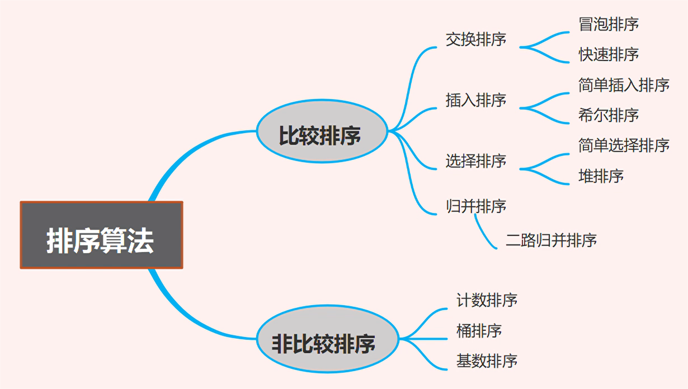
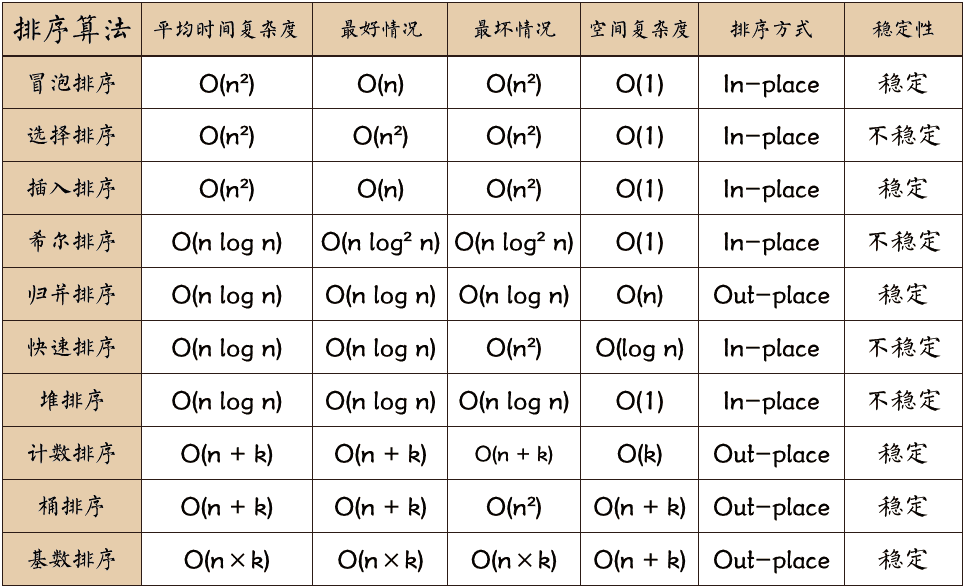

# 基本概念

## 稳定 

如果a原本在b前面,而a=b,排序之后a仍然在b的前面

## 不稳定       

如果a原本在b的前面,而a=b,排序之后a可能会出现在b的后面

## 时间复杂度       

时间复杂度是衡量算法运行时间长短的一种指标,常用大O符号表示      
时间复杂度描述的是算法在处理数据规模增大时,运行时间的增长趋势,表示算法的执行效率      

## 空间复杂度      

空间复杂度是算法需要使用的内存空间的大小,也常用大O符号表示      
空间复杂度与算法的时间复杂度类似,描述的是算法在处理数据规模增大时,所需内存空间的增长趋势     

# 分类

排序算法可以分为两大类: 

1. 比较类排序    
比较类排序是一类基于比较操作来进行排序的算法    
它们的实现核心是比较两个元素的大小关系       
通过比较来决定元素间的相对次序,由于其时间复杂度不能突破O(nlogn),因此也称为非线性时间比较类排序

2. 非比较类排序      
非比较类排序是不依赖于元素之间大小关系进行排序的算法        
它们通常需要通过额外的空间来记录元素的状态,从而进行排序    
它可以突破基于比较排序的时间下界,以线性时间运行,因此也称为线性时间非比较类排序   

## 十大排序复杂度

