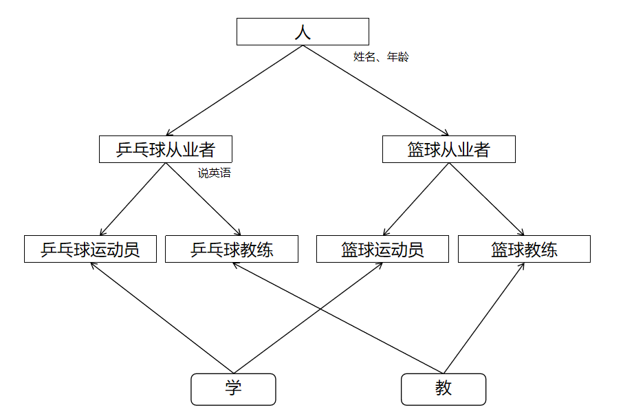
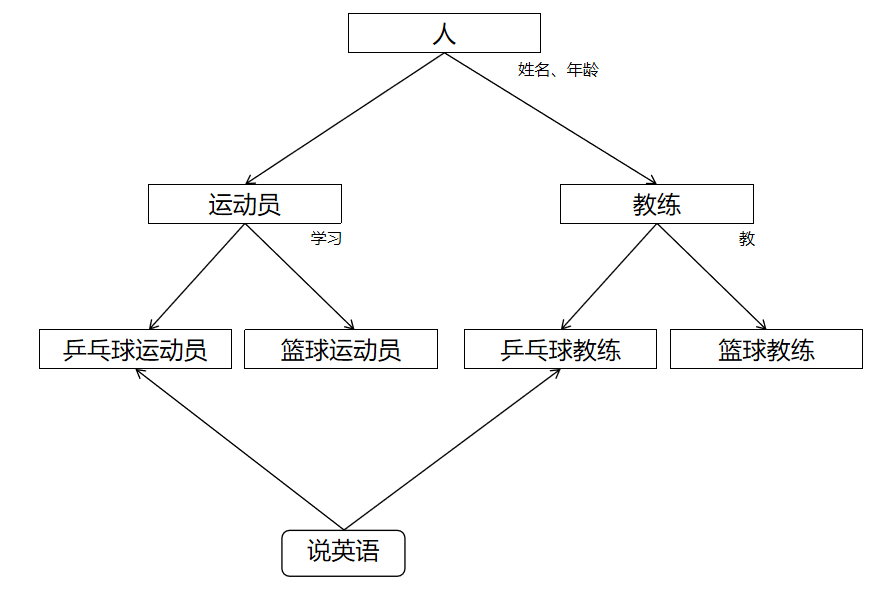

# 接口

接口就是一种规则,是对行为的抽象  
相较于抽象类是共性的抽象,接口更接近于行为的抽象  

## 定义和使用

格式: `public interface 接口名{}`  

细节:   
1. 接口不能实例化(创建对象)   
2. 接口和类之间是实现关系,通过implements关键字表示  
范例: `public class 类名 implements 接口名{}`  
3. 接口的子类(实现类)  
a.**要么重写接口中的所有抽象方法**  
b.要么是抽象类  

## 注意事项

1. 接口和类的实现关系,可以单实现,也可以多实现  
范例: `public class 类名 implements 接口名1,接口名2{}`  
2. 实现类还可以在继承一个类的同时实现多个接口  
范例: `public class 类名 extends 父类 implements 接口名1,接口名2{}`  

练习:  

编写带有接口和抽象类的标准JavaBean类  

青蛙Frog  
属性: 名字、年龄  
行为: 吃虫子、蛙泳  

狗Dog  
属性: 名字、年龄  
行为: 吃骨头、狗刨   

兔子Rabbit  
属性: 名字、年龄  
行为: 吃胡萝卜  

```java
public abstract class Animal {
    private String name;
    private int age;

    public Animal() {
    }

    public Animal(String name,int age) {
        this.name = name;
        this.age = age;
    }

    // 抽象方法: 吃东西
    public abstract void eat();

    public String getName() {
        return name;
    }

    public void setName(String name) {
        this.name = name;
    }

    public int getAge() {
        return age;
    }

    public void setAge(int age) {
        this.age = age;
    }
}
```

```java
// Swim接口
public interface Swim {
    public abstract void swim();
}
```

```java
public class Dog extends Animal implements Swim {
    public Dog() {
    }

    public Dog(String name,int age) {
        super(name,age);
    }

    @Override
    public void eat() {
        System.out.println("吃骨头");
    }


    @Override
    public void swim() {
        System.out.println("狗刨");
    }
}
```

```java
public class Frog extends Animal implements Swim {
    public Frog() {
    }

    public Frog(String name,int age) {
        super(name,age);
    }

    @Override
    public void eat() {
        System.out.println("吃虫子");
    }

    @Override
    public void swim() {
        System.out.println("蛙泳");
    }
}
```

```java
public class Rabbit extends Animal {
    public Rabbit() {
    }

    public Rabbit(String name,int age) {
        super(name,age);
    }

    @Override
    public void eat() {
        System.out.println("吃胡萝卜");
    }
}
```

## 接口中成员的特点

## 成员变量

只能是常量  

**默认**修饰符: `public static final`  

## 无构造方法  

## 成员方法  

只能是抽象方法  

**默认**修饰符: `public abstract`  
JDK7以前: 接口中只能定义抽象方法  
JDK8的新特性: 接口中可以定义有方法体的方法  
JDK9的新特性: 接口中可以定义私有方法  

## 接口和类之间的关系  

## 类和类的关系  

**继承关系**,只能单继承,不能多继承,但是可以多层继承  
 
## 类和接口的关系  

**实现关系**,可以单实现,也可以多实现,还可以在继承一个类的同时实现多个接口  

范例: 

```java
public interface Inter1 {
    public abstract void method1();
    public abstract void method2();
    public abstract void method3();
}
```

```java
public interface Inter2 {
    public abstract void method1();
    public abstract void method2();
    public abstract void method3();
    public abstract void method4();
}
```

```java
// 如果实现的多个接口内的方法重名,则实现类中重写的方法重写了所有接口中的方法
public class InterImpl implements Inter1,Inter2 {
    // 重写接口Inter1中的method1
    // 重写接口Inter2中的method1
    @Override
    public void method1() {

    }
    // 重写接口Inter1中的method2
    // 重写接口Inter2中的method2
    @Override
    public void method2() {
        
    }
    // 重写接口Inter1中的method3
    // 重写接口Inter2中的method3
    @Override
    public void method3() {

    }
    // 重写接口Inter2中的method4
    @Override
    public void method4() {

    }
}
```

## 接口和接口的关系

**继承关系**,可以单继承,也可以多继承     
**如果实现类实现了最下面的子接口,那么就需要重写所有的抽象方法**  

范例: 

```java
public interface Inter1 {
    public abstract void method1();
}
```

```java
public interface Inter2 {
    public abstract void method2();
}
```

```java
public interface Inter3 extends Inter1,Inter2 {
    public abstract void method3();
}
```

```java
// 如果实现类实现了最下面的子接口,那么就需要重写所有的抽象方法
public class InterImpl implements Inter3 {
    @Override
    public void method1() {

    }

    @Override
    public void method2() {

    }

    @Override
    public void method3() {

    }
}
```

练习: 

现有乒乓球运动员和篮球运动员,乒乓球教练和篮球教练  
为了出国交流,和乒乓球相关的人员都需要学习英语   
乒乓球运动员: 姓名、年龄、学打乒乓球、说英语  
篮球运动员: 姓名、年龄、学打篮球  
乒乓球教练: 姓名、年龄、教打乒乓球、说英语  
篮球教练: 姓名、年龄、教打篮球  

思路1: 



思路2: 



思路2代码: 

```java
public abstract class Person {
    private String name;
    private int age;

    public Person() {
    }

    public Person(String name,int age) {
        this.name = name;
        this.age = age;
    }

    public String getName() {
        return name;
    }

    public void setName(String name) {
        this.name = name;
    }

    public int getAge() {
        return age;
    }

    public void setAge(int age) {
        this.age = age;
    }
}
```

```java
public abstract class Player extends Person {
    public Player() {
    }

    public Player(String name,int age) {
        super(name,age);
    }

    public abstract void learn();
}
```

```java
public abstract class Trainer extends Person {
    public Trainer() {
    }

    public Trainer(String name,int age) {
        super(name,age);
    }

    public abstract void teach();
}
```

```java
public interface SpeakEnglish {
    public abstract void speakEnglish();
}
```

```java
public class PingPongPlayer extends Player implements SpeakEnglish {
    public PingPongPlayer() {
    }

    public PingPongPlayer(String name,int age) {
        super(name,age);
    }

    @Override
    public void learn() {
        System.out.println("学习打乒乓球");
    }

    @Override
    public void speakEnglish() {
        System.out.println("乒乓球运动员在说英语");
    }
}
```

```java
public class BasketballPlayer extends Player{
    public BasketballPlayer() {
    }

    public BasketballPlayer(String name,int age) {
        super(name,age);
    }

    @Override
    public void learn() {
        System.out.println("学习打篮球");
    }
}
```

```java
public class PingpongTrainer extends Trainer implements SpeakEnglish{
    public PingpongTrainer() {
    }

    public PingpongTrainer(String name,int age) {
        super(name,age);
    }

    @Override
    public void teach() {
        System.out.println("教打乒乓球");
    }

    @Override
    public void speakEnglish() {
        System.out.println("乒乓球教练在说英语");
    }
}
```

```java
public class BasketballTrainer extends Trainer {
    public BasketballTrainer() {
    }

    public BasketballTrainer(String name,int age) {
        super(name,age);
    }

    @Override
    public void teach() {
        System.out.println("教打篮球");
    }
}
```

## 接口中新增的方法

JDK7以前: 接口中只能定义抽象方法  
JDK8的新特性: 接口中可以定义有方法体的方法(默认、静态)  
JDK9的新特性: 接口中可以定义私有方法  

## 默认方法(JDK8)  

允许在接口中定义默认方法,需要使用关键字default修饰  

作用: 解决接口升级的问题  

接口中**默认方法**的定义格式: `public default 返回值类型 方法名(参数列表){}`  
范例: `public default void show(){}`   

注意事项: 
1. **默认方法不是抽象方法,所以不强制被重写,如果被重写; 重写的时候去掉default关键字**  
2. **public可以省略,default不能省略**  
3. **如果实现了多个接口,多个接口中存在相同名字的默认方法,子类就必须对该方法进行重写**  

练习: 

```java
public interface InterA {
    public abstract void abstractShow();
    // public可以省略,default不能省略
    public default void show(){
        System.out.println("这是InterA接口中的默认方法");
    }
}
```

```java
public interface InterB {
    public abstract void abstractShow();

    public default void show() {
        System.out.println("这是InterB接口中的默认方法");
    }
}
```

```java
public class InterImpl implements InterA,InterB {
    @Override
    public void abstractShow() {
        System.out.println("实现类重写的抽象方法");
    }

    // 默认方法不是抽象方法,所以不强制被重写
    // 如果实现了多个接口,多个接口中存在相同名字的默认方法,子类就必须对该方法进行重写
    @Override
    public void show() {
        System.out.println("重写接口中的默认方法");
    }
}
```

```java
public class Test {
    public static void main(String[] args) {
        InterImpl interImpl = new InterImpl();
        // 打印结果:"实现类重写的抽象方法"
        interImpl.abstractShow();
        // 打印结果:"重写接口中的默认方法"
        interImpl.show();
    }
}
```

## 静态方法(JDK8)  
 
允许在接口中定义静态方法,需要用static修饰  

接口中**静态方法**的定义格式: `public static 返回值类型 方法名(参数列表){}`  
范例: `public static void show(){}`  

注意事项:    
1. **静态方法只能通过接口名调用,不能通过实现类名或者对象名调用**   
2. **public可以省略,static不能省略**  

练习: 

```java
public interface Inter {
    public abstract void abstractShow();

    public static void show() {
        System.out.println("Inter接口中的静态方法");
    }
}
```

```java
public class InterImpl implements Inter {

    @Override
    public void abstractShow() {
        System.out.println("InterImpl重写的抽象方法");
    }

    public static void show(){
        System.out.println("InterImpl里的静态方法");
    }
}
```

```java
public class Test {
    public static void main(String[] args) {
        // 调用接口中的静态方法
        // 打印结果:"Inter接口中的静态方法"
        Inter.show();
        // 调用实现类里的静态方法
        // 打印结果:"InterImpl里的静态方法"
        InterImpl.show();
        // 这不是重写
        // 子类把从父类继承下来的虚方法表里面的方法进行覆盖了,才叫重写
    }
}
```

## 私有方法(JDK9)

格式1: `private 返回值类型 方法名(参数列表){}`  
范例: `private void show(){}`  

格式2: `private static 返回值类型 方法名(参数列表){}`  
范例: `private static void show(){}`  

练习: 

```java
public interface InterA {
    public default void show1() {
        System.out.println("show1()默认方法");
        show3();
    }

    public default void show2() {
        System.out.println("show2()默认方法");
        show3();
    }

    // 普通的私有方法,给默认方法服务
    private void show3() {
        System.out.println("开始执行");
    }

    public static void show4() {
        System.out.println("show4()静态方法");
        show5();
    }

    // 静态的私有方法,给静态方法服务
    private static void show5() {
        System.out.println("开始执行");
    }
}
```

## 接口的应用

1. 接口代表规则,是行为的抽象,想要哪个类拥有一个行为,就让这个类实现对应的接口   
2. 当一个方法的参数是接口时,可以传递接口**所有的实现类对象**,这种方式称之为接口多态  

## 适配器设计模式

设计模式(Design Pattern)是一套被反复使用、多数人知晓的、经过分类编目的、代码设计经验的总结  
使用设计模式是为了可重用代码、让代码更容易被他人理解、保证代码的可靠性、程序的重用性  
使用场景: 当一个接口中抽象方法过多,但是只要使用其中一部分的时候,就可以适配器设计模式  

步骤: 
1. 编写中间类`XXXAdapter`,实现对应的接口  
为了避免其他类创建适配器类的对象,中间的适配器类要用abstract进行修饰  
2. 对接口中的抽象方法进行空实现  
3. 让真正的实现类继承中间类,并重写需要用的方法  

范例: 

```java
public interface Inter {
    public abstract void method1();
    public abstract void method2();
    public abstract void method3();
    public abstract void method4();
    public abstract void method5();
    public abstract void method6();
    public abstract void method7();
    public abstract void method8();
    public abstract void method9();
}
```

```java
// 把适配器InterAdapter也设置为抽象类,防止被创建
public abstract class InterAdapter implements Inter{
    @Override
    public void method1() {

    }

    @Override
    public void method2() {

    }

    @Override
    public void method3() {

    }

    @Override
    public void method4() {

    }

    @Override
    public void method5() {

    }

    @Override
    public void method6() {

    }

    @Override
    public void method7() {

    }

    @Override
    public void method8() {

    }

    @Override
    public void method9() {

    }
}
```

```java
public class InterImpl extends InterAdapter{
    @Override
    public void method5() {
        System.out.println("重写method5()方法");
    }
}
```

练习: 

1. 定义手机类  
行为: 打电话,发短信  
2. 定义接口IPlay  
​行为: 玩游戏  
3. 定义旧手机类继承手机类  
​行为: 继承父类的行为  
4. 定义新手机继承手机类实现IPlay接口  
行为: 继承父类的行为,重写玩游戏方法  
5. 定义测试类  
​在测试类中定义一个用手机的方法,要求该方法既能接收老手机对象,也能接收新手机对象  
​在该方法内部调用打电话,发短信以及新手机特有的玩游戏方法  
 
```java
public class Phone {
    public Phone() {
    }

    public void call() {
        System.out.println("打电话");
    }

    public void message() {
        System.out.println("发短信");
    }
}
```

```java
public abstract interface IPlay {
    public abstract void playGame();
}
```

```java
public class newPhone extends Phone implements IPlay {
    public newPhone() {
    }

    @Override
    public void playGame() {
        System.out.println("玩游戏");
    }
}
```

```java
public class oldPhone extends Phone {
    public oldPhone() {
    }
}
```

```java
public class Test {
    public static void main(String[] args) {
        newPhone np = new newPhone();
        oldPhone op = new oldPhone();
        usePhone(np,op);
    }

    public static void usePhone(newPhone np,oldPhone op) {
        System.out.println("老手机: ");
        op.call();
        op.message();
        System.out.println("新手机: ");
        np.call();
        np.message();
        np.playGame();
    }
}
```