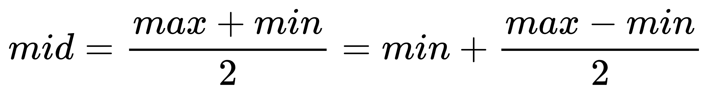
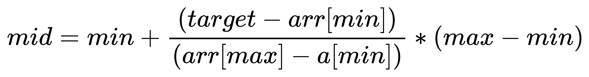

## 插值查找

在二分查找中,每次都是从待查找序列的中间点开始查找,这样的做法在正确性上固然没什么问题,但假如要查找的值距离某个边界比较近,还从中间点开始查找,就有点浪费时间了
例如,在一个{1,2,...,100}的数组中,要查找"88"这个值,还一直采用和中间点比较的策略,就显得不太明智,因为明显可以明显从较为靠后的位置去检索,为了克服这种弊端,引入了插值查找

## 基本思路

在二分查找的基础上,让中间的mid点,尽可能靠近想要查找的元素

二分查找中的查找点: 



插值查找中的查找点: 



这样,让mid值的变化更靠近关键字key,也就间接地减少了比较次数,因此提高了查找的效率

核心逻辑: **基于二分查找算法,将查找点的选择改进为自适应选择**

## 范例

### 迭代法

```java
public class Test {
    public static void main(String[] args) {
        int[] arr = {7,12,32,45,87,93,102,142,156};
        int target = 32;
        int min = 0;
        int max = arr.length - 1;
        System.out.println(binarySearch(arr,min,max,target));
    }

    static int binarySearch(int[] arr,int min,int max,int target) {
        if (min <= max) {
            int mid = min + ((target - arr[min]) / (arr[max] - arr[min])) * (max - min);
            if (arr[mid] == target) {
                return mid;
            } else if (arr[mid] < target) {
                return binarySearch(arr,mid + 1,max,target);
            } else {
                return binarySearch(arr,min,mid - 1,target);
            }
        } else {
            return -1;
        }
    }
}
```

### 递归法

```java
public class Test {
    public static void main(String[] args) {
        int[] arr = {7,12,32,45,87,93,102,142,156};
        int target = 32;
        int min = 0;
        int max = arr.length - 1;
        System.out.println(binarySearch(arr,min,max,target));
    }

    static int binarySearch(int[] arr,int min,int max,int target) {
        if (min <= max) {
            int mid = min + ((target - arr[min]) / (arr[max] - arr[min])) * (max - min);
            if (arr[mid] == target) {
                return mid;
            } else if (arr[mid] < target) {
                return binarySearch(arr,mid + 1,max,target);
            } else {
                return binarySearch(arr,min,mid - 1,target);
            }
        } else {
            return -1;
        }
    }
}
```

## 复杂度

**如果元素均匀分布,则时间复杂度为O(log(logn)),在最坏的情况下可能需要O(n),空间复杂度为O(1)**

## 优缺点

1. 优点: 对于长度比较长,关键字分布又比较均匀的查找表来说,插值查找算法的平均性能比折半查找要好的多
2. 缺点: 数组中如果分布非常不均匀,那么插值查找未必是很合适的选择