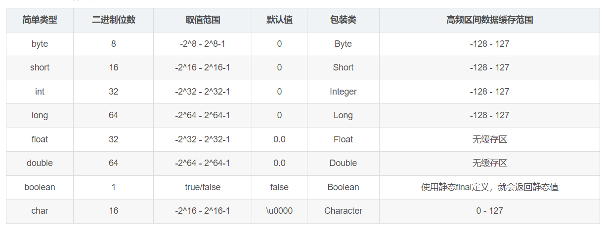

## 基本数据类型



### 整数

关键字: `byte`   
取值范围: -128 ～ 127   
内存占用: 1 Byte  
    
关键字: `short`    
取值范围: -32768 ～ 32767      
内存占用: 2 Byte    
    
关键字: int   
取值范围: -2147483648 ～ 21483647(10位数)   
内存占用: 4 Byte  
    
关键字: `long`   
取值范围: -9223372036854775808 ～ 9223372036854775807(19位数)   
内存占用: 8 Byte  
**如果要定义long类型的变量,在数据值的后面需要加一个L作为后缀**  
**L可以是大写,也可以是小写,推荐大写**   
    
### 浮点数

关键字: `float`   
取值范围: -3.401298e-38 ～ 3.402823e+38   
内存占用: 4 Byte  
**如果要定义float类型的变量,在数据值的后面需要加一个F作为后缀**  
**F可以是大写,也可以是小写,推荐大写**  

关键字: `double`   
取值范围: -4.9000000e-324 ～ 1.797693e+308   
内存占用: 8 Byte      
    
### 字符

关键字: `char`   
取值范围: 0 ～ 65535   
内存占用: 2 Byte  
  
### 布尔

关键字: boolean   
取值范围: true,false   
内存占用: 1 Byte  

范例: 

```java
public class Main {
    public static void main(String[] args){
        //byte
        byte b = 10;
        System.out.println(b);
        //short
        short s = 20;
        System.out.println(s);
        //int
        int i = 30;
        System.out.println(i);
        //long
        long l = 9999999999L;
        System.out.println(l);
        //float
        float f = 2.0F;
        System.out.println(f);
        //double
        double d = 33.0;
        System.out.println(d);
        //char
        char c = '牛';
        System.out.println(c);
        //boolean
        boolean n = true;
        System.out.println(n);
    }
}
```

练习: 

输出个人信息

```java
public class Main {
    public static void main(String[] args){
        String name = "Hugh";
        int age = 23;
        char gender = '男';
        double height = 172.1;
        boolean marriage = false;
        System.out.println(name);
        System.out.println(age);
        System.out.println(gender);
        System.out.println(height);
        System.out.println(marriage);
    }
}
```

练习: 

输出影视信息(名称、主演、年份、评分)

```java
public class Main {
    public static void main(String[] args){
        String name = "前任攻略爱情公寓";
        String actor = "曾小贤,吕子乔,胡一菲";
        int year = 2023;
        double score = 9.1;
        System.out.println(name);
        System.out.println(actor);
        System.out.println(year);
        System.out.println(score);
    }
}
```

练习: 

输出商品信息

```java
public class Main {
    public static void main(String[] args){
        String brand = "Huawei Mate 30 Pro";
        double price = 6299.00;
        System.out.println(brand);
        System.out.println(price);
    }
}
```

## 引用数据类型

除了8种基本数据类型外的,其他所有数据类型是引用数据类型