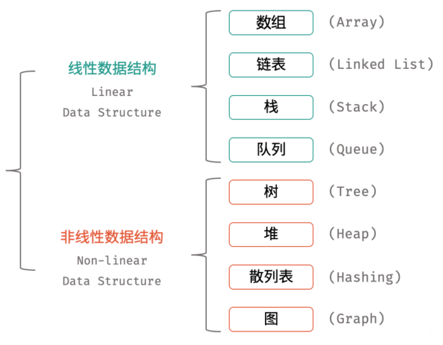

# 数据结构

数据结构是计算机存储、组织数据的方式,是指数据相互之间是以什么方式排列在一起的  

数据结构是为了更加方便的管理和使用数据,不同的业务场景下要选择不同的数据结构    

一般情况下,精心选择的数据结构可以带来更高的运行或者存储效率       

           

[数据结构可视化-在线网站](https://www.cs.usfca.edu/~galles/visualization/Algorithms.html)